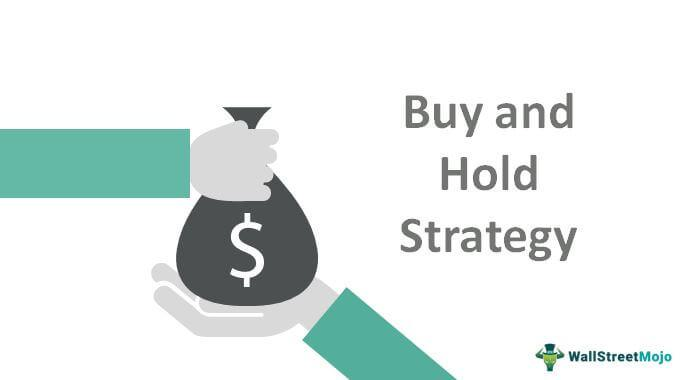

Buy-and-hold is a widely recognized long-term investment strategy, traditionally associated with stock markets, where investors purchase securities to hold them over extended periods despite market fluctuations. This strategy is based on the belief that, in the long run, financial assets tend to increase in value. While typically applied to stocks, the buy-and-hold strategy can also be effectively utilized in forex trading. Forex, or forex exchange, involves trading currency pairs and offers unique opportunities for long-term investment given its global nature and the influence of macroeconomic factors.

This article aims to explore the potential of implementing a buy-and-hold strategy within the context of forex trading through the use of algorithmic trading techniques. Algorithmic trading, which involves using computer programs to execute trades based on pre-set criteria, offers several advantages for forex traders. By automating trade execution, it reduces human error, eliminates emotional decision-making, and provides the capability to analyze extensive market data efficiently. These attributes make it a potentially valuable tool for optimizing the buy-and-hold strategy in the dynamic forex market.



We will consider both fundamental concepts and practical methodologies necessary for effectively executing this strategy. Fundamental analysis, which assesses economic indicators, interest rates, and geopolitical factors, plays a crucial role in understanding long-term trends in currency values. When combined with technical indicators through algorithmic tools, traders can identify optimal entry and exit points for their forex investments. The integration of algorithmic solutions can thus enhance the precision and effectiveness of a buy-and-hold approach.

The primary objective of this guide is to provide comprehensive information for traders interested in making long-term investments in the forex market. By understanding and executing a forex buy-and-hold strategy, traders can aim to capitalize on currency appreciation over time. The guide will offer insights into selecting pertinent currency pairs, employing algorithmic strategies, and adhering to a disciplined approach that aligns with evolving economic landscapes. Ultimately, balanced strategy development, leveraging both fundamental and technical analyses, can help traders optimize their forex portfolios for sustained growth.

## Table of Contents

## Understanding the Buy-and-Hold Forex Strategy

The buy-and-hold forex strategy is predicated on the notion of maintaining a currency position over an extended period, primarily grounded on fundamental economic analysis. Unlike equities, where prices can soar from corporate announcements or breakthroughs, currency pairs are less susceptible to short-lived significant rallies. This is because currency values are influenced by broader macroeconomic factors like GDP growth, inflation rates, and trade balances, which evolve more gradually.

The core premise of this strategy is to identify currency pairs that are likely to appreciate based on underlying economic conditions. This can be exemplified by observing economic trends: for instance, if Country A is experiencing robust economic growth and political stability, its currency is more likely to strengthen against a currency from a country facing economic turmoil or instability. This requires traders to remain informed about global economic conditions and policy changes, integrating this information into their investment choices.

Position traders are typically the practitioners of buy-and-hold strategies in [forex](/wiki/forex-system) markets. They take a longer-term view, often holding positions for weeks, months, or even years. This long-term perspective allows them to ride out short-term market volatilities, which can be particularly advantageous in a forex market characterized by frequent fluctuations caused by various global economic and political events.

This strategy necessitates a comprehensive understanding of global economics and the ability to interpret diverse economic indicators. It also requires patience and a level of risk tolerance, as market conditions can cause temporary dips in currency pairs that have been identified for their long-term potential. By leveraging information from central bank announcements, economic reports, and geopolitical developments, traders can make informed decisions that align with the buy-and-hold paradigm.

## Key Factors Influencing Forex Buy-and-Hold Strategy

Traders employing a buy-and-hold strategy in forex must carefully evaluate several key factors to maximize the potential for long-term profitability. One of the primary considerations is central bank policies, which significantly influence currency values. Central banks control monetary policy, including setting interest rates and regulating money supply. For instance, if a central bank signals an intention to increase interest rates, it often leads to currency appreciation due to anticipated higher returns for investors holding that currency. Therefore, traders should stay informed about monetary policy announcements and minutes from central bank meetings to assess potential impacts on their currency holdings.

Interest rates themselves are another critical [factor](/wiki/factor-investing), not only as a tool of monetary policy but also as indicators of economic health. High interest rates can attract foreign capital, leading to currency strength, as opposed to low interest rates which might deter investment. Traders can leverage [interest rate](/wiki/interest-rate-trading-strategies) differentials through [carry](/wiki/carry-trading) trades, a strategy that involves borrowing in a currency with a low-interest rate and investing in a currency with a higher rate. For example, borrowing in Japanese yen, historically marked by low interest rates, and investing in New Zealand dollars, which typically offer higher yields, could provide additional returns through interest rate differentials.

Global economic indicators also shape the long-term trajectories of currency values. Indicators like GDP growth rates, inflation, unemployment figures, and trade balances provide insights into a country's economic performance. A robust economy often leads to currency appreciation as higher economic activity increases demand for that country's goods and services, subsequently driving up demand for its currency.

Geopolitical stability and projections of economic growth further impact currency investments. Currencies from politically stable countries with positive growth forecasts are generally more attractive as buy-and-hold candidates. Conversely, regions with political turmoil or economic uncertainty may see their currencies lose value as investors seek safer alternatives.

Understanding and interpreting these factors allows traders to build a portfolio of currencies with strong growth prospects. By integrating detailed [fundamental analysis](/wiki/fundamental-analysis) into their trading strategies, traders can more accurately forecast which currencies are likely to appreciate over time, optimizing their buy-and-hold strategy to achieve superior long-term returns.

## Integrating Algorithmic Trading into Your Strategy

Algorithmic trading can significantly enhance the buy-and-hold forex strategy by leveraging automation to execute trades with precision and consistency. This increased efficiency is achieved by minimizing human errors that can arise from emotional trading decisions or inconsistent market observations. Algorithms, or "algos," are designed to process extensive amounts of market data, enabling traders to identify optimal entry and [exit](/wiki/exit-strategy) points based on predetermined criteria.

To effectively integrate algo trading into your forex strategy, traders must begin by clearly defining their investment goals and strategy. The development of an algorithm starts with outlining specific rules and parameters, which could include technical indicators, economic data releases, or statistical signals. These criteria should be rigidly defined based on historical and fundamental analysis to align with long-term market trends.

Once the strategy is conceptualized, traders must translate these rules into a programmable format using a programming language such as Python. Python is particularly popular due to its extensive libraries and frameworks (e.g., pandas for data manipulation, NumPy for numerical calculations, and TA-Lib for technical analysis) which are instrumental in [backtesting](/wiki/backtesting) strategies and validating their performance.

Here's a basic example of an [algorithmic trading](/wiki/algorithmic-trading) script using Python:

```python
import pandas as pd
import talib

# Load historical data
data = pd.read_csv('forex_data.csv')
prices = data['Close']

# Define a simple moving average strategy
short_window = 40
long_window = 100

signals = pd.DataFrame(index=data.index)
signals['signal'] = 0.0

signals['short_mavg'] = talib.SMA(prices, window=short_window)
signals['long_mavg'] = talib.SMA(prices, window=long_window)

# Generate signals
signals['signal'][short_window:] = np.where(
    signals['short_mavg'][short_window:] > signals['long_mavg'][short_window:], 1.0, 0.0)

signals['positions'] = signals['signal'].diff()

# Backtest the strategy
initial_capital = float(100000.0)
positions = pd.DataFrame(index=signals.index).fillna(0.0)
positions['forex'] = 100 * signals['signal']  

portfolio = positions.multiply(prices, axis=0)
pos_diff = positions.diff()

portfolio['holdings'] = (positions.multiply(prices, axis=0)).sum(axis=1)
portfolio['cash'] = initial_capital - (pos_diff.multiply(prices, axis=0)).sum(axis=1).cumsum()
portfolio['total'] = portfolio['cash'] + portfolio['holdings']
portfolio['returns'] = portfolio['total'].pct_change()

# Analyze the results
print(portfolio.tail())
```

Incorporating algo trading also involves rigorous backtesting to ensure that the strategy performs well under various market conditions. Backtesting involves running the algorithm using historical data to verify if the desired outcomes are achieved and to refine parameters where necessary. This iterative process helps identify potential flaws and aids in optimizing the strategy before actual capital is deployed.

By relying on data-driven insights, algorithmic trading removes the subjective element inherent in manual trading, leading to more consistent performance over time. The result is a methodical approach that capitalizes on defined market opportunities while guarding against emotionally influenced decision-making.

As forex markets continue to evolve with changing economic landscapes, traders must adapt their algorithms to new data trends. Continuous evaluation and adjustment are vital to maintaining the relevance and effectiveness of an algorithmic buy-and-hold strategy in the forex market.

## Implementing the Buy-and-Hold Forex Strategy

To implement a successful buy-and-hold forex strategy using algorithmic trading, one must follow a structured approach that encompasses research, execution, and maintenance. This strategy emphasizes the importance of combining thorough fundamental analysis with algorithmic precision to optimize long-term positions.

### Thorough Fundamental Analysis

Before engaging in any trades, it is crucial to conduct comprehensive fundamental analysis of the selected currency pairs. This involves examining economic indicators such as GDP growth rates, employment figures, interest rates, and inflation data, which can influence currency appreciation over time. Traders need to stay informed about central bank policies and geopolitical developments that may affect currency stability.

#### Example:
For instance, if a trader is considering the USD/EUR pair, they should analyze the monetary policy of the Federal Reserve compared to the European Central Bank, alongside economic reports from both the United States and the Eurozone. Key questions might include how interest rate changes might influence the currency pair or how trade relations could impact economic performance.

### Selecting the Right Currency Pairs and Entry Points

Choosing the right currency pairs involves balancing strong growth potential with manageable risk. Using both technical and fundamental indicators can guide this selection. Fundamental analysis identifies candidate pairs with robust economic or political stability, while technical indicators help pinpoint entry points.

Technical indicators, such as moving averages and RSI (Relative Strength Index), assist in timing trades by identifying trends and potential points of reversal. For example, a crossover of moving averages might signal an ideal entry point for a trade.

#### Python Example for Technical Entry Point:
```python
import pandas as pd

def moving_average_crossover(data, short_window=50, long_window=200):
    data['Short_MA'] = data['Close'].rolling(window=short_window, min_periods=1).mean()
    data['Long_MA'] = data['Close'].rolling(window=long_window, min_periods=1).mean()

    # Generate trading signals
    data['Signal'] = 0
    data['Signal'][short_window:] = np.where(data['Short_MA'][short_window:] 
                                             > data['Long_MA'][short_window:], 1, -1)
    return data

# Assuming 'fx_data' is a DataFrame containing forex prices with a 'Close' column
signals = moving_average_crossover(fx_data)
```

### Maintaining and Monitoring Long-term Positions

After executing trades, ongoing management of positions is essential. Traders should frequently reassess their portfolio in response to shifts in market conditions, adjusting their holdings as needed. This involves staying updated with global economic news and periodically reviewing economic forecasts. An automated trading algorithm can assist by providing alerts or automatically altering positions based on predefined parameters.

#### Strategy Reassessment:

- **Monitor Economic Indicators**: Regularly update your economic outlook based on the latest data releases and adjust the strategy accordingly.
- **Set Reassessment Periods**: Establish routine intervals (e.g., quarterly) to evaluate the positions and align them with updated market projections.

### Building and Sustaining a Profitable Portfolio

Constructing a successful buy-and-hold forex portfolio requires a disciplined approach to allocation, with diversification across currency pairs to mitigate risk. The use of algorithmic systems can facilitate this process by ensuring consistent adherence to trading rules, ultimately enhancing decision-making and reducing emotional bias.

In summary, by integrating detailed fundamental analysis with algorithmic trading capabilities, traders can effectively implement a buy-and-hold forex strategy. This hybrid approach maximizes the chances of capitalizing on long-term currency appreciation while minimizing human error and emotional influence.

## Pros and Cons of the Buy-and-Hold Forex Strategy

The buy-and-hold forex strategy presents a unique set of advantages and disadvantages that traders must carefully consider before committing to this approach. One of the primary benefits of the buy-and-hold strategy is its potential for reduced transaction costs. Unlike short-term trading strategies, which often incur frequent trading fees, holding a position for an extended period minimizes such costs. This is because fewer transactions are executed over time, which can significantly reduce the cumulative cost of trading.

Additionally, the buy-and-hold strategy places a strong emphasis on fundamental analysis. Traders employing this approach typically engage in comprehensive research to understand the long-term economic trends affecting currency pairs. By focusing on macroeconomic indicators, central bank policies, and geopolitical events, traders can make informed decisions that align with their long-term investment goals. This focus on fundamentals allows traders to capture value from sustained economic growth and currency appreciation over time.

However, the buy-and-hold strategy is not without its challenges. One major drawback is the requirement for patience and a long-term commitment. Currency markets can be volatile, and long-term positions expose traders to risks associated with geopolitical changes and unforeseen economic events. This [volatility](/wiki/volatility-trading-strategies) can result in significant short-term fluctuations that may tempt traders to deviate from their strategy. The ability to remain disciplined amidst market turbulence is crucial for success.

Moreover, long-term exposure to the forex market increases vulnerability to events such as political instability, changes in government policies, and economic crises. Traders must consistently monitor global developments and be prepared to adjust their positions in response to major shifts. This aspect underscores the importance of adaptability and continuous reassessment of the market environment.

Ultimately, traders must weigh the strengths and weaknesses of the buy-and-hold forex strategy to determine its suitability for their individual trading goals and risk tolerance. By thoroughly understanding the advantages and risks, traders can manage their expectations and optimize their strategy to fit their unique trading style. This comprehensive overview aids traders in making informed decisions and effectively navigating the complexities of the forex market, enhancing their potential for long-term success.

## Conclusion

The buy-and-hold forex strategy, when augmented with algorithmic trading, offers a promising avenue for traders aiming for sustained long-term gains through currency appreciation. This approach leverages the strength of fundamental economic trends alongside the precision of algorithmic analysis, creating a structured path for potential profitability.

Strategic planning emerges as a critical component in this strategy, as it allows traders to navigate the complexities and inherent risks of long-term forex investments. By crafting a well-defined plan and adhering to it with disciplined execution, traders can maximize the benefits while mitigating exposure to unexpected events such as geopolitical shifts and market volatility.

Continual monitoring and adaptability are also vital. As global economic landscapes are in perpetual flux, maintaining alignment with these changes ensures that traders can adjust their positions appropriately. This adaptability not only safeguards their investments but also positions them to capitalize on emerging opportunities.

To achieve optimal outcomes, traders should adopt a balanced methodology. Combining fundamental analysis with algorithmic precision allows for enhanced decision-making processes, underpinned by data-driven insights. This dual approach minimizes emotional biases and ensures that trading decisions are based on comprehensive economic assessments and market trends.

In conclusion, the buy-and-hold forex strategy, when effectively integrated with algo trading, provides a robust framework for long-term success. Traders are encouraged to consider incorporating this strategy into their trading toolkit, acknowledging its potential to offer both stability and growth in their currency trading endeavors. The combined use of fundamental analysis and algorithmic tools presents a compelling prospect for those ready to embrace this strategic investment path.

## References & Further Reading

[1]: Jessop, S. (2020). ["The Carry Trade in a Nutshell: What You Need to Know"](https://blogs.wellesley.edu/jjoyce/2020/11/11/2020-globie-the-carry-trade/) Investopedia.

[2]: Yao, J., Li, Y., & Tan, C. L. (2000). ["Option price forecasting using neural networks"](https://www.sciencedirect.com/science/article/pii/S0305048399000663) Journal of Economic Dynamics and Control, 24(5-7), 869-887.

[3]: Lopez de Prado, M. (2018). ["Advances in Financial Machine Learning"](https://www.amazon.com/Advances-Financial-Machine-Learning-Marcos/dp/1119482089) Wiley.

[4]: Chan, E. (2009). ["Quantitative Trading: How to Build Your Own Algorithmic Trading Business"](https://github.com/ftvision/quant_trading_echan_book) Wiley.

[5]: Aronson, D. (2006). ["Evidence-Based Technical Analysis: Applying the Scientific Method and Statistical Inference to Trading Signals"](https://www.amazon.com/Evidence-Based-Technical-Analysis-Scientific-Statistical/dp/0470008741) Wiley.

[6]: Jansen, S. (2020). ["Machine Learning for Algorithmic Trading: Predictive models to extract signals from market and alternative data"](https://github.com/stefan-jansen/machine-learning-for-trading) Packt Publishing.

[7]: Engle, R. F., & Granger, C. W. J. (1987). ["Co-integration and Error Correction: Representation, Estimation, and Testing"](https://www.jstor.org/stable/1913236?read-now=1) Econometrica, Vol. 55, No. 2, pp. 251-276.