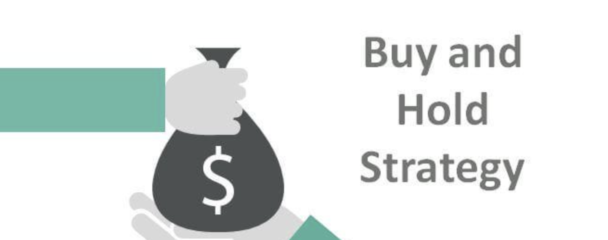

## Table of Contents

## What is a buy-and-hold strategy in forex trading?

A buy-and-hold strategy in forex trading is when a trader buys a currency pair and keeps it for a long time. The goal is to make money from the currency getting stronger over time. This is different from other trading styles where people buy and sell currencies quickly. People who use a buy-and-hold strategy believe that they can predict long-term trends better than short-term changes.

This strategy needs patience because it can take months or even years to see big profits. It also requires a good understanding of the economy and what might affect currency values in the future. Traders using this method often look at things like interest rates, economic growth, and political stability. While it can be less stressful than quick trading, it still has risks because no one can predict the future perfectly.

## How does the buy-and-hold strategy differ from day trading or scalping?

The buy-and-hold strategy is different from day trading and scalping because it involves holding onto a currency pair for a long time, like months or years. People who use this strategy believe that over a long period, the currency they buy will become stronger and they will make money. They are not worried about small ups and downs in the market every day. Instead, they focus on big trends that happen over time. This means they need to understand things like the economy, interest rates, and what's happening in the world that could affect currencies.

Day trading and [scalping](/wiki/gamma-scalping), on the other hand, are about making quick profits. Day traders buy and sell currencies within the same day, trying to take advantage of small price movements. They might make many trades in a single day and need to watch the market closely all the time. Scalping is even faster; scalpers might only hold a position for a few seconds or minutes. Both these methods need a lot of attention and can be stressful because the market can change very quickly. Unlike buy-and-hold, these strategies are more about reacting to what's happening right now in the market rather than what might happen in the future.

## What are the potential benefits of using a buy-and-hold strategy in forex?

One big benefit of using a buy-and-hold strategy in [forex](/wiki/forex-system) is that it can be less stressful than other ways of trading. Because you're holding onto a currency for a long time, you don't have to worry about the small ups and downs in the market every day. This means you don't need to spend all your time watching the market. Instead, you can focus on bigger trends that happen over months or years. This can make trading easier and less nerve-wracking.

Another benefit is that buy-and-hold can help you take advantage of long-term trends in currency values. If you believe that a certain currency will get stronger over time, holding onto it for a long period can lead to big profits. This strategy lets you benefit from things like growing economies or changes in interest rates that happen slowly. It's a way to make money by understanding the big picture of what's happening in the world, rather than trying to predict small, quick changes in the market.

## What are the risks associated with a buy-and-hold strategy in forex trading?

One big risk of using a buy-and-hold strategy in forex trading is that it can take a long time to see any profits. When you hold onto a currency for months or years, you might have to wait a long time before the currency gets stronger and you make money. During this time, the market can change in ways you didn't expect, and your currency might not become as valuable as you thought it would. This means you could lose money if the long-term trend you were counting on doesn't happen.

Another risk is that you need to be really good at predicting what will happen in the future. With buy-and-hold, you're betting on big trends that might take a long time to play out. If your predictions about the economy, interest rates, or world events are wrong, you could end up losing a lot of money. It's hard to predict the future perfectly, and even small mistakes can lead to big losses when you're holding onto a currency for a long time.

## How can a beginner determine if a buy-and-hold strategy is suitable for them?

A beginner can figure out if a buy-and-hold strategy is right for them by thinking about how much time they want to spend on trading. If you don't want to watch the market every day and prefer a more relaxed approach, buy-and-hold might be a good fit. This strategy means you buy a currency and hold onto it for a long time, so you don't need to check prices all the time. It's less stressful than [day trading](/wiki/day-trading-spy) or scalping, where you need to be quick and always on the lookout for small changes in the market.

Another thing to consider is how well you understand big economic trends. Buy-and-hold works best if you can predict how currencies will change over months or years. This means you need to know about things like interest rates, how economies grow, and what's happening in the world. If you like learning about these big picture things and feel confident in your predictions, then buy-and-hold could work well for you. But if you find it hard to predict the future or don't like waiting a long time to see if your predictions are right, you might want to try a different strategy.

## What economic indicators should be monitored when employing a buy-and-hold strategy?

When using a buy-and-hold strategy in forex, it's important to keep an eye on several key economic indicators. One of the most important is interest rates. When a country's central bank changes its interest rates, it can affect the value of that country's currency. If interest rates go up, the currency usually becomes stronger because it attracts more investors looking for higher returns. Another important indicator is the Gross Domestic Product (GDP), which shows how fast a country's economy is growing. A growing economy often means a stronger currency, so keeping track of GDP can help you predict long-term trends.

Another set of indicators to watch are inflation rates and employment data. Inflation can weaken a currency if it's too high because it reduces the buying power of money. On the other hand, low inflation or deflation can make a currency stronger. Employment data, like unemployment rates, also matters because a strong job market usually means a healthy economy, which can lead to a stronger currency. By watching these indicators, you can get a better sense of how a currency might perform over the long term, which is crucial for a buy-and-hold strategy.

## How can technical analysis be integrated into a buy-and-hold forex strategy?

Even though a buy-and-hold strategy in forex focuses on long-term trends, you can still use technical analysis to make better decisions. Technical analysis looks at past price movements and patterns to predict what might happen next. For buy-and-hold traders, this can help find the best times to buy or sell a currency. For example, you might use moving averages to see if a currency is in a long-term uptrend or downtrend. If the long-term moving average is going up, it could be a good sign to buy and hold that currency.

Another way to use technical analysis in a buy-and-hold strategy is to look for support and resistance levels. These are price levels where a currency has a hard time moving past. If you see that a currency keeps bouncing off a certain support level, it might be a good time to buy and hold, expecting the price to go up over time. Technical analysis can also help you set stop-loss orders to protect your money if the market moves against you. Even though you're holding for the long term, these tools can help you make smarter choices and manage risks better.

## What are some common mistakes traders make when using a buy-and-hold strategy?

One common mistake traders make when using a buy-and-hold strategy is not doing enough research. Since you're holding a currency for a long time, it's important to understand the big things that can affect its value, like the economy, interest rates, and world events. If you don't know enough about these things, you might pick the wrong currency to hold, and end up losing money. It's really important to spend time learning and making sure your predictions about the future are as good as they can be.

Another mistake is not being patient enough. A buy-and-hold strategy means you have to wait a long time to see if your predictions are right. Sometimes, the market can go down before it goes up, and if you get scared and sell too soon, you might miss out on big profits later. It's important to stick to your plan and not let short-term changes in the market make you panic. Remember, buy-and-hold is about playing the long game, so patience is key.

## How does currency pair selection affect the success of a buy-and-hold strategy?

Currency pair selection is really important for the success of a buy-and-hold strategy. When you choose which currencies to buy and hold, you need to think about which ones will get stronger over time. This means looking at things like the economy of the countries involved, their interest rates, and what's happening in the world that could affect their currencies. If you pick a currency pair where one currency is likely to do better than the other over the long term, you have a better chance of making money. For example, if you think the US economy will grow faster than Japan's, you might want to buy and hold USD/JPY.

On the other hand, if you pick the wrong currency pair, you could lose money even if you hold it for a long time. Let's say you think the Euro will get stronger against the US Dollar, so you buy and hold EUR/USD. But if the US economy ends up doing better than Europe's, the Euro might not get stronger like you thought. This means your buy-and-hold strategy won't work out as well. So, choosing the right currency pair is a big part of making sure your buy-and-hold strategy is successful.

## What role does fundamental analysis play in a long-term forex buy-and-hold approach?

Fundamental analysis is really important when you're using a buy-and-hold strategy in forex trading. It means looking at the big things that can affect a country's currency over a long time. This includes things like how fast the economy is growing, what interest rates are doing, and what's happening in the world. By understanding these things, you can guess which currencies will get stronger or weaker over months or years. If you think a country's economy will do well, you might want to buy and hold its currency, hoping it will become more valuable.

For example, if you see that a country's central bank is raising interest rates, it might make their currency stronger because more people want to invest there for higher returns. Or, if a country's economy is growing faster than others, its currency might also get stronger. By using [fundamental analysis](/wiki/fundamental-analysis), you can make better choices about which currencies to buy and hold. It helps you see the big picture and make predictions that work well with a long-term strategy like buy-and-hold.

## How can a trader manage and mitigate risks in a buy-and-hold forex strategy?

One way to manage and lower risks in a buy-and-hold forex strategy is by using stop-loss orders. A stop-loss order is like a safety net that automatically sells your currency if it drops to a certain price. This helps you limit how much money you could lose if the market goes against what you thought would happen. Even though you're holding onto the currency for a long time, having a stop-loss can protect you from big losses if things go wrong.

Another way to handle risks is by not putting all your money into one currency pair. Instead, you can spread your money across different currencies. This is called diversification, and it means if one currency doesn't do well, you won't lose all your money because you have other currencies that might be doing better. It's like not putting all your eggs in one basket. By doing this, you can make your buy-and-hold strategy safer and more likely to work out in the long run.

## What advanced techniques can expert traders use to optimize a buy-and-hold strategy in forex markets?

Expert traders can use something called position sizing to make their buy-and-hold strategy better. This means they decide how much money to put into each currency pair based on how risky it is. If a currency pair seems really risky, they might put less money into it. But if it looks pretty safe, they might put more money in. This way, they can keep their overall risk low while still trying to make good profits. They also look at different economic indicators like inflation rates, employment numbers, and [interest rate](/wiki/interest-rate-trading-strategies) changes to guess which currencies will do well over a long time. By using this information, they can choose the best currency pairs to hold onto for months or years.

Another advanced technique is using trailing stop-loss orders. These are like regular stop-loss orders, but they move up as the currency gets stronger. This means if the currency you're holding goes up in value, the stop-loss order goes up too, locking in more profit. But if the currency starts to drop, the stop-loss order can still sell it before you lose too much money. Expert traders also use something called hedging to protect their money. Hedging means they might buy another currency or financial product that goes up when their main currency goes down. This can help them not lose as much money if their predictions about the future are wrong. By using these advanced techniques, expert traders can make their buy-and-hold strategy work even better and safer.

## References & Further Reading

[1]: Jessop, S. (2020). ["The Carry Trade in a Nutshell: What You Need to Know"](https://blogs.wellesley.edu/jjoyce/2020/11/11/2020-globie-the-carry-trade/) Investopedia.

[2]: Yao, J., Li, Y., & Tan, C. L. (2000). ["Option price forecasting using neural networks"](https://www.sciencedirect.com/science/article/pii/S0305048399000663) Journal of Economic Dynamics and Control, 24(5-7), 869-887.

[3]: Lopez de Prado, M. (2018). ["Advances in Financial Machine Learning"](https://www.amazon.com/Advances-Financial-Machine-Learning-Marcos/dp/1119482089) Wiley.

[4]: Chan, E. (2009). ["Quantitative Trading: How to Build Your Own Algorithmic Trading Business"](https://github.com/ftvision/quant_trading_echan_book) Wiley.

[5]: Aronson, D. (2006). ["Evidence-Based Technical Analysis: Applying the Scientific Method and Statistical Inference to Trading Signals"](https://www.amazon.com/Evidence-Based-Technical-Analysis-Scientific-Statistical/dp/0470008741) Wiley.

[6]: Jansen, S. (2020). ["Machine Learning for Algorithmic Trading: Predictive models to extract signals from market and alternative data"](https://github.com/stefan-jansen/machine-learning-for-trading) Packt Publishing.

[7]: Engle, R. F., & Granger, C. W. J. (1987). ["Co-integration and Error Correction: Representation, Estimation, and Testing"](https://www.jstor.org/stable/1913236?read-now=1) Econometrica, Vol. 55, No. 2, pp. 251-276.