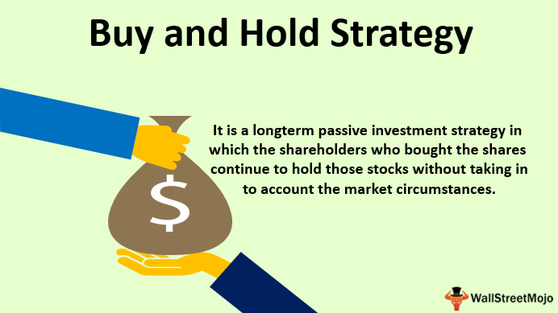

## Table of Contents

## What is the Buy and Hold strategy?

The Buy and Hold strategy is a simple investment approach where you buy stocks or other investments and keep them for a long time. Instead of trying to guess when the market will go up or down, you just hold onto your investments. This strategy is based on the belief that over many years, the stock market will grow, and your investments will be worth more.

People like this strategy because it's easy and doesn't need a lot of time or special knowledge. You don't have to watch the market every day or make quick decisions. Instead, you can focus on choosing good investments at the start and then let them grow over time. This can help you avoid the stress and mistakes that come from trying to time the market.

## How does the Buy and Hold strategy differ from other investment strategies?

The Buy and Hold strategy is different from other investment strategies because it focuses on long-term growth instead of short-term gains. With Buy and Hold, you buy stocks or other investments and keep them for many years. You don't worry about small changes in the market. Other strategies, like day trading or swing trading, involve buying and selling quickly to make money from short-term market movements. These strategies need a lot of time and attention because you have to watch the market closely and make fast decisions.

Another way Buy and Hold differs is in its simplicity and lower risk compared to strategies like active trading. Active trading means you're always trying to buy low and sell high, which can be risky and stressful. Buy and Hold doesn't try to beat the market; it just aims to grow with it over time. This means you spend less time managing your investments and can avoid the mistakes that come from trying to predict market changes. While other strategies might promise quicker profits, Buy and Hold is about steady, long-term growth.

## What are the basic principles of the Buy and Hold strategy?

The Buy and Hold strategy is all about keeping your investments for a long time. You buy stocks or other things you think will grow in value and then you just hold onto them. You don't sell them just because the market goes up or down a little. The main idea is that over many years, the market will go up, and your investments will be worth more. This means you don't need to spend a lot of time watching the market or making quick decisions.

Another important part of the Buy and Hold strategy is choosing your investments carefully at the start. You want to pick good companies or funds that you believe will do well over time. Once you have made your choices, you let them grow without trying to guess when to buy or sell. This strategy is simple and can help you avoid the stress and mistakes that come from trying to time the market. It's about being patient and letting your investments grow slowly but steadily over the years.

## What types of investments are typically used in a Buy and Hold strategy?

In a Buy and Hold strategy, people usually invest in stocks of big, well-known companies. These are called blue-chip stocks, and they are from companies that have been around for a long time and are likely to keep doing well. Another common choice is index funds, which are a way to invest in a whole bunch of stocks at once. For example, an S&P 500 index fund lets you own a piece of the 500 biggest companies in the U.S. These funds are popular because they spread out the risk and often grow steadily over time.

Another type of investment often used in Buy and Hold is real estate. People might buy a house or an apartment building and keep it for many years, hoping that it will become more valuable over time. They might also get money from renting it out. Some people also choose to invest in bonds, especially government or high-quality corporate bonds. Bonds are seen as safer than stocks and can provide a steady income, which can be good for long-term planning. The key is to pick investments that you believe will grow over the years and then hold onto them without worrying about short-term changes in the market.

## What are the potential benefits of using a Buy and Hold strategy?

One of the main benefits of using a Buy and Hold strategy is that it's simple and doesn't take a lot of time. You don't have to watch the market every day or make quick decisions about when to buy or sell. Instead, you choose good investments at the start and then just let them grow over time. This can save you a lot of stress and help you avoid the mistakes that come from trying to guess what the market will do next.

Another big benefit is that Buy and Hold can lead to good long-term growth. The idea is that over many years, the market goes up, and your investments become worth more. This means you can see your money grow steadily without having to do a lot of work. It's a patient approach that can pay off if you pick the right investments and stick with them for a long time.

## What are the risks associated with the Buy and Hold strategy?

One risk of the Buy and Hold strategy is that you might hold onto investments that don't do well. If you pick a stock or fund that doesn't grow, you could lose money over time. This can happen if a company has problems or if the whole market goes down for a long time. Since you're not selling and buying often, you might not see these problems until it's too late.

Another risk is that you might miss out on better opportunities. If the market changes a lot, there could be times when selling and buying something else would be smarter. But with Buy and Hold, you stick with what you have, even if other investments start to look more promising. This can mean you don't make as much money as you could if you were more active in your investing.

Lastly, it can be hard to stay calm during big market drops. Even though the idea is to hold on for the long term, seeing your investments lose value can be scary. If you panic and sell during a downturn, you might lock in losses instead of waiting for the market to recover. So, it's important to be patient and believe in your long-term plan, even when things look bad for a while.

## How does market volatility affect a Buy and Hold strategy?

Market [volatility](/wiki/volatility-trading-strategies) means the market can go up and down a lot in a short time. This can be tough for people using a Buy and Hold strategy. When the market drops a lot, it can be scary to see your investments lose value. But the key to Buy and Hold is to not panic and sell during these times. If you can hold on, you might see your investments recover and grow over time. The idea is that the market will go up in the long run, even if it's bumpy along the way.

Still, big swings in the market can test your patience. If the market stays down for a long time, it might be hard to stick with your plan. You might start to worry that your investments won't come back up. But if you believe in the companies or funds you've chosen, it's often best to keep holding. Over many years, the market tends to go up, so staying calm during volatile times can help you benefit from this long-term growth.

## How important is asset allocation in a Buy and Hold strategy?

Asset allocation is really important in a Buy and Hold strategy. It's all about deciding how to spread your money across different types of investments, like stocks, bonds, and real estate. When you're planning to hold onto your investments for a long time, it's smart to pick a mix that matches your goals and how much risk you're okay with. For example, if you're young and can handle more ups and downs, you might put more money into stocks. But if you're closer to needing the money, you might want more bonds, which are usually safer.

Once you've set up your asset allocation, you don't need to change it a lot with Buy and Hold. The idea is to stick with your plan and let your investments grow over time. But sometimes, you might need to make small tweaks if your situation changes or if one part of your portfolio grows a lot more than the others. Keeping a good balance can help you manage risk and make sure your investments are working well together to reach your long-term goals.

## What role does diversification play in a Buy and Hold strategy?

Diversification is a big part of a Buy and Hold strategy. It means spreading your money across different types of investments, like stocks, bonds, and real estate. This helps lower your risk because if one investment doesn't do well, the others might still be okay. For example, if the stock market goes down, your bonds might still be making money. This way, you're not putting all your eggs in one basket, which is important when you're planning to hold onto your investments for a long time.

In a Buy and Hold strategy, you pick your investments at the start and then let them grow over many years. Diversification helps make sure that your whole plan doesn't fall apart if one part of the market has problems. It's like having a safety net. By having a mix of different investments, you can feel more secure that your money will keep growing, even if some parts of the market go up and down a lot. This can help you stick with your long-term plan and not panic when the market gets bumpy.

## How can one evaluate the performance of a Buy and Hold strategy over time?

Evaluating the performance of a Buy and Hold strategy over time means looking at how your investments have grown. You can do this by checking the total value of your portfolio at different times, like every year or every few years. You might also compare your returns to a benchmark, like the S&P 500, to see if your investments are doing better or worse than the overall market. It's good to look at both the ups and downs, not just the final number, because this strategy is about long-term growth, not quick wins.

Another way to evaluate your Buy and Hold strategy is to see if it's meeting your goals. Are you saving enough for retirement or another big goal? Are you happy with how much risk you're taking? Sometimes, you might need to make small changes to your investments to keep them on track. But the main thing is to be patient and focus on the long run. Over many years, the market usually goes up, and your investments should grow if you stick with your plan.

## What are some advanced techniques for optimizing a Buy and Hold strategy?

One way to make your Buy and Hold strategy even better is by using something called dollar-cost averaging. This means you put money into your investments at regular times, like every month, instead of all at once. By doing this, you buy more shares when prices are low and fewer when they're high. Over time, this can help you get a better average price for your investments and make your portfolio grow more smoothly. It's a smart way to keep investing without worrying too much about short-term market changes.

Another advanced technique is to rebalance your portfolio every now and then. This means checking your investments to make sure they're still in the mix you want. If one part of your portfolio has grown a lot more than the others, you might sell some of it and buy more of the parts that haven't grown as much. This helps keep your risk at a level you're comfortable with and can make sure your investments are working together to meet your long-term goals. Rebalancing doesn't mean you're changing your strategy; it's just keeping it on track.

Lastly, you can use tax-efficient investing to make your Buy and Hold strategy work even better. This means thinking about where you put your investments to lower the taxes you have to pay. For example, you might keep investments that grow a lot in tax-advantaged accounts like IRAs or 401(k)s. By being smart about taxes, you can keep more of your money working for you over the long term. These techniques can help you fine-tune your Buy and Hold strategy to get the best results without losing the simplicity that makes it so appealing.

## How do tax considerations impact the effectiveness of a Buy and Hold strategy?

Tax considerations can really affect how well a Buy and Hold strategy works. When you hold onto your investments for a long time, you might pay less in taxes because long-term capital gains are usually taxed at a lower rate than short-term gains. This means you get to keep more of your money, which can help your investments grow even more over time. Also, if you keep your investments in special accounts like IRAs or 401(k)s, you might not have to pay taxes on your gains until you take the money out, or maybe not at all if it's a Roth account. This can make a big difference in how much your portfolio grows.

Another way taxes can impact your Buy and Hold strategy is through something called tax-loss harvesting. This is when you sell an investment that's lost value to use that loss to lower your taxes. You can then buy a similar investment to keep your strategy going. By doing this, you can reduce the amount of taxes you owe, which leaves more money in your portfolio to grow over time. So, thinking about taxes and using smart tax strategies can help make your Buy and Hold approach even more effective.

## References & Further Reading

[1]: Bergstra, J., Bardenet, R., Bengio, Y., & Kégl, B. (2011). ["Algorithms for Hyper-Parameter Optimization."](https://dl.acm.org/doi/10.5555/2986459.2986743) Advances in Neural Information Processing Systems 24.

[2]: ["Advances in Financial Machine Learning"](https://www.amazon.com/Advances-Financial-Machine-Learning-Marcos/dp/1119482089) by Marcos Lopez de Prado

[3]: ["Evidence-Based Technical Analysis: Applying the Scientific Method and Statistical Inference to Trading Signals"](https://www.amazon.com/Evidence-Based-Technical-Analysis-Scientific-Statistical/dp/0470008741) by David Aronson

[4]: ["Machine Learning for Algorithmic Trading"](https://github.com/stefan-jansen/machine-learning-for-trading) by Stefan Jansen

[5]: ["Quantitative Trading: How to Build Your Own Algorithmic Trading Business"](https://github.com/LucindaYa/quant-resources/blob/master/Quantitative%20Trading%20How%20to%20Build%20Your%20Own%20Algorithmic%20Trading%20Business.pdf) by Ernest P. Chan