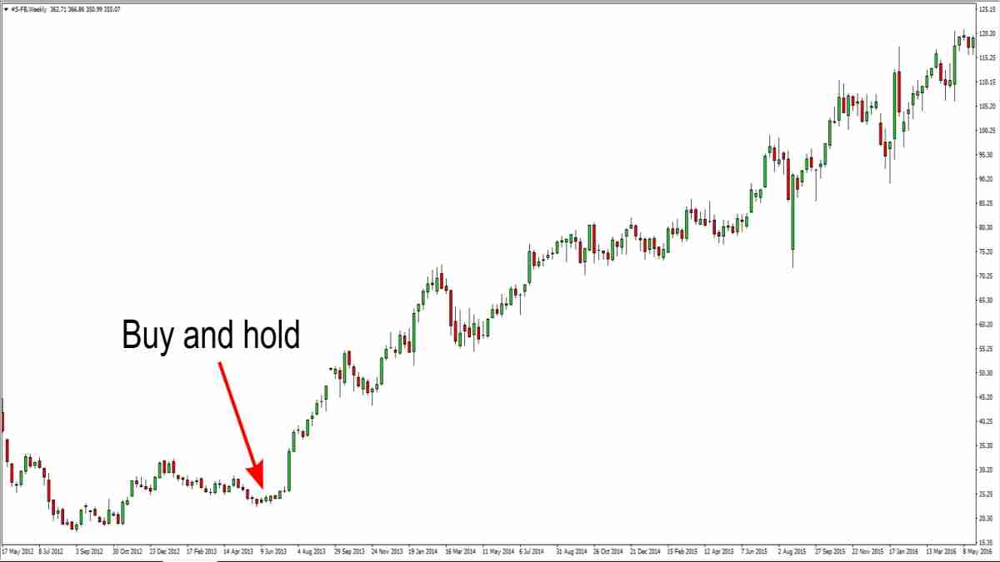

## Table of Contents

## What is the 'buy and hold' investment strategy?

The 'buy and hold' investment strategy is a simple approach where you buy investments like stocks or funds and keep them for a long time, often many years. Instead of trying to time the market or trade frequently, you believe in the long-term growth of your investments. This strategy is popular because it's easy to understand and doesn't require constant attention to your portfolio.

A big advantage of the 'buy and hold' strategy is that it can help you avoid the stress and mistakes that come with trying to predict short-term market movements. By holding onto your investments, you can benefit from the overall upward trend of the market over time. However, it's important to choose your investments wisely because this strategy means you'll be sticking with them through ups and downs.

## How does 'buy and hold' differ from other investment strategies?

The 'buy and hold' strategy is different from other investment strategies because it focuses on keeping investments for a long time, rather than buying and selling them often. Other strategies, like day trading or swing trading, involve trying to make quick profits by buying and selling stocks in a short period. These strategies need a lot of time and attention because you have to watch the market closely and make decisions quickly.

Another way 'buy and hold' differs is in how it handles market ups and downs. With 'buy and hold,' you believe that the market will grow over time, so you keep your investments even when the market goes down. Other strategies, like market timing, try to predict when the market will go up or down and buy or sell based on those predictions. This can be risky because it's hard to guess the market correctly, and it can lead to missing out on good times or selling at bad times.

Overall, 'buy and hold' is simpler and less stressful than many other strategies. It doesn't need you to watch the market all the time or make quick decisions. Instead, it's about [picking](/wiki/asset-class-picking) good investments and sticking with them for the long haul. This can be a good choice for people who want to invest without spending a lot of time and energy on it.

## What are the benefits of adopting a 'buy and hold' approach?

One big benefit of the 'buy and hold' approach is that it's easy and doesn't take a lot of time. You pick good investments and then you just hold onto them for a long time. This means you don't have to watch the market every day or make quick decisions about buying and selling. It's a lot less stressful than other ways of investing where you have to keep an eye on things all the time.

Another benefit is that it can help you make more money over time. The stock market usually goes up over many years, even if it has some ups and downs along the way. By holding onto your investments, you can benefit from this long-term growth. Also, when you buy and hold, you don't have to pay fees for buying and selling a lot, which can save you money and help your investments grow even more.

Lastly, 'buy and hold' can help you avoid making bad decisions based on short-term market changes. If the market goes down, you might feel scared and want to sell, but with 'buy and hold,' you stick to your plan and keep your investments. This can stop you from selling at a bad time and missing out on the market going back up. It's a good way to stay calm and focused on your long-term goals.

## What are the potential risks associated with 'buy and hold'?

One risk of the 'buy and hold' strategy is that you might keep an investment that isn't doing well. If you pick a stock or fund that doesn't grow or even loses value over time, holding onto it for a long time can hurt your overall returns. It's important to do your homework and pick good investments from the start because it can be hard to fix a bad choice later.

Another risk is that the market might not always go up. Even though the market usually grows over many years, there can be long periods where it stays the same or goes down. If you need your money during one of these times, you might have to sell your investments at a loss. This means you could lose money instead of making it, which can be a big problem if you were counting on that money for something important.

Lastly, 'buy and hold' doesn't work well if you need your money quickly. This strategy is meant for long-term investing, so if you need to use your money sooner than you planned, you might not be able to wait for your investments to grow. It's important to make sure you can leave your money invested for a long time before you start using this strategy.

## How can a beginner start implementing a 'buy and hold' strategy?

To start using a 'buy and hold' strategy, a beginner should first learn about different types of investments like stocks, bonds, and mutual funds. It's a good idea to read [books](/wiki/algo-trading-books), watch videos, or even take a class to understand what you're getting into. Once you feel ready, you can open an investment account with a brokerage firm. Look for one that has low fees and good tools for beginners. After setting up your account, you'll need to decide how much money you can invest and how you want to spread it out among different investments. This is called diversification, and it helps lower your risk by not putting all your money in one place.

Once you've chosen your investments, the key is to stick with them for the long haul. This means not selling them just because the market goes up and down. It's important to check your investments every now and then to make sure they're still a good fit for your goals, but don't make changes based on short-term market moves. Over time, you might want to add more money to your investments or adjust your portfolio a bit, but the main idea is to hold onto your investments for many years. This way, you can benefit from the growth of the market over time and avoid the stress of trying to time the market.

## What types of assets are best suited for a 'buy and hold' strategy?

For a 'buy and hold' strategy, stocks of big, stable companies are a good choice. These are often called blue-chip stocks. They are from well-known companies that have been around for a long time and usually pay dividends, which are like little bonuses for holding the stock. Another good option is index funds, which are a type of mutual fund that tries to match the performance of a big part of the market, like the S&P 500. Index funds are easy to manage and often have low fees, making them perfect for long-term investing.

Bonds can also work well with a 'buy and hold' strategy, especially if you want something a bit safer. Government bonds and high-quality corporate bonds can give you steady income over time. Real estate investment trusts (REITs) are another option. They let you invest in real estate without buying property yourself, and they often pay out good dividends. The key is to pick assets that you believe will do well over many years and that fit your goals and how much risk you're willing to take.

## How long should one typically hold investments in a 'buy and hold' strategy?

In a 'buy and hold' strategy, you usually keep your investments for a long time, like many years. Some people think about holding onto their investments for at least 5 to 10 years. This long time frame helps you ride out the ups and downs of the market and benefit from the overall growth over time.

The exact time can depend on your goals and when you need the money. If you're saving for retirement, you might hold your investments for 20 or 30 years or even more. The main idea is to pick a time that fits with your plans and then stick with your investments, even if the market has some rough patches along the way.

## Can 'buy and hold' be effective in volatile markets?

Yes, 'buy and hold' can be effective even in volatile markets. Volatility means the market goes up and down a lot, which can be scary. But if you stick with your 'buy and hold' strategy, you don't sell your investments just because the market is going down. Over time, the market usually goes back up, and by holding on, you can benefit from this long-term growth.

The key is to pick good investments at the start and believe in them for the long haul. Even if the market is bumpy, if you've chosen solid companies or funds, they can still grow over many years. It's important not to let short-term ups and downs make you panic and sell. By staying calm and sticking to your plan, you can come out ahead even in a volatile market.

## How does tax impact a 'buy and hold' strategy?

When you use a 'buy and hold' strategy, you can save money on taxes. If you hold onto your investments for more than a year before selling them, you usually pay a lower tax rate on any profits you make. This is called the long-term capital gains tax rate, and it's often less than the tax rate you'd pay if you sold your investments sooner. By holding onto your investments for a long time, you can keep more of your money.

But, there are some things to think about. If your investments pay dividends, you might have to pay taxes on those every year, even if you don't sell your investments. This can be a bit annoying, but the tax rate on qualified dividends is usually lower than your regular income tax rate. Also, if you're investing in a retirement account like an IRA or 401(k), you can often put off paying taxes until you take the money out later, which can help your investments grow even more over time.

## What are some advanced techniques to optimize a 'buy and hold' portfolio?

One way to make your 'buy and hold' portfolio even better is to keep it balanced. This means checking your investments every now and then to make sure they're still spread out the way you want. Over time, some investments might grow more than others, so you might need to sell a bit of what's doing really well and buy more of what's not doing as well. This helps keep your risk at a level you're comfortable with. Another good idea is to add new money to your portfolio regularly. This can help you buy more shares when the market is down, which can be a smart move in the long run.

Another advanced technique is to use dollar-cost averaging. This means you put the same amount of money into your investments at regular times, like every month. This way, you buy more shares when prices are low and fewer when prices are high, which can help you get a better average price over time. Also, think about using tax-advantaged accounts like IRAs or 401(k)s. These can help you save on taxes and let your money grow more over time. By using these techniques, you can make your 'buy and hold' strategy even stronger and help your investments do better in the long run.

## How does 'buy and hold' perform compared to active trading over the long term?

Over the long term, 'buy and hold' often does better than active trading for a lot of people. This is because the stock market usually goes up over many years, and by holding onto your investments, you can benefit from this growth. Active trading, where you buy and sell a lot to try to make quick profits, can be hard to do well. It takes a lot of time and knowledge, and even experts can get it wrong. Plus, every time you buy or sell, you might have to pay fees, which can add up and eat into your profits. So, for most people, sticking with 'buy and hold' can lead to better results over time.

But, it's not always that simple. Some people who are really good at active trading can make more money than if they just held onto their investments. These people often have a lot of experience and spend a lot of time watching the market. For everyone else, though, 'buy and hold' is usually easier and less stressful. It doesn't need you to be checking the market all the time, and it helps you avoid making quick decisions that you might regret later. In the end, 'buy and hold' can be a good choice for long-term investing because it's simple and can help you grow your money over time without too much hassle.

## What are the psychological challenges of sticking to a 'buy and hold' strategy?

One of the biggest psychological challenges of sticking to a 'buy and hold' strategy is dealing with fear and panic when the market goes down. It can be really hard to watch your investments lose value and not do anything about it. You might feel like you should sell to stop the losses, but with 'buy and hold,' you need to stay calm and keep your investments. This can be tough, especially if you see other people making quick profits by trading.

Another challenge is the temptation to try to time the market. When you see the market going up, it can be tempting to sell and then buy back in when it goes down. But this is hard to get right, and you might miss out on the best times to be in the market. Sticking to 'buy and hold' means trusting that your investments will do well over many years, even if they have some rough patches along the way. It's about having patience and believing in your long-term plan, which can be a big mental challenge.

## References & Further Reading

[1]: ["The Intelligent Investor: The Definitive Book on Value Investing. A Book of Practical Counsel (Revised Edition)"](https://www.amazon.com/Intelligent-Investor-Definitive-Investing-Essentials/dp/0060555661) by Benjamin Graham

[2]: ["Advances in Financial Machine Learning"](https://www.amazon.com/Advances-Financial-Machine-Learning-Marcos/dp/1119482089) by Marcos Lopez de Prado

[3]: ["Quantitative Trading: How to Build Your Own Algorithmic Trading Business"](https://www.amazon.com/Quantitative-Trading-Build-Algorithmic-Business/dp/1119800064) by Ernest P. Chan

[4]: ["Algorithmic and High-Frequency Trading"](https://www.amazon.com/Algorithmic-High-Frequency-Trading-Mathematics-Finance/dp/1107091144) by Álvaro Cartea, Sebastian Jaimungal, and José Penalva

[5]: ["Machine Learning for Algorithmic Trading - Second Edition"](https://www.oreilly.com/library/view/machine-learning-for/9781839217715/) by Stefan Jansen

[6]: Malkiel, B. G. (2016). ["A Random Walk Down Wall Street: The Time-Tested Strategy for Successful Investing (Eleventh Edition)"](https://www.amazon.com/Random-Walk-Down-Wall-Street/dp/0393246116). W. W. Norton & Company.

[7]: ["Python for Finance: Mastering Data-Driven Finance"](https://www.amazon.com/Python-Finance-Mastering-Data-Driven/dp/1492024333) by Yves Hilpisch

[8]: ["Evidence-Based Technical Analysis: Applying the Scientific Method and Statistical Inference to Trading Signals"](https://www.amazon.com/Evidence-Based-Technical-Analysis-Scientific-Statistical/dp/0470008741) by David Aronson