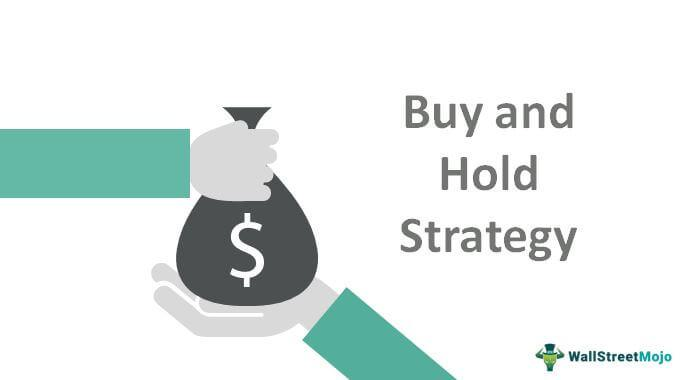

The 'Buy and Hold' strategy is a foundational investment approach characterized by the acquisition of assets with the intention of retaining them over extended durations. This strategy is predicated on the belief that, despite short-term market volatility, markets tend to increase in value over the long term. By minimizing frequent trading, investors who adopt this strategy can often benefit from reduced transaction costs and favorable tax implications associated with long-term capital gains.

Algorithmic trading infuses this classic investment strategy with a contemporary twist by incorporating technology. This involves the use of pre-defined criteria and complex mathematical models to automate the buying and selling of investments. The integration of such technological advancements aims to enhance decision-making processes while executing trades with precision and speed.



This article investigates the potential synergy of combining the 'Buy and Hold' strategy with algorithmic trading to achieve optimal investment outcomes. By automating certain aspects of the investment process, investors may stabilize their approaches while also gaining efficiency and potentially enhancing returns. Moreover, the synthesis of these strategies can be particularly beneficial when tailored to fit various investment goals and risk profiles, offering a customized investment path rooted in both traditional and modern methodologies. As financial markets continue to develop and become increasingly dynamic, the fusion of these approaches presents numerous opportunities and challenges for contemporary investors.

## Table of Contents

## Understanding Buy and Hold Strategy

The "Buy and Hold" strategy is a fundamental investment approach that emphasizes the importance of long-term asset retention. By acquiring securities and holding onto them for extended durations, investors aim to capitalize on the intrinsic growth potential of financial markets. The essence of this strategy lies in its ability to reduce the impact of short-term market fluctuations, thereby allowing the intrinsic value of investments to appreciate over time.

One of the notable benefits of this strategy is the reduction in transaction costs. Frequent buying and selling of assets commonly incur substantial fees, which can erode overall investment returns. By adhering to a buy and hold policy, investors minimize these frictional costs, allowing more of their capital to remain invested and work towards compounding returns.

Furthermore, the "Buy and Hold" strategy often takes advantage of favorable long-term capital gains tax rates. In many jurisdictions, holding an investment for more than a year subjects it to lower tax rates on capital gains compared to short-term investments. This tax efficiency further enhances the attractiveness of long-term investing.

This strategy, however, necessitates a certain degree of patience and confidence in the enduring upward trajectory of markets. While market corrections and [volatility](/wiki/volatility-trading-strategies) are an inherent part of investing, adherents of the "Buy and Hold" method maintain a conviction that markets will recover and continue to grow over time. This belief is often grounded in historical data, which generally reflects an upward trend in equity markets over long periods, despite temporary setbacks.

Ultimately, the "Buy and Hold" strategy aligns with the principles of passive investing, accommodating those seeking stable, long-term growth without the stress of frequent trading. This approach underscores the value of maintaining a disciplined and patient investment mindset, allowing market forces and time to drive wealth accumulation.

## The Role of Algorithmic Trading in Investing

Algorithmic trading has revolutionized the financial markets by automating the buying and selling of securities through the use of complex algorithms. This technological advancement reduces the potential for human error and minimizes decisions driven by emotions, which are common drawbacks of manual trading. The key advantages of [algorithmic trading](/wiki/algorithmic-trading) include its ability to execute trades quickly and efficiently, leveraging computational power to analyze vast amounts of data in real-time and responding to market conditions that would be challenging for human traders to process at the same speed.

The incorporation of [artificial intelligence](/wiki/ai-artificial-intelligence) (AI) and [machine learning](/wiki/machine-learning) (ML) further enhances the effectiveness of algorithmic trading strategies. By using sophisticated models, these technologies can identify patterns and adapt to changes within the financial markets, allowing for a more personalized and efficient trading experience. Machine learning algorithms can continuously learn from data, improving their predictions and adapting to new market conditions over time. For example, a machine learning model could be trained to predict stock price movements based on historical data, technical indicators, and news sentiment analysis, thus automating decision-making processes that were traditionally handled by human analysts.

Python has become a popular language in the development of algorithmic trading systems due to its simplicity and the availability of powerful libraries such as NumPy, pandas, and scikit-learn. Below is a basic example of a Python script that utilizes historical price data to implement a simple moving average crossover strategy, which is one of the most common algorithmic trading strategies:

```python
import pandas as pd
import numpy as np

# Load historical price data
data = pd.read_csv('historical_prices.csv')
data['SMA_50'] = data['Close'].rolling(window=50).mean()
data['SMA_200'] = data['Close'].rolling(window=200).mean()

# Generate trading signals
data['Signal'] = 0
data.loc[data['SMA_50'] > data['SMA_200'], 'Signal'] = 1
data.loc[data['SMA_50'] < data['SMA_200'], 'Signal'] = -1

# Backtest the strategy
data['Returns'] = data['Close'].pct_change()
data['Strategy_Returns'] = data['Signal'].shift(1) * data['Returns']

# Calculate cumulative returns
cumulative_returns = (1 + data['Strategy_Returns']).cumprod() - 1

print(cumulative_returns.tail())
```

In the above code, the script calculates simple moving averages (SMA) for 50-day and 200-day periods and generates buy and sell signals based on their crossover points. By running a backtest, investors can evaluate the historical performance of this strategy, helping to assess its potential viability.

In summary, algorithmic trading, with the aid of AI and ML, has transformed investing practices by providing tools for automated, efficient, and less emotionally driven trades. As technology continues to advance, the potential for further enhancements in algorithmic strategies suggests promising developments for the future of investment management.

## Pros and Cons of Combining Buy and Hold with Algo Trading

Combining the 'Buy and Hold' strategy with algorithmic trading presents a compelling investment approach by blending traditional financial principles with cutting-edge technology. The integration of these methods can introduce several advantages and some challenges.

**Pros**

One significant advantage of this hybrid strategy is the reduction of emotional stress. Traditional 'Buy and Hold' investors may face anxiety during market fluctuations due to the need for immediate decision-making in volatile conditions. By employing algorithmic trading, decisions are based on predefined criteria rather than emotions, helping investors to maintain composure during market turbulence.

Time efficiency is another benefit. Algorithmic trading automates the buying and selling process, allowing trades to be executed rapidly and efficiently. This automation frees investors from monitoring the market constantly, thus optimizing resource allocation and letting them focus on other critical tasks.

Moreover, the potential for higher risk-adjusted returns is substantial. Algorithmic trading can incorporate sophisticated risk management techniques and diversify the portfolio dynamically according to market conditions. This adaptability may improve the strategy's overall performance compared to a static 'Buy and Hold' approach.

**Cons**

Despite these advantages, there are challenges. The reliance on algorithms introduces dependency risks. An algorithm that fails to adapt to unexpected market conditions might execute trades that are not aligned with the investor’s overall strategy.

There is also a requirement for accurate algorithmic setup. Designing and implementing an effective algorithm demands a deep understanding of market dynamics and significant technical expertise. An incorrect configuration may lead to suboptimal decisions and potential financial losses.

In conclusion, while merging 'Buy and Hold' with algorithmic trading brings potential efficiencies and emotional relief, investors must be vigilant about the technology's setup and dependency to capitalize on its advantages effectively.

## Popular Platforms and Tools

Robo-advisors such as Betterment and Wealthfront have become synonymous with algorithm-driven portfolio management, aligning closely with the principles of passive investing. These platforms utilize advanced algorithms to create diversified portfolios based on individual investor preferences, risk tolerances, and financial goals. By automating the investment process, robo-advisors reduce the need for active decision-making, thus supporting the foundational concept of the Buy and Hold strategy. This approach not only minimizes emotional investment decisions but also aids in maintaining a disciplined investment path over the long term.

In addition to robo-advisors, numerous trading platforms now integrate artificial intelligence (AI) and machine learning technologies to provide sophisticated tools for investors interested in algorithmic trading. These platforms, such as QuantConnect and Alpaca, offer robust frameworks for developing, testing, and deploying trading algorithms. The integration of AI allows for the analysis of vast datasets, enabling more precise market predictions and strategy optimizations.

Moreover, the use of algorithmic trading systems within these platforms can help investors execute trades swiftly and accurately, taking advantage of market opportunities that may be fleeting. The deployment of AI-driven algorithms ensures that trades are executed based on predefined criteria, thereby minimizing the risks associated with human error and emotional volatility.

To illustrate the power of algorithmic strategies, consider a Python example for a simple moving average crossover strategy, often employed in algorithmic trading:

```python
import pandas as pd
import numpy as np

# Assuming historical price data is loaded into a DataFrame `data`
# Creating short and long moving averages
data['SMA_50'] = data['Close'].rolling(window=50).mean()
data['SMA_200'] = data['Close'].rolling(window=200).mean()

# Signal generation for moving average crossover
data['Signal'] = 0
data['Signal'][50:] = np.where(data['SMA_50'][50:] > data['SMA_200'][50:], 1, 0)

# Calculate the trading positions
data['Position'] = data['Signal'].diff()

# Print a sample of the calculated data with signals and positions
print(data[['Close', 'SMA_50', 'SMA_200', 'Signal', 'Position']].tail())
```

The platforms' provision of tools like these empowers investors to explore algorithmic strategies that align with their predefined investment objectives. As technology continues to evolve, these platforms are poised to offer increasingly sophisticated features, enabling both novice and experienced investors to integrate advanced algorithmic trading techniques into their investment strategies seamlessly. This capability not only enhances potential returns but also positions investors to adapt swiftly to dynamic market conditions while adhering to the core tenets of passive investing.

## Future Trends in Passive Investing and Algo Trading

Technological advancements are significantly reshaping passive investing and algorithmic trading, making them more efficient and personalized. Blockchain technology, for instance, offers enhanced security and transparency in financial transactions, which can be particularly beneficial for passive investors. By enabling decentralized and immutable ledger systems, blockchain ensures that investment records are accurate, reducing the risk of fraud and errors. This transparency aligns well with the principles of passive investing, where clarity and understanding of investment flows are crucial.

Artificial Intelligence (AI) is another catalyst for change, providing tools for more sophisticated data analysis and decision-making processes. AI-driven algorithms can efficiently analyze large datasets to identify market trends and predict potential investment opportunities. This capability not only optimizes the execution of buy-and-hold strategies but also enhances the responsiveness of algorithmic trading systems to market fluctuations. Machine learning, a subset of AI, allows these systems to adapt and improve their performance over time by learning from historical data and outcomes.

The reduction of fees and increased transparency are further democratizing access to passive investment strategies. Traditional investment models often include high management fees, which can erode returns over time. However, the deployment of software algorithms and robo-advisors reduces the need for human intervention, thus lowering associated costs. This transition enables more investors to engage in passive investing without significant financial barriers, aligning with trends towards simplified and cost-effective investment solutions.

Emerging technologies are expected to continue driving innovation in investment approaches. For instance, advancements in natural language processing (NLP) facilitate better sentiment analysis of financial news and social media, offering insights into market sentiment that can influence investment strategies. Quantum computing, though still in its nascent stages, holds the potential to solve complex financial models much faster than classical computers, potentially offering real-time risk assessments and optimizing portfolio management.

As these technologies evolve, the integration of passive investing with algorithmic trading is likely to become more seamless and sophisticated. Investors will have access to more personalized and tailored strategies that reflect their individual risk profiles and financial goals. Furthermore, ongoing innovations will make the investment process more inclusive, providing broader access to global financial markets and allowing for more diversified investment opportunities.

In conclusion, the future of passive investing and algorithmic trading is poised for substantial transformation driven by technological advancements. These changes promise to enhance investment efficiency, reduce costs, and offer more personalized approaches, opening new avenues for wealth generation and financial inclusion in the global market.

## Conclusion

The integration of Buy and Hold with algorithmic trading creates a compelling strategy for wealth growth, especially in the fluctuating financial markets. By combining these approaches, investors can leverage the benefits of both long-term investment stability and automated, data-driven trading precision. This synergy allows investors to potentially enhance returns while mitigating the emotional and behavioral biases that often affect investment decisions.

When adopting these strategies, investors should carefully evaluate their individual risk tolerance and trading preferences. The Buy and Hold strategy inherently involves a belief in the long-term growth of markets, while algorithmic trading requires a comfort level with technology and an understanding of algorithmic processes. By aligning these preferences with their financial goals, investors can optimize their investment outcomes.

Continuous technological advancements are poised to further transform the landscape of passive investing. The integration of artificial intelligence, machine learning, and other emerging technologies promises to provide investors with increasingly personalized and efficient tools. These innovations also contribute to greater transparency and reduced fees, making investment opportunities more accessible to a broader audience.

As the evolution of passive investing persists, those who stay informed and adaptable can seize new opportunities and potentially achieve substantial wealth accumulation. Therefore, the fusion of Buy and Hold with algorithmic trading not only enhances current investment strategies but also positions investors advantageously for future financial success.

## References & Further Reading

[1]: ["The Intelligent Investor: The Definitive Book on Value Investing. A Book of Practical Counsel (Revised Edition)"](https://www.amazon.com/Intelligent-Investor-Definitive-Investing-Essentials/dp/0060555661) by Benjamin Graham

[2]: ["Advances in Financial Machine Learning"](https://www.amazon.com/Advances-Financial-Machine-Learning-Marcos/dp/1119482089) by Marcos Lopez de Prado

[3]: ["Quantitative Trading: How to Build Your Own Algorithmic Trading Business"](https://www.amazon.com/Quantitative-Trading-Build-Algorithmic-Business/dp/1119800064) by Ernest P. Chan

[4]: ["Algorithmic and High-Frequency Trading"](https://www.amazon.com/Algorithmic-High-Frequency-Trading-Mathematics-Finance/dp/1107091144) by Álvaro Cartea, Sebastian Jaimungal, and José Penalva

[5]: ["Machine Learning for Algorithmic Trading - Second Edition"](https://www.oreilly.com/library/view/machine-learning-for/9781839217715/) by Stefan Jansen

[6]: Malkiel, B. G. (2016). ["A Random Walk Down Wall Street: The Time-Tested Strategy for Successful Investing (Eleventh Edition)"](https://www.amazon.com/Random-Walk-Down-Wall-Street/dp/0393246116). W. W. Norton & Company.

[7]: ["Python for Finance: Mastering Data-Driven Finance"](https://www.amazon.com/Python-Finance-Mastering-Data-Driven/dp/1492024333) by Yves Hilpisch

[8]: ["Evidence-Based Technical Analysis: Applying the Scientific Method and Statistical Inference to Trading Signals"](https://www.amazon.com/Evidence-Based-Technical-Analysis-Scientific-Statistical/dp/0470008741) by David Aronson