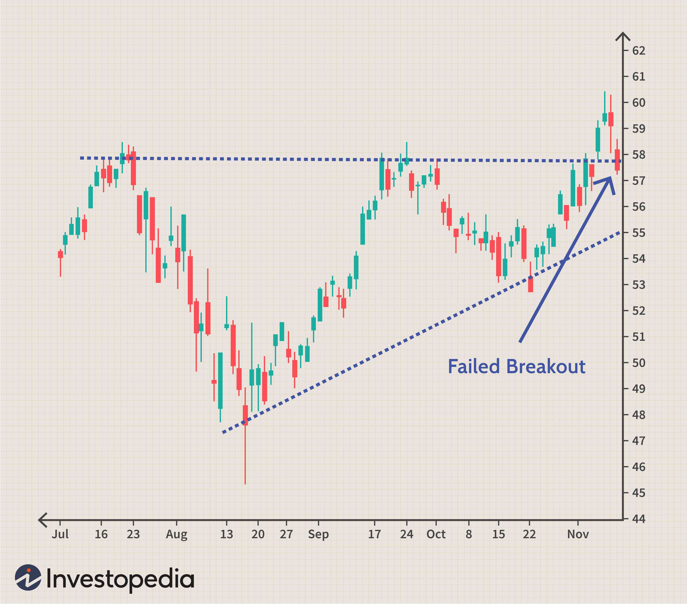

## Table of Contents

## What is a Buy Break?

A Buy Break, also known as a breakout, is when the price of a stock or another financial asset moves above a certain resistance level. This resistance level is a price that the asset has had trouble going above in the past. When the price finally breaks through this level, it can be a sign that the asset might keep going up in value. Traders and investors often see this as a good time to buy the asset, hoping to make money as the price continues to rise.

However, a Buy Break doesn't always mean the price will keep going up. Sometimes, the price might go back down after breaking through the resistance level. This is called a false breakout. Because of this, it's important for traders to be careful and use other tools and information to help them decide if a Buy Break is a good time to buy. They might look at things like the overall market trend, news about the company, and other technical indicators to make a smarter decision.

## How does a Buy Break differ from other trading strategies?

A Buy Break strategy focuses on buying an asset when its price moves above a resistance level, which is a price the asset has struggled to go beyond before. This strategy is different from others because it's all about timing the entry point right after the price breaks through a key level. Traders using this strategy believe that once the price breaks through, it might keep going up, giving them a chance to make money. They often use charts and other tools to spot these resistance levels and wait for the right moment to buy.

Other trading strategies might not focus as much on these specific price levels. For example, a trend-following strategy looks at the overall direction of the market and tries to buy when the market is going up and sell when it's going down. This is different from a Buy Break because it doesn't depend on breaking through a specific price point. Another strategy, like value investing, involves buying assets that seem underpriced based on their fundamental value, not their current price movements. So, while a Buy Break strategy is about timing the entry based on price action, other strategies might look at different factors like market trends or the asset's value.

## What are the key components of a Buy Break?

A Buy Break is all about waiting for the price of a stock or another asset to go above a certain level that it has had trouble getting past before. This level is called a resistance level. When the price finally breaks through this resistance, it might be a sign that the price could keep going up. Traders who use a Buy Break strategy are looking for this exact moment to buy the asset, hoping to make money as the price rises.

But, it's not just about seeing the price go up. Traders also need to look at other things to make sure it's a good time to buy. They might check the overall trend of the market, read news about the company, and use other tools like charts and indicators. This helps them avoid false breakouts, where the price goes up but then quickly goes back down. So, while the main part of a Buy Break is the price breaking through a resistance level, being careful and using other information is also very important.

## Can you explain the mechanism behind a Buy Break?

A Buy Break happens when the price of a stock or another thing you can buy goes above a certain level that it couldn't go past before. This level is called a resistance level. When the price finally goes above this level, it's called a breakout. Traders who use the Buy Break strategy wait for this moment to happen. They think that once the price breaks through, it might keep going up, so they buy the stock right after the breakout, hoping to make money as the price rises.

But it's not just about seeing the price go up. Traders also need to look at other things to make sure it's a good time to buy. They might check the overall trend of the market, read news about the company, and use other tools like charts and indicators. This helps them avoid false breakouts, where the price goes up but then quickly goes back down. So, while the main part of a Buy Break is the price breaking through a resistance level, being careful and using other information is also very important.

## What are the typical market conditions that favor a Buy Break?

Market conditions that favor a Buy Break often include a strong overall upward trend in the market. When the market is going up, it's more likely that a stock's price will keep rising after it breaks through a resistance level. This is because more people are buying stocks, which pushes prices up. Traders look for signs of this upward trend, like higher highs and higher lows on the price chart, to feel confident that a Buy Break will lead to more gains.

Another important condition is high trading volume when the breakout happens. High volume means a lot of people are buying the stock at the same time, which can help push the price even higher. It shows that there's strong interest in the stock, making it more likely that the price will keep going up after the breakout. Traders pay close attention to volume to make sure the Buy Break is supported by real buying interest and not just a temporary spike in price.

## How do traders identify potential Buy Break opportunities?

Traders identify potential Buy Break opportunities by looking at price charts to find resistance levels. A resistance level is a price that the stock has had trouble going above in the past. They draw lines on the chart to connect the highest points where the price stopped before. When the price gets close to this level again, traders watch closely. If the price goes above this level, it might be a Buy Break opportunity.

Besides looking at the charts, traders also pay attention to the overall market trend. If the market is going up, it's more likely that a stock's price will keep rising after a breakout. They also check the trading volume. If a lot of people are buying the stock when it breaks through the resistance level, it's a good sign that the price might keep going up. This helps traders feel more confident that the Buy Break is a real opportunity and not just a temporary price spike.

## What are the common entry and exit strategies used in a Buy Break?

For a Buy Break, traders usually buy the stock right after it goes above a resistance level. They might set a specific price above the resistance level as their entry point. For example, if the resistance level is at $50, they might decide to buy if the price goes to $51. This way, they make sure the price has really broken through before they buy. Some traders also use other signs like high trading volume to confirm the breakout before they enter their trade.

When it comes to exiting a Buy Break trade, traders have a few common strategies. One is to set a target price where they want to sell for a profit. They might look at the next resistance level or use a certain percentage gain as their target. Another strategy is to use a stop-loss order, which automatically sells the stock if the price goes down to a certain level. This helps limit their losses if the price goes back down after the breakout. Some traders might also decide to sell if they see signs that the upward trend is ending, like if the price starts to go down or if the trading volume drops.

## What are the risks associated with implementing a Buy Break strategy?

One big risk of using a Buy Break strategy is that the price might go back down after it breaks through the resistance level. This is called a false breakout. If the price goes up but then quickly drops, traders can lose money. They might have bought the stock hoping it would keep going up, but instead, they end up with a loss. To try and avoid this, traders often use other tools and information to make sure the breakout is real, but there's still a chance it won't work out.

Another risk is that the market can be unpredictable. Even if the price breaks through a resistance level and everything seems good, other things can happen that make the price go down. For example, bad news about the company or changes in the overall market can cause the stock to drop. Traders need to be ready for these surprises and have a plan for what to do if the price doesn't keep going up like they hoped. This means setting stop-loss orders to limit their losses and being careful about how much money they put into each trade.

## How can technical analysis tools be used to enhance a Buy Break strategy?

Technical analysis tools can help traders spot Buy Break opportunities by showing them where the resistance levels are on a price chart. Traders use tools like trend lines and moving averages to draw lines that connect the highest points where the price stopped before. These lines help them see if the price is getting close to breaking through a resistance level. If the price goes above this level, it might be a good time to buy. Tools like the Relative Strength Index (RSI) and the Moving Average Convergence Divergence (MACD) can also show if the stock is overbought or oversold, which can help traders decide if the breakout is likely to continue.

Another way technical analysis can help is by confirming the breakout with volume indicators. High trading volume when the price breaks through a resistance level is a good sign that the breakout is real and not just a temporary spike. Traders might use volume charts or the On-Balance Volume (OBV) indicator to see if a lot of people are buying the stock at the same time. This can give them more confidence that the price will keep going up after the breakout. By using these technical tools, traders can make smarter decisions about when to enter and exit their trades, helping them avoid false breakouts and manage their risks better.

## What are some real-world examples of successful Buy Breaks?

One real-world example of a successful Buy Break happened with Apple Inc. in early 2017. The stock had been trading around $115 for a while, and this was seen as a resistance level. When the price finally broke above $115 and kept going up, traders who bought at the breakout made money as the stock reached new highs. They used charts to see the resistance level and waited for the price to go above it before buying. The high trading volume at the time of the breakout also helped confirm that it was a good time to buy.

Another example is with Netflix in late 2019. The stock had trouble going above $300 for a long time, but when it finally did, it was a clear Buy Break. Traders who bought the stock after it broke through this resistance level saw the price go up to over $500 in the following months. They looked at the overall market trend, which was going up, and used volume indicators to make sure the breakout was real. This helped them feel confident in their decision to buy at the breakout and hold onto the stock as it continued to rise.

## How does a Buy Break strategy adapt to different time frames?

A Buy Break strategy can work on different time frames, like short-term, medium-term, or long-term. On a short-term chart, like a 5-minute or 1-hour chart, traders look for quick breakouts above resistance levels. They might buy a stock right after it goes above the level and then sell it soon after for a small profit. This can happen in a few hours or even minutes. On these short time frames, traders need to watch the market closely and act fast because things can change quickly.

On longer time frames, like daily or weekly charts, a Buy Break strategy focuses on bigger trends. Traders look for the price to break through a resistance level that has been important for weeks or months. When this happens, they might hold onto the stock for a longer time, hoping to make more money as the price keeps going up over days or weeks. On these longer time frames, traders don't need to watch the market as closely, but they still need to check the overall market trend and use other tools to make sure the breakout is real.

## What advanced techniques can be applied to optimize a Buy Break strategy?

To make a Buy Break strategy even better, traders can use something called multiple time frame analysis. This means they look at the same stock on different time frames, like a daily chart and a 1-hour chart, at the same time. By doing this, they can see if the breakout is strong on both short and long time frames. If the price breaks through a resistance level on both, it's a good sign that the breakout is real and might keep going up. Traders can also use trend indicators like moving averages to see if the overall trend supports the breakout. If the stock is above its long-term moving average, it's more likely to keep going up after a Buy Break.

Another advanced technique is to use volume profile analysis. This helps traders see where a lot of buying and selling happened in the past. If the breakout happens at a price where a lot of trading happened before, it can be a strong sign that the price will keep going up. Traders can also use something called a volatility stop, which helps them set their stop-loss orders in a smart way. Instead of just picking a random price to sell if the stock goes down, a volatility stop uses the stock's recent price movements to decide where to set the stop-loss. This can help traders avoid getting out of the trade too early if the price goes down a little bit but still has a good chance of going back up.

## How can one construct an algorithmic buy break strategy?

Algorithmic trading employs sophisticated computer algorithms to execute trades with precision and speed. Constructing an effective buy break algorithm requires the establishment of explicit entry and [exit](/wiki/exit-strategy) points based on predefined thresholds. This approach ensures that trading decisions are systematic and not influenced by emotional biases. Entry points in a buy break strategy are typically identified when a stock surpasses its resistance level—a point previously identified as a ceiling beyond which the stock price has struggled to rise.

To effectively automate this process, technology plays a crucial role. Programming languages like Python are predominantly used for writing trading algorithms due to their extensive libraries and ease of integration with trading platforms. For example, libraries such as NumPy and pandas simplify data manipulation, while trading APIs like [Interactive Brokers](/wiki/interactive-brokers-api) API facilitate direct execution of trades through automated processes. Below is a simplified Python example demonstrating how one might set up a basic buy break strategy:

```python
import numpy as np
import pandas as pd
import talib

# Example of a dataset with time-series stock data
data = pd.read_csv('stock_data.csv')

# Close prices
close = data['Close']

# Calculate a simple moving average (SMA) as a technical indicator
sma = talib.SMA(close, timeperiod=20)

# Basic threshold for a buy break strategy
threshold = 1.01

# Define a buy signal when close price is greater than SMA threshold
signals = close > (sma * threshold)

# Trading logic would be implemented here
for i in range(len(signals)):
    if signals[i]:
        print(f"Buy signal at index {i}, price: {close[i]}")
```

Backtesting is a critical component in honing a trading strategy. It involves simulating the strategy on historical data to evaluate its performance, mitigating the risk of unexpected results in real-world applications. By [backtesting](/wiki/backtesting), developers can understand how the strategy would have performed under past market conditions and make necessary adjustments to improve robustness.

In constructing a buy break strategy, the integration of technical indicators can significantly enhance decision-making. The Donchian Channel, for example, provides a clear framework to determine breakout points by plotting the highest high and lowest low over a specified period. This enables the algorithm to systematically identify breakouts beyond conventional resistance levels. The Donchian Channel formula is as follows:

$$
\text{Upper Band} = \max \left( \text{high}_{i} \right), \quad \text{Lower Band} = \min \left( \text{low}_{i} \right)
$$

where $i$ represents each price point within the specified window. This indicator helps isolate structural price changes, allowing the algorithm to react swiftly to genuine buy opportunities while avoiding false signals or noise.

Overall, constructing an algorithmic buy break strategy is a nuanced process that hinges on well-defined entry and exit criteria, robust technological integration, thorough backtesting, and dynamic usage of technical indicators like the Donchian Channel. These elements collectively contribute to a strategy that is both functional and adaptable to ever-changing market conditions.

## References & Further Reading

[1]: ["Advances in Financial Machine Learning"](https://www.amazon.com/Advances-Financial-Machine-Learning-Marcos/dp/1119482089) by Marcos Lopez de Prado

[2]: ["Evidence-Based Technical Analysis: Applying the Scientific Method and Statistical Inference to Trading Signals"](https://www.amazon.com/Evidence-Based-Technical-Analysis-Scientific-Statistical/dp/0470008741) by David Aronson

[3]: ["Machine Learning for Algorithmic Trading"](https://github.com/stefan-jansen/machine-learning-for-trading) by Stefan Jansen

[4]: ["Quantitative Trading: How to Build Your Own Algorithmic Trading Business"](https://www.amazon.com/Quantitative-Trading-Build-Algorithmic-Business/dp/1119800064) by Ernest P. Chan

[5]: Bergstra, J., Bardenet, R., Bengio, Y., & Kégl, B. (2011). ["Algorithms for Hyper-Parameter Optimization."](https://dl.acm.org/doi/10.5555/2986459.2986743) Advances in Neural Information Processing Systems 24.