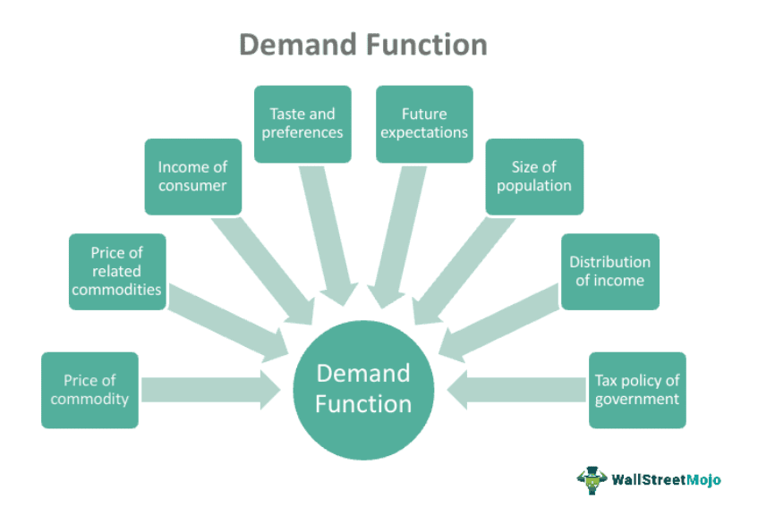

Algorithmic trading, often referred to as algo trading, has revolutionized the trading sector by offering enhanced efficiency and precision. This transformation is driven by the use of computer programs that execute trades based on pre-defined strategies, allowing traders to capitalize on rapid market movements and large data processing capabilities unattainable through manual trading. The need for such sophisticated systems has grown in tandem with the complexities of modern financial markets.

In today's competitive trading environment, understanding the intricacies of algorithmic solutions is crucial for financial success. As traders increasingly seek automation to streamline operations and remove human emotional bias, the demand for high-quality algorithmic trading software has soared. This software not only increases market efficiency but also bolsters liquidity by enabling quick and accurate order executions.



The acquisition of algorithmic trading software represents a significant economic decision. It involves evaluating the costs associated with software purchase and ongoing maintenance, alongside potential returns on investment. An insightful exploration of these factors is vital, as traders must weigh the initial expenses against the long-term benefits of reduced transaction costs and minimized errors.

This article investigates the various aspects of purchasing algorithmic trading software, highlighting the benefits, risks, and essential considerations necessary for making informed decisions. By understanding these elements, traders can better align their strategies with their financial goals, ultimately optimizing their trading practices within a rapidly evolving market landscape.

## Table of Contents

## What is Algorithmic Trading?

Algorithmic trading is a method of executing orders using automated pre-programmed trading instructions that consider variables such as timing, price, and volume. This technique leverages advanced data analysis and computational power to facilitate decision-making processes that are faster and more precise than possible through manual trading. By codifying a trading strategy into an algorithm, traders can ensure that their trades are executed with minimal human intervention, thereby reducing the potential for emotional bias and human error in trading decisions.

At its core, algorithmic trading uses statistical models and mathematical computations to determine the best strategies for trading securities. These algorithms are typically developed by quant analysts and traders to identify profitable trading opportunities by analyzing historical data and current market conditions. For instance, algorithms can be designed to recognize [arbitrage](/wiki/arbitrage) opportunities, trend-following systems, or mean-reversion strategies based on market indicators.

The primary advantage of [algorithmic trading](/wiki/algorithmic-trading) is its ability to process and analyze large volumes of data at remarkable speeds. This allows the systems to promptly respond to market movements and execute trades in milliseconds, offering a significant edge in highly dynamic trading environments. As a result, algorithmic trading contributes significantly to market efficiency by enabling rapid transaction processing and ensuring that prices reflect available information more quickly.

Moreover, algorithmic trading plays a substantial role in enhancing [liquidity](/wiki/liquidity-risk-premium) in financial markets. By automating trade executions, these systems can facilitate a higher number of transactions and narrower bid-ask spreads. This increased trading activity not only supports smoother market operations but also encourages participation from a broader range of market participants, further enhancing market depth and robustness.

The deployment of algorithmic trading necessitates sophisticated software solutions capable of integrating and executing complex trading strategies. These systems streamline trading operations by continuously monitoring market conditions and executing trades without the need for direct human intervention. This removal of emotional factors from the trading decision-making process can lead to more disciplined adherence to trading strategies, which can be particularly advantageous during periods of market turbulence.

In conclusion, algorithmic trading is a powerful tool that utilizes predefined instructions to execute trades at speeds and precision that are beyond human capabilities. By improving market efficiency and liquidity, these automated systems not only benefit individual traders but also contribute to the overall stability and functionality of financial markets.

## The Economics of Buying Algorithmic Trading Software

Investing in algorithmic trading software requires a detailed cost-benefit analysis, recognizing both the tangible and intangible aspects it contributes to trading outcomes. The initial investment in such software varies widely depending on its capabilities, complexity, and vendor. Basic platforms may start at a few hundred dollars, while advanced systems with extensive features and customization may cost thousands, capturing more comprehensive data analysis, speed, and multiple trading strategies.

The potential return on investment (ROI) from algorithmic trading software is primarily driven by its capability to enhance trading efficiency and accuracy. By automating trades, the software can execute complex strategies swiftly, capitalizing on market opportunities that might be missed with manual trading. The ROI is dictated by factors such as market conditions, execution speed, accuracy of the programmed strategy, and reduced human errors.

Software maintenance and updates, although an additional recurring expense, are crucial for keeping pace with evolving financial markets and trading regulations. These costs can range from monthly fees for technical support to annual payments for software upgrades, contributing to the software’s longevity and performance.

Evaluating software pricing models, traders face options between one-time purchases and subscription models. A one-time purchase offers lifetime access but could incur significant upfront costs. Subscription models, often billed monthly or annually, spread the cost over time, making it potentially more manageable. They typically include regular updates and support, ensuring that the software remains current and efficient.

Algorithmic trading significantly reduces transaction costs and errors by executing trades with precision and speed that human traders cannot match. Minimizing slippage—the difference between the expected and actual transaction price—is a tangible example. Additionally, automation lowers the risk of errors linked to manual data entry and emotional decision-making, optimizing overall trading performance.

In summary, while the economics of purchasing algorithmic trading software involves upfront and ongoing costs, the potential for substantial ROI through improved trading efficiency and reduced errors underscores its value. Careful evaluation of the investment against trading goals and market strategies is essential for leveraging these technologies effectively.

## Key Considerations Before Purchasing

Understanding your trading goals is a fundamental step before purchasing algorithmic trading software. Clearly defined objectives help determine the specific functionalities required in a trading algorithm. For instance, if your goal is high-frequency trading, you would need software capable of executing numerous trades within seconds. Conversely, long-term investors may prioritize analytical tools for trend analysis over rapid execution capabilities.

Evaluating the software's effectiveness through [backtesting](/wiki/backtesting) results is crucial. Backtesting involves testing a trading strategy on historical data to gauge its potential success. Reliable software should offer comprehensive backtesting features, enabling traders to assess the viability of their strategies. It's essential to look for platforms providing robust data sets and accurate simulations of past market conditions. Python, for instance, offers libraries like `[backtrader](/wiki/backtrader)` and `zipline` that can effectively perform such analyses:

```python
import backtrader as bt

class TestStrategy(bt.Strategy):
    def __init__(self):
        self.sma = bt.indicators.SimpleMovingAverage(self.data.close, period=15)

    def next(self):
        if not self.position:
            if self.data.close[0] > self.sma[0]:
                self.buy()
        else:
            if self.data.close[0] < self.sma[0]:
                self.sell()

cerebro = bt.Cerebro()
# Add data feed and strategy
cerebro.run()
cerebro.plot()
```

Considering the technical requirements and compatibility with existing systems is vital. Traders should ensure that the algorithmic software can integrate seamlessly with their current trading infrastructure, including compatibility with different operating systems, brokerage APIs, and data feeds. Verifying these technical requirements prevents future operational disruptions and maximizes the software's utility.

Assessing the vendor's reputation and customer support services is another significant consideration. A reputable vendor often implies reliable software and fewer operational risks. Reviewing customer testimonials, industry reviews, and expert analyses can offer insights into the software's credibility. Customer support is equally important, as even the most robust software may require technical assistance. Responsive and knowledgeable support can significantly enhance the user experience.

Lastly, considering the scalability of the software for future trading needs is essential. As trading expertise and objectives evolve, so may the requirements for algorithmic solutions. Choosing software offering scalable features ensures that it can grow alongside your trading portfolio. This scalability might include the ability to process larger datasets, execute more complex strategies, or incorporate additional market assets.

By meticulously addressing these key considerations, traders can make informed decisions when purchasing algorithmic trading software, aligning their choice with both present objectives and future aspirations.

## Top Algorithmic Trading Platforms

In the rapidly evolving landscape of algorithmic trading, selecting the right platform is crucial for both novices and seasoned traders. Platforms such as TradeStation, [Interactive Brokers](/wiki/interactive-brokers-api), and TrendSpider have emerged as leaders, each offering unique features to cater to diverse trading needs.

**TradeStation** stands out for its comprehensive suite of tools and robust back-testing capabilities. It offers a powerful EasyLanguage scripting language, allowing users to create custom trading strategies. This platform is known for its high level of user-friendliness, enabling traders to navigate its advanced features with relative ease. What's more, TradeStation provides extensive customer support, including educational resources and webinars, particularly beneficial for traders looking to deepen their understanding of algorithmic strategies.

**Interactive Brokers** is renowned for its extensive market access and competitive pricing. It provides traders with access to a global marketplace, encompassing various asset classes such as stocks, options, futures, and forex. Interactive Brokers' API allows for significant customization, though it requires a certain level of programming knowledge, specifically in languages like Python. Despite its slightly steeper learning curve, the platform's comprehensive feature set and efficient order execution make it a top choice for professional traders. Its customer support is primarily web-based, offering a wide range of resources for users.

**TrendSpider** is particularly favored by traders who prioritize technical analysis. It integrates machine learning to automate some aspects of the trading strategy creation process, offering features such as automated dynamic price alerts and multi-timeframe analysis. TrendSpider is praised for its intuitive interface, making it accessible even to beginners. Although it does not require coding for basic strategies, advanced users can harness its scripting capabilities for more complex setups. TrendSpider also supports users through detailed tutorials and responsive customer service.

When comparing these platforms, several key factors emerge. TradeStation and Interactive Brokers allow for extensive strategy customization through programming, with the former being more user-friendly for beginners due to its proprietary scripting language. TrendSpider, while less focused on coding, excels in visualization and technical analysis.

In terms of cost, TradeStation offers both one-time purchase and subscription models, appealing to different user preferences. Interactive Brokers operates on a commission-based structure, which can prove cost-effective for high-[volume](/wiki/volume-trading-strategy) traders. TrendSpider primarily employs a subscription model, though it provides a free trial period for potential users to explore its features.

Each of these platforms offers unique educational resources. TradeStation offers webinars and tutorials, Interactive Brokers provides an extensive library of research and learning materials, and TrendSpider includes tutorials and [machine learning](/wiki/machine-learning) insights that enhance the technical analysis process.

In summary, the choice between TradeStation, Interactive Brokers, and TrendSpider largely depends on individual requirements such as coding capabilities, cost considerations, and specific trading focuses like technical analysis or market access. Understanding these factors can aid traders in selecting the platform that best aligns with their strategic goals.

## Benefits and Risks of Algorithmic Trading

Algorithmic trading offers considerable advantages, primarily in terms of speed, accuracy, and minimizing emotional decision-making. Algorithms allow traders to execute orders at speeds unattainable by humans, processing large volumes of data to identify and act on trading opportunities in real-time. This ensures precision in trade execution, significantly reducing the possibility of human error. Additionally, by relying on pre-programmed strategies, algorithmic trading reduces the impact of human emotions, such as fear or greed, thereby facilitating more rational decision-making.

However, algorithmic trading is not without its risks. One major concern is software failure. Trading algorithms, being software, are vulnerable to bugs, glitches, and other technical issues that could lead to significant financial losses. Market anomalies pose another risk, where unexpected market conditions may render an algorithm ineffective, leading to losses. Continuous monitoring is essential, despite the automated nature of algorithmic trading. Traders must ensure that their algorithms respond correctly to market changes and that software operates without interruption.

Legal and regulatory considerations are also paramount in algorithmic trading. Different jurisdictions may have specific regulations governing the use of trading algorithms, necessitating compliance with these rules. Traders must be aware of restrictions on trading frequencies, order types, and potential liability issues that could arise from algorithmic activities. 

For effective risk management in algorithmic trading, several techniques can be employed. Diversification of trading strategies across various markets and instruments can help mitigate risk. Implementing robust testing, such as historical backtesting and stress testing under hypothetical market conditions, ensures the reliability of algorithms. Additionally, setting failsafe mechanisms, like circuit breakers, can protect against extreme losses during abrupt market movements. 

In summary, while algorithmic trading provides significant benefits in terms of efficiency and accuracy, it requires vigilance and comprehensive understanding of its associated risks and regulatory environment to ensure successful implementation.

## Conclusion

Algorithmic trading has fundamentally transformed the landscape of financial markets, offering notable economic impacts and benefits. By utilizing computer algorithms to make trading decisions, investors can achieve unparalleled speed and accuracy, thus enhancing market efficiency and potentially increasing profit margins. Algorithmic trading minimizes transaction costs and reduces the likelihood of human error, generally resulting in improved overall performance and liquidity provision.

Enacting a thorough research process prior to selecting algorithmic trading systems is paramount. Each trader’s unique set of objectives and risk tolerance levels necessitates a customized approach when choosing a suitable algorithmic trading platform. This careful selection process ensures alignment with personal trading strategies and goals, thereby optimizing individual outcomes.

Embracing algorithmic trading as a component of a diversified trading strategy can safeguard against the [volatility](/wiki/volatility-trading-strategies) inherent in financial markets. By integrating algorithms into a broader investment portfolio, traders can distribute risk more effectively and buoy their chances of financial success across different market cycles.

Prospective buyers looking to transition into algorithmic trading should consider the following three action steps:
1. **Educate and Equip**: Gain a solid understanding of algorithmic trading concepts and market trends through courses, webinars, or certifications. Knowledge is power in making informed decisions.
2. **Trial and Backtest**: Utilize demo accounts or backtesting features offered by trading platforms to test algorithms without financial risk. This facilitates a deeper comprehension of how different algorithms respond to varying market conditions.
3. **Start Small**: Begin with limited capital investment when implementing algorithmic trading to manage potential risks and gradually scale up as confidence and experience grow.

Continued learning and adaptation remain crucial in the ever-evolving field of algorithmic trading. Engaging with online forums, attending industry conferences, and subscribing to relevant publications can help traders keep abreast of technological advancements and regulatory changes. Staying informed and agile will empower traders to not only leverage contemporary trading technologies but also to evolve alongside them.

## References & Further Reading

[1]: Bergstra, J., Bardenet, R., Bengio, Y., & Kégl, B. (2011). ["Algorithms for Hyper-Parameter Optimization."](https://dl.acm.org/doi/10.5555/2986459.2986743) Advances in Neural Information Processing Systems 24.

[2]: ["Advances in Financial Machine Learning"](https://www.amazon.com/Advances-Financial-Machine-Learning-Marcos/dp/1119482089) by Marcos Lopez de Prado

[3]: ["Evidence-Based Technical Analysis: Applying the Scientific Method and Statistical Inference to Trading Signals"](https://www.wiley.com/en-us/Evidence+Based+Technical+Analysis%3A+Applying+the+Scientific+Method+and+Statistical+Inference+to+Trading+Signals-p-9780470008744) by David Aronson

[4]: ["Machine Learning for Algorithmic Trading"](https://github.com/PacktPublishing/Machine-Learning-for-Algorithmic-Trading-Second-Edition) by Stefan Jansen

[5]: ["Quantitative Trading: How to Build Your Own Algorithmic Trading Business"](https://books.google.com/books/about/Quantitative_Trading.html?id=j70yEAAAQBAJ) by Ernest P. Chan