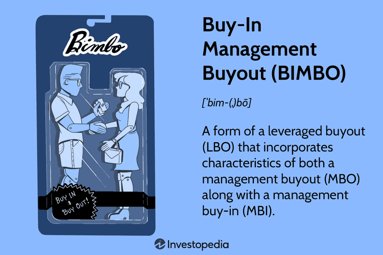

In the evolving landscape of business acquisitions, the Buy-In Management Buyout (BIMBO) represents a sophisticated strategy that combines the efforts of both internal and external management teams. This approach is distinct because it merges the benefits of management buy-outs (MBOs) with management buy-ins (MBIs), creating a hybrid transaction aimed at acquiring and revitalizing a company. By leveraging the expertise of existing managers alongside new, external leaders, BIMBOs can provide a comprehensive restructuring solution that maximizes operational efficiency and strategic direction.

This article aims to shed light on the complexities of BIMBOs, particularly their intersection with algorithmic trading and the broader corporate finance environment. Algorithmic trading, with its reliance on mathematical models and high-speed computer systems to make trading decisions, experiences distinct influences from the transitions and restructuring events triggered by BIMBOs. The involvement of new management teams can lead to significant stock price movements, potentially altering volatility patterns and introducing novel trading opportunities or risks.



By understanding the mechanisms behind BIMBOs, businesses and investors can appreciate how these buyouts enhance company value and bolster competitive advantage. This exploration also involves evaluating BIMBOs’ implications for trading strategies, as the integration of internal and external management impacts investor sentiment and, consequently, market dynamics. Ultimately, assessing BIMBOs' role in corporate acquisitions can reveal valuable insights into how leveraged buyouts may drive significant value creation and strategic realignment for firms navigating complex financial landscapes.

## Table of Contents

## Understanding BIMBO: Key Concepts

Buy-In Management Buyout (BIMBO) represents a unique approach in business acquisitions, blending elements of both traditional management buy-outs (MBO) and management buy-ins (MBI). A BIMBO involves existing management retaining their roles while simultaneously integrating an external team. This approach differentiates BIMBOs from conventional buyouts, where typically only internal management or external parties assume control.

In a BIMBO, the existing management team participates in acquiring the company, akin to an MBO, but the addition of new management members aligns with MBI. This dual structure aims to harness the strengths of both internal familiarity and external expertise.

The objectives of BIMBOs are multifaceted. One primary goal is to leverage the external team's fresh perspectives alongside the internal team's operational knowledge. This strategic combination aims to streamline operations, enhance competitive strategy, and foster innovation. Furthermore, BIMBOs are designed to minimize disruptions during transitions. Integrating external management can introduce new skills and ideas that complement internal strengths, facilitating smoother adaptation to new leadership dynamics.

Fundamentally, a BIMBO seeks to create synergies by aligning the interests and skills of existing and incoming teams. This alignment can lead to improved company performance, increase market competitiveness, and ultimately enhance shareholder value. The strategic nature of BIMBOs ensures they are more than just a merger of teams—they constitute a comprehensive effort to reposition an organization for sustained success.

## The Role of Private Equity in BIMBOs

Private equity firms play a pivotal role in facilitating Buy-In Management Buyouts (BIMBOs) by providing essential capital resources and strategic guidance. Their involvement is crucial for the successful execution of BIMBO transactions, offering support that extends beyond mere financial backing to include extensive industry expertise and strategic development. 

**Capital Provision and Strategic Guidance**

Private equity firms serve as a primary source of investment capital necessary for executing a BIMBO. They provide the financial muscle required to purchase and restructure a company. The infusion of capital allows for enhancements in operational efficiency, market expansion, and strategic acquisitions. Furthermore, private equity firms bring aboard a wealth of industry experience and insights that significantly benefit the management teams in navigating the complexities of a buyout. Their expertise helps in identifying value creation opportunities and implementing strategic changes that align with market trends and business goals.

**Benefits of Private Equity Involvement**

1. **Financial Backing**: The capital from private equity firms helps mitigate the financial constraints often faced by internal management teams, enabling them to pursue growth initiatives without burdening the company with excessive debt. This financial support can be structured in various forms, including equity investments or debt financing, tailored to suit the specific needs of the transaction.

2. **Industry Expertise**: With their profound understanding of industry dynamics, private equity firms assist in shaping business strategies that foster innovation and competitiveness. They often provide mentorship to management teams, offering insights into effective governance practices, operational improvements, and market positioning.

3. **Network Access**: Private equity investors generally have extensive networks, which are invaluable for opening new markets, forging strategic partnerships, and acquiring talented personnel. This network can accelerate a company's growth trajectory and broaden its market reach.

**Risks and Mitigation Strategies**

Despite the advantages, private equity-backed BIMBOs are not without risks. The alignment of interests between private equity investors and the management team is critical yet challenging. Potential risks include:

1. **Conflicting Objectives**: Divergent priorities between private equity firms seeking quick returns and managers aiming for sustainable growth can lead to strategic discord. Establishing clear, mutual objectives early in the transaction and instituting performance-based incentives can align interests.

2. **Debt Burden**: While private equity can reduce reliance on debt, leveraged buyouts can still result in significant financial leverage, increasing the risk of insolvency during economic downturns. A prudent approach towards capital structuring, ensuring manageable debt levels, can mitigate this risk.

3. **Management Overload**: The dual role of managing existing operations while integrating new leadership can overwhelm management, leading to operational inefficiencies. Structured transition plans and phased integration strategies are essential to avert this.

In summary, private equity firms are instrumental in the success of BIMBOs by providing not only the necessary capital but also strategic and operational guidance that can propel a company towards enhanced performance and competitiveness. Understanding and navigating the associated risks with effective mitigation strategies ensures that both investors and management can capitalize on the benefits while steering clear of potential pitfalls.

## Financial Structuring in BIMBO

Buy-In Management Buyouts (BIMBOs) necessitate a complex financial structuring process that aims to balance the interests of both internal and external stakeholders. At the core of these transactions is the meticulous assessment and determination of the company’s valuation. The success of a BIMBO heavily relies on the ability to establish a fair valuation that adequately reflects the company’s present performance, potential growth, and market standing. For accurate valuation, common techniques such as Discounted Cash Flow (DCF) analysis, Comparable Company Analysis, and Precedent Transactions are frequently employed, each suitable depending on the industry specifics and the company’s financial health.

Debt and equity structuring are pivotal in financing a BIMBO. The balance between debt (leveraged financing) and equity (ownership financing) determines the financial burden of the company post-acquisition. Typically, private equity firms play a significant role, providing the capital required in exchange for a significant equity stake. This often leads to a leveraged buyout scenario, where a major portion of the purchase price is financed through debt, with the expectation that the future cash flows of the company will cover the debt repayments.

Negotiations between existing management and new investors are critical in this structuring phase. The dynamics of these negotiations are influenced by factors such as the existing management's understanding of the business and market environment versus the new investors’ strategic vision and financial acumen. Critical aspects that require negotiation include the percentage of equity transferred, the power distribution on the company’s board, and the milestones that must be achieved for the management team to unlock further financial incentives or retain operational control.

To illustrate financial alignment interests, consider a scenario where internal managers retain a substantial equity stake, promoting their continued investment in the company’s growth. External managers, often new investors or private equity firms, might require protective provisions such as preferred shares that ensure a fixed dividend or liquidation preference. 

Here is a hypothetical scenario to shed light on financial structuring:

```python
# Simple Python Illustration of Equity and Debt Structuring

## Parameters
enterprise_value = 100  # (in million dollars)
equity_contribution = 40  # Percentage of equity
debt_contribution = 60  # Percentage of debt
internal_management_share = 20  # Percentage share for internal management
external_investors_share = 80  # Percentage share for external investors

## Calculations
equity_value = enterprise_value * (equity_contribution / 100)
debt_value = enterprise_value * (debt_contribution / 100)

internal_share_value = equity_value * (internal_management_share / 100)
external_share_value = equity_value * (external_investors_share / 100)

## Output
print(f"Total Equity Value: ${equity_value}M")
print(f"Total Debt Value: ${debt_value}M")
print(f"Internal Management's Equity Value: ${internal_share_value}M")
print(f"External Investors' Equity Value: ${external_share_value}M")
```

This financial structuring tactic ensures that various stakeholders, including internal management and external investors, have aligned interests towards the company's growth. By doing so, BIMBOs strive to harmonize internal insights with external acumen, enhancing company value and facilitating smooth transitions during ownership changes.

## Challenges and Conflict Resolution

In Buy-In Management Buyouts (BIMBOs), several challenges commonly arise, particularly involving tensions between new and existing management teams. These conflicts can stem from differences in business strategies, leadership styles, and corporate cultures. Addressing these differences is crucial to facilitating a seamless transition and ensuring the success of the buyout.

### Common Challenges

1. **Cultural Clashes**: Existing management often maintains an ingrained organizational culture which may conflict with the perspectives and practices introduced by new managers. These cultural differences can lead to misunderstandings and decrease productivity if not managed appropriately.

2. **Leadership Conflicts**: BIMBOs involve the blending of leadership styles from both internal and external managers. Differences in decision-making processes, risk tolerance, and leadership vision can lead to conflicts and threaten the stability of the management team.

3. **Strategic Misalignments**: New management might propose strategic adjustments to align the company with current market trends or efficiency goals, which might not align with the existing management's vision. Such misalignments can hinder synergistic collaboration and operational continuity.

### Strategies for Conflict Resolution

- **Open Communication Channels**: Establishing transparent communication between all parties is essential. Regular meetings and updates can facilitate understanding and help synchronize goals. This clarity aids in minimizing assumptions and fostering an environment conducive to collaboration.

- **Leadership Integration Workshops**: Conducting workshops where both teams can present their visions, goals, and strategies can help align their objectives. These activities encourage active listening and understanding of each other’s strengths, facilitating the integration of diverse leadership styles.

- **Defined Roles and Responsibilities**: Clearly defining the roles and responsibilities of both internal and external managers can help manage expectations and reduce friction. This clarity allows for better focus on individual contributions towards collective company goals.

- **Cultural Adaptation Programs**: Implementing programs aimed at cultural integration can ease the transition. These programs highlight the necessity of mutual respect and understanding and provide tools for adapting to new cultural norms.

### Importance of Leadership and Cultural Integration

For a BIMBO to be successful, integrating differing leadership styles and facilitating cultural shifts are vital. Navigating these changes requires deliberate efforts to develop a unified management team capable of steering the company towards its strategic objectives. Recognizing the value in diverse perspectives promotes innovation and can enhance overall company performance. Culturally integrating teams enables smoother operations, reducing the risk of operational disruptions and fostering a shared mission. 

By proactively addressing these challenges with strategic conflict resolution measures, companies can harness the potential strengths of a BIMBO, leading to sustained corporate growth and operational excellence.

## Impact of BIMBO on Algorithmic Trading

Buy-In Management Buyouts (BIMBOs) represent a significant event in a company's lifecycle that can lead to substantial fluctuations in its stock prices and [volatility](/wiki/volatility-trading-strategies). These fluctuations are driven by the inherent uncertainty and potential restructuring associated with the mix of internal and external management teams taking over the company. Algorithmic trading strategies can exploit these changes in market dynamics, aiming to predict and capitalize on the resultant stock price movements.

### Stock Price and Volatility Effects

A BIMBO often introduces a period of uncertainty as markets assess the potential outcomes of the new management structure. This uncertainty can lead to increased volatility in the company's stock price as traders and investors respond to news and rumors associated with the transition. The following factors typically drive these volatility changes:

1. **Management Changes:** Market participants evaluate the competencies and reputation of the incoming management team. Any perceived weakness or lack of experience can result in negative sentiment, causing stock prices to drop.

2. **Strategic Shifts:** New management might signal strategic changes, such as refocusing on different market segments or altering the product roadmap, which can cause reevaluation of the company's future earnings potential.

3. **Operational Restructuring:** Anticipated changes in operational efficiency or cost structures can affect valuation models, leading to volatile trading as these factors become publicly known.

### Trading Opportunities and Risks

Algorithmic trading models utilize this volatility to identify patterns and trading opportunities. These can include:

- **Event-Driven Strategies:** Algorithms can be programmed to react to news events related to the BIMBO process, such as shareholder meetings, press releases, or filings with regulatory bodies, allowing traders to enter positions in anticipation of stock movements.

- **Volatility Arbitrage:** By assessing implied volatility against historical norms, algorithms can exploit mispricings in options or other derivatives tied to the company's stock.

However, these opportunities come with risks:

- **False Signals:** Corporate transitions often generate rumors that may not materialize, which algorithms might mistakenly interpret as genuine signals, leading to unprofitable trades.

- **Liquidity Concerns:** Increased volatility can lead to reduced liquidity in the stock, potentially resulting in higher transaction costs or the inability to execute trades at favorable prices.

### Leveraging Algorithmic Models

Traders can leverage specific algorithmic models to maximize returns from BIMBO-induced market fluctuations:

- **Sentiment Analysis Models:** Utilizing natural language processing (NLP) techniques, these models analyze media articles, social media, and public statements to gauge market sentiment and predict stock price direction.

  ```python
  from textblob import TextBlob

  def analyze_sentiment(text):
      sentiment = TextBlob(text).sentiment.polarity
      return sentiment

  sample_text = "The new management team's strategy could lead to improved growth."
  sentiment_score = analyze_sentiment(sample_text)
  print(sentiment_score)
  ```

- **Predictive Modeling:** Advanced machine learning models can predict future stock prices by incorporating various data sources, including historical price patterns, economic indicators, and management announcements.

- **Quantitative Models:** These models use statistical methods and historical data to identify trading signals. For example, Bollinger Bands or moving average crossovers can highlight entry and exit points during volatility spikes.

In conclusion, BIMBOs have a pronounced impact on stock prices and volatility, offering fertile ground for [algorithmic trading](/wiki/algorithmic-trading) strategies. By leveraging advanced analytics and [machine learning](/wiki/machine-learning) models, traders can navigate the complexities and capitalize on the trading opportunities presented by these corporate restructurings. However, due consideration must be given to the inherent risks and potential for false signals.

## Case Studies: Successful BIMBOs

Buy-In Management Buyouts (BIMBOs) have been pivotal in reshaping company ownerships and enhancing business operations. Successful BIMBOs demonstrate the dynamic interplay of strategic management integration and decision-making, which ultimately fosters company growth, market performance, and shareholder value. Here, we illuminate real-world examples to underscore the intrinsic elements of successful BIMBOs.

One notable example of a successful BIMBO is the acquisition of the UK-based retail chain, Boots, by its management team alongside private equity group KKR in 2007. This BIMBO was characterized by an effective blend of existing management expertise and external leadership acumen, facilitated by strategic interventions from KKR. The significant factors contributing to its success included:

1. **Management Integration**: The synergy between Boots’ existing executives and the external managerial prowess of KKR enabled the creation of a coherent leadership vision. This integration focused on leveraging the deep market knowledge of the internal team with the strategic foresight of external advisors.

2. **Strategic Decision-Making**: A key strategic decision was to revitalize Boots' product offerings and expand its market presence internationally. The management successfully launched an array of health and beauty products, seizing new competitive advantages in diverse markets.

3. **Operational Restructuring**: Under the BIMBO framework, Boots optimized its operations by renegotiating supply chain contracts and upgrading its technological infrastructure, thereby reducing costs and enhancing efficiency.

The outcomes of the Boots BIMBO were substantial. The company experienced accelerated growth in sales and profits, directly impacting its market performance. As a result, Boots achieved increased shareholder value, as reflected in its share price appreciation and improved investor confidence.

Another example is the acquisition of the French manufacturing firm, Elis, in 2007. The BIMBO involved internal managers partnering with Eurazeo, a leading investment firm. Key elements that contributed to its success included:

1. **Leadership Synergy**: The existing management's industry expertise was complemented by Eurazeo's financial acumen, fostering an environment that encouraged innovation and strategic expansion.

2. **Focused Growth Initiatives**: Strategic decisions involved diversifying services and entering new geographical markets. This was enabled by robust capital allocation, which supported investments in growth-centric projects and technology advancements.

Post-BIMBO, Elis witnessed a remarkable growth trajectory. The company expanded its service portfolio, enhancing its competitive stance in Europe and South America. This expansion resulted in substantial revenue increase and market share growth, translating to enhanced shareholder returns.

These examples showcase that successful BIMBOs hinge on decisive management integration, strategic foresight, and operational restructuring. The resultant effect is often reflected in enhanced company growth, improved market standings, and incre​ased shareholder value. The adaptability of BIMBOs to align with company goals and market demands underscores their enduring significance in corporate finance strategies.

## Future Outlook for BIMBOs

The landscape of Buy-In Management Buyouts (BIMBOs) is continually evolving, driven by technological advancements and shifting economic conditions. As digital tools and technologies proliferate, they are poised to play a significant role in enhancing the efficiency and strategy of future BIMBO transactions. Technologies such as [artificial intelligence](/wiki/ai-artificial-intelligence) (AI), machine learning (ML), and data analytics provide the potential to streamline due diligence processes and provide deeper insights into company valuations and risk assessment. These tools facilitate more informed decision-making by quickly analyzing vast datasets for trends and anomalies that may influence the success of a buyout.

Moreover, digital communication tools and platforms can enhance transparency and collaboration among internal and external management teams involved in BIMBOs, ensuring smoother transitions and better integration strategies. Virtual data rooms and secure communication channels help manage the confidentiality and security of sensitive financial and strategic information during the acquisition process.

As economic conditions fluctuate, they also have implications for the popularity and success rates of BIMBOs. In periods of economic instability or downturns, the availability of credit can be restricted, potentially limiting the financial structuring options available for BIMBOs. Conversely, during periods of economic growth, increased availability of capital and favorable lending conditions may boost the frequency of BIMBOs.

Economic shifts also affect industry valuations, impacting the attractiveness of potential targets for BIMBOs. For instance, market sectors undergoing rapid transformation due to technological innovation or regulation changes might present lucrative opportunities for BIMBOs, as they often require both investment and strategic management overhaul, which is central to the BIMBO model.

Adaptability is crucial for businesses and investors considering BIMBOs amid these changing conditions. The adoption of flexible financial strategies, such as leveraging a mix of debt and equity financing, can mitigate risks associated with economic variability. Additionally, fostering strong relationships with private equity firms can provide the necessary financial backing and strategic support to navigate complex market dynamics.

In conclusion, as technological advancements continue to influence corporate acquisitions, and as economic conditions shift, the potential for BIMBOs to serve as a strategic tool for growth remains strong. Embracing digital tools and adapting to changing economic landscapes will be vital for the continued success and popularity of BIMBOs in future corporate finance strategies.

## Conclusion

The Buy-In Management Buyout (BIMBO) represents a significant strategy in the landscape of corporate acquisitions. By integrating internal and external management teams, BIMBOs create a dynamic environment that seeks to streamline operations and maximize company value. This approach allows for the retention of invaluable institutional knowledge while infusing fresh perspectives from outside experts, effectively balancing continuity with innovation. 

For investors and businesses contemplating BIMBOs, the potential opportunities are substantial. BIMBOs can drive significant company growth and operational improvements. They provide an avenue for rejuvenating business strategies and can align management incentives with shareholder interests, promoting increased market competitiveness and long-term success.

However, challenges exist, particularly in navigating the complex dynamics between existing and incoming management. Effective conflict resolution strategies and a careful integration of differing leadership styles are crucial to harmonize operations and achieve a successful transition. The financial structuring of such transactions, including valuation assessments and negotiation of debt and equity positions, further underscores the necessity for meticulous planning and execution.

Encouraging continued exploration of BIMBOs is essential due to their potential to leverage the diverse capabilities of management teams. As businesses increasingly seek innovative solutions to remain competitive, BIMBOs offer a strategic avenue to unlock business potential and drive enhancement in company value. This model not only aligns with the evolving needs of the corporate world but also serves as a robust framework for achieving sustainable growth and efficiency in business acquisitions.

## References & Further Reading

[1]: Wright, M., Thompson, S., & Robbie, K. (1992). ["Venture Capital and Management-Led Leveraged Buyouts: Evidence from the U.K."](https://www.sciencedirect.com/science/article/pii/088390269290034O) Journal of Business Venturing, 7(1), 47-71.

[2]: Cumming, D., Siegel, D. S., & Wright, M. (2007). ["Private Equity, Leveraged Buyouts and Governance."](https://papers.ssrn.com/sol3/papers.cfm?abstract_id=983802) Journal of Corporate Finance, 13(4), 439-460.

[3]: Lopez de Prado, M. (2018). ["Advances in Financial Machine Learning."](https://www.amazon.com/Advances-Financial-Machine-Learning-Marcos/dp/1119482089) John Wiley & Sons.

[4]: Chan, E. P. (2008). ["Quantitative Trading: How to Build Your Own Algorithmic Trading Business."](https://github.com/egorpe/EPChan-QuantitativeTrading/blob/master/example7_6.m) John Wiley & Sons.

[5]: Amess, K., Girma, S., & Wright, M. (2008). ["What are the Wage and Employment Consequences of Leveraged Buyouts, Private Equity and Acquisitions in the UK?"](https://papers.ssrn.com/sol3/papers.cfm?abstract_id=1270581) Small Business Economics, 30(1), 97-116.