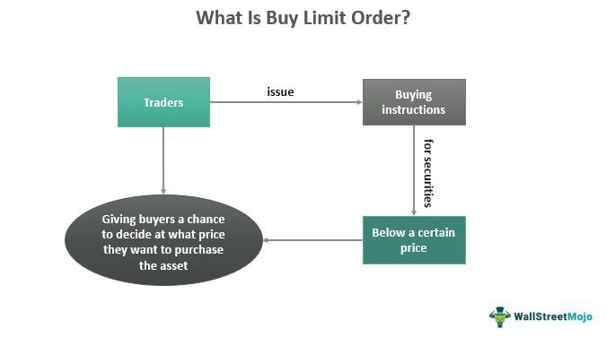

Understanding the different types of stock trading orders is crucial for any trader or investor. Stock trading orders dictate how a trade is executed, influencing aspects such as timing, pricing, and execution certainty. Among these order types, the buy limit order stands out as it offers control over purchase prices. A buy limit order is a specific type of order where a trader specifies the maximum price they are willing to pay for a stock. This ensures that the order will only be executed at the specified price or lower, providing significant control over costs and protecting against sudden market fluctuations.

In this article, we will explore various order types in stock trading, focusing on buy limit orders and how algorithmic trading integrates these strategies. Algorithmic trading, which involves using computer algorithms to execute trades at optimal conditions, utilizes these order types to automate and refine trading strategies. By leveraging predefined parameters and conditions, algorithmic trading can enhance the efficiency and effectiveness of executing buy limit orders, among others.

Grasping these concepts can aid in making more informed decisions in the stock market. A clear understanding of how different order types function, and when to employ them, empowers traders to tailor their strategies based on market conditions and personal investment goals. With this knowledge, traders can better navigate the complexities of the stock market, optimizing their trades to maximize potential returns while minimizing risk.

## Table of Contents

## What Is a Buy Limit Order?

A buy limit order is a specific type of trading order used to purchase a stock at or below a predetermined price, thus allowing traders to maintain control over their purchase costs. This type of order ensures that the trader does not pay more than the specified price, which is particularly useful in managing expenses and planning investment strategies. In contrast to market orders, which are executed immediately at the current market price, buy limit orders will only be executed if the stock reaches the trader’s specified price or a lower one. This ensures cost control but does not guarantee that the order will be fulfilled, as the stock price may not reach the specified limit price during the trading period. The choice of using a buy limit order is often influenced by the trader's assessment of the stock’s future price movements and market conditions.

## Benefits of Buy Limit Orders

Buy limit orders provide traders with a crucial mechanism for controlling the maximum price they are willing to pay for stocks. This control is achieved by setting a predetermined price, known as the limit price, below which the order can be executed. By specifying this ceiling, traders can protect themselves from paying more than intended, which is a fundamental aspect of disciplined trading.

One significant advantage of buy limit orders is their ability to manage trading costs effectively. In contrast to market orders, which are executed immediately at the best available current price, buy limit orders ensure that trades are executed only at the specified limit price or lower. This feature mitigates the risk of slippage, which occurs when the execution price differs from the expectation due to rapid market movements. Slippage can lead to unexpected costs, eroding the profitability of trades; hence, using buy limit orders provides a layer of financial predictability.

Furthermore, buy limit orders are particularly advantageous in volatile markets where stock prices fluctuate rapidly. In such environments, the immediate execution associated with market orders can lead to trades being filled at disadvantageous prices. However, buy limit orders allow traders to wait for the market to reach their desired entry point, thus harnessing the opportunity presented by price dips without overstepping financial boundaries.

In summary, buy limit orders offer traders the dual benefit of price control and cost management, making them an indispensable tool in a volatile trading landscape.

## Drawbacks of Buy Limit Orders

The primary drawback of a buy limit order lies in the possibility of non-execution when the stock fails to reach the specified limit price. This limitation means that traders may miss out on opportunities if the market price does not align with their expectations. In dynamic markets, this risk is amplified as stock prices may swiftly move beyond the stipulated limit without triggering an execution. While buy limit orders are designed to provide price control, they can be less responsive in volatile environments where rapid price fluctuations are frequent.

Another potential downside to consider is the financial implication associated with buy limit orders. Certain brokers may impose higher commissions on these orders compared to market orders. This difference in commission arises because buy limit orders necessitate more precise placement and execution strategies, potentially leading to increased resource allocation by the brokerage firm. As such, traders should be cognizant of any additional costs incurred by opting for a buy limit order, as this could affect overall trading profitability.

For traders and investors, balancing the advantages of price control with the potential drawbacks of non-execution and higher costs is crucial. Strategically utilizing buy limit orders requires a clear understanding of market trends and timing to optimize their effectiveness while minimizing risks and additional expenses.

## Buy Limit Order vs. Other Order Types

A buy limit order is a specific type of order that allows traders to purchase a stock at or below a predetermined price. This contrasts with several other order types that offer different levels of price control and execution guarantees. Understanding the nuances among these orders is critical in selecting the appropriate strategy based on trading goals and market conditions.

### Market Orders

A market order is an instruction to buy or sell a stock immediately at the best available current price. The primary advantage of a market order is its high likelihood of execution, assuming the market is open and liquid. However, market orders offer no price control, potentially leading to higher costs due to slippage—where the final execution price is significantly different from the expected price. This characteristic makes market orders suitable for traders who prioritize execution speed over price precision.

### Stop Orders

A stop order, or stop-loss order, becomes a market order once a stock reaches a specified stop price. Stop orders are designed to limit losses or protect profits. Traders often use them to avoid holding onto a stock that is falling, offering a mechanism to automate selling before the price drops further. However, because the order converts to a market order once triggered, the final execution price might differ from the stop price, particularly in fast-moving markets.

### Stop-Limit Orders

Stop-limit orders combine features of both stop orders and limit orders. They are activated at a stop price but will only execute at a specified limit price or better. This gives traders more precise control over the execution price, but it also carries the risk of non-execution. If the market price moves rapidly, the stock might hit the stop price but not the limit price, leaving the order unfilled. Stop-limit orders are most useful when traders want to avoid slippage and have a specific price target.

### Advanced Order Types

#### Trailing Stop Orders

Trailing stop orders allow traders to set a stop price that fluctuates with the stock's market price, either by a fixed dollar amount or a percentage. As the stock price moves favorably, the stop price adjusts to lock in profits, but if the price reverses, the stop order executes. This dynamic adjustment can help traders capitalize on gains while limiting potential losses.

#### One-Cancels-the-Other (OCO) Orders

OCO orders are an advanced strategy where two orders are placed simultaneously, and if one executes, the other is automatically canceled. This type of order is useful for executing a trade strategy without having to monitor the market consistently. For instance, a trader might pre-set conditions to either take a profit or stop a loss, knowing only one will execute.

### When to Use Each Order Type

Selecting the appropriate order type depends on a trader's objectives and the specific market conditions at the time. For example, if a trader values speed and is less concerned about the exact purchase price, they might opt for a market order. If price control is critical, buy limit and stop-limit orders offer pre-defined thresholds that help execute trades within desired price ranges. Traders anticipating market [volatility](/wiki/volatility-trading-strategies) may prefer advanced orders like trailing stops or OCO to automate strategies that align with their desired risk exposure and profit goals.

Overall, a well-rounded understanding of these order types allows traders to better navigate varied financial market scenarios and optimize their strategies for success.

## Algorithmic Trading and Order Types

Algorithmic trading represents a significant evolution in financial markets, using complex algorithms to automate and optimize trading activities. These algorithms utilize various order types, including buy limit orders, to enhance execution strategies. One primary advantage of these systems is the ability to process vast amounts of data quickly, enabling traders to respond to market conditions with precision and speed.

Buy limit orders are integral to [algorithmic trading](/wiki/algorithmic-trading) as they allow traders to specify a maximum purchase price for securities. By automating these orders, algorithms can continuously monitor market prices and execute trades the moment the market price aligns with the desired limit. This automation helps to capitalize on brief market opportunities that manual trading might miss.

The optimization of buy limit orders within algorithmic systems involves several techniques. For instance, algorithms can evaluate historical price data and predictive analytics to determine optimal limit levels. Additionally, these systems can incorporate risk management protocols, ensuring trades adhere to predefined financial constraints and targets.

The role of technologies such as Application Programming Interfaces (APIs) is crucial in executing these strategies efficiently. APIs facilitate real-time data exchange between trading platforms and algorithmic systems, enabling seamless integration of external data sources, trading signals, and execution commands. Through APIs, traders can execute high-frequency trading operations, where rapid execution and minimal latency are paramount.

In practice, an algorithm might automatically place a buy limit order at a specific price point based on technical indicators such as moving averages or support and resistance levels. The system constantly updates the required parameters, adjusting the order strategy as new market data becomes available. This dynamic adjustment feature enhances the ability to achieve cost efficiencies and better execution outcomes.

In summary, algorithmic trading leverages the precision and speed of technology to optimize buy limit orders and other order types. This integration allows traders to automate complex strategies, maintaining a competitive edge in fast-paced financial markets.

## Examples and Use Cases

Buy limit orders offer strategic advantages in various trading scenarios, especially when price control and cost efficiency are paramount. One common scenario where buy limit orders may be preferable is when market volatility is high, and investors anticipate a stock's price to decline to a specific level before appreciating. For example, consider an investor interested in purchasing shares of XYZ Corporation, which is currently trading at $50 per share. The investor believes that due to a forthcoming earnings announcement, the stock's price could temporarily dip to $45. By placing a buy limit order at $45, the investor ensures that they will only buy the stock if it reaches this target price, minimizing the risk of overpaying in a volatile market.

Algorithmic trading takes the strategy of using buy limit orders to another level by automating the execution process. Algorithms can be programmed to constantly monitor the market and place buy limit orders once predefined conditions are met, such as technical indicators signaling a potential price drop. For instance, consider an algorithm designed to track the 50-day moving average of stock ABC. If the stock price dips below this average, the algorithm could automatically place a buy limit order at a price slightly below the current trading level, optimizing for potential rebounds.

A notable case study illustrating algorithmic trading's impact on order execution involves the use of APIs for real-time market data analysis and order placement. Institutions often deploy algorithms connected to these APIs to execute large volumes of trades while maintaining order execution at optimal price levels. For example, a [hedge fund](/wiki/hedge-fund-trading-strategies) might use an algorithm integrated with an API to analyze real-time data feeds and execute buy limit orders across multiple stocks as part of a diversified strategy. This setup allows the fund to dynamically adjust its limit prices based on rapid changes in market conditions, ensuring precision and timeliness in trade execution.

These examples underscore the versatility and effectiveness of buy limit orders in various trading contexts, demonstrating their value in both manual trading and automated environments. By leveraging the strategic placement of buy limit orders, traders and investors can better manage their entry points and capitalize on favorable price movements.

## Conclusion

In stock trading, a comprehensive understanding of order types is essential for effective decision-making and risk management. The ability to select the appropriate order type—such as market orders, stop orders, or buy limit orders—can significantly impact trading outcomes. Buy limit orders, in particular, offer traders the flexibility to control the maximum price they are willing to pay for a stock, thereby managing costs and avoiding slippage in volatile markets.

Leveraging buy limit orders in conjunction with algorithmic trading can further enhance trading strategies. Algorithmic trading, which uses predefined rules and mathematical models to execute trades, optimizes these orders for improved execution and cost efficiency. By automating the trading process, algorithms can respond to market changes faster than manual trading, potentially capitalizing on favorable conditions that might otherwise be missed.

To effectively utilize buy limit orders and algorithmic trading, traders must remain informed about current market trends and developments. Staying updated with market news, economic indicators, and policy changes can provide insights into price movements and market volatility, informing the strategic placement of buy limit orders. Consequently, traders should cultivate a habit of continuous learning and analysis to maximize the benefits of these trading tools.

In summary, understanding and selecting the right order types is crucial for successful trading. Buy limit orders, especially when combined with algorithmic trading, offer significant advantages by providing price control and cost efficiency. By staying informed about market trends, traders can enhance their decision-making process and better navigate the complexities of the stock market.

## References & Further Reading

[1]: Bergstra, J., Bardenet, R., Bengio, Y., & Kégl, B. (2011). ["Algorithms for Hyper-Parameter Optimization."](https://proceedings.neurips.cc/paper/2011/file/86e8f7ab32cfd12577bc2619bc635690-Paper.pdf) Advances in Neural Information Processing Systems 24.

[2]: ["Advances in Financial Machine Learning"](https://www.amazon.com/Advances-Financial-Machine-Learning-Marcos/dp/1119482089) by Marcos Lopez de Prado

[3]: ["Evidence-Based Technical Analysis: Applying the Scientific Method and Statistical Inference to Trading Signals"](https://www.amazon.com/Evidence-Based-Technical-Analysis-Scientific-Statistical/dp/0470008741) by David Aronson

[4]: ["Machine Learning for Algorithmic Trading"](https://github.com/stefan-jansen/machine-learning-for-trading) by Stefan Jansen

[5]: ["Quantitative Trading: How to Build Your Own Algorithmic Trading Business"](https://www.amazon.com/Quantitative-Trading-Build-Algorithmic-Business/dp/1119800064) by Ernest P. Chan

[6]: Harris, L. (2003). ["Trading and Exchanges: Market Microstructure for Practitioners"](https://academic.oup.com/book/52292) by Larry Harris

[7]: Hasbrouck, J. (2007). ["Empirical Market Microstructure: The Institutions, Economics, and Econometrics of Securities Trading"](https://academic.oup.com/book/52241) by Joel Hasbrouck

[8]: Kissell, R. (2006). ["The Science of Algorithmic Trading and Portfolio Management"](https://www.sciencedirect.com/book/9780124016897/the-science-of-algorithmic-trading-and-portfolio-management) by Robert Kissell

[9]: Aldridge, I. (2013). ["High-Frequency Trading: A Practical Guide to Algorithmic Strategies and Trading Systems"](https://www.amazon.com/High-Frequency-Trading-Practical-Algorithmic-Strategies/dp/1118343506) by Irene Aldridge