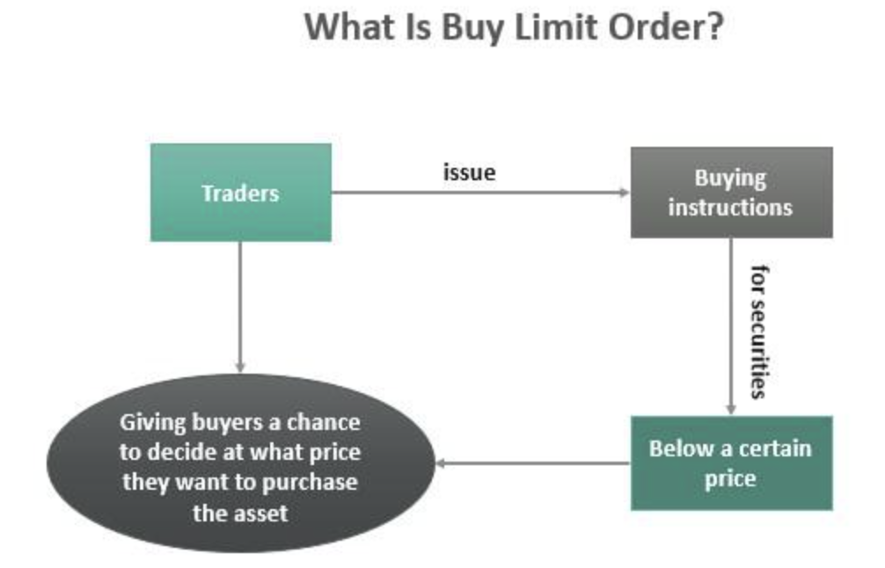

## Table of Contents

## What is a buy limit order?

A buy limit order is a type of order you can place with a broker to buy a stock at a specific price or lower. For example, if you want to buy a stock that is currently trading at $50 but you think it might drop to $45, you can set a buy limit order at $45. If the stock price reaches $45 or goes lower, your order will be executed, and you will buy the stock at that price.

This type of order is useful if you want to control the price you pay for a stock. It helps you avoid buying the stock at a higher price than you are willing to pay. However, there is a risk that the stock price might never reach your limit price, and your order will not be executed. So, it's important to set your limit price carefully based on your research and market conditions.

## How does a buy limit order work?

A buy limit order is a way to tell your broker that you want to buy a stock, but only if it reaches a certain price or lower. For example, if a stock is trading at $50 and you think it might go down to $45, you can set a buy limit order at $45. If the stock price drops to $45 or below, your order will be filled, and you will buy the stock at that price.

This type of order is helpful because it lets you set the maximum price you are willing to pay for a stock. It can save you money if the stock price drops to your limit or lower. But, there's a chance that the stock might never reach your limit price. If that happens, your order won't be filled, and you won't buy the stock. So, it's important to choose your limit price wisely based on your research and what's happening in the market.

## What are the key components of a buy limit order?

A buy limit order has a few main parts that you need to know. First, there's the limit price. This is the highest price you're willing to pay for the stock. If the stock's price reaches or goes below this limit, your order will be filled. Second, there's the quantity, which is how many shares you want to buy. You need to decide how many shares you want before you place the order.

The third part is the duration of the order. This tells the broker how long the order should stay active. You can choose a day order, which means the order will expire at the end of the trading day if it's not filled. Or, you can choose a good-till-canceled (GTC) order, which means the order will stay active until it's filled or you cancel it. Understanding these parts helps you use buy limit orders effectively to buy stocks at the price you want.

## What are the advantages of using a buy limit order?

Using a buy limit order has some good points. It lets you buy a stock at a lower price than it's currently trading at. If you think a stock is going to go down a bit before it goes up, you can set a buy limit order at that lower price. This way, you might save money because you're buying the stock for less than what it's worth right now. It's like waiting for a sale before you buy something.

Another advantage is that it gives you control over what you spend. You decide the highest price you're willing to pay, and if the stock doesn't reach that price, you don't have to buy it. This can help you stick to your budget and not pay more than you want to. It's a good way to make sure you're being smart with your money when you invest.

## What are the disadvantages of using a buy limit order?

One disadvantage of using a buy limit order is that the stock might never reach your limit price. If that happens, your order won't be filled, and you won't buy the stock. This can be frustrating if the stock price keeps going up and you miss out on a good investment because you were waiting for a lower price.

Another problem is that the stock might only hit your limit price for a short time. If there aren't enough shares available at your limit price, you might only get part of the shares you wanted. This can be tricky if you need a certain number of shares to meet your investment goals.

Using a buy limit order also means you need to watch the market closely. If the stock price moves quickly, you might need to adjust your limit price. This can take a lot of time and attention, which might not be easy for everyone.

## How does a buy limit order differ from a buy market order?

A buy limit order and a buy market order are two different ways to buy a stock. With a buy limit order, you tell your broker to buy the stock only if it reaches a certain price or lower. For example, if a stock is trading at $50 and you set a buy limit order at $45, your order will only be filled if the stock price drops to $45 or below. This helps you control the price you pay and can save you money if the stock price goes down.

On the other hand, a buy market order is simpler. When you place a buy market order, you're telling your broker to buy the stock right away at the current market price. If a stock is trading at $50 and you place a buy market order, you'll buy it at around $50, depending on the exact price at that moment. This means you'll get the stock quickly, but you might pay a higher price than with a buy limit order.

The main difference is about control and speed. A buy limit order gives you control over the price but might not get filled if the stock price doesn't reach your limit. A buy market order gets filled quickly but at the current market price, which could be higher than you want to pay. Choosing between them depends on whether you care more about the price or getting the stock right away.

## In what market conditions is a buy limit order most effective?

A buy limit order works best in a market that is going down or staying the same. If you think a stock's price will drop a bit before it goes up again, setting a buy limit order at a lower price can help you buy the stock for less money. This is good when the market is not too wild and the stock's price moves slowly. You can wait for the right moment to buy without rushing.

It's also useful in a market where the stock's price goes up and down a lot but stays around the same average. If you see that a stock often dips to a certain price before going back up, you can set your buy limit order at that lower price. This way, you might catch the stock when it's on sale and still get it before it goes up again. Just remember, if the stock never reaches your limit price, you won't buy it, so you need to be okay with that risk.

## Can you provide an example of when to use a buy limit order?

Imagine you're interested in buying shares of a company called ABC Corp. The stock is currently trading at $100 per share, but you believe it might drop to $95 soon due to some upcoming news. You want to buy the stock, but you don't want to pay more than $95 per share. In this case, you can place a buy limit order at $95. If the stock price drops to $95 or lower, your order will be filled, and you'll buy the shares at that price. This way, you could save $5 per share compared to buying at the current market price.

Let's say you set your buy limit order at $95 and the stock does drop to that price. Your order gets filled, and you buy the shares at $95 each. A few days later, the stock price goes back up to $105. Because you used a buy limit order, you were able to buy the stock at a lower price and now have a profit of $10 per share if you decide to sell. This example shows how a buy limit order can help you buy a stock at a better price and potentially make more money when the stock price goes up again.

## What are the risks associated with buy limit orders?

One risk of using a buy limit order is that the stock might never reach your limit price. If the stock price stays above your limit, your order won't be filled, and you won't buy the stock. This can be frustrating if the stock keeps going up and you miss out on a good investment because you were waiting for a lower price.

Another risk is that the stock might only hit your limit price for a short time. If there aren't enough shares available at your limit price, you might only get part of the shares you wanted. This can be tricky if you need a certain number of shares to meet your investment goals. 

Also, using a buy limit order means you need to watch the market closely. If the stock price moves quickly, you might need to adjust your limit price. This can take a lot of time and attention, which might not be easy for everyone.

## How can traders manage and adjust buy limit orders?

Traders can manage and adjust buy limit orders by keeping an eye on the market and changing their orders when needed. If the stock price is moving a lot, traders might want to change their limit price to make sure they can still buy the stock. They can do this by going into their trading account and updating the limit price to a new number that they think the stock might reach. It's also important to decide how long the order should stay active. If they set a day order and the stock doesn't reach the limit price that day, they might want to set a new order the next day or change it to a good-till-canceled (GTC) order so it stays active until it's filled or canceled.

Another way to manage buy limit orders is to think about how many shares they want to buy. If the stock price hits the limit but there aren't enough shares at that price, traders might only get part of what they wanted. They can adjust the quantity of shares in their order to make sure they get as many as they need. Also, traders should be ready to cancel their order if the market changes and they don't want to buy the stock anymore. By staying on top of these things, traders can use buy limit orders to their advantage and make smart choices about when and how to buy stocks.

## What advanced strategies involve the use of buy limit orders?

One advanced strategy using buy limit orders is called dollar-cost averaging. This is when you spread out your stock purchases over time. Instead of buying all your shares at once, you set buy limit orders at different prices and times. For example, if you want to buy 100 shares of a stock, you might set four buy limit orders for 25 shares each at different prices. This way, you can buy some shares if the price goes down to your limit, and you might end up paying less on average than if you bought all the shares at once.

Another strategy is using buy limit orders to take advantage of short-term price dips. If you think a stock is generally going up but might drop a bit soon, you can set a buy limit order at that lower price. For instance, if a stock is usually going up but you think it might drop from $50 to $48, you can set a buy limit order at $48. If the stock does drop to that price, your order will be filled, and you can buy the stock at a discount. Then, when the stock price goes back up, you can sell it for a profit. This strategy needs you to watch the market closely and be ready to adjust your limit price if the stock doesn't behave as you expected.

## How do buy limit orders fit into a broader trading strategy?

Buy limit orders can be a big part of a bigger trading plan. They help traders buy stocks at lower prices, which can save money and make more profit later. Traders might use buy limit orders with other ways of trading, like dollar-cost averaging. This means they buy a little bit of a stock over time instead of all at once. By setting buy limit orders at different prices, they can get shares when the price goes down and maybe pay less on average. This can be a smart way to slowly build up their investment without spending too much at once.

Another way buy limit orders fit into a trading strategy is by taking advantage of short-term price drops. If a trader thinks a stock will go up over time but might drop a bit soon, they can set a buy limit order at that lower price. If the stock does drop to the limit price, the order gets filled, and the trader buys the stock at a discount. Then, when the stock price goes back up, they can sell it for a profit. This strategy needs the trader to keep a close eye on the market and be ready to change their limit price if the stock doesn't move as they thought. Using buy limit orders like this can help traders make the most of market changes and buy stocks at the best possible prices.

## References & Further Reading

[1]: Bergstra, J., Bardenet, R., Bengio, Y., & Kégl, B. (2011). ["Algorithms for Hyper-Parameter Optimization."](https://proceedings.neurips.cc/paper/2011/file/86e8f7ab32cfd12577bc2619bc635690-Paper.pdf) Advances in Neural Information Processing Systems 24.

[2]: ["Advances in Financial Machine Learning"](https://www.amazon.com/Advances-Financial-Machine-Learning-Marcos/dp/1119482089) by Marcos Lopez de Prado

[3]: ["Evidence-Based Technical Analysis: Applying the Scientific Method and Statistical Inference to Trading Signals"](https://www.amazon.com/Evidence-Based-Technical-Analysis-Scientific-Statistical/dp/0470008741) by David Aronson

[4]: ["Machine Learning for Algorithmic Trading"](https://github.com/stefan-jansen/machine-learning-for-trading) by Stefan Jansen

[5]: ["Quantitative Trading: How to Build Your Own Algorithmic Trading Business"](https://www.amazon.com/Quantitative-Trading-Build-Algorithmic-Business/dp/1119800064) by Ernest P. Chan

[6]: Harris, L. (2003). ["Trading and Exchanges: Market Microstructure for Practitioners"](https://academic.oup.com/book/52292) by Larry Harris

[7]: Hasbrouck, J. (2007). ["Empirical Market Microstructure: The Institutions, Economics, and Econometrics of Securities Trading"](https://academic.oup.com/book/52241) by Joel Hasbrouck

[8]: Kissell, R. (2006). ["The Science of Algorithmic Trading and Portfolio Management"](https://www.sciencedirect.com/book/9780124016897/the-science-of-algorithmic-trading-and-portfolio-management) by Robert Kissell

[9]: Aldridge, I. (2013). ["High-Frequency Trading: A Practical Guide to Algorithmic Strategies and Trading Systems"](https://www.amazon.com/High-Frequency-Trading-Practical-Algorithmic-Strategies/dp/1118343506) by Irene Aldridge