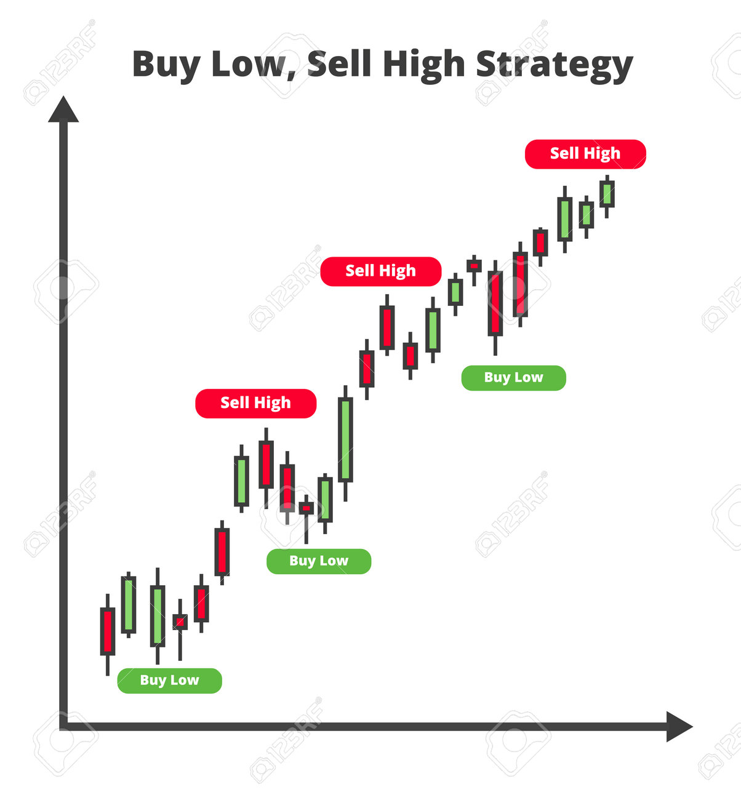

## Table of Contents

## What does 'Buy Low, Sell High' mean in the context of investing?

'Buy Low, Sell High' is a basic idea in investing. It means you should try to buy things when they are cheap and sell them when they are expensive. This way, you can make a profit. For example, if you buy a stock for $10 and later sell it for $20, you make money because you sold it for more than you paid for it.

However, knowing when something is low or high can be hard. Prices go up and down all the time. You need to study the market and understand what affects prices. Sometimes, what seems low might go even lower, and what seems high might go higher. So, it's important to be patient and do your research before making decisions.

## Why is the 'Buy Low, Sell High' strategy considered fundamental in trading?

The 'Buy Low, Sell High' strategy is considered fundamental in trading because it is the simplest way to make a profit. When you buy something at a low price and sell it at a higher price, you earn money from the difference. This idea works in many markets, like stocks, real estate, or even collectibles. It's the core of what trading is all about: buying things when they are undervalued and selling them when they are overvalued.

Understanding when something is truly low or high can be tricky, though. Prices can keep changing, and what looks like a good deal today might not be tomorrow. Traders need to study the market, look at trends, and sometimes guess where prices will go next. Even though it's simple in theory, putting the 'Buy Low, Sell High' strategy into practice takes a lot of work and skill.

## How can a beginner identify when a stock is 'low' enough to buy?

For a beginner, figuring out if a stock is 'low' enough to buy can be tough. One way to start is by looking at the stock's price history. If the current price is lower than it has been in the past few months or years, it might be a good time to buy. You can use charts to see these trends. Also, paying attention to the company's news can help. If the company is doing well but the stock price is down because of something temporary, like a bad quarter, it might be a good buy.

Another thing to consider is the stock's price compared to similar companies. If a stock is cheaper than others in the same industry, it might be undervalued. This is called looking at the stock's valuation. You can use simple ratios like the price-to-earnings (P/E) ratio to see if a stock is cheap compared to its earnings. Remember, though, that just because a stock looks cheap doesn't mean it will go up. You need to do your homework and maybe even talk to more experienced investors before deciding.

It's also important to think about your own goals and how much risk you're willing to take. If you're new to investing, you might want to start with safer stocks that have a history of steady growth. Don't rush into buying just because a stock looks low. Take your time to learn and understand the market better. Investing is a long-term game, and patience can pay off.

## What are common indicators used to determine when to sell a stock at a 'high' price?

One common indicator to sell a stock at a high price is when the stock reaches a new peak. If you see the stock price going higher than it has ever been before, it might be a good time to sell. This is because the stock might not keep going up forever, and selling at a peak could mean you make the most profit. Another sign is when the stock's price is much higher than its average over the past few months or years. If the stock is way above its usual price, it might be overvalued, and selling could be smart.

Another indicator is when the stock's price-to-earnings (P/E) ratio is much higher than the industry average. This can mean the stock is overvalued compared to other companies in the same business. If you see this, it might be time to sell before the price drops back down. Also, if there's bad news about the company or the economy that could make the stock price fall, selling before that happens can help you get out at a high price. Keeping an eye on these signs can help you decide when to sell and make the most of your investment.

## Can you explain the role of market timing in the 'Buy Low, Sell High' strategy?

Market timing is really important when you're trying to buy low and sell high. It's all about guessing when prices will go up or down. If you can buy a stock right before it starts to go up, you can make more money. But if you buy it and then it keeps going down, you might lose money. So, getting the timing right can make a big difference in how much profit you make.

But, market timing is hard to do well. No one can predict the future perfectly, so it's a bit like guessing. Sometimes, you might get it right, but other times you might not. That's why some people say it's better to invest for the long term instead of trying to time the market. Still, if you can get good at it, timing the market can help you buy low and sell high more often.

## What are the risks associated with trying to 'Buy Low, Sell High'?

Trying to buy low and sell high can be risky because it's hard to know when a stock is really at its lowest or highest point. Prices can keep going down after you buy, or they might not go up as much as you hope after you buy. If you guess wrong, you could lose money instead of making a profit. It's also hard to time the market perfectly. You might think a stock is at its lowest, but it could drop even more, or you might sell too early and miss out on more gains.

Another risk is that you might get too focused on short-term price changes and miss the bigger picture. If you're always trying to buy and sell at the perfect times, you might end up trading too much. This can lead to higher costs from fees and taxes, which can eat into your profits. Plus, if you're always worried about the next price move, it can be stressful and make investing less enjoyable. It's important to remember that while buying low and selling high sounds simple, putting it into practice can be tricky and comes with its own set of challenges.

## How does fundamental analysis assist in executing a 'Buy Low, Sell High' strategy?

Fundamental analysis helps you figure out if a stock is a good buy by looking at the company's financial health and future prospects. It's like checking if a company is strong and likely to grow. You look at things like how much money the company makes, how much it owes, and what it's planning to do next. If the stock price is low compared to these numbers, it might be a good time to buy because the stock could be undervalued. This means you might be able to buy it at a low price before other people realize how good the company is and the price goes up.

Once you own the stock, [fundamental analysis](/wiki/fundamental-analysis) can also help you decide when to sell. If the company's earnings start to grow and the stock price goes up, but it's still not as high as it should be based on the company's strong fundamentals, you might decide to hold onto it longer. But if the price gets really high compared to the company's actual value, it might be time to sell. This way, you can try to sell the stock at a high price before it goes down again. Fundamental analysis gives you a way to make smarter decisions about when to buy and sell based on the real value of the company, not just what the market is doing at the moment.

## What role does technical analysis play in identifying 'Buy Low, Sell High' opportunities?

Technical analysis helps you find good times to buy low and sell high by looking at charts and patterns in a stock's price. It's all about studying how the stock has moved in the past to guess where it might go next. For example, if you see that a stock's price often goes up after it hits a certain low point, you might decide to buy when it reaches that low again. Technical analysis uses tools like moving averages and trend lines to help you spot these patterns. It can show you when a stock might be getting ready to go up or down, which can help you decide when to buy or sell.

Even though technical analysis can be helpful, it's not perfect. It's based on past data, and the future can be different. Sometimes, a stock might not follow the patterns you expect, and you could end up buying at a low that keeps going lower or selling at a high that keeps going higher. That's why it's good to use technical analysis along with other methods, like fundamental analysis, to make better decisions. By combining different kinds of analysis, you can get a fuller picture of whether a stock is really a good buy or sell at its current price.

## How can an investor use historical data to improve their 'Buy Low, Sell High' strategy?

An investor can use historical data to improve their 'Buy Low, Sell High' strategy by looking at how a stock's price has moved in the past. By studying old price charts, an investor can spot patterns and trends. For example, if a stock often goes up after it reaches a certain low price, the investor might decide to buy when it hits that low again. Historical data can also help an investor see if a stock's current price is low or high compared to where it has been before. This can give them a better idea of whether the stock is a good buy at its current price.

Another way historical data helps is by showing how a stock reacts to certain events or times of the year. If a stock usually goes up during a certain season or after good news about the company, an investor can use this information to time their buys and sells better. But, it's important to remember that just because something happened in the past doesn't mean it will happen again. So, while historical data can guide decisions, it should be used along with other information, like what's happening with the company and the economy right now, to make the best choices.

## What are some advanced techniques for predicting market lows and highs more accurately?

One advanced technique for predicting market lows and highs more accurately is using quantitative analysis. This means using math and computer programs to look at lots of data and find patterns that are hard for people to see. For example, you might use a computer to study how different stocks move together or how they react to news about the economy. By finding these patterns, you can make better guesses about when prices might go up or down. But remember, even with all this math, the future is still hard to predict perfectly.

Another technique is to use sentiment analysis. This means looking at what people are saying about a stock or the market on social media, in news articles, or in financial reports. If a lot of people are feeling good about a stock, it might be near a high, and if they're feeling bad, it might be near a low. You can use special tools to measure this sentiment and see if it's changing. Combining this with other information, like what's happening in the economy or with the company, can help you make smarter decisions about when to buy low and sell high.

## How does one manage a portfolio using the 'Buy Low, Sell High' strategy across different market conditions?

Managing a portfolio using the 'Buy Low, Sell High' strategy across different market conditions means you need to pay attention to what's happening in the market and adjust your plan. When the market is going up, you might see more chances to sell high. But you also need to be careful not to sell too soon, because the market could keep going up. On the other hand, when the market is going down, you might find more stocks to buy low. But you have to be patient and wait for the right time, because prices could keep falling.

It's also important to spread your money across different kinds of investments. This way, if one part of the market is doing badly, another part might be doing well. For example, if stocks are going down, maybe bonds or real estate are going up. By having a mix of different investments, you can still find opportunities to buy low and sell high, no matter what the market is doing. This helps you keep your portfolio strong and growing, even when things are changing a lot.

## Can you discuss case studies where 'Buy Low, Sell High' was successfully implemented by expert investors?

One famous example of someone using the 'Buy Low, Sell High' strategy well is Warren Buffett. He bought shares in American Express in 1964 when the company was in trouble because of a big scandal. The stock price was low, and many people were scared to buy it. But Buffett saw that the company was still strong and would recover. He bought a lot of shares at a low price. Over time, as American Express got better, the stock price went up a lot. Buffett sold his shares at a much higher price and made a big profit.

Another example is when investor Peter Lynch managed the Fidelity Magellan Fund. He was really good at finding stocks that were undervalued. In the early 1980s, he bought shares in Chrysler when the company was struggling and the stock price was low. Lynch believed that Chrysler would turn things around, and he was right. As Chrysler started to do better, the stock price went up. Lynch sold the shares at a high price and made a lot of money for the fund's investors. These examples show that if you can find good companies when their stock prices are low and hold onto them until they go up, you can make a lot of money.

## References & Further Reading

[1]: Bergstra, J., Bardenet, R., Bengio, Y., & Kégl, B. (2011). ["Algorithms for Hyper-Parameter Optimization."](https://papers.nips.cc/paper/4443-algorithms-for-hyper-parameter-optimization) Advances in Neural Information Processing Systems 24.

[2]: ["Advances in Financial Machine Learning"](https://www.amazon.com/Advances-Financial-Machine-Learning-Marcos/dp/1119482089) by Marcos Lopez de Prado

[3]: ["Evidence-Based Technical Analysis: Applying the Scientific Method and Statistical Inference to Trading Signals"](https://www.amazon.com/Evidence-Based-Technical-Analysis-Scientific-Statistical/dp/0470008741) by David Aronson

[4]: ["Machine Learning for Algorithmic Trading"](https://github.com/stefan-jansen/machine-learning-for-trading) by Stefan Jansen

[5]: ["Quantitative Trading: How to Build Your Own Algorithmic Trading Business"](https://www.amazon.com/Quantitative-Trading-Build-Algorithmic-Business/dp/1119800064) by Ernest P. Chan