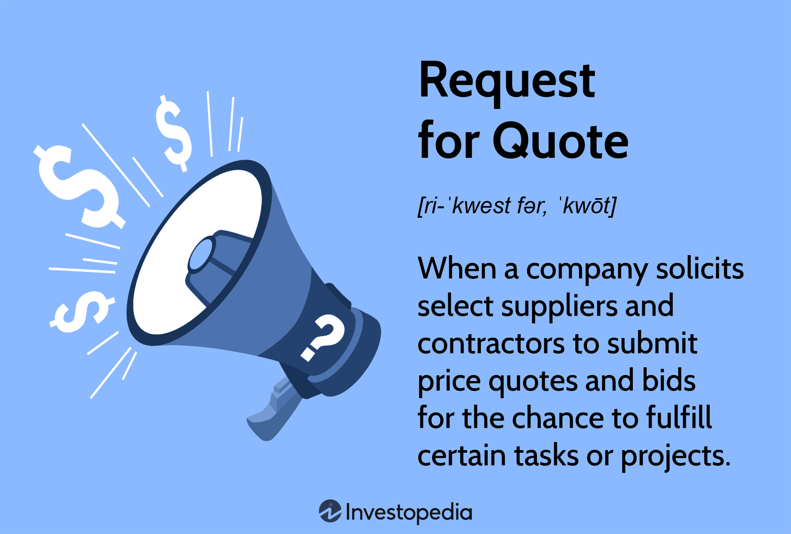

This article explores essential financial concepts related to the stock market, primarily focusing on 'buy quotes' and algorithmic trading. In an era marked by the increasing complexity of financial markets, grasping these terms is pivotal for both novice and seasoned traders. Buy quotes, representing the best available price at which a trader can purchase a security, serve as a vital component in understanding price dynamics and market transactions. These quotes inform traders about the entry and exit points, heavily influencing trading strategies and decisions within the volatile stock market environment.

On a parallel note, the role of algorithmic trading has gained substantial prominence in modern finance. Utilizing pre-programmed algorithms, this trading method allows for the execution of trades at speeds and volumes impossible for human traders to match. By analyzing vast quantities of data to pinpoint market opportunities, algorithmic trading minimizes human biases and errors, thereby offering a more systematic approach to handling transactions. It is crucial for traders and investors to comprehend how these concepts—buy quotes and algorithmic trading—intertwine to affect stock prices and form the substratum of effective trading strategies. By the conclusion of this guide, readers will be equipped with a robust understanding of these pivotal financial concepts, enabling informed decision-making in the stock market landscape.



## Table of Contents

## Understanding Stock Market Buy Quotes

A buy quote in the stock market indicates the optimal price at which a trader is willing to purchase a particular security at any given moment. This quote is a cornerstone of financial trading, serving as a real-time representation of demand in the marketplace. Buy quotes are instrumental in establishing the price at which securities exchange hands during a market session, highlighting their critical role in trading strategies.

The quotation structure is directly related to the principles of bid and ask prices. The bid price represents the maximum amount that a buyer is willing to offer, while the ask price is the minimum amount a seller is willing to accept. The relationship between these two prices forms the basis of market supply and demand dynamics. In particular, the difference between the bid and ask price, known as the spread, serves as an indirect measure of the security's liquidity and transaction cost. A narrower spread typically suggests higher liquidity, allowing traders to enter and exit positions more efficiently.

Buy quotes help traders determine the most advantageous entry and exit points, guiding decisions that align with their trading objectives. For example, when a trader spots a buy quote lower than their target entry price, it may indicate an opportunity for a cost-effective acquisition. Conversely, a quote higher than the desired exit price could suggest the right moment to sell, optimizing potential gains.

For traders looking to capitalize on available opportunities, understanding buy quotes and their relationship with bid and ask prices is essential. By analyzing this information, traders gain insights into the market's current sentiment and can adjust their strategies accordingly to maximize profit potential.

## Key Financial Terms Related to Buy Quotes

Bid Price: The bid price is the highest price that a buyer is willing to pay for a security at any given time. It represents the demand in the market for that security and is a critical component in determining the buy quote for a stock. The bid price is dynamic and can fluctuate based on various factors, such as market conditions, economic news, and investor sentiment. This price is essential for traders aiming to sell their securities, as it indicates the potential selling price they could receive at that moment.

Ask Price: The ask price is the lowest price that a seller is willing to accept for a security. This price indicates the supply of the asset in the market. Similar to the bid price, the ask price is subject to change based on market dynamics. Traders looking to purchase securities focus on the ask price as it reflects the current purchase cost. The ask price is typically higher than the bid price due to the transaction costs and desired profit margin for sellers.

Spread: The spread is the difference between the bid price and the ask price. It is a crucial indicator of the [liquidity](/wiki/liquidity-risk-premium) and transaction cost of the security. A narrower spread usually suggests higher liquidity, meaning that the security can be bought and sold more easily and quickly without significantly affecting its price. Conversely, a wider spread may indicate lower liquidity and higher transaction costs. The spread can be mathematically expressed as:

$$
\text{Spread} = \text{Ask Price} - \text{Bid Price}
$$

NBBO (National Best Bid and Offer): The NBBO is a Securities and Exchange Commission (SEC)-regulated system that ensures traders receive the best available buy and sell quotes. The NBBO represents the highest bid price and the lowest ask price available across all exchanges for a particular security. This system is crucial for maintaining market integrity and efficiency, ensuring that all traders have access to the best possible prices when executing trades. The NBBO is dynamically updated, reflecting real-time changes in the market.

## The Role of Algorithmic Trading in the Stock Market

Algorithmic trading, often referred to as algo trading, is a sophisticated trading strategy that utilizes computer algorithms to execute orders based on predefined instructions. This approach has transformed the landscape of trading by enabling trades to occur at speeds and frequencies that far surpass human capabilities. Central to [algorithmic trading](/wiki/algorithmic-trading) is the exploitation of market opportunities through the analysis of large datasets and precise execution of orders, which ultimately seeks to optimize trading performance.

One of the primary benefits of algorithmic trading is its ability to minimize human error and emotional decision-making, offering a systematic and disciplined trading approach. Algorithms can be designed to capitalize on specific patterns or conditions in the market, executing trades swiftly as opportunities arise without the delay associated with human intervention.

Several common strategies employed in algorithmic trading include:

1. **Trend Following**: This strategy focuses on algorithms that track and capitalize on ongoing trends in the market prices. By identifying upward or downward movements in securities, these algorithms can make buy or sell decisions in an attempt to ride these trends profitably.

2. **Mean Reversion**: This strategy is rooted in the belief that prices and returns tend to move back towards their historical means over time. Algorithms using this strategy identify deviations from average prices and predict reversals, thus making trades based on the anticipated return to the norm.

3. **Statistical Arbitrage**: This involves identifying and exploiting statistical price inefficiencies between related financial instruments. These algorithms seek to profit from price discrepancies with rigorous quantitative models that predict relative price moves.

A simple example of a mean reversion strategy implemented in Python might look as follows:

```python
import numpy as np
import pandas as pd

def mean_reversion_strategy(prices, window=20):
    # Calculate rolling mean and standard deviation
    rolling_mean = prices.rolling(window=window).mean()
    rolling_std = prices.rolling(window=window).std()
    z_scores = (prices - rolling_mean) / rolling_std

    # Create buy and sell signals
    buy_signals = z_scores < -1
    sell_signals = z_scores > 1

    return buy_signals, sell_signals

# Example usage with historical price data
prices = pd.Series([...])  # Load with price data
buy, sell = mean_reversion_strategy(prices)
```

This script generates buy and sell signals when the price deviates significantly from its rolling mean, assuming a return to the mean is likely. Algorithmic trading continues to advance with the emergence of new technologies and data analytics, maintaining its pivotal role in the stock market through enhanced efficiency and precision.

## Advantages and Disadvantages of Algorithmic Trading

Algorithmic trading, often termed algo trading, offers several advantages that have revolutionized modern financial markets. One of the primary benefits is increased efficiency. Algorithms can process vast amounts of data at an incredible speed, allowing them to monitor markets in real time and execute trades with minimal delay. This capability significantly reduces the time lag associated with manual trading, enabling traders to capitalize promptly on fleeting market opportunities. The efficiency of algorithmic trading translates into the ability to execute a large number of trades with consistency and precision, minimizing human error and emotional bias.

Additionally, algorithmic trading allows for rapid trade execution, which is crucial in markets where price discrepancies can disappear in a fraction of a second. Algorithms can place multiple orders across various markets and accounts, enhancing the possibility of securing the best price available at any given moment. By automating this process, traders not only improve their response times to market movements but also gain a competitive edge.

Another significant advantage is the reduction in transaction costs. Algorithmic systems are designed to identify the optimal timing for trades and the most cost-effective venues for execution. This automated search for the best conditions can result in lower bid-ask spreads and reduced market impact costs, ultimately maximizing the trader's profit margins.

However, despite these advantages, algorithmic trading also has some disadvantages. It relies heavily on technological infrastructure, making it susceptible to technical failures and glitches. A minor programming error or a technology malfunction can lead to significant financial losses. Therefore, robust system maintenance and error-checking protocols are essential to mitigate these risks.

Algorithmic trading is also vulnerable to unforeseen market events. While algorithms are designed to react to a wide range of scenarios, they may not always predict or respond correctly to irregular or highly volatile market conditions. This limitation can sometimes exacerbate market [volatility](/wiki/volatility-trading-strategies), as seen during the infamous Flash Crash of 2010.

Furthermore, large-scale adoption of algorithmic strategies can lead to increased market volatility. As many algorithms are programmed to respond to similar market signals, a cascade of automated sell-offs or acquisitions can amplify price swings, thereby impacting overall market stability.

Despite these drawbacks, algorithmic trading is extensively used across financial markets. Its ability to handle large-[volume](/wiki/volume-trading-strategy) trades with precision and efficiency makes it an indispensable tool for modern trading operations. As technology continues to advance, the sophisticated nature of algorithmic trading systems is expected to evolve, further fine-tuning its effectiveness and addressing some of its current limitations.

## Common Algorithmic Trading Strategies

Algorithmic trading strategies are designed to execute trades based on systematic, pre-defined criteria. Common strategies include trend-following, [arbitrage](/wiki/arbitrage), mean reversion, and market-making, each leveraging different market behaviors and opportunities.

### Trend-Following Strategies

Trend-following algorithms capitalize on long-term or short-term directional movements in asset prices. The central hypothesis is that market prices tend to move in observable patterns due to the presence of [momentum](/wiki/momentum), allowing traders to profit by following the established trend. Common techniques include moving averages, momentum indicators, and [breakout](/wiki/breakout-trading) systems. For instance, a simple moving average crossover strategy initiates a buy order when a shorter-term moving average crosses above a longer-term moving average.

Example Python code for a simple moving average crossover strategy:

```python
def moving_average_crossover(prices, short_window=50, long_window=200):
    short_ma = prices.rolling(window=short_window).mean()
    long_ma = prices.rolling(window=long_window).mean()
    signal = (short_ma > long_ma).astype(int)
    return signal
```

### Arbitrage Strategies

Arbitrage algorithms exploit price discrepancies of the same asset across different platforms or markets. By executing simultaneous buy and sell orders, traders aim to achieve risk-free profits. Classic arbitrage strategies involve identifying moments when the price difference between two markets exceeds transaction costs. These strategies rely heavily on high-speed execution and access to multiple market venues.

### Mean Reversion

Mean reversion is based on the assumption that asset prices tend to revert to their historical averages over time. This strategy identifies when an asset is overbought or oversold relative to historical norms, suggesting a future price correction. Techniques may involve statistical measures such as standard deviations, Bollinger Bands, or z-scores to determine deviations from the mean.

A basic mean reversion strategy using z-scores in Python can be implemented as follows:

```python
def mean_reversion_strategy(prices, window=20, threshold=2):
    mean = prices.rolling(window).mean()
    std_dev = prices.rolling(window).std()
    z_score = (prices - mean) / std_dev
    buy_signal = z_score < -threshold
    sell_signal = z_score > threshold
    return buy_signal, sell_signal
```

### Market-Making Algorithms

Market-making algorithms strive to profit from the bid-ask spread by simultaneously placing buy and sell orders. These algorithms provide liquidity to the market by continuously quoting buy and sell prices. The goal is to capture the spread while managing inventory risk. Successful market-making requires sophisticated risk management techniques and typically operates on high-speed, low-latency trading systems.

Each of these strategies requires a deep understanding of market mechanics and significant computational resources to implement efficiently. Moreover, [backtesting](/wiki/backtesting) and risk management are crucial to ensure these algorithms perform well across various market conditions.

## Technical Requirements and Challenges of Algorithmic Trading

Implementing algorithmic trading necessitates a sophisticated understanding of both technical and financial domains. A successful setup typically requires strong programming skills, notably in languages such as Python or C++, due to their extensive libraries and frameworks available for financial modeling and data analysis. Access to real-time market data feeds is also critical, as these enable algorithms to make timely trading decisions based on the latest market conditions.

A cornerstone of algorithmic trading is robust backtesting capabilities. This involves simulating trades on historical data to evaluate the performance of a trading strategy before it is deployed in the live market. These simulations help in tweaking algorithms for optimal performance and in identifying potential pitfalls. Python libraries like `pandas` and `numpy`, alongside frameworks like `Backtrader`, offer powerful tools for such analyses. For instance, the following Python snippet demonstrates a basic backtesting structure using `Backtrader`:

```python
import backtrader as bt

class MyStrategy(bt.Strategy):
    def __init__(self):
        self.sma = bt.indicators.SimpleMovingAverage(period=15)

    def next(self):
        if self.data.close > self.sma:
            self.buy()
        elif self.data.close < self.sma:
            self.sell()

cerebro = bt.Cerebro()
# Here you would add your data feed, for example:
# cerebro.adddata(bt.feeds.PandasData(dataname=your_data))
cerebro.addstrategy(MyStrategy)
cerebro.run()
```

One of the significant challenges in algorithmic trading is ensuring algorithm stability. Algorithms must be designed to withstand multiple market conditions and unexpected events. Stability involves rigorous testing and validation which can identify potential weaknesses or vulnerabilities in the strategies. Latency is another critical [factor](/wiki/factor-investing); it refers to the time delay from when a trading signal is generated to when it is executed. Minimizing latency is crucial, especially in high-frequency trading, to ensure trades occur at the desired market conditions.

Managing market impact is essential for maintaining the integrity of trading strategies. Large trades can influence market prices, which may lead to slippage—a difference between the expected price of a trade and the price at which it is executed. Strategies to mitigate this include slicing orders into smaller batches and executing them over a period.

Lastly, proper infrastructure and risk management strategies are paramount. This includes having a reliable technological framework comprising low-latency networks, co-location services (where traders' servers are placed in close proximity to exchange servers), and redundant systems to ensure uptime. Risk management involves setting parameters such as stop-loss limits, position sizing, and diversification to protect against adverse market movements. These factors collectively contribute to a more resilient and efficient approach to algorithmic trading.

## Conclusion

Understanding buy quotes and effectively utilizing algorithmic trading are essential strategies for traders and investors aiming to navigate the complex dynamics of the stock market. Buy quotes, typically reflecting the demand side of a security's market, provide traders with crucial real-time insights into market pricing. This transparency helps in identifying optimal entry and [exit](/wiki/exit-strategy) points, which can be pivotal in making informed investment decisions.

Algorithmic trading further enhances trading efficiency by leveraging sophisticated algorithms to execute trades with precision and speed unachievable by humans. This automated approach minimizes human error and emotional biases, leading to a more systematic and disciplined trading process. As financial technology continues to advance, algorithmic trading systems have become increasingly adept at processing large volumes of data, enabling traders to exploit market inefficiencies swiftly.

By mastering these components, market participants can gain notable advantages, such as reduced transaction costs and improved trade execution. As a result, traders and investors who adeptly implement these tools stand to enhance their profitability and strategic positioning in the ever-evolving financial market landscape.

## References & Further Reading

[1]: Bergstra, J., Bardenet, R., Bengio, Y., & Kégl, B. (2011). ["Algorithms for Hyper-Parameter Optimization."](https://dl.acm.org/doi/10.5555/2986459.2986743) Advances in Neural Information Processing Systems 24.

[2]: ["Advances in Financial Machine Learning"](https://www.amazon.com/Advances-Financial-Machine-Learning-Marcos/dp/1119482089) by Marcos Lopez de Prado

[3]: ["Evidence-Based Technical Analysis: Applying the Scientific Method and Statistical Inference to Trading Signals"](https://www.amazon.com/Evidence-Based-Technical-Analysis-Scientific-Statistical/dp/0470008741) by David Aronson

[4]: ["Machine Learning for Algorithmic Trading"](https://github.com/stefan-jansen/machine-learning-for-trading) by Stefan Jansen

[5]: ["Quantitative Trading: How to Build Your Own Algorithmic Trading Business"](https://github.com/LucindaYa/quant-resources/blob/master/Quantitative%20Trading%20How%20to%20Build%20Your%20Own%20Algorithmic%20Trading%20Business.pdf) by Ernest P. Chan