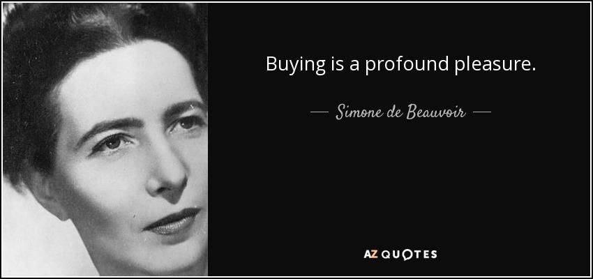

## Table of Contents

## What is a buy quote?

A buy quote is a price that a seller offers to someone who wants to buy something. It's like when you go to a store and see a price tag on an item. That price tag is a buy quote because it tells you how much you need to pay to take the item home.

Sometimes, a buy quote can be different from the final price. For example, if you are buying a car, the dealership might give you a buy quote, but you might be able to negotiate a lower price. So, a buy quote is just a starting point for how much something costs, and it can change based on different factors like negotiation or special deals.

## Why are buy quotes important in trading?

Buy quotes are really important in trading because they tell traders how much they need to pay to buy a stock, currency, or any other asset. This helps traders make smart choices about when to buy. If the buy quote is too high, traders might wait for a better price. If it's a good price, they might buy right away.

Also, buy quotes help make trading fair and clear. Everyone can see the same buy quote, so no one gets a secret deal. This makes the market work better because traders can trust that the prices they see are real. Knowing the buy quote helps traders plan their moves and make money.

## How do you request a buy quote from a broker?

To request a buy quote from a broker, you can start by calling them or sending an email. Just tell them clearly what you want to buy, like a specific stock or currency. It's good to give them all the details they need, like how many shares you want or the amount of currency you're looking to trade. This way, they can give you an accurate buy quote.

Once you've given them all the details, the broker will look up the current market price and any other costs like fees. They'll then tell you the total price you'd need to pay if you decide to buy right then. This buy quote helps you decide if you want to go ahead with the trade or wait for a better price.

## What information is typically included in a buy quote?

A buy quote usually has the price you need to pay for something. This price is called the "ask price." It's how much the seller wants for the stock, currency, or whatever you want to buy. The buy quote also might include other costs like fees or taxes. These extra costs can make the total price higher than just the ask price.

Sometimes, the buy quote also tells you how many shares or how much of the thing you can buy at that price. This is called the "[volume](/wiki/volume-trading-strategy)" or "quantity." Knowing this helps you plan if you want to buy a lot or a little. Overall, a buy quote gives you all the info you need to decide if you want to buy something right away or wait for a better price.

## How does a buy quote differ from a sell quote?

A buy quote and a sell quote are two different prices you see in trading. A buy quote, also called the "ask price," is the price that someone selling a stock or currency wants you to pay if you want to buy it. It's like the price tag on an item in a store. When you see a buy quote, it tells you how much you need to spend to get that stock or currency.

On the other hand, a sell quote, also known as the "bid price," is the price that someone buying a stock or currency is willing to pay if you want to sell it to them. It's like when you want to sell something and someone offers you a certain amount of money for it. The sell quote shows you how much you can get if you decide to sell your stock or currency at that moment.

The difference between the buy quote and the sell quote is called the "bid-ask spread." This spread is important because it shows how much the price can change between buying and selling. Traders look at both the buy and sell quotes to decide when to buy or sell, and they try to make money from the difference between these two prices.

## What factors influence the price in a buy quote?

Many things can change the price in a buy quote. One big thing is how many people want to buy the stock or currency. If lots of people want it, the price can go up because sellers can ask for more money. Another thing is how easy it is to find the stock or currency. If it's hard to find, the price might go up because there's not enough to go around. Also, news about the company or the country can change the price. Good news might make the price go up, and bad news might make it go down.

The overall market can also affect the buy quote. If the whole market is doing well, prices might go up. If the market is doing badly, prices might go down. Sometimes, big events like elections or natural disasters can shake up the market and change prices. Fees and taxes can also add to the price in a buy quote. Brokers might charge extra for their services, and taxes can make the total price higher. All these things together decide how much you see on the buy quote.

## How can you interpret the data in a buy quote to make better trading decisions?

When you look at a buy quote, it's like seeing a price tag that tells you how much you need to pay to buy something. This price, called the ask price, is important because it helps you decide if you should buy now or wait. If the ask price is low compared to what you think the stock or currency is worth, it might be a good time to buy. But if the ask price is high, you might want to wait for a better deal. You can also compare the ask price with the bid price, which is what someone is willing to pay if you want to sell. The difference between these two prices, called the bid-ask spread, can tell you how easy or hard it might be to buy and sell quickly.

Another thing to think about when looking at a buy quote is the volume or quantity. This tells you how many shares or how much of the stock or currency you can buy at that price. If the volume is high, it means there's a lot available, and you might be able to buy more easily. But if the volume is low, it might be harder to buy what you want. Also, pay attention to any extra costs like fees or taxes that might be included in the buy quote. These can make the total price higher than just the ask price. By looking at all these parts of the buy quote, you can make smarter choices about when to buy and how much to spend.

## What are the common mistakes to avoid when using buy quotes?

One common mistake people make with buy quotes is not looking at the whole picture. They see a low price and jump to buy without thinking about other costs like fees or taxes. These extra costs can make the total price higher than they thought. Also, they might not check the volume or quantity to see if they can buy as much as they want at that price. If the volume is low, they might not be able to buy everything they need, which can mess up their trading plans.

Another mistake is not comparing the buy quote with the sell quote. The difference between these two, called the bid-ask spread, can tell you a lot about the market. If the spread is big, it might be hard to buy and sell quickly without losing money. People also forget to think about the bigger market. News, events, or overall market trends can change prices fast. Ignoring these can lead to buying at the wrong time. By looking at all these things, you can avoid making quick decisions that might cost you more in the end.

## How do electronic trading platforms affect the process of obtaining buy quotes?

Electronic trading platforms make it easier and faster to get buy quotes. Instead of calling a broker and waiting for them to tell you the price, you can see buy quotes right away on your computer or phone. These platforms show you the latest prices all the time, so you can quickly decide if you want to buy something. They also let you compare buy quotes from different sellers, which helps you find the best price without talking to anyone.

These platforms can also change how buy quotes work. Because so many people can see the same buy quotes at the same time, the prices can move very fast. This means that the buy quote you see one second might be different the next second. It's good because you can see the most up-to-date prices, but it can be hard to keep up with the changes. Also, electronic platforms might have extra fees, so you need to check if these fees are included in the buy quote you see.

## What are the best practices for comparing buy quotes from different sources?

When you want to compare buy quotes from different places, it's important to look at the whole picture. Start by checking the ask price, which is how much you need to pay to buy the stock or currency. But don't stop there. Make sure to see if there are any extra costs like fees or taxes that can make the total price higher. Also, look at the volume or quantity to know how much you can buy at that price. If one place has a lower ask price but higher fees, it might not be the best deal after all.

Another thing to do is to compare the buy quote with the sell quote, or bid price, from each place. The difference between these two prices, called the bid-ask spread, can tell you a lot about how easy it is to buy and sell. A smaller spread might mean it's easier to trade without losing money. Also, think about how fast the prices change on each platform. Some places might have prices that move very quickly, so you need to be ready to act fast. By looking at all these things, you can find the best buy quote that fits your trading plan.

## How can advanced traders use buy quotes to implement complex trading strategies?

Advanced traders can use buy quotes to make smart trading plans by looking at more than just the price. They pay attention to the bid-ask spread, which is the difference between the buy quote and the sell quote. A small spread can mean the market is calm and it's easier to trade without losing much money. But a big spread might mean the market is moving fast, and traders can use this to their advantage. They might buy when the spread is small and sell when it gets bigger, making money from the difference. They also watch the volume, or how much is available to buy at the buy quote. If the volume is high, they know they can buy a lot without changing the price too much.

Another way advanced traders use buy quotes is by combining them with other tools like charts and news. They might see a low buy quote and check the news to see if it's because of something good or bad happening. If it's good news, they might buy right away, hoping the price will go up. If it's bad news, they might wait for a better time. They also use buy quotes to set up automatic trades. For example, they can tell their computer to buy a stock when the buy quote reaches a certain low price. This way, they don't have to watch the market all the time and can still make money when the price is right. By using buy quotes in these smart ways, advanced traders can make more money and do better in the market.

## What future trends might impact the use and availability of buy quotes?

In the future, technology will keep changing how we see and use buy quotes. More people will use smart computers and phones to trade, so buy quotes will be easier to find and compare. New apps and websites might show buy quotes in new ways, like using pictures or sounds to help people understand them better. Also, computers might start guessing what buy quotes will be in the future, helping traders plan their moves. This could make trading faster and easier, but it might also make prices change even quicker, so traders will need to be ready to act fast.

Another big change might come from rules made by governments. They might make new laws to make sure buy quotes are fair and clear for everyone. This could mean more information about buy quotes will be shared, helping traders make better choices. But it might also mean more rules to follow, which could make trading a bit harder. Overall, the future of buy quotes will be shaped by technology and rules, making them more useful but also more complex for traders to use.

## What are the key financial terms related to buy quotes?

Bid Price: The bid price is the highest price that a buyer is willing to pay for a security at any given time. It represents the demand in the market for that security and is a critical component in determining the buy quote for a stock. The bid price is dynamic and can fluctuate based on various factors, such as market conditions, economic news, and investor sentiment. This price is essential for traders aiming to sell their securities, as it indicates the potential selling price they could receive at that moment.

Ask Price: The ask price is the lowest price that a seller is willing to accept for a security. This price indicates the supply of the asset in the market. Similar to the bid price, the ask price is subject to change based on market dynamics. Traders looking to purchase securities focus on the ask price as it reflects the current purchase cost. The ask price is typically higher than the bid price due to the transaction costs and desired profit margin for sellers.

Spread: The spread is the difference between the bid price and the ask price. It is a crucial indicator of the [liquidity](/wiki/liquidity-risk-premium) and transaction cost of the security. A narrower spread usually suggests higher liquidity, meaning that the security can be bought and sold more easily and quickly without significantly affecting its price. Conversely, a wider spread may indicate lower liquidity and higher transaction costs. The spread can be mathematically expressed as:

$$
\text{Spread} = \text{Ask Price} - \text{Bid Price}
$$

NBBO (National Best Bid and Offer): The NBBO is a Securities and Exchange Commission (SEC)-regulated system that ensures traders receive the best available buy and sell quotes. The NBBO represents the highest bid price and the lowest ask price available across all exchanges for a particular security. This system is crucial for maintaining market integrity and efficiency, ensuring that all traders have access to the best possible prices when executing trades. The NBBO is dynamically updated, reflecting real-time changes in the market.

## References & Further Reading

[1]: Bergstra, J., Bardenet, R., Bengio, Y., & Kégl, B. (2011). ["Algorithms for Hyper-Parameter Optimization."](https://dl.acm.org/doi/10.5555/2986459.2986743) Advances in Neural Information Processing Systems 24.

[2]: ["Advances in Financial Machine Learning"](https://www.amazon.com/Advances-Financial-Machine-Learning-Marcos/dp/1119482089) by Marcos Lopez de Prado

[3]: ["Evidence-Based Technical Analysis: Applying the Scientific Method and Statistical Inference to Trading Signals"](https://www.amazon.com/Evidence-Based-Technical-Analysis-Scientific-Statistical/dp/0470008741) by David Aronson

[4]: ["Machine Learning for Algorithmic Trading"](https://github.com/stefan-jansen/machine-learning-for-trading) by Stefan Jansen

[5]: ["Quantitative Trading: How to Build Your Own Algorithmic Trading Business"](https://github.com/LucindaYa/quant-resources/blob/master/Quantitative%20Trading%20How%20to%20Build%20Your%20Own%20Algorithmic%20Trading%20Business.pdf) by Ernest P. Chan