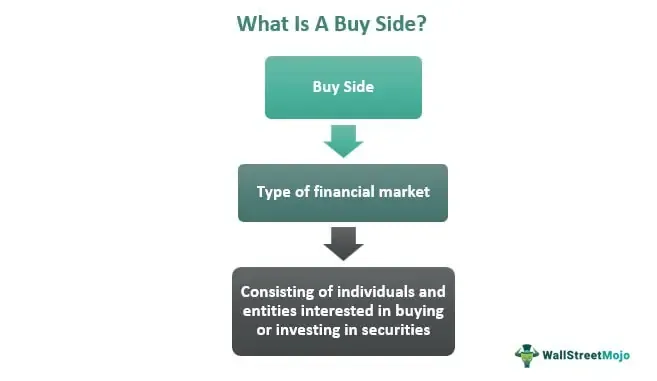

In the rapidly evolving world of financial markets, investment management is undergoing a significant transformation driven by technological advancements. Algorithmic trading, particularly on the buy side, stands out as one of the most impactful innovations in this domain. By automating trade execution using sophisticated algorithms and computer programs, algorithmic trading allows buy-side firms to process vast amounts of data with remarkable speed and precision. This capability is reshaping the way institutional investors like mutual funds and pension funds manage and optimize their portfolios, enabling them to achieve superior performance in highly competitive markets.

Buy-side investment management primarily involves the acquisition and management of securities to maximize returns for clients. It contrasts with the sell-side, which mainly deals with market advisory services. The integration of algorithmic trading strategies into buy-side management processes empowers these institutions to automate trade executions based on predefined criteria, capturing fleeting market opportunities and reducing human error.



Understanding the interplay between buy-side investment management and algorithmic trading is crucial for investors aiming to leverage technological advancements for portfolio optimization. By exploiting these technologies, investors can enhance decision-making processes, minimize transaction costs, and ultimately gain a competitive edge in the financial landscape. As the financial markets continue to evolve, staying informed about these transformational changes is essential for success.

## Table of Contents

## Understanding Buy-Side Investment Management

Buy-side investment management encompasses the range of activities undertaken by institutional investors such as mutual funds, pension funds, and insurance companies. These entities primarily focus on acquiring securities and other financial assets to build and manage portfolios with the express goal of maximizing returns for their clients. This involves thorough research, strategic asset selection, and long-term planning. Unlike the sell-side, where the emphasis lies on providing advisory services and facilitating transactions for clients, the buy-side emphasizes strategic acquisition and asset management.

The role of buy-side entities is crucial in the financial markets as they are substantial holders of securities, thus influencing market dynamics through their investment decisions. These institutions allocate capital across various asset classes, including equities, fixed income, real estate, and alternative investments, driven by comprehensive analysis and risk assessment processes. The decision-making framework on the buy-side relies heavily on portfolio management theories and risk management techniques, aiming to achieve the optimal balance between risk and return.

Key components of buy-side investment management include asset allocation, security analysis, and portfolio construction. Asset allocation involves determining the proportion of a portfolio to be invested in each asset class to achieve the desired risk-return profile. Security analysis is the process of evaluating potential investment opportunities through fundamental or technical analysis. Portfolio construction strategically combines these securities to form a diversified investment portfolio that aligns with the investor's goals and constraints.

The buy-side's focus on asset acquisition necessitates a deep understanding of financial markets, economic trends, and investor behavior. Advanced quantitative techniques and algorithmic models are often employed to enhance decision-making and optimize trade execution. By leveraging these tools, buy-side firms can achieve greater efficiency and effectiveness in managing large volumes of capital across multiple markets and asset types.

## The Role of Algorithmic Trading in Buy-Side Management

Algorithmic trading is a critical component of buy-side management, involving the use of sophisticated computer algorithms to automate the execution of trades based on specific, predefined criteria. This strategy is a substantial shift from traditional trading methods, leveraging technology to process data at high speeds with remarkable precision. By minimizing human intervention, [algorithmic trading](/wiki/algorithmic-trading) significantly reduces the likelihood of errors, thereby enhancing the reliability and accuracy of trade execution. 

The primary goal of buy-side firms in implementing algorithmic trading strategies is to achieve efficient executions that optimize investment returns across diversified markets. These algorithms are designed to navigate complex market environments, allowing investors to respond promptly to market fluctuations and capitalize on emerging opportunities. 

Algorithmic systems analyze vast amounts of market data in real-time, allowing buy-side firms to execute large volumes of trades swiftly without exerting a significant market impact. This efficiency not only aids in achieving better pricing but also in optimizing the timing of trades to take advantage of favorable market conditions. 

Additionally, the precision offered by algorithmic trading is paramount in reducing slippage, which is the difference between the expected price of a trade and the actual price at which the trade is executed. By using advanced algorithms, traders can minimize this discrepancy, ensuring that trades are executed at the most advantageous prices possible.

Overall, the integration of algorithmic trading into buy-side management practices empowers firms to enhance their portfolio management efficiency, providing a competitive advantage in the ever-evolving financial markets landscape.

## Advantages of Buy-Side Algo Trading

Algorithmic trading offers notable advantages for buy-side investment management, particularly in terms of speed, precision, and cost efficiency.

**Speed** is a crucial factor where algorithmic trading excels, as algorithms can execute trades in milliseconds. This high speed is essential for capitalizing on short-lived market opportunities that arise from rapidly changing market conditions. In financial markets, minor delays can lead to significant differences in trade execution prices. Algorithms eliminate these delays, thereby providing a substantial advantage over manual trading by swiftly capturing favorable price points before they vanish.

**Precision** in algorithmic trading significantly reduces error rates associated with manual order entry. Human traders are prone to errors such as input mistakes or hesitation during volatile market conditions, but trading algorithms perform predefined criteria with exactness. By automating the trade process, algorithms ensure consistent transaction execution, reducing the risk of costly mistakes and enhancing portfolio performance.

**Cost Efficiency** is another substantial benefit, as algorithmic trading often reduces transaction costs. This is achieved by aggregating orders to minimize the market impact. When large orders are executed by human traders, the market can react to the trades, adversely affecting the price of the security being bought or sold. Algorithms can break down large orders into smaller ones, executing them strategically to smooth out market impact and maintain favorable price levels. By reducing transaction costs, algorithmic trading helps in maximizing returns on investments. 

These advantages underscore the transformative impact algorithms have on buy-side trading, making them an integral tool for investors aiming to enhance portfolio efficiency and performance.

## Challenges Faced in Algo Trading

Technical risks are inherent in algorithmic trading, where the reliance on advanced technology and complex algorithms can lead to significant financial losses if not managed effectively. Errors in the design or implementation of trading algorithms can result from coding mistakes, incomplete market data, or unforeseen market conditions. These errors can cause unintended trades, incorrect pricing, and ultimately, financial losses. To mitigate these risks, rigorous testing and validation processes, including [backtesting](/wiki/backtesting) and simulation under various market scenarios, are essential.

Overfitting is another critical challenge in algorithmic trading. It occurs when a trading algorithm is excessively tailored to fit historical data, capturing noise rather than underlying market patterns. An overfitted model may perform exceptionally well with past data but fail to generalize to new, unseen market conditions, leading to suboptimal trading decisions. Techniques such as cross-validation and regularization are employed to prevent overfitting, ensuring models are robust and adaptable to diverse market environments.

Regulatory compliance is a pressing concern for algorithmic traders. Financial markets are governed by a complex web of regulations designed to ensure market integrity and protect investors. Algorithms must adhere to these regulatory standards, which vary across jurisdictions and evolve in response to market developments. Non-compliance can lead to severe penalties, including fines and trading bans. Traders must stay informed about regulatory changes and implement tools to monitor compliance, ensuring that their algorithms operate within legal parameters. To achieve this, continuous education, collaboration with legal experts, and investment in compliance technology are crucial.

## Integrating Technology with Investment Strategies

Advanced computational tools and real-time data analytics have significantly influenced the decision-making processes in buy-side investment management. These technologies allow for the rapid analysis of large datasets, providing investors with crucial insights and enabling more informed decisions. By employing statistical models and [machine learning](/wiki/machine-learning) algorithms, buy-side firms have developed sophisticated methods to detect market trends and optimize trading strategies.

Statistical models, such as regression analysis, are fundamental in examining relationships between different financial variables and predicting future price movements based on historical data. For example, time-series models can help forecast stock prices by analyzing trends and seasonal patterns. Machine learning, on the other hand, goes a step further by using algorithms that improve automatically through experience and additional data insights. Machine learning methods, such as supervised learning algorithms, can classify financial data or predict asset prices by training on labeled datasets.

Python, a popular programming language in financial data analysis, offers various libraries like `pandas`, `numpy`, and `scikit-learn` to implement such models. Here is a simple example using Python to implement a linear regression model to predict stock prices:

```python
import pandas as pd
from sklearn.model_selection import train_test_split
from sklearn.linear_model import LinearRegression

# Sample dataset preparation
data = pd.read_csv('historical_stock_prices.csv')
X = data[['Open', 'High', 'Low', 'Volume']]  # Features
y = data['Close']  # Target variable

# Splitting the dataset into training and test sets
X_train, X_test, y_train, y_test = train_test_split(X, y, test_size=0.2, random_state=42)

# Creating and training the regression model
model = LinearRegression()
model.fit(X_train, y_train)

# Predicting stock prices
predictions = model.predict(X_test)
```

Investors must leverage these technological advancements to integrate systematic trading methodologies, allowing for rapid and efficient responses to ever-changing market dynamics. This integration can lead to the development of automated trading systems capable of executing trades based on predefined criteria, thus minimizing human error and optimizing performance.

By effectively merging these technologies with traditional investment strategies, buy-side firms can enhance predictive accuracy, maximize returns, and maintain a competitive advantage in increasingly data-driven markets. The ongoing development of [artificial intelligence](/wiki/ai-artificial-intelligence) and machine learning will likely continue to shape the strategies employed by investors, further increasing the efficacy and complexity of investment decision-making processes.

## Conclusion

The integration of algorithmic trading into buy-side investment management signifies a pivotal shift towards data-driven decision making. This evolution enables investors to process vast quantities of market data with speed and precision, drastically improving their ability to optimize investment portfolios. Algorithmic trading provides a structured approach to identifying profitable opportunities, minimizing transaction costs, and effectively managing risk by automating buy and sell decisions based on predefined criteria.

By understanding and harnessing algorithmic trading techniques, investors can significantly enhance their portfolio management capabilities. The sophistication and efficiency offered by algorithms allow for rapid adaptation to market changes, facilitating strategic flexibility and enhanced performance. For instance, algorithms can incorporate statistical [arbitrage](/wiki/arbitrage), pairs trading, and market-making strategies, which are designed to exploit specific market inefficiencies. Investors benefit from improved execution quality and the ability to strategically time trades based on quantitative analysis rather than traditional qualitative assessments.

Staying informed about these technological advancements is essential for achieving success in the modern financial landscape. As the financial markets continue to evolve, the role of technology in shaping investment strategies becomes increasingly prominent. Investors who remain abreast of the latest developments in algorithmic trading can capitalize on emerging trends and innovations, thereby maintaining a competitive edge. Continuous education and adaptation are crucial, as the integration of new technologies and methodologies in trading environments demands proficiency in understanding complex algorithms and data analytics.

Emphasizing ongoing learning and adaptation ensures that investors can continually refine their strategies and align them with contemporary market dynamics. In summary, the synergy between algorithmic trading and buy-side investment management empowers investors to achieve data-driven, efficient, and strategic portfolio outcomes, positioning them advantageously within the competitive financial market landscape.

## References & Further Reading

Explore resources on algorithmic trading advancements and its impact on financial markets:

- **Books**: A comprehensive resource is "Advances in Financial Machine Learning" by Marcos Lopez de Prado, which offers in-depth insights into the use of machine learning techniques in finance. This book is valuable for understanding how data-driven approaches are transforming trading strategies and improving the decision-making process in investment management.

- **Online Articles and Platforms**: Staying updated with the latest trends and strategies in algorithmic trading is crucial. Online platforms such as Investopedia (www.investopedia.com) provide explanations and articles on various aspects of algorithmic trading, including strategies, tools, and regulatory considerations. Additionally, financial news websites like Bloomberg (www.bloomberg.com) and Reuters (www.reuters.com) offer the latest updates on technological advancements and market impacts.

- **Academic Journals**: Reading academic papers on algorithmic trading can provide insights into cutting-edge research and methodologies. Journals such as the Journal of Financial Economics and the Quantitative Finance journal often publish articles on innovative algorithmic trading techniques and analyses of their effectiveness in today's markets.

- **Online Courses and Webinars**: Platforms like Coursera and edX offer courses on algorithmic trading and financial markets. For instance, the "Machine Learning for Trading" course on Coursera provides practical knowledge on implementing trading algorithms using machine learning.

- **Professional Conferences and Workshops**: Attending conferences and workshops focused on financial technology and trading, such as the Quantitative Finance Conference, can provide networking opportunities and firsthand knowledge from industry leaders and researchers. These events often feature discussions on the latest technologies and regulatory changes affecting algorithmic trading.

By engaging with these resources, investors and professionals can enhance their understanding of algorithmic trading, allowing them to make informed decisions and effectively leverage technology in financial markets.

