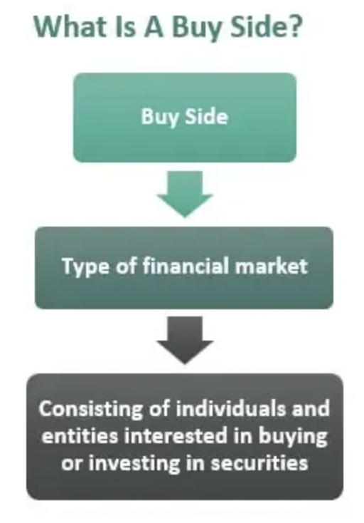

## Table of Contents

## What is the buy side in financial markets?

The buy side in financial markets refers to firms that buy investment securities for their own accounts or for their clients. These firms include mutual funds, pension funds, hedge funds, and other institutional investors. They are called the buy side because they are the ones purchasing securities, as opposed to the sell side, which includes investment banks and broker-dealers that sell these securities.

The main goal of buy-side firms is to generate returns for their investors or clients by making strategic investment decisions. They conduct thorough research and analysis to identify promising investment opportunities. Buy-side firms often have large teams of analysts and portfolio managers who work together to make informed decisions about where to allocate their funds. This focus on buying and managing investments sets them apart from sell-side firms, which focus more on facilitating transactions and providing market liquidity.

## Who are the typical participants on the buy side?

The buy side in financial markets includes different kinds of groups that buy securities for themselves or for people they work for. These groups are called mutual funds, pension funds, hedge funds, and other big investors like insurance companies. They are all about finding good investments to make money for their own accounts or for the people who have given them money to invest.

These buy-side groups have teams of people who do a lot of research to pick the best investments. They look at a lot of information to decide where to put their money. Their main job is to grow the money they manage, which is different from the sell side, where people help sell the investments and make the market work smoothly.

## How does the buy side differ from the sell side?

The buy side and the sell side are two different parts of the financial world. The buy side includes groups like mutual funds, pension funds, and hedge funds. These groups buy investments to make money for themselves or for the people who have given them money to invest. They do a lot of research to pick the best investments and try to grow the money they manage.

The sell side, on the other hand, is made up of investment banks and broker-dealers. These groups help sell investments and make the market work smoothly. They don't usually keep the investments for themselves but help other people buy and sell them. The sell side makes money by charging fees for their services, like helping with trades or giving advice.

So, the main difference is that the buy side focuses on buying and managing investments to grow money, while the sell side focuses on selling investments and helping the market run smoothly. Both parts are important for the financial world to work well.

## What are the main activities conducted by buy-side firms?

Buy-side firms focus on buying investments to make money for themselves or for their clients. They do a lot of research to find the best investments. This includes looking at company reports, market trends, and economic data. Their goal is to pick investments that will grow in value over time. They use this research to make smart choices about where to put their money, aiming to get good returns for their investors.

Another main activity for buy-side firms is managing the investments they have bought. This means they keep an eye on how their investments are doing and make changes when needed. If an investment is not doing well, they might sell it and buy something else that looks more promising. They also need to balance their portfolio to spread out the risk. This ongoing management is important to keep their clients' money growing and safe.

In addition to buying and managing investments, buy-side firms also deal with their clients. They need to communicate with them about how their money is being used and how it's doing. This involves creating reports and sometimes meeting with clients to discuss their investment strategies. Good communication helps build trust and keeps clients happy with the service they are getting.

## What role do buy-side analysts play in investment decisions?

Buy-side analysts are really important for making investment choices. They spend a lot of time looking at different companies, markets, and economic trends. They use this information to figure out which investments might be good to buy. Their job is to give the people who manage the money, called portfolio managers, good advice on what to invest in. By doing this, they help make sure the money they manage grows in a smart way.

These analysts also help keep an eye on the investments once they are bought. They keep checking to see if the investments are still doing well or if something has changed. If an investment isn't doing as well as expected, the analysts will let the portfolio managers know. This helps the managers decide if they should sell that investment and buy something else. In short, buy-side analysts are key in both [picking](/wiki/asset-class-picking) new investments and making sure the current ones are still a good choice.

## How do buy-side firms manage risk?

Buy-side firms manage risk by spreading their money across different types of investments. This is called diversification. By not putting all their money into one thing, they lower the chance that a big loss in one investment will hurt their whole portfolio. They also look at how much risk they are willing to take and set rules for how much they can invest in certain types of securities. This helps them keep their investments safe and balanced.

Another way buy-side firms manage risk is by always watching and checking their investments. They use tools and models to predict how different situations might affect their money. If they see a big risk coming, they might sell some investments or buy others to protect themselves. They also have plans ready for emergencies, so they know what to do if something bad happens suddenly. This careful watching and planning helps them handle risks better.

## What types of investment strategies are commonly used by buy-side firms?

Buy-side firms use many different strategies to make money for themselves or their clients. One common strategy is called value investing. This is when they look for companies that they think are priced lower than they should be. They believe that over time, the price of these companies will go up, and they can sell the stocks for a profit. Another strategy is growth investing, where they focus on companies that are growing fast and might keep growing. They expect these companies to increase in value, even if they have to pay a higher price for the stocks now.

Another strategy is called income investing. Here, buy-side firms look for investments that pay regular income, like dividends from stocks or interest from bonds. This can give their clients a steady stream of money. They also use a strategy called [momentum](/wiki/momentum) investing, where they buy stocks that have been going up in price, hoping the trend will continue. Lastly, some firms use a strategy called [arbitrage](/wiki/arbitrage), where they take advantage of price differences between markets or securities to make a profit. Each of these strategies helps buy-side firms manage their investments and try to grow their clients' money.

## How has technology impacted the operations of buy-side firms?

Technology has changed a lot about how buy-side firms work. They use computers and special software to do their research faster and better. Instead of looking through piles of papers, they can now use tools to analyze lots of information quickly. This helps them find good investments and make smart choices. They also use technology to keep track of their investments and see how they are doing in real-time. This means they can react faster if something changes and make better decisions to manage their money.

Another big change is how they talk to their clients. With technology, they can send reports and updates easily through emails or online platforms. This makes it easier to keep clients informed about their investments. Also, technology has made trading easier and faster. Buy-side firms can use electronic systems to buy and sell investments quickly, which can help them take advantage of opportunities in the market. Overall, technology has made things more efficient and helped buy-side firms do their job better.

## What are the regulatory challenges faced by buy-side firms?

Buy-side firms have to follow a lot of rules set by governments and financial watchdogs. These rules are there to make sure that the firms are honest and fair with their clients. One big challenge is keeping up with all the new rules that keep coming out. These rules can be about how they handle their clients' money, what information they need to share, and how they report their activities. It can be hard for buy-side firms to stay on top of everything and make sure they are following all the rules all the time.

Another challenge is dealing with different rules in different countries. If a buy-side firm works in many places, they have to know and follow the rules for each place. This can be tricky because the rules can be very different from one country to another. It takes a lot of work to make sure they are doing everything right everywhere they operate. Keeping up with these regulations is important to avoid fines and to keep their clients' trust.

## How do buy-side firms interact with sell-side firms?

Buy-side firms and sell-side firms work together in the financial world. Buy-side firms, like mutual funds and pension funds, buy investments to make money for themselves or their clients. They need information and help from sell-side firms, like investment banks and broker-dealers, to do this. Sell-side firms provide research reports, advice, and help with buying and selling investments. They also help with big things like taking a company public or helping a company buy another company. So, buy-side firms often reach out to sell-side firms to get the information and services they need to make smart investment choices.

The relationship between buy-side and sell-side firms is important for both sides. Buy-side firms use the research and services from sell-side firms to find good investments and manage their money better. They might pay for this help or use it for free, depending on the agreement. On the other hand, sell-side firms make money by providing these services to buy-side firms. They charge fees for their research, advice, and help with trading. This partnership helps the financial market work smoothly, with buy-side firms getting the help they need and sell-side firms [earning](/wiki/earning-announcement) money for their services.

## What are the current trends affecting the buy side in financial markets?

One big trend affecting the buy side in financial markets is the use of technology and data. Buy-side firms are using more and more computer programs and special tools to do their research and make investment decisions. These tools help them look at a lot of information quickly and find good investments. They also use technology to keep track of their investments in real-time and make trades faster. This makes their work more efficient and helps them make better choices for their clients.

Another trend is the focus on environmental, social, and governance ([ESG](/wiki/esg-investing)) factors. More and more buy-side firms are looking at how companies treat the environment, their workers, and how they are run when making investment choices. This is because many investors want their money to be used in a way that is good for the world, not just for making money. So, buy-side firms are paying more attention to these factors to meet their clients' needs and stay competitive in the market.

## How can one pursue a career in the buy side of financial markets?

To start a career on the buy side of financial markets, you usually need a strong education background. Many people get a degree in finance, economics, or a related field. After that, getting some experience is important. You might start with internships or entry-level jobs at financial firms. These roles can help you learn about the industry and build skills that are useful for the buy side. Networking is also key. Going to industry events and connecting with people in the field can open doors to job opportunities.

Once you have some experience, you can aim for roles like a buy-side analyst or portfolio manager. These jobs involve a lot of research and analysis to pick good investments. To get these roles, you might need to get certifications like the Chartered Financial Analyst (CFA) designation. This shows that you know a lot about investing and finance. Keep learning and staying up-to-date with market trends, because the buy side is always changing. With hard work and the right skills, you can build a successful career in this part of the financial world.

## References & Further Reading

Explore resources on [algorithmic trading](/wiki/algorithmic-trading) advancements and its impact on financial markets:

- **Books**: A comprehensive resource is "Advances in Financial Machine Learning" by Marcos Lopez de Prado, which offers in-depth insights into the use of machine learning techniques in finance. This book is valuable for understanding how data-driven approaches are transforming trading strategies and improving the decision-making process in investment management.

- **Online Articles and Platforms**: Staying updated with the latest trends and strategies in algorithmic trading is crucial. Online platforms such as Investopedia (www.investopedia.com) provide explanations and articles on various aspects of algorithmic trading, including strategies, tools, and regulatory considerations. Additionally, financial news websites like Bloomberg (www.bloomberg.com) and Reuters (www.reuters.com) offer the latest updates on technological advancements and market impacts.

- **Academic Journals**: Reading academic papers on algorithmic trading can provide insights into cutting-edge research and methodologies. Journals such as the Journal of Financial Economics and the Quantitative Finance journal often publish articles on innovative algorithmic trading techniques and analyses of their effectiveness in today's markets.

- **Online Courses and Webinars**: Platforms like Coursera and edX offer courses on algorithmic trading and financial markets. For instance, the "Machine Learning for Trading" course on Coursera provides practical knowledge on implementing trading algorithms using machine learning.

- **Professional Conferences and Workshops**: Attending conferences and workshops focused on financial technology and trading, such as the Quantitative Finance Conference, can provide networking opportunities and firsthand knowledge from industry leaders and researchers. These events often feature discussions on the latest technologies and regulatory changes affecting algorithmic trading.

By engaging with these resources, investors and professionals can enhance their understanding of algorithmic trading, allowing them to make informed decisions and effectively leverage technology in financial markets.

