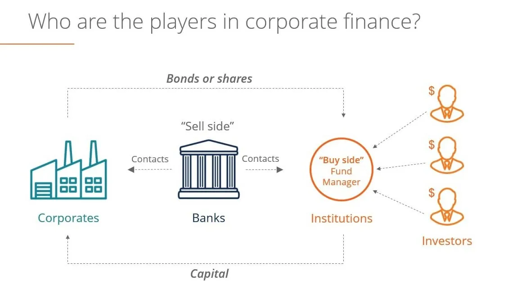

## Table of Contents

## What is buy side investing?

Buy side investing refers to the activities of investment firms, such as mutual funds, pension funds, and hedge funds, that buy securities for their own accounts or for their clients. These firms aim to generate returns by investing in stocks, bonds, and other financial instruments. The buy side is different from the sell side, which includes investment banks and brokerages that help companies sell their securities to investors.

In buy side investing, the focus is on finding the best investment opportunities that match the firm's investment strategy and goals. This involves a lot of research and analysis to pick the right securities at the right price. Buy side investors often work closely with sell side analysts and brokers to get the information and insights they need to make smart investment decisions. The ultimate goal is to build a portfolio that will grow in value over time and provide good returns for the firm or its clients.

## How does buy side investing differ from sell side investing?

Buy side investing and sell side investing are two sides of the financial world. Buy side investors are the ones who buy securities for their own accounts or for their clients. They work for firms like mutual funds, pension funds, and hedge funds. Their main job is to find good investments that will make money for themselves or their clients. They spend a lot of time researching and analyzing different stocks, bonds, and other financial products to decide what to buy.

On the other hand, sell side investors work for investment banks and brokerages. Their job is to help companies sell their securities to investors. They do this by providing research and advice to buy side investors and by helping to set prices for the securities. While buy side investors focus on building a portfolio that will grow in value, sell side investors focus on helping companies raise money by selling their stocks or bonds. In short, buy side investors are the buyers, and sell side investors are the sellers in the financial market.

## What are some common examples of buy side investments?

Buy side investments include a wide range of financial products that firms buy to make money for themselves or their clients. Common examples are stocks, which are shares in a company that can go up or down in value. Another example is bonds, which are loans to a company or government that pay back with interest over time. Mutual funds are also popular, where a firm pools money from many investors to buy a mix of stocks and bonds. 

In addition to these, buy side investors might also put money into real estate, where they buy properties to rent out or sell later at a higher price. They might invest in commodities like gold or oil, hoping their value will increase. Some buy side firms even invest in private companies, called private equity, where they buy part or all of a business to help it grow and then sell it for a profit. Each of these investments has its own risks and rewards, and buy side investors choose them based on their goals and the amount of risk they are willing to take.

## Who typically engages in buy side investing?

Buy side investing is mainly done by big investment firms like mutual funds, pension funds, and hedge funds. These firms use their own money or money from clients to buy different kinds of investments. Their goal is to make money by choosing the right stocks, bonds, or other financial products. For example, a mutual fund might buy shares in many different companies to spread out the risk and try to make a good return for the people who invest in the fund.

People who work at these firms, like portfolio managers and analysts, spend a lot of time researching and [picking](/wiki/asset-class-picking) the best investments. They look at things like how much a company is growing, how much money it makes, and what the future might hold for the industry it's in. They also talk to people on the sell side, like investment banks, to get more information and help them make smart choices. By doing all this work, they try to build a strong portfolio that will make money over time.

## What are the key advantages of buy side investing for investors?

Buy side investing has several key advantages for investors. One big advantage is that it allows investors to get professional help in picking their investments. Big firms like mutual funds and hedge funds have teams of experts who spend all their time researching and analyzing different stocks, bonds, and other financial products. This means that when you invest with them, you're getting the benefit of all that work and expertise, which can lead to better investment choices and potentially higher returns.

Another advantage is that buy side investing can help spread out risk. When you invest in a mutual fund or a pension fund, your money is mixed with money from other investors to buy a wide range of investments. This diversification means that if one investment does poorly, it won't hurt your whole portfolio as much. It's like not putting all your eggs in one basket. By spreading out the risk, buy side investing can make your investments safer and more stable over time.

## How can buy side investing help in portfolio diversification?

Buy side investing helps in portfolio diversification by allowing investors to spread their money across a wide range of different investments. When you invest with a buy side firm like a mutual fund or a pension fund, your money is combined with money from other investors to buy many different kinds of stocks, bonds, and other financial products. This means that if one investment doesn't do well, it won't hurt your whole portfolio too much because the other investments can help balance it out. It's like not putting all your eggs in one basket; by spreading your money around, you lower the risk that one bad investment will ruin everything.

This kind of diversification is especially helpful because buy side firms have experts who know how to pick a good mix of investments. These professionals spend a lot of time researching and analyzing different companies and industries to find the best opportunities. They can choose investments from different sectors, like technology, healthcare, and energy, and from different parts of the world. This way, even if one sector or region has a tough time, your portfolio can still do well because it's not relying on just one thing. By using the expertise of buy side firms, investors can build a more balanced and stable portfolio that can weather ups and downs in the market.

## What role does research play in buy side investing?

Research is super important in buy side investing. It's like the backbone of what these firms do. When you're trying to make money by buying stocks, bonds, or other stuff, you need to know a lot about what you're buying. That's where research comes in. Buy side firms have teams of people who spend all their time looking at different companies, figuring out how they're doing, and guessing what might happen next. They look at things like how much money a company makes, how fast it's growing, and what's going on in the world that might affect it. All this research helps them pick the best investments and avoid the bad ones.

This research also helps buy side investors make smart choices about when to buy and sell. By knowing a lot about a company, they can tell if its stock is a good deal or too expensive. They can also see if something big is about to happen that might make the stock go up or down. This kind of deep understanding lets them build a strong portfolio that can make money over time. So, without good research, buy side investing wouldn't work nearly as well. It's all about knowing as much as you can so you can make the best choices with your money.

## What are the potential risks associated with buy side investing?

Buy side investing comes with some risks that investors need to think about. One big risk is that the value of the investments can go down. Even with a lot of research, it's hard to predict what will happen in the future. If a company doesn't do as well as expected, or if the whole market goes down, the stocks or bonds you bought might lose value. This can be tough, especially if you need to sell your investments when they're worth less than what you paid for them.

Another risk is that buy side firms might not always make the best choices. Even with experts doing the research, they can still make mistakes. They might buy something that turns out to be a bad investment, or they might miss out on a good opportunity. Plus, some firms charge fees for managing your money, and if those fees are high, they can eat into your returns. So, it's important to understand that even with professional help, there's always some risk involved in buy side investing.

## How does the regulatory environment impact buy side investing?

The regulatory environment can have a big impact on buy side investing. Rules and laws set by the government can change how buy side firms do their work. For example, there might be rules about what kinds of investments they can make, how much risk they can take, and how they need to report what they're doing. These rules are meant to protect investors and keep the financial markets fair and safe. But they can also make it harder for buy side firms to do some things they might want to do. They have to spend time and money making sure they follow all the rules, which can slow them down and add to their costs.

On the other hand, a strong regulatory environment can also be good for buy side investing. When there are clear rules in place, it can make investors feel more confident about putting their money into these firms. They know that the government is watching to make sure everything is done right. This can help attract more money into the market, which can lead to more opportunities for buy side firms to find good investments. So, while regulations can be a challenge, they can also help create a safer and more stable environment for buy side investing.

## What advanced strategies can be employed in buy side investing to maximize returns?

One advanced strategy that buy side investors can use to maximize returns is called "hedging." This means they buy and sell different investments to protect their money from big losses. For example, if they think the stock market might go down, they might buy something called a "put option" that will make money if the market does go down. This way, even if their stocks lose value, the put option can help make up for it. Another way to hedge is by using something called "short selling," where they borrow a stock and sell it, hoping to buy it back later at a lower price. These strategies can be tricky and need a lot of research and skill, but they can help protect and even grow their money when the market is unpredictable.

Another strategy is "sector rotation," where buy side investors move their money from one part of the market to another based on what's doing well at the time. For example, if technology stocks are doing great, they might put more money into tech companies. But if they think the economy is going to slow down, they might switch some of their money to more stable sectors like utilities or consumer staples. This way, they can try to stay ahead of market changes and make the most of different opportunities. It takes a lot of watching and understanding of what's going on in the economy, but it can help them earn more money by being in the right place at the right time.

A third strategy is "quantitative investing," which uses math and computers to pick investments. Buy side investors might use special computer programs to look at a lot of data about different companies and find patterns that show which ones are likely to do well. These programs can help them find good investments faster and more accurately than just looking at the data themselves. It's a bit like using a super smart robot to help with their work. This can be really helpful, but it also means they need to know a lot about math and computers, and they need to keep updating their programs to make sure they're still working well.

## How do buy side investors typically source and evaluate investment opportunities?

Buy side investors look for investment opportunities in many ways. They often start by reading news and reports about different companies and industries. They might also talk to people who work in those industries to get more information. Sometimes, they use special computer programs that look at a lot of data to find good investments. They also get ideas from sell side analysts, who work at banks and brokerages and send them reports about different stocks and bonds. By using all these sources, buy side investors can find out about a lot of different investments and decide which ones might be good to buy.

Once they find an investment opportunity, buy side investors need to evaluate it carefully. They do this by doing a lot of research. They look at things like how much money the company makes, how fast it's growing, and what risks it might face. They also think about the price of the investment and whether it's a good deal. To help with this, they might use special tools and models that help them guess what might happen in the future. By doing all this work, they can decide if the investment is worth buying and how much money they should put into it. This careful evaluation helps them make smart choices and try to earn good returns for themselves or their clients.

## What technological tools and platforms are essential for effective buy side investing?

Buy side investors use a lot of different technological tools and platforms to help them do their job well. One important tool is a "bloomberg terminal," which is like a super computer that gives them a lot of information about stocks, bonds, and other investments. It helps them see what's happening in the market right now and what might happen next. They also use special software called "portfolio management systems" that help them keep track of all their investments and see how they're doing. These systems can show them if they need to buy more of something or sell something to make their portfolio better.

Another key tool is "data analytics platforms." These platforms help buy side investors look at a lot of data to find patterns and make smart guesses about what might happen in the future. They use these platforms to see which companies are doing well and which ones might be good to invest in. "Trading platforms" are also important because they help buy side investors buy and sell investments quickly and easily. These platforms can connect them to other people who want to buy and sell the same things, making it easier to get the best price. All these tools together help buy side investors make good choices and try to earn more money for themselves or their clients.

## References & Further Reading

[1]: ["Advances in Financial Machine Learning"](https://www.amazon.com/Advances-Financial-Machine-Learning-Marcos/dp/1119482089) by Marcos Lopez de Prado

[2]: Bergstra, J., Bardenet, R., Bengio, Y., & Kégl, B. (2011). ["Algorithms for Hyper-Parameter Optimization."](https://dl.acm.org/doi/10.5555/2986459.2986743) Advances in Neural Information Processing Systems 24.

[3]: ["Quantitative Trading: How to Build Your Own Algorithmic Trading Business"](https://github.com/LucindaYa/quant-resources/blob/master/Quantitative%20Trading%20How%20to%20Build%20Your%20Own%20Algorithmic%20Trading%20Business.pdf) by Ernest P. Chan

[4]: ["Evidence-Based Technical Analysis: Applying the Scientific Method and Statistical Inference to Trading Signals"](https://www.amazon.com/Evidence-Based-Technical-Analysis-Scientific-Statistical/dp/0470008741) by David Aronson

[5]: ["Machine Learning for Algorithmic Trading"](https://github.com/stefan-jansen/machine-learning-for-trading) by Stefan Jansen