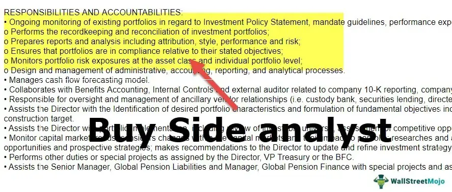

In finance, the continuous evolution of investment strategies is driven by technological advancements. Two pivotal elements in this transformation are buy-side investing and algorithmic trading, both of which play crucial roles in enhancing portfolio management and optimizing investment outcomes.

Buy-side investing refers to the activities of institutional investors such as mutual funds, hedge funds, and pension funds. These entities purchase securities and assets to manage money on behalf of their clients, focusing on maximizing returns and achieving strategic financial objectives. The buy-side operates distinctively from the sell-side, which comprises entities such as investment banks that facilitate the sale of securities.



Algorithmic trading, on the other hand, involves the use of computer algorithms to execute trades based on predetermined criteria. This approach leverages high-speed data analysis and execution, offering benefits like speed, precision, and the reduction of human error in trading decisions. By enhancing the efficiency of trade executions, algorithmic trading has become an integral part of modern financial markets, spanning across stocks, forex, and cryptocurrency domains.

This article explores various investment strategies and provides insights into the benefits of buy-side investing and the technological advancements presented by algorithmic trading. By understanding these concepts, investors can harness technology to optimize their portfolios and make informed decisions in a competitive market.

## Table of Contents

## Understanding Investment Strategies

Investment strategies are vital for achieving a balanced and robust investment portfolio, catering to various investor preferences based on risk tolerance, investment horizon, and financial objectives. Each strategy comes with its unique characteristics and can be tailored to suit individual investor needs.

Growth investing targets capital appreciation by investing in companies expected to grow at an above-average rate compared to other companies in the market. This strategy often involves focusing on younger companies or sectors with high potential for earnings growth. Investors engaging in growth investing typically look for indicators such as revenue growth, high profit margins, and market expansion potential. The goal is to benefit from the increase in the stock's value over time, although this approach can entail higher risk due to market volatility and the speculative nature of predicting growth trends.

Value investing, in contrast, involves identifying and investing in undervalued companies that are deemed to be trading for less than their intrinsic value. This strategy is based on the principle that the market sometimes misprices stocks in the short term, providing opportunities to purchase them at a discount. Value investors often use metrics such as the price-to-earnings (P/E) ratio, price-to-book (P/B) ratio, and dividend yield to assess the potential investment. By buying such stocks, the expectation is that the market will eventually recognize the company's true value, leading to price appreciation and profit.

Income investing seeks to generate a steady income stream from investments, primarily through dividends or interest payments. This strategy often involves investing in dividend-paying stocks, bonds, and real estate investment trusts (REITs). The focus is on stability and regular income rather than capital gains. Income investors are typically more conservative and prioritize risk management over aggressive growth, making this a popular choice for those nearing retirement or seeking to supplement their income.

Dollar-cost averaging (DCA) is an investment technique that involves regularly investing a fixed amount of money into a particular asset, irrespective of its price. This approach helps mitigate the impact of market [volatility](/wiki/volatility-trading-strategies), as investors purchase more shares when prices are low and fewer shares when prices are high. Over time, dollar-cost averaging can result in a lower average cost per share. DCA is particularly beneficial for investors who prefer a disciplined approach and do not want to time the market.

In practice, investors may combine multiple strategies to align with their overall investment goals, creating a diversified portfolio that balances potential risks and rewards. Understanding these strategies and their application is crucial for investors aiming to achieve long-term financial success.

## Exploring the Buy-Side in Investing

The buy-side refers to a segment within the financial market consisting of firms and institutions focused on purchasing securities and assets for portfolio management and investment purposes. These entities include mutual funds, hedge funds, pension funds, and insurance companies, among others. Their primary objective is to maximize returns for their clients through strategic investing.

Mutual funds are one of the most recognizable buy-side entities. They pool funds from multiple investors to purchase a diversified portfolio of stocks, bonds, or other securities. The capital is actively managed by portfolio managers, who use a combination of research, analysis, and market insights to make informed investment decisions. The key advantage of mutual funds lies in their ability to offer individual investors access to a diversified portfolio with relative ease and lower investment thresholds.

Hedge funds, another significant player on the buy-side, are investment partnerships that employ various aggressive strategies to achieve high returns. Unlike mutual funds, hedge funds are less constrained by regulatory requirements, allowing for the use of leverage, derivatives, and short-selling. This flexibility enables hedge funds to generate returns regardless of market conditions, although they are typically accessible only to accredited or institutional investors due to their higher risk profiles.

Pension funds represent yet another critical facet of buy-side investing. These funds manage retirement savings for employees, ensuring they have adequate income post-retirement. Pension fund managers focus on long-term stability and growth, balancing the risk and return profiles of their portfolios to secure the financial futures of their beneficiaries.

Buy-side institutions employ a range of analysts and strategists to optimize investment outcomes. Analysts conduct in-depth research on potential investment opportunities, evaluating financial statements, market trends, and economic indicators. Strategists develop and implement plans to achieve specific investment objectives, often focusing on asset allocation, risk management, and performance monitoring. This comprehensive approach allows buy-side entities to make well-informed decisions, ultimately maximizing returns for their clients while managing associated risks effectively.

## Benefits of Buy-Side Investing

Buy-side investing offers several notable advantages to institutions such as mutual funds, hedge funds, and pension funds. One significant benefit is the ability to leverage large-lot transactions to achieve reduced trading costs. Large orders often allow buy-side entities to negotiate better terms with brokers, thus minimizing the overall cost per transaction. This efficiency in trading can lead to higher net returns for investors.

Moreover, buy-side institutions have access to in-depth financial research and insights, which is crucial for making informed investment decisions. They often employ a team of analysts and strategists dedicated to uncovering opportunities and assessing market conditions. This extensive research capability provides buy-side investors with a competitive edge in identifying undervalued assets and capitalizing on market trends.

Portfolio diversification is another advantage inherent to buy-side investing. By investing in a broad array of assets across various sectors and geographies, buy-side institutions can mitigate risk and enhance potential returns. Diversification reduces the impact of any single asset's poor performance on the overall portfolio, thereby stabilizing returns over the long term.

Finally, buy-side investing supports long-term strategic planning. Institutions can align their investment strategies with long-term goals, such as retirement payouts for pension funds or endowment growth for educational institutions. This strategic approach focuses on sustaining growth and value creation over extended periods, accommodating the financial objectives of the institutions and their stakeholders.

 to Algorithmic Trading

Algorithmic trading uses sophisticated computer algorithms to automate and streamline trading processes. By employing pre-set rules and conditions, these algorithms can analyze vast amounts of market data and execute trades with precision and speed that surpasses human capabilities. A key characteristic of [algorithmic trading](/wiki/algorithmic-trading) is its ability to eliminate human emotions, such as fear and greed, which can often lead to irrational trading decisions. This results in more consistent and objective trading outcomes.

The efficiency of algorithmic trading has made it a popular choice across various financial markets, including stocks, foreign exchange ([forex](/wiki/forex-system)), and cryptocurrencies. In the stock market, algorithms might be used to exploit technical indicators, market trends, or even news sentiment to make buy or sell decisions. The forex market benefits from algorithmic trading through strategies like statistical [arbitrage](/wiki/arbitrage), which takes advantage of price inefficiencies between currency pairs. Similarly, in the [cryptocurrency](/wiki/cryptocurrency) market, algorithms are applied due to the high volatility and the 24/7 nature of trading, making it essential for traders to react to market movements without delay.

Algorithmic trading can be categorized into different strategies, such as high-frequency trading ([HFT](/wiki/high-frequency-trading-strategies)), arbitrage, market-making, and trend-following. High-frequency trading is particularly noteworthy for its focus on speed, as it involves executing a large number of orders at extremely fast rates to capture small price differences. This type of trading demands cutting-edge technology and infrastructure to be effective, often occurring in milliseconds.

Despite its advantages, algorithmic trading presents challenges. Ensuring that algorithms function as intended requires rigorous [backtesting](/wiki/backtesting) and real-time monitoring to prevent unforeseen losses due to technical glitches or market anomalies. Additionally, over-optimization of algorithms can lead to overfitting, where the system becomes too tailored to historical data, thus not performing well in future or unseen market conditions.

In conclusion, algorithmic trading represents a significant advancement in trading methodologies, capitalizing on technology to enhance trading efficiency and accuracy across diverse markets. Traders who harness this technology effectively can gain a competitive edge and may achieve superior financial performance.

## Advantages and Challenges of Algo Trading

Algorithmic trading, often referred to as algo trading, provides a range of advantages that can significantly enhance trading efficiencies and outcomes. One primary benefit is speed. Algorithms can execute trades at a fraction of a second, far surpassing human capabilities. This rapid execution is crucial in markets where prices can change within milliseconds. Moreover, these algorithms improve precision by minimizing manual intervention, thereby reducing errors associated with human trading activities.

Another critical advantage of algorithmic trading is its capacity to process and analyze vast volumes of data quickly. With advancements in technology, algorithms can assimilate diverse datasets, from historical price movements to real-time market news, thus enabling informed trading decisions. This ability is particularly beneficial in high-frequency trading environments, where success often hinges on processing information faster than competitors.

While the benefits are substantial, algorithmic trading also presents several challenges. Technical failures can pose significant risks. An error in the code, network failures, or unexpected market conditions can lead to substantial financial losses. Mitigating these risks requires robust systems that are rigorously tested under various scenarios to ensure reliability.

Overfitting is another common challenge in algorithmic trading. This occurs when an algorithm is too closely tailored to historical data, capturing noise instead of the underlying market structure. Such algorithms may perform well on past data but fail to adapt to new market conditions. To combat overfitting, it's essential to incorporate regular model validation and out-of-sample testing into the development process.

Furthermore, the high infrastructure costs associated with algorithmic trading can be prohibitive for smaller firms. Deploying and maintaining sophisticated trading systems demand substantial investments in hardware, software, and continuous data feeds. These systems also require ongoing updates to stay compliant with regulatory standards and to incorporate the latest market algorithms.

Proficient implementation of algorithmic systems necessitates advanced technology and data analysis techniques. Developers must employ cutting-edge programming languages and frameworks, such as Python, to construct flexible and resilient algorithms. Below is a simple Python snippet demonstrating a basic moving average crossover strategy, a popular algorithmic trading approach:

```python
import pandas as pd

# Assume 'data' is a DataFrame containing the historical stock prices
data['Short_MA'] = data['Close'].rolling(window=40).mean()
data['Long_MA'] = data['Close'].rolling(window=100).mean()

# Generate signals
data['Signal'] = 0
data.loc[data['Short_MA'] > data['Long_MA'], 'Signal'] = 1
data.loc[data['Short_MA'] < data['Long_MA'], 'Signal'] = -1

# Determine positions
data['Position'] = data['Signal'].shift()
```

In conclusion, while algorithmic trading offers significant advantages like speed and precision, it also poses challenges such as technical risks and high costs. Successful algorithmic trading hinges on sophisticated system design, comprehensive testing, and adaptive strategy development. Prioritizing these factors can help mitigate risks and capitalize on the benefits of algo trading.

## Integrating Investment Strategies with Technology

Modern investors are increasingly integrating algorithmic mechanisms into their investment strategies to enhance decision-making. This integration leverages advanced computational tools and real-time data analysis to inform and optimize investment methodologies. By automating repetitive processes and improving the speed and accuracy of data processing, algorithmic techniques offer a significant advantage over traditional investment decision-making methods.

One key aspect of integrating technology into investment strategies is the use of statistical models and [machine learning](/wiki/machine-learning) algorithms. These models are capable of processing vast amounts of historical and real-time data to identify patterns, trends, and correlations that may not be apparent through manual analysis. For example, regression models can be used to predict asset price movements based on historical data, while clustering algorithms may help in segmenting investment portfolios based on risk-return profiles.

```python
import numpy as np
from sklearn.linear_model import LinearRegression

# Example of using linear regression to predict future prices
# Sample historical prices
prices = np.array([100, 102, 104, 108, 110]).reshape(-1, 1)
# Future price point indices
indices = np.array([1, 2, 3, 4, 5]).reshape(-1, 1)

model = LinearRegression().fit(indices, prices)

# Predict the price for the next time point
predicted_price = model.predict(np.array([[6]]))
print(f"Predicted price for the next time point: {predicted_price[0][0]}")
```

In particular, buy-side firms have effectively harnessed these technological advancements to manage and rebalance large portfolios. Algorithmic strategies enable these firms to systematically execute trades in response to market conditions, manage exposures to different asset classes, and ensure alignment with investment mandates. This capability is crucial for institutional investors, such as mutual funds and hedge funds, that deal with substantial asset volumes and require precise execution to minimize market impact and transaction costs.

Moreover, real-time data feeds and sophisticated analytics platforms provide investors with up-to-date market intelligence, allowing them to quickly respond to market developments. High-frequency trading (HFT), a form of algorithmic trading, exemplifies this with its reliance on millisecond-level execution speeds to capitalize on temporary market inefficiencies.

The integration of technology into investment strategies represents a significant shift towards data-driven decision making. It underscores the importance of technology in navigating the complexities of modern financial markets, where the ability to process and act upon information swiftly and accurately can be a defining [factor](/wiki/factor-investing) in achieving superior investment outcomes.

## Conclusion

Investment strategies, encompassing both traditional and technology-driven approaches, provide investors with the tools needed to optimize returns and effectively manage risks. In the evolving landscape of investment management, buy-side investing and algorithmic trading have emerged as prominent methodologies. Buy-side investing enables institutions such as mutual funds, hedge funds, and pension funds to capitalize on large-lot transactions, gain access to extensive financial research, and implement strategic portfolio diversification. On the other hand, algorithmic trading offers the advantages of speed, precision, and the capacity to process vast data volumes, allowing for rapid and efficient trade execution in various markets including stocks, forex, and cryptocurrencies.

Educating oneself about these investment strategies is crucial for making informed and strategic decisions in today's competitive market. By understanding the dynamics of buy-side investing and harnessing the power of algorithmic trading, investors can position themselves advantageously, equipped to navigate the complexities of modern financial markets and potentially enhance their investment outcomes. Whether opting for traditional methods or embracing technological advancements, the key to successful investment management lies in the continuous acquisition of knowledge and the strategic application of insights gained.

## References & Further Reading

[1]: ["Advances in Financial Machine Learning"](https://www.amazon.com/Advances-Financial-Machine-Learning-Marcos/dp/1119482089) by Marcos Lopez de Prado

[2]: Bergstra, J., Bardenet, R., Bengio, Y., & Kégl, B. (2011). ["Algorithms for Hyper-Parameter Optimization."](https://dl.acm.org/doi/10.5555/2986459.2986743) Advances in Neural Information Processing Systems 24.

[3]: ["Quantitative Trading: How to Build Your Own Algorithmic Trading Business"](https://github.com/LucindaYa/quant-resources/blob/master/Quantitative%20Trading%20How%20to%20Build%20Your%20Own%20Algorithmic%20Trading%20Business.pdf) by Ernest P. Chan

[4]: ["Evidence-Based Technical Analysis: Applying the Scientific Method and Statistical Inference to Trading Signals"](https://www.amazon.com/Evidence-Based-Technical-Analysis-Scientific-Statistical/dp/0470008741) by David Aronson

[5]: ["Machine Learning for Algorithmic Trading"](https://github.com/stefan-jansen/machine-learning-for-trading) by Stefan Jansen