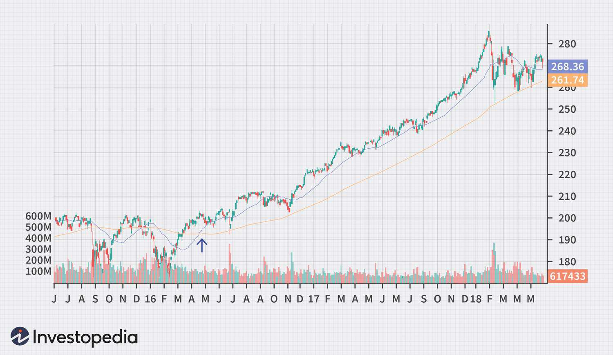

In today's fast-paced financial markets, identifying the optimal time to purchase or sell an asset presents a significant challenge to investors. The ever-changing nature of markets is driven by numerous factors, including macroeconomic trends, geopolitical events, and technological advancements. To navigate this complexity, investors rely on a suite of tools and indicators designed to assist in making well-informed decisions.

Among these tools, buy signals and algorithmic trading have emerged as pivotal techniques for traders seeking to enhance the efficiency and profitability of their strategies. Buy signals function as critical indicators, recommending when it might be advantageous to invest in a particular asset. These signals often stem from a combination of technical indicators, market sentiment analyses, and fundamental evaluations, thereby providing a comprehensive impetus for trading decisions.



Algorithmic trading, on the other hand, employs advanced algorithms to execute trades at speeds and frequencies that would be impossible for human traders. This method dramatically shifts the landscape of investing, as it allows for automated decision-making processes that can eliminate emotional biases and enhance consistency across trades. The integration of buy signals into algorithmic trading systems merges analytical precision with technological efficiency, forming a powerful approach that can potentially capture new market opportunities rapidly.

This article aims to explore the intricate nature of investing, emphasizing the importance of buy signals and the transformative influence of algorithmic trading in modern financial markets. We will also examine some leading investment indicators, such as moving averages and relative strength indices, and how they seamlessly integrate into algorithmic trading strategies to refine and optimize trading decisions.

As financial technologies evolve, understanding these tools becomes paramount for anyone involved in trading, from individual investors to institutional fund managers. This exploration aims to equip readers with the necessary insights to navigate and capitalize on the complexities inherent in today's dynamic market environment.

## Table of Contents

## What Is a Buy Signal?

A buy signal is a specific condition or a set of conditions that indicates the most favorable time to purchase an asset or security. These signals are primarily derived from three main sources: technical indicators, chart patterns, and [fundamental analysis](/wiki/fundamental-analysis). Each source offers distinct insights that aid traders in making informed decisions.

**Technical Indicators:** These are mathematical calculations based on the price, volume, or open interest of a security. They forecast future price movements and help identify buying opportunities. Common technical indicators that generate buy signals include moving averages, Relative Strength Index (RSI), and MACD (Moving Average Convergence Divergence). For example, a simple moving average crossover, where a short-term moving average crosses above a long-term moving average, is often considered a buy signal. The corresponding Python code to calculate a simple moving average crossover might look like this:

```python
import pandas as pd

# Assume df is a DataFrame with 'Close' price column
short_window = 40
long_window = 100

# Calculate short and long moving averages
df['Short_MA'] = df['Close'].rolling(window=short_window, min_periods=1).mean()
df['Long_MA'] = df['Close'].rolling(window=long_window, min_periods=1).mean()

# Generate buy signal
df['Buy_Signal'] = (df['Short_MA'] > df['Long_MA']).shift(1)
```

**Chart Patterns:** These are visual signals observed directly on price charts. Patterns such as head and shoulders, cup and handle, or double bottom can indicate bullish trends leading to buy signals. Investors may look for confirming signals after these patterns to initiate a buy.

**Fundamental Analysis:** This involves evaluating an asset's intrinsic value by examining related economic, financial, and other qualitative and quantitative factors. A positive shift in these fundamentals, such as increased earnings growth or favorable economic conditions, may trigger a buy signal.

Traders use buy signals to remove emotional biases that can cloud judgment, thus streamlining their decision-making processes. By relying on predefined criteria, buy signals support automation, enhancing efficiency in both short-term trading, such as [day trading](/wiki/day-trading-spy), and long-term investment strategies. Understanding and accurately interpreting these signals is essential for any market participant aiming to optimize their trading performance.

## Popular Investment Indicators

Investors and traders rely on various investment indicators to make informed buying decisions. Among the most widely used are moving averages, the Relative Strength Index (RSI), and candlestick patterns. Each of these tools provides insights into market trends, helping traders identify potential buy signals and turning points in asset prices.

Moving averages are a staple in technical analysis, providing a smoothed representation of an asset's price over a specified period. They help investors discern the direction of market trends by mitigating the impact of short-term fluctuations. Two commonly used types of moving averages are the Simple Moving Average (SMA) and the Exponential Moving Average (EMA). The SMA calculates the average closing price over a set number of periods, while the EMA gives greater weight to more recent prices, making it more responsive to new information. The moving average crossover is a popular signal in which a short-term moving average crosses above a long-term moving average, indicating a potential buying opportunity.

The Relative Strength Index (RSI) is a [momentum](/wiki/momentum) oscillator that quantifies the speed and change of price movements. Developed by J. Welles Wilder, the RSI ranges from 0 to 100 and is typically used to identify overbought or oversold conditions in a security. An RSI reading above 70 often suggests that a security might be overbought, potentially signaling a price pullback, while an RSI below 30 indicates a possible oversold condition and a potential buying opportunity. Traders use RSI to gauge the strength of a trend and to confirm other buy signals.

Candlestick patterns offer a visual representation of price movements within a specific time frame. These patterns, which originated from Japanese rice trading, play a crucial role in technical analysis. They provide insights into market sentiment and can signal potential reversals or continuations in trends. Common candlestick patterns include doji, engulfing patterns, and hammers. Each pattern has distinct characteristics that, when combined with other indicators, can help traders anticipate future price movements.

Volume and price [volatility](/wiki/volatility-trading-strategies) are additional components often analyzed to assess potential buy signals. Trading [volume](/wiki/volume-trading-strategy) reflects the number of shares or contracts traded in a security or market during a given period. Higher volume often indicates stronger conviction behind a price movement, reinforcing the validity of buy signals. Price volatility, a measure of the rate at which the price of a security increases or decreases, provides insights into the stability of a security's price movement and can influence the risk-reward ratio of a potential trade.

These indicators, when combined, form a robust framework that assists traders in navigating financial markets. By identifying market trends and potential turning points, these tools help traders optimize their entry and [exit](/wiki/exit-strategy) strategies, ultimately contributing to more informed and strategic investment decisions.

## Algo Trading: An Overview

Algorithmic trading, commonly referred to as algo trading, employs predefined sets of instructions or algorithms to [carry](/wiki/carry-trading) out trades at speeds and frequencies that a human trader cannot match. This technique capitalizes on the use of advanced mathematical models and high-speed trading systems to efficiently execute trades. The sophistication of these algorithms allows algo trading to operate across various financial markets, including foreign exchange ([forex](/wiki/forex-system)), stocks, and cryptocurrencies, where rapid execution is often critical.

Algo trading can be particularly advantageous in high-frequency trading ([HFT](/wiki/high-frequency-trading-strategies)). In HFT, traders engage in transactions that occur in microseconds, necessitating the use of algorithms that can respond faster than any human trader. These algorithms are designed to make decisions based on a set of parameters such as timing, price, or even quantity, allowing traders to tap into fleeting opportunities presented by market fluctuations.

A distinctive feature of [algorithmic trading](/wiki/algorithmic-trading) is its ability to process large volumes of data in real time. Utilizing algorithms, traders can efficiently sift through complex datasets to identify profitable trade opportunities. This capability is instrumental in markets that are data-intensive and require immediate decision-making, given their volatile and dynamic nature. For instance, in the stock market, algorithms analyze historical price data and current market conditions to predict future movements, enabling traders to buy or sell securities almost instantaneously.

From a technical perspective, algo trading involves the development and implementation of algorithms that follow a specific logic or trading strategy. For example, a simple algorithm might be programmed to buy a stock when its 50-day moving average surpasses its 200-day moving average, a strategy often referred to as a "moving average crossover". More complex strategies might take into account multiple indicators and adapt dynamically to market conditions.

Modern algorithmic trading platforms often incorporate [machine learning](/wiki/machine-learning) and [artificial intelligence](/wiki/ai-artificial-intelligence) to enhance the decision-making process. These systems can learn from past trades and adjust their parameters to improve future performance, thereby offering an edge to traders who employ them effectively. Furthermore, programming languages like Python are frequently used to develop and test trading algorithms due to their robust libraries and frameworks designed for data analysis and financial computations.

Here is a simple example of a Python function using the `pandas` library to implement a moving average crossover strategy:

```python
import pandas as pd

def moving_average_crossover(data, short_window=50, long_window=200):
    signals = pd.DataFrame(index=data.index)
    signals['price'] = data['Close']
    signals['short_ma'] = data['Close'].rolling(window=short_window, min_periods=1).mean()
    signals['long_ma'] = data['Close'].rolling(window=long_window, min_periods=1).mean()
    signals['signal'] = 0.0
    signals['signal'][short_window:] = \
        np.where(signals['short_ma'][short_window:] > signals['long_ma'][short_window:], 1.0, 0.0)
    signals['positions'] = signals['signal'].diff()

    return signals
```

This straightforward algorithm calculates short-term and long-term moving averages and generates buy and sell signals based on their crossover points. Such automation enables traders to execute predefined strategies consistently, free from emotional or psychological interference.

In conclusion, algorithmic trading has transformed the landscape of financial markets. By leveraging sophisticated algorithms and high-speed computing, traders gain the capacity to rapidly capitalize on opportunities, augmenting their potential for profitability in highly competitive and fast-paced trading environments.

## Integrating Buy Signals into Algo Trading

Buy signals can be integrated into algorithmic trading systems to enhance the automation and efficiency of investment processes. The integration begins with the selection and programming of technical indicators, which serve as the foundation for buy and sell strategies within these systems. One commonly used indicator is the moving average crossover. In a typical scenario, a buy signal is generated when a short-term moving average crosses above a long-term moving average, suggesting a potential upward price movement.

To illustrate, consider two moving averages: a short-term moving average (SMA_short) and a long-term moving average (SMA_long). When implementing this in Python, the logic might look as follows:

```python
import numpy as np
import pandas as pd

def generate_signals(prices, short_window=40, long_window=100):
    signals = pd.DataFrame(index=prices.index)
    signals['price'] = prices
    signals['short_mavg'] = prices.rolling(window=short_window, min_periods=1, center=False).mean()
    signals['long_mavg'] = prices.rolling(window=long_window, min_periods=1, center=False).mean()
    signals['signal'] = 0.0
    signals['signal'][short_window:] = np.where(signals['short_mavg'][short_window:] > signals['long_mavg'][short_window:], 1.0, 0.0)  
    signals['positions'] = signals['signal'].diff()
    return signals
```

This code calculates the short and long-term moving averages of a given price series and then generates buy signals where the short-term average surpasses the long-term average.

The automation of trading decisions based on such indicators serves to reduce human error and enhances execution speed. This is particularly crucial in fast-paced markets where timing can significantly influence profitability. By automating the recognition and reaction to buy signals, traders can ensure that opportunities are captured without delay.

Nevertheless, successful implementation of buy signals into algorithmic trading requires rigorous testing and optimization. This involves [backtesting](/wiki/backtesting) algorithms against historical data to validate their performance and make necessary adjustments. For instance, traders would employ in-sample data to refine strategies and then use out-of-sample data for validation to avoid overfitting.

Optimization further extends to parameter tuning—adjusting variables such as moving average periods to align with specific market conditions or asset characteristics. Despite these efforts, challenges such as market volatility and system errors persist, requiring ongoing refinement and monitoring.

In summary, integrating buy signals into algorithmic trading demands a strategic blend of technical expertise and analytical rigor. By carefully testing and optimizing algorithms, traders can harness the power of automation to enhance decision-making and operational efficiency in financial markets.

## Benefits and Challenges of Algo Trading

Algorithmic trading, often referred to as algo trading, brings a myriad of benefits to the financial markets. One of the most significant advantages is the speed at which trades are executed. Using advanced computer algorithms, trades can be completed in fractions of a second, which is crucial in fast-moving markets. This speed enables traders to capitalize on short-lived opportunities that would be infeasible through manual trading.

Accuracy is another critical benefit of algo trading. Algorithms minimize human errors by following predefined rules and parameters. This precision is essential for executing complex strategies that require meticulous attention to detail. Moreover, algo trading facilitates the backtesting of strategies. Traders can simulate their strategies on historical data to assess their viability before applying them in live markets. This process helps in refining strategies and understanding potential risks and returns.

The elimination of emotional bias is another advantage of algo trading. Human traders are often swayed by emotions such as fear and greed, which can lead to suboptimal decision-making. Algorithms, in contrast, operate based on data and logic, ensuring that trading decisions are consistent and devoid of emotional interference. Additionally, algo trading allows for diversified investment strategies by enabling traders to manage multiple strategies and assets simultaneously.

Despite its benefits, algorithmic trading is not without challenges. System errors can pose significant risks. Even minor bugs in an algorithm can lead to substantial financial losses. Consequently, rigorous testing and validation of algorithms are crucial before deployment. Market risks, such as sudden price changes or [liquidity](/wiki/liquidity-risk-premium) crunches, also present challenges. Algorithms rely on the availability of market data and liquidity to function correctly, and unexpected changes can impact their performance.

Continuous monitoring of algo trading systems is necessary to ensure their effective operation. Since market conditions and technologies evolve rapidly, traders must regularly update and adapt their algorithms to stay competitive. This includes staying abreast of technological advancements, such as improvements in data analytics and trading platforms, which can offer new opportunities for algorithmic strategies.

In conclusion, algorithmic trading offers prominent advantages in terms of speed, accuracy, and the ability to backtest strategies, all while removing emotional biases and facilitating diversification. Nonetheless, it is imperative for traders to remain vigilant against system errors, market risks, and the necessity for continuous monitoring. Staying informed about technological advancements and market changes is essential for thriving in the dynamic landscape of algo trading.

## Conclusion

Investing is an evolving field enriched by technology and data analytics. The integration of buy signals and algorithmic trading has become essential for optimizing investment strategies. Buy signals provide traders with systematic rules to make informed decisions, helping to reduce emotional biases that could affect their trading outcomes. These signals, when used effectively, generate a more disciplined approach to entering or exiting positions.

Algorithmic trading facilitates swift execution of trades through predefined algorithms, allowing for a significant competitive advantage in today's fast-paced financial markets. By leveraging advanced mathematical models and computational power, traders can execute thousands of transactions per second, improving the efficiency and accuracy of their strategies.

Despite the potential of these tools, fully understanding their mechanics and applications is crucial. Traders must be able to interpret technical indicators and incorporate them into algorithms that automate decision-making processes. The effectiveness of algorithmic trading and buy signals is contingent upon rigorous testing, continuous optimization, and profitable system designs.

As financial markets continue to evolve, it is essential for traders to remain updated on technological advancements and market dynamics. Continuous education and adaptability will be key components of successful trading, helping investors navigate the complexities of modern finance. This approach not only enhances trading strategies but also ensures resilience to the unpredictability and volatility inherent in global markets.

## References & Further Reading

[1]: Bergstra, J., Bardenet, R., Bengio, Y., & Kégl, B. (2011). ["Algorithms for Hyper-Parameter Optimization."](https://dl.acm.org/doi/10.5555/2986459.2986743) Advances in Neural Information Processing Systems 24.

[2]: ["Advances in Financial Machine Learning"](https://www.amazon.com/Advances-Financial-Machine-Learning-Marcos/dp/1119482089) by Marcos Lopez de Prado

[3]: ["Evidence-Based Technical Analysis: Applying the Scientific Method and Statistical Inference to Trading Signals"](https://www.amazon.com/Evidence-Based-Technical-Analysis-Scientific-Statistical/dp/0470008741) by David Aronson

[4]: ["Machine Learning for Algorithmic Trading"](https://github.com/stefan-jansen/machine-learning-for-trading) by Stefan Jansen

[5]: ["Quantitative Trading: How to Build Your Own Algorithmic Trading Business"](https://www.amazon.com/Quantitative-Trading-Build-Algorithmic-Business/dp/1119800064) by Ernest P. Chan