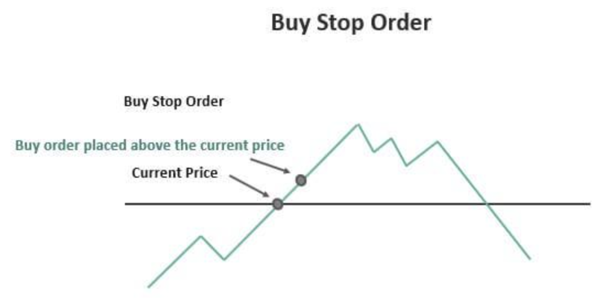

## Table of Contents

## What is a buy stop order?

A buy stop order is an instruction that you give to your broker to buy a stock or other financial asset when its price reaches a specific level that is higher than the current market price. It's like setting a trap that only gets triggered if the price goes up to or above the level you set. Traders often use buy stop orders to enter a market when they believe the price will continue to rise after hitting a certain point.

For example, if a stock is currently trading at $50 and you think it will go up once it reaches $55, you can set a buy stop order at $55. If the stock price hits $55, your order will be activated, and you will buy the stock at the next available price, which might be slightly higher than $55. This way, you don't have to watch the market all the time; the order will work automatically when the price reaches your target.

## How does a buy stop order differ from a buy limit order?

A buy stop order and a buy limit order are two different types of orders you can use when trading stocks or other financial assets. A buy stop order is used when you want to buy a stock only if its price goes up to or above a certain level. For example, if a stock is at $50 and you think it will keep going up once it hits $60, you can set a buy stop order at $60. If the price reaches $60, your order will be triggered, and you'll buy the stock at the next available price, which could be a bit higher than $60.

On the other hand, a buy limit order is used when you want to buy a stock at a price that is lower than the current market price. If that same stock is at $50 and you think it might drop to $45 before going up again, you can set a buy limit order at $45. If the price drops to $45 or lower, your order will be activated, and you'll buy the stock at $45 or the best available price near that level. So, the main difference is that a buy stop order helps you buy when the price is rising, while a buy limit order helps you buy when the price is falling.

## What are the main uses of a buy stop order?

A buy stop order is often used by traders to enter a market when they think the price will keep going up. Imagine you're watching a stock that's going up slowly. You think it will really start to climb fast once it hits a certain price. So, you set a buy stop order at that price. If the stock reaches that price, your order kicks in, and you buy the stock. This way, you don't have to watch the market all the time. The order does the work for you when the price hits your target.

Another common use of a buy stop order is to limit losses. If you're already holding a stock and you see its price dropping, you might want to buy more of the stock if it starts to go up again. You can set a buy stop order just above the current price. If the price starts to recover and hits your stop price, you'll buy more shares. This can help you average down your cost per share if you believe the stock will eventually go back up. It's like setting a safety net that only catches the stock if it starts to bounce back.

## When should a trader consider using a buy stop order?

A trader should think about using a buy stop order when they believe a stock's price will keep going up after it hits a certain level. Imagine you're watching a stock that's slowly going up. You think it will really start to climb fast once it reaches, say, $60. Instead of watching the market all day, you can set a buy stop order at $60. If the stock hits that price, your order will kick in, and you'll buy the stock without needing to be there. It's like setting a trap that only catches the stock when it goes up to your target price.

Another time to use a buy stop order is when you want to limit losses on a stock you already own. If the stock's price is dropping, you might want to buy more shares if it starts to go up again. You can set a buy stop order just above the current price. If the price starts to recover and hits your stop price, you'll buy more shares. This can help you average down your cost per share if you believe the stock will eventually go back up. It's like setting a safety net that only catches the stock if it starts to bounce back.

## How do you set up a buy stop order on a trading platform?

Setting up a buy stop order on a trading platform is pretty easy. First, you need to find the stock you want to buy. You can do this by searching for the stock's name or symbol on your trading platform. Once you've found the stock, look for an option that says "Trade" or "Order Entry." Click on it, and you'll see a form where you can enter your order details.

In the form, you'll see a place to choose the type of order. Select "Buy Stop" from the list of order types. Then, you need to enter the stop price. This is the price at which you want your order to be triggered. For example, if the stock is currently at $50 and you want to buy it if it goes up to $60, you would enter $60 as your stop price. After that, you can enter the number of shares you want to buy. Once you've filled in all the details, review everything to make sure it's correct, and then click "Submit" or "Place Order" to set up your buy stop order.

## What are the potential risks associated with using buy stop orders?

Using buy stop orders can be risky because the price might go up just for a short time and then drop again. Imagine you set a buy stop order at $60 for a stock that's currently at $50. If the price jumps to $60 for a moment and then falls back down, you might end up buying the stock at a high price right before it drops. This is called a "false [breakout](/wiki/breakout-trading)," and it can lead to losses if the stock doesn't keep going up like you hoped.

Another risk is that the market can be really fast and unpredictable. When your buy stop order gets triggered, there might be a lot of other orders happening at the same time. This can cause the price to jump even higher before you actually buy the stock. So, you might end up buying at a price that's higher than your stop price. It's important to keep an eye on how fast the market is moving and be ready for these quick changes.

## Can you explain the concept of 'stop hunting' in relation to buy stop orders?

Stop hunting is something that happens in the stock market when big traders or institutions try to push the price of a stock to a certain level where a lot of people have set their buy stop orders. Imagine you and a bunch of other people have set buy stop orders at $60 for a stock that's currently at $50. Big traders might try to make the price go up to $60 just to trigger all those orders. Once your orders are triggered and you buy the stock, the big traders might then sell their shares, making the price drop again. This can be frustrating because you might end up buying at a high price right before it goes down.

It's important to be aware of stop hunting because it can affect your trading strategy. If you know that a lot of people have set their buy stop orders at a certain price, big traders might try to hit that price to make a profit. To protect yourself, you might want to set your buy stop order a little higher or lower than where you think others might have theirs. This way, you might avoid getting caught in a stop hunting situation where the price goes up just to trigger orders and then falls back down.

## How can buy stop orders be used in a breakout trading strategy?

In a breakout trading strategy, a buy stop order is used to enter a trade when a stock's price breaks through a certain level. Imagine you're watching a stock that's been moving between $50 and $55 for a while. You think that if the price goes above $55, it might keep going up. So, you set a buy stop order at $55. If the stock price hits $55, your order will be triggered, and you'll buy the stock at the next available price. This way, you can take advantage of the upward movement right when it starts, without having to watch the market all the time.

However, using buy stop orders in a breakout strategy comes with risks. Sometimes, the price might go above your stop price just for a short time and then fall back down. This is called a false breakout, and if you buy the stock during this time, you might end up with a loss. It's important to be aware of this possibility and maybe set your buy stop order a bit higher than where you think others might have theirs. This can help you avoid getting caught in a situation where big traders push the price up just to trigger a lot of buy stop orders and then let it fall back down.

## What is the impact of market volatility on buy stop orders?

Market [volatility](/wiki/volatility-trading-strategies) can make buy stop orders trickier to use. When the market is moving a lot, the price of a stock can jump around quickly. If you set a buy stop order at a certain price, the stock might hit that price for just a moment before dropping back down. This is called a false breakout, and it can lead to you buying the stock at a high price right before it falls. So, in a volatile market, you might end up with a loss if the stock doesn't keep going up like you hoped.

Another thing to watch out for in a volatile market is the speed of the market. When your buy stop order gets triggered, there might be a lot of other orders happening at the same time. This can make the price jump even higher before you actually buy the stock. So, you might end up buying at a price that's higher than your stop price. It's important to keep an eye on how fast the market is moving and be ready for these quick changes. Using buy stop orders in a volatile market can be risky, but if you're careful and set your orders wisely, you can still use them to your advantage.

## How do slippage and gapping affect buy stop orders?

Slippage happens when the price of a stock moves quickly and you end up buying it at a different price than you expected. Imagine you set a buy stop order at $60, but when the stock hits $60, the price jumps to $61 before your order gets filled. That extra dollar is called slippage. In a fast-moving or volatile market, slippage can be bigger, which means you might buy the stock at a higher price than you planned. This can affect your trading strategy because you might end up paying more than you wanted.

Gapping is when the price of a stock jumps from one price to another without trading at the prices in between. This can happen when the market opens after being closed, like over a weekend or holiday. If you have a buy stop order set at $60 and the stock closes at $55 on Friday, but opens at $62 on Monday, your order will be triggered at the opening price of $62. This is called a gap. Gapping can make it hard to predict exactly what price you'll buy at, which can be risky because you might end up buying at a much higher price than you planned.

## Can buy stop orders be used effectively in algorithmic trading?

Buy stop orders can be used effectively in [algorithmic trading](/wiki/algorithmic-trading) because they help automate the buying process. In algorithmic trading, computers use math and rules to make trading decisions. A buy stop order can be set up within these algorithms to buy a stock when it reaches a certain price. This means the computer can watch the market and make trades without needing a person to do it. It's like setting a trap that only catches the stock when it goes up to your target price, and it can be very useful in fast-moving markets where quick decisions are important.

However, using buy stop orders in algorithmic trading also comes with risks. If the market is very volatile, the price might hit your stop price for just a moment and then drop back down. This can lead to buying the stock at a high price right before it falls, which might result in a loss. Also, if the market gaps, your order might get filled at a much higher price than you planned. So, while buy stop orders can be a powerful tool in algorithmic trading, it's important to set them up carefully and be aware of these risks to make the most of them.

## What advanced techniques can traders use to optimize the placement of buy stop orders?

Traders can use a few smart tricks to make their buy stop orders work better. One trick is to look at where other traders might be setting their orders. If a lot of people have their buy stop orders at the same price, big traders might try to push the price up to that level just to make those orders happen and then let the price fall back down. To avoid this, you can set your buy stop order a little higher or lower than where you think others might have theirs. This way, you might not get caught in a situation where the price goes up just to trigger orders and then drops.

Another trick is to use something called a trailing stop order. This is a special kind of buy stop order that moves up with the price of the stock. Imagine the stock price is going up slowly. Instead of setting a fixed buy stop order, you can set a trailing stop order that stays a certain amount below the highest price the stock has reached. If the stock keeps going up, your order will move up with it. But if the stock starts to go down, your order will stay where it is and might get triggered if the price comes back down to it. This can help you buy the stock at a good price without missing out on big moves up.

## References & Further Reading

[1]: Bergstra, J., Bardenet, R., Bengio, Y., & Kégl, B. (2011). ["Algorithms for Hyper-Parameter Optimization."](https://dl.acm.org/doi/10.5555/2986459.2986743) Advances in Neural Information Processing Systems 24.

[2]: Marcos Lopez de Prado. ["Advances in Financial Machine Learning."](https://www.amazon.com/Advances-Financial-Machine-Learning-Marcos/dp/1119482089) Wiley, 2018.

[3]: David Aronson. ["Evidence-Based Technical Analysis: Applying the Scientific Method and Statistical Inference to Trading Signals."](https://www.amazon.com/Evidence-Based-Technical-Analysis-Scientific-Statistical/dp/0470008741) Wiley, 2007.

[4]: Stefan Jansen. ["Machine Learning for Algorithmic Trading."](https://github.com/stefan-jansen/machine-learning-for-trading) Packt Publishing, 2019.

[5]: Ernest P. Chan. ["Quantitative Trading: How to Build Your Own Algorithmic Trading Business."](https://www.amazon.com/Quantitative-Trading-Build-Algorithmic-Business/dp/0470284889) Wiley, 2008.