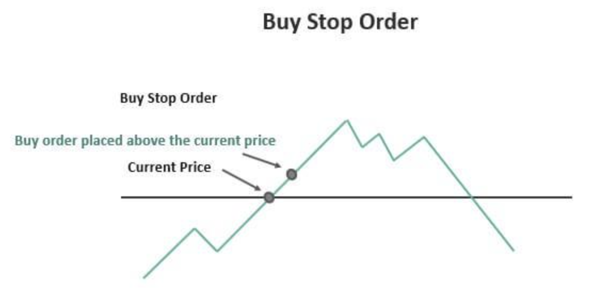

## Table of Contents

## What is a buy stop order in trading?

A buy stop order is a type of order used in trading where you tell your broker to buy a stock or other asset once it reaches a certain price that is higher than its current price. For example, if a stock is currently trading at $50, you might set a buy stop order at $55. This means your order will only be executed if the stock price goes up to $55 or higher. Traders use buy stop orders to enter a market at a higher price, often to take advantage of upward momentum or to limit their risk.

Buy stop orders are commonly used in various trading strategies. One common use is when a trader believes that if a stock breaks through a certain price level, it will continue to rise. By setting a buy stop order just above this level, the trader can automatically enter the market at the start of a potential upward trend. Another use is to limit losses on a short position. If a trader has shorted a stock and wants to cap potential losses, they might set a buy stop order at a price higher than the current market price to automatically buy back the stock if it rises to that level, thus closing the short position.

## How does a buy stop order differ from a market order?

A buy stop order and a market order are different ways to buy a stock or asset. A market order is an order to buy at the current market price, no matter what that price is. When you place a market order, it gets filled right away at the best available price at that moment. This means you will own the stock as soon as possible, but the exact price you pay might be a little different from the price you saw when you placed the order.

On the other hand, a buy stop order is set to buy only when the price reaches a certain level that is higher than the current price. For example, if a stock is at $50 and you set a buy stop order at $55, your order won't be filled until the price hits $55 or more. This type of order is used to enter the market at a specific price point, often to catch an upward trend or to manage risk in trading strategies. Unlike a market order, a buy stop order might not get filled at all if the price never reaches the set level.

## When should a trader use a buy stop order?

A trader should use a buy stop order when they want to buy a stock only if it goes up to a certain price. For example, if a stock is at $50 and you think it will keep going up if it reaches $55, you can set a buy stop order at $55. This way, you'll only buy the stock if it hits that price, which can help you catch a rising trend. It's like setting a trap for the price to hit a certain level before you decide to buy.

Another good time to use a buy stop order is when you want to limit losses on a short position. If you've shorted a stock and it's at $50, you might set a buy stop order at $55 to buy it back if the price goes up that high. This helps you control how much you could lose if the stock price goes against you. Buy stop orders are useful tools for traders to manage their entry points and risks in the market.

## What are the potential risks of using buy stop orders?

Using buy stop orders can be risky because they might not get filled at the exact price you set. For example, if you set a buy stop order at $55 and the stock jumps from $54 to $56 really fast, you might end up buying at $56 or even higher. This is called slippage, and it can make your trade more expensive than you planned.

Another risk is that the stock might never reach the price you set for your buy stop order. If the stock stays below your target, your order won't be filled at all. This means you might miss out on buying the stock if it starts to rise later. So, you need to be careful and think about whether the price you choose for your buy stop order is realistic and worth waiting for.

## How can a buy stop order be used to manage risk?

A buy stop order can help manage risk by setting a limit on how much you might lose on a short position. If you've shorted a stock and it's at $50, you can set a buy stop order at $55. This means if the stock price goes up to $55, your order will buy back the stock, closing your short position. This way, you control the maximum amount you could lose if the stock price goes against you.

Another way buy stop orders manage risk is by helping you enter a trade at a better price. If you believe a stock will keep rising once it hits $55, you can set a buy stop order at that price. This means you'll only buy the stock if it goes up to $55, which might be a safer entry point if you think the stock will keep going up from there. By waiting for the price to reach a certain level, you can avoid buying the stock if it doesn't show the upward [momentum](/wiki/momentum) you're looking for.

## Can you explain the concept of a buy stop limit order?

A buy stop limit order is a type of order that combines a buy stop order and a limit order. When you use a buy stop limit order, you set two prices: a stop price and a limit price. The stop price is the price at which the order becomes active. For example, if a stock is at $50 and you set the stop price at $55, your order will only become active if the stock reaches $55 or higher. Once the stock hits $55, your order turns into a limit order.

The limit price is the highest price you're willing to pay for the stock. So, if you set the limit price at $56, your order will try to buy the stock at $55 or any price up to $56. If the stock jumps past $56 right away, your order won't be filled because it's above your limit price. Using a buy stop limit order helps you control both when you enter the market and how much you pay, but there's a risk your order might not get filled if the stock price moves too fast.

## What are the key considerations when setting the price level for a buy stop order?

When setting the price level for a buy stop order, you need to think about the stock's current price and where you think it might go next. If the stock is at $50 and you believe it will keep going up once it reaches $55, you might set your buy stop order at $55. This way, you'll only buy the stock if it hits that price, which could be a good entry point if the stock keeps rising. But you also need to consider how likely it is for the stock to reach that price. If it's too far from the current price, your order might never get filled.

Another thing to think about is how fast the stock price might move. If you set your buy stop order too close to the current price, there's a chance the stock could quickly jump past it, and you might end up buying at a higher price than you wanted. This is called slippage. So, you need to find a balance between setting a price that's likely to be reached and one that won't cause too much slippage. It's all about finding the right spot where you think the stock will hit your price without moving too fast past it.

## How do market conditions affect the effectiveness of buy stop orders?

Market conditions can really change how well buy stop orders work. If the market is moving slowly and steadily, your buy stop order might get filled at the price you set. This is good because it means you can buy the stock at the price you wanted. But if the market is moving fast and prices are jumping around a lot, your buy stop order might not work out as planned. The stock could quickly go past your stop price, and you might end up buying at a higher price than you expected. This is called slippage, and it can make your trade more expensive.

Also, the overall mood of the market matters. In a strong bull market, where prices are going up a lot, your buy stop order might be more likely to get filled because the stock has a good chance of reaching your stop price. But in a bear market, where prices are falling, it might be harder for the stock to hit your stop price, and your order might not get filled at all. So, you need to think about what's happening in the market when you set your buy stop order to make sure it has a good chance of working the way you want it to.

## What are some advanced strategies involving buy stop orders?

One advanced strategy involving buy stop orders is called [breakout](/wiki/breakout-trading) trading. In this strategy, you look for stocks that are stuck in a certain price range and might break out of it. If a stock has been moving between $50 and $55 for a while, you might set a buy stop order just above $55, say at $56. If the stock breaks out and goes above $56, your order will be triggered, and you'll buy the stock. This can be a good way to catch the start of a big move up, but you need to be careful because sometimes the breakout might not last, and the price could fall back down.

Another strategy is using buy stop orders to manage risk in short selling. When you short a stock, you're betting that the price will go down. But if it goes up instead, you could lose money. To limit your losses, you can set a buy stop order at a higher price than where you shorted the stock. For example, if you short a stock at $50, you might set a buy stop order at $55. If the stock goes up to $55, your order will buy back the stock, closing your short position and capping your loss. This helps you control how much you could lose if the stock price moves against you.

A third strategy involves using buy stop orders in conjunction with technical analysis. Traders often use indicators like moving averages or trend lines to find key price levels. If a stock is approaching a resistance level at $55, and you think it will break through and keep going up, you can set a buy stop order just above that level, say at $56. This way, if the stock breaks through the resistance, your order will be triggered, and you'll enter the trade at the start of a potential upward trend. It's important to combine this with other analysis to increase the chances of the stock reaching your stop price and continuing to rise.

## How do buy stop orders integrate with automated trading systems?

Buy stop orders are really helpful in automated trading systems because they can make trading decisions without needing someone to watch the market all the time. In an automated system, you can set up rules that tell the computer when to buy a stock. If you think a stock will go up when it hits a certain price, you can set a buy stop order at that price. The computer will keep an eye on the stock price and will buy the stock for you as soon as it reaches your set price. This way, you don't have to be there all the time to make the trade happen.

Using buy stop orders in automated systems can also help manage risk better. For example, if you're using a computer program to short sell stocks, you can set buy stop orders to limit your losses. If the stock price starts to go up and reaches a price you set, the computer will automatically buy back the stock to close your short position. This helps you control how much you might lose if the stock price moves against you. By setting these orders, the computer can follow your trading plan and make sure you stick to your risk management rules without you having to do anything.

## Can you discuss historical examples where buy stop orders significantly impacted market movements?

One famous time when buy stop orders had a big impact was during the "Flash Crash" of May 6, 2010. On that day, the stock market dropped really fast and then bounced back just as quickly. A lot of people think that buy stop orders played a big part in making the drop happen so fast. Many traders had set buy stop orders at certain prices, hoping to buy stocks if they went up. But when the market started to fall, these orders turned into sell orders because the prices hit the stop levels. This made the market fall even faster as more and more sell orders were triggered.

Another example happened during the "Black Monday" crash on October 19, 1987. This was one of the worst days in stock market history, with the market dropping over 20% in one day. Buy stop orders were a big part of why the market fell so hard. Many investors had set buy stop orders to protect their investments, but when the market started to drop, these orders turned into sell orders. This created a chain reaction where more and more sell orders were triggered, making the market fall even faster. It showed how buy stop orders can make big market moves happen even faster when everyone is trying to get out at the same time.

## What are the psychological aspects traders should consider when placing buy stop orders?

When traders use buy stop orders, they need to think about how their feelings might affect their decisions. It's easy to get excited or worried about a stock's price, and this can make you set your buy stop order at the wrong price. If you're too hopeful, you might set your order too high, thinking the stock will keep going up. But if you're too scared, you might set it too low and miss out on a good chance to buy. It's important to stay calm and think clearly about where to set your buy stop order so it fits with your overall trading plan.

Another thing to think about is how you might feel if the stock doesn't reach your buy stop price. Sometimes, the stock might not go up to the price you set, and this can make you feel frustrated or disappointed. But it's important not to let these feelings make you change your plan. Stick to your strategy and don't rush into buying the stock just because you feel bad about missing out. Remember, buy stop orders are there to help you make smart trading choices, not to make you feel stressed or upset.

## References & Further Reading

[1]: Bergstra, J., Bardenet, R., Bengio, Y., & Kégl, B. (2011). ["Algorithms for Hyper-Parameter Optimization."](https://dl.acm.org/doi/10.5555/2986459.2986743) Advances in Neural Information Processing Systems 24.

[2]: ["Advances in Financial Machine Learning"](https://www.amazon.com/Advances-Financial-Machine-Learning-Marcos/dp/1119482089) by Marcos Lopez de Prado

[3]: ["Evidence-Based Technical Analysis: Applying the Scientific Method and Statistical Inference to Trading Signals"](https://www.amazon.com/Evidence-Based-Technical-Analysis-Scientific-Statistical/dp/0470008741) by David Aronson

[4]: ["Machine Learning for Algorithmic Trading"](https://github.com/stefan-jansen/machine-learning-for-trading) by Stefan Jansen

[5]: ["Quantitative Trading: How to Build Your Own Algorithmic Trading Business"](https://www.amazon.com/Quantitative-Trading-Build-Algorithmic-Business/dp/1119800064) by Ernest P. Chan