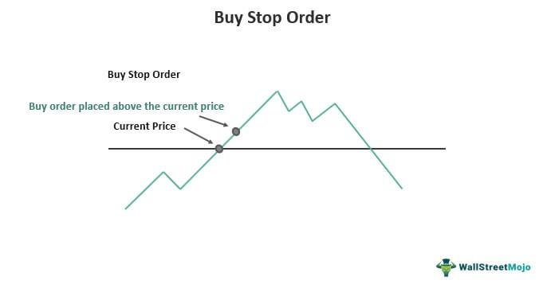

Financial markets are essential platforms facilitating the exchange of financial assets, including stocks, bonds, commodities, and currencies. These markets are complex systems where market participants—ranging from individual investors to large institutional traders—engage in buying and selling activities. A critical component of executing strategies within these markets is the use of trading orders, which allow participants to specify their buying or selling intentions under varying conditions.

Trading orders are the instructions given to a broker or trading platform to execute transactions on behalf of the trader. Among the myriad of orders available, buy stops stand out as strategic tools. A buy stop order is set at a price above the current market price and becomes active once that price is reached. It plays a significant role in scenarios where traders seek to capitalize on upward market momentum while managing potential downside risk.



In recent years, algorithmic trading—often truncated to algo trading—has become indispensable in optimizing order execution and managing market risks. Algorithmic trading refers to the automatic execution of trading orders using pre-set algorithms based on various criteria, such as timing, price, or quantity. This method offers considerable benefits, including enhanced speed and precision of executions, reduced transaction costs, and improved market liquidity.

This article explores the integral components of trading orders, buy stops, and algorithmic trading. We will examine how buy stops can be effectively employed to realize advantageous positions in trending markets, how trading orders shape strategic market actions and manage risks, and how algorithmic trading is revolutionizing these processes. By doing so, this article aims to illuminate the intricate connections between these elements and their combined potential to elevate trading strategies in modern financial markets.

## Table of Contents

## Understanding Financial Market Orders

Financial market orders are the fundamental tools through which participants execute trades, manage portfolios, and implement strategic goals. Trading orders specify the conditions under which a trade should be executed, providing clarity, control, and precision in transactions. Understanding the types of orders available is essential for market participants aiming to navigate the complexities of modern financial markets effectively.

**Types of Orders**

1. **Market Orders**: These are orders to buy or sell a financial instrument immediately at the best available current price. Market orders are typically used when certainty of execution is prioritized over price. For example, if a trader places a market order to buy a stock, it will be filled at the lowest asking price available at the time the order reaches the market.

2. **Limit Orders**: A limit order specifies the maximum price a buyer is willing to pay or the minimum price a seller is willing to accept for a security. This order type ensures that the trader does not pay more or receive less than the specified price, but it does not guarantee execution. Limit orders are useful in controlling entry and exit prices during volatile market conditions.

3. **Stop Orders**: These orders are triggered when the market price reaches a predefined stop level, at which point they become market orders. Stop orders are primarily used for managing risk, allowing traders to limit potential losses or protect profits. For instance, a stop-loss order can be set below the purchase price of a security to limit a trader’s loss if the market turns against their position.

**Strategic Goals and Risk Management**

Trading orders are instrumental in achieving strategic objectives within financial markets. Market orders, with their emphasis on immediacy, are suited for traders looking to capitalize on favorable market conditions without delay. Limit orders, on the other hand, offer precision and control over price levels, aligning with strategies that prioritize specific entry and [exit](/wiki/exit-strategy) points. Stop orders function as a safety net, offering mechanisms for loss limitation and profit protection.

By selecting the appropriate order type, traders can align their transactions with their strategic goals. For instance, during periods of high market [volatility](/wiki/volatility-trading-strategies), limit orders allow traders to set boundaries for their trades, reducing the risk of adverse price movements. Conversely, market orders are useful in fast-moving markets where opportunities are fleeting and the speed of execution is paramount.

In conclusion, the diverse range of trading orders available in financial markets provides traders with the tools necessary to execute trades efficiently and manage risks effectively. Understanding these orders enables traders to tailor their strategies to specific market conditions, thereby optimizing their chances of achieving desired outcomes.

## Exploring Buy Stops

Buy stop orders are a fundamental tool within trading strategies, serving to initiate a purchase of a financial instrument once its price surpasses a specified level. Essentially, a buy stop is set above the current market price, allowing traders to capitalize on upward market movements. This type of order is particularly instrumental in managing risk and safeguarding profits in volatile markets.

The primary purpose of a buy stop is to mitigate potential losses by triggering a purchase only when bullish conditions are confirmed. This ensures that trades are executed in alignment with a trader's strategic goals, thereby enhancing the potential for successful outcomes. For example, a trader holding a short position might use a buy stop to cover their position and limit losses if the market price begins to rise unexpectedly.

Market conditions where buy stops are particularly useful include scenarios of strong upward [momentum](/wiki/momentum) or [breakout](/wiki/breakout-trading) patterns. In such environments, prices may quickly surge past resistance levels, presenting traders with opportunities to enter a trend at the optimal moment. By setting a buy stop just above known resistance levels or key price points, traders can automate their entry strategy and respond more effectively to rapid market changes without constant monitoring.

An advantageous scenario for employing buy stops can be observed in trending markets, where the instrument's price is experiencing sustained movement in one direction. In a bullish trend, for instance, traders may place buy stops above recent price highs to catch breakout movements and participate in the trend. This strategic application allows traders to systematically position themselves to benefit from upward momentum, thus potentially maximizing profits while minimizing exposure to reversal risks.

In summary, buy stops are leveraged in trading strategies to ensure positions are opened only under favorable conditions. By automating entry into upward trending markets, buy stops offer traders an efficient means to align with positive price movements, enhancing their strategic edge in competitive financial markets.

## Algorithmic Trading: Revolutionizing Order Execution

Algorithmic trading, often referred to as algo trading, is a significant advancement in the field of financial markets, empowering traders and institutions with the ability to execute orders with remarkable speed and precision. At its core, [algorithmic trading](/wiki/algorithmic-trading) utilizes complex algorithms to automate trading decisions, thus eliminating the need for manual intervention and allowing trades to be executed at optimal prices and times.

One of the primary benefits of algorithmic trading is its ability to process large volumes of data in real-time and respond to market conditions much faster than human traders. This speed is paramount, especially in high-frequency trading environments where fractions of a second can determine the profitability of a trade. Algorithms can analyze multiple market indicators and place trades automatically when predetermined criteria are met, ensuring that opportunities are not missed and risk is managed efficiently.

Precision in order execution is another critical advantage of algorithmic trading. By reducing human error, algorithms can execute trades without the emotional and psychological biases that often affect manual trading. For instance, algorithms can implement sophisticated strategies that consider various factors such as asset volatility, [liquidity](/wiki/liquidity-risk-premium), and pricing trends, thereby enhancing the accuracy of order placement.

A practical application of algorithmic trading is its integration with various order types, including buy stops. Buy stop orders are employed to purchase a security once its price surpasses a specified level, acting as a tool for traders to capitalize on upward market trends. Algorithms can seamlessly incorporate buy stops into trading strategies, functioning not only as signals for order execution but also as part of larger, more complex trading frameworks. For instance, an algo trading system might use buy stops as part of a breakout strategy, where an order is triggered only when a security breaks through resistance levels, thus ensuring trades are executed in alignment with strong market trends.

In conclusion, algorithmic trading has transformed the landscape of financial markets by offering unprecedented speed and precision in order execution. Beyond enhancing the efficiency of trade placement, algorithms integrating various order types, such as buy stops, allow for dynamic and responsive trading strategies that capitalize on market opportunities while effectively managing risks. As technology continues to evolve, the role of algorithms is expected to expand, further revolutionizing the way trading is conducted.

## Integration of Buy Stops in Algo Trading Strategies

The integration of buy stops in algorithmic trading strategies serves as an effective method for optimizing trade execution. Buy stops are predefined points where a trading position is automatically executed, acting as pivotal components in mitigating risk and capitalizing on favorable market trends. When integrated with algorithmic trading systems, buy stops provide a structured mechanism to manage trades with precision and adaptability, especially in volatile markets.

Algorithmic trading systems, or algo trading, utilize sophisticated algorithms to execute orders based on a variety of parameters, such as timing, price, and [volume](/wiki/volume-trading-strategy). Incorporating buy stops into these systems offers traders the advantage of reacting to market conditions swiftly and automatically, without the need for manual intervention. This capacity is particularly beneficial in volatile markets where rapid price movements could otherwise lead to suboptimal trading decisions.

### Case Study: Managing Buy Stops in Volatile Markets

Consider a scenario in a highly volatile foreign exchange market, where a trader employs an algorithmic trading system with integrated buy stops. The system is designed to initiate a buy order when the currency pair's price rises above a specified threshold, indicating a bullish market sentiment.

```python
# Python pseudo-code for managing buy stops in an algo trading system
def algo_trading_system(current_price, buy_stop_price, historical_data):
    # Example of simple moving average for trend analysis
    sma = sum(historical_data[-10:]) / 10  
    if current_price > buy_stop_price and current_price > sma:
        execute_buy_order(current_price)

def execute_buy_order(price):
    print(f"Executing buy order at price: {price}")

# Example data and execution
historical_data = [1.1, 1.2, 1.15, 1.18, 1.12, 1.16, 1.3, 1.25, 1.22, 1.28]
current_price = 1.32
buy_stop_price = 1.3

algo_trading_system(current_price, buy_stop_price, historical_data)
```

In this context, the algorithm uses a simple moving average (SMA) to assess the trend and confirm the buy order is triggered when the current price surpasses both the buy stop price and the SMA. This ensures that the buy orders are executed only when there is a strong indication of upward momentum, thus optimizing trade execution.

### Role of Data Analytics and Machine Learning

Data analytics and [machine learning](/wiki/machine-learning) (ML) play crucial roles in refining buy stop strategies within algorithmic systems. An ML algorithm can process large datasets to identify patterns and trends that might not be evident through traditional analysis methods. By analyzing historical and real-time market data, ML models can optimize parameters for buy stops, such as dynamically adjusting stop levels based on volatility and market volume.

For instance, predictive analytics can help forecast price movements by employing techniques like regression analysis or neural networks, enabling traders to adjust their buy stop levels accordingly. The integration of these advanced technologies allows traders to adapt their strategies to evolving market dynamics, improving their ability to capture profitable opportunities while minimizing exposure to risk.

In conclusion, the integration of buy stops within algorithmic trading systems offers enhanced trade execution by combining the automatic execution capabilities of algorithms with the strategic positioning power of buy stops. By leveraging data analytics and machine learning, traders can fine-tune their strategies to achieve optimal performance in both stable and volatile market conditions.

## The Advantages and Limitations of Buy Stops and Algo Trading

Buy stops, when incorporated within algorithmic trading frameworks, present several notable advantages. By automating the execution of buy stop orders, traders can capitalize on market movements with increased speed and precision. This automation reduces the likelihood of human error, ensuring that orders are executed in accordance with pre-defined strategies. Moreover, algorithmic trading allows for the continuous monitoring of market conditions, facilitating the timely execution of buy stops when specific market conditions are met. This capacity for real-time adaptation is particularly beneficial in volatile markets, where rapid fluctuations can offer both opportunities and risks.

However, integrating buy stops into algorithmic trading is not without challenges. One key issue is the accurate prediction of market conditions where buy stop orders would be advantageous. Algorithms must be designed to discern intricate market patterns and react appropriately, which requires sophisticated data analysis capabilities. Additionally, the implementation of buy stop orders in algorithmic systems may lead to excessive trading activity, causing higher transaction costs if not carefully managed.

To mitigate these challenges, traders often employ advanced data analytics and machine learning techniques. These tools enhance the predictive accuracy of algorithms, improving their ability to identify optimal entry points for buy stop orders. For example, machine learning models can be trained to recognize patterns indicative of upward price trends, thereby optimizing the timing of buy stop executions.

When aligning buy stop orders with algorithmic strategies, several factors must be considered. Firstly, traders need to define precise trigger conditions for buy stops, such as specific price levels or technical indicators. This requires a thorough understanding of market dynamics and the specific asset being traded. Secondly, risk management is crucial; algorithms should incorporate stop-loss mechanisms to limit potential losses. Finally, the choice of trading platform and technology plays a significant role. Platforms that offer robust [backtesting](/wiki/backtesting) capabilities and low-latency execution are preferable, as they allow traders to validate their strategies and respond swiftly to market changes.

In conclusion, while buy stops integrated within algorithmic trading frameworks offer several key benefits, such as enhanced execution speed and precision, they also pose challenges related to prediction accuracy and cost management. By leveraging advanced analytics and considering critical factors in strategy alignment, traders can effectively utilize buy stops to optimize their trading outcomes.

## Practical Tips for Traders

To effectively implement buy stops in trading strategies, traders should first understand how these orders function within their broader investment plans. A buy stop order is designed to purchase a security once it reaches a specific price, known as the stop price, above its current market price. This type of order allows traders to seize upward momentum in asset prices, ensuring they enter a trade while minimizing the risk of missed opportunities in trending markets.

One of the best practices for implementing buy stops is to align them with well-researched market analyses. Traders should be equipped with relevant market data to set an appropriate stop price. This involves analyzing historical price trends and current market conditions to improve the accuracy of the stop price placement.

Algorithmic trading tools can significantly enhance decision-making and execution efficiency in implementing buy stops. These tools utilize algorithms that automatically execute trades based on pre-set criteria, allowing for quick reactions to market movements beyond manual capabilities. Algorithmic trading offers speed, precision, and the ability to handle large volumes of trades simultaneously, which is essential in fast-moving markets.

One example of using algorithmic tools is employing Python libraries such as `pandas` for data analysis and `numpy` for numerical calculations. By using these libraries, traders can develop scripts to backtest strategies involving buy stops, optimizing their parameters to reflect market realities better.

Here's a simple Python code snippet illustrating how one might set up a buy stop order logic using a basic strategy:

```python
import pandas as pd
import numpy as np

# Example dataset of stock prices
data = {'Price': [100, 101, 102, 103, 104, 105]}
df = pd.DataFrame(data)

# Setting a buy stop above the current market price
stop_price = df['Price'].iloc[-1] + 2  # Assuming a buy stop 2 units above the last price

def check_buy_stop(current_price, stop_price):
    if current_price >= stop_price:
        return "Execute Buy Order"
    else:
        return "Hold Position"

# Check current price against buy stop
current_price = 106  # Current market price
decision = check_buy_stop(current_price, stop_price)
print(decision)
```

When selecting appropriate trading platforms and technologies, traders should consider factors such as the platform’s computational power, latency, and the ability to integrate various data sources and algorithms. Platforms offering customizable algorithmic tools and rich data analytics can provide significant advantages. Traders might consider widely adopted platforms like MetaTrader 5, which supports automated trading and offers a comprehensive environment for developing trading systems with advanced technical analysis tools.

Moreover, traders should prioritize platforms that provide robust security features and ensure compliance with financial regulations. This focus helps protect sensitive data and facilitates a stable trading environment. A combination of technical capability and compliance can help foster both trust and efficiency in executing trading strategies effectively.

To maintain a competitive edge, traders should continuously update their knowledge of new trading technologies and market developments. This ongoing learning process can help in refining strategies and leveraging new features and tools introduced in trading platforms over time.

## Conclusion

The interplay between buy stops, trading orders, and algorithmic trading holds significant relevance in contemporary financial markets. Buy stops serve as essential mechanisms that help traders capitalize on favorable market movements while effectively managing risks. Trading orders, in their various forms, facilitate the precise execution of market strategies by allowing traders to automate and streamline their trading activities. The advent of algorithmic trading has further enhanced these processes, enabling rapid and accurate order execution that aligns with sophisticated trading strategies.

The future of trading strategies integrating automated systems and traditional order types appears promising. As financial markets become increasingly complex and interconnected, there is a growing need for advanced tools that can efficiently process vast amounts of data and execute trades at optimal moments. Algorithmic trading systems, powered by innovations in data analytics and machine learning, are perfectly poised to meet these demands. The integration of traditional order types, such as buy stops, within these automated frameworks adds another layer of precision and versatility, thereby enhancing overall trading performance.

Traders are encouraged to pursue a deep understanding of advanced trading technologies and continually refine their strategies. By leveraging the capabilities of algorithmic trading and incorporating robust order types like buy stops, traders can maintain a competitive edge in dynamic market environments. Staying informed about technological advancements and market trends is crucial for traders aiming to optimize their trading outcomes and capitalize on emerging opportunities. Embracing a forward-thinking mindset and continuously exploring advanced tools and strategies will be key to thriving in the evolving landscape of financial markets.

## References & Further Reading

[1]: Bergstra, J., Bardenet, R., Bengio, Y., & Kégl, B. (2011). ["Algorithms for Hyper-Parameter Optimization."](https://dl.acm.org/doi/10.5555/2986459.2986743) Advances in Neural Information Processing Systems 24.

[2]: ["Advances in Financial Machine Learning"](https://www.amazon.com/Advances-Financial-Machine-Learning-Marcos/dp/1119482089) by Marcos Lopez de Prado

[3]: ["Evidence-Based Technical Analysis: Applying the Scientific Method and Statistical Inference to Trading Signals"](https://www.amazon.com/Evidence-Based-Technical-Analysis-Scientific-Statistical/dp/0470008741) by David Aronson

[4]: ["Machine Learning for Algorithmic Trading"](https://github.com/stefan-jansen/machine-learning-for-trading) by Stefan Jansen

[5]: ["Quantitative Trading: How to Build Your Own Algorithmic Trading Business"](https://www.amazon.com/Quantitative-Trading-Build-Algorithmic-Business/dp/1119800064) by Ernest P. Chan