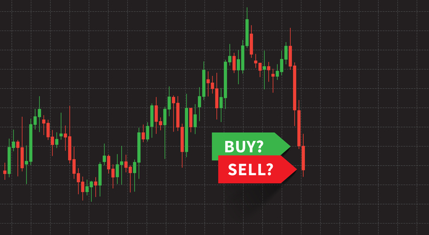

"Buy the Dip" is a popular trading and investment strategy based on the idea of purchasing assets after a decline in their price, under the expectation that a rebound is imminent. This approach is predicated on the belief that the drop in price is temporary and not indicative of a long-term downward trend. The strategy is widely used by individual investors and traders who seek to capitalize on what they perceive as temporary market irrationality or overreactions to news or events.

In today’s volatile market conditions, characterized by rapid shifts due to global economic uncertainties, technological advancements, and geopolitical events, the "Buy the Dip" strategy has gained even more relevance. Many investors see these market dips as opportunities to acquire assets at a discount. The increased market volatility, partly driven by more accessible trading through online platforms and heightened global interconnectivity, provides more frequent opportunities for this strategy to be employed. Additionally, the proliferation of market information and analysis tools has empowered more traders and investors to attempt timing the market using this approach.

However, while the strategy is popular, it is not without risk. It requires a nuanced understanding of market dynamics and the ability to distinguish between a temporary dip and a long-term decline. The strategy also demands discipline and a clear analysis of the asset’s fundamentals to avoid catching a "falling knife," a term used to describe the risk of buying into a declining trend that continues to worsen.

## Table of Contents

## Understanding 'Buy the Dip'

The strategy of 'Buy the Dip' is not a new concept in the financial world. Its roots can be traced back to the earliest days of stock trading, where savvy investors sought to purchase stocks at a low price during temporary market declines, anticipating a rebound to profitability. Over the years, as financial markets evolved and became more sophisticated, so did the strategy. It gained significant popularity with the advent of more public market participation and the development of global financial markets.

Historically, 'Buy the Dip' gained particular prominence during market corrections and bear phases, where discerning investors saw declines not as a signal of enduring trouble, but as temporary setbacks and opportunities for profit. The strategy thrived in the era of bull markets, especially notable in the late 20th and early 21st centuries, where markets experienced swift recoveries after downturns, rewarding those who had the foresight and confidence to invest during these dips.

At its core, the 'Buy the Dip' strategy is deeply rooted in market psychology. It capitalizes on the common investor tendency to overreact to negative news or market events, leading to sharp, often unwarranted declines in asset prices. This overreaction creates opportunities for investors who understand that markets often move cyclically and that what goes down will likely go up again, especially in the case of fundamentally strong assets.

The appeal of this strategy also lies in its simplicity and the basic human inclination to seek bargains. Buying low and selling high is an intuitive principle for profit-making, and 'Buy the Dip' embodies this principle. However, it requires investors to overcome their innate biases and fears, particularly the tendency to avoid buying when the market is in a downturn and sentiment is negative.

## How 'Buy the Dip' Works

The 'Buy the Dip' strategy operates on the principle of identifying and capitalizing on temporary market declines. Investors employing this strategy closely monitor market movements, looking for opportunities where assets have dipped in price but still have strong fundamentals, indicating a likely rebound.

**Mechanics of the Strategy:**

1. **Market Monitoring:** Investors keep a vigilant eye on market trends and news that could affect asset prices.
2. **Identifying Dips:** A dip is identified when an asset's price falls significantly, but the decline seems temporary or reactionary rather than indicative of long-term devaluation.
3. **Assessment of Fundamentals:** Investors analyze the underlying fundamentals of the asset to ensure that the price drop is not due to inherent flaws or enduring issues.
4. **Timing the Purchase:** The purchase is timed to coincide with what the investor perceives as the lowest point in the dip, maximizing potential gains when the price rebounds.
5. **Exit Strategy:** Investors plan an exit strategy, either targeting a specific price point for resale or a particular time frame.

**Analysis Techniques:**

1. **Technical Analysis:** This involves analyzing statistical trends gathered from trading activity, such as price movement and volume. Common tools include moving averages, Relative Strength Index (RSI), and Bollinger Bands, which help in identifying potential entry points during a dip.
2. **Fundamental Analysis:** This method involves evaluating the intrinsic value of an asset by examining related economic, financial, and other qualitative and quantitative factors. Key indicators include earnings reports, market position, competition, and management efficiency.
3. **Sentiment Analysis:** Investors also gauge market sentiment, often using news and social media analysis, to understand the mood of the market and whether a dip is driven by investor overreaction or a fundamental issue.

By combining these techniques, investors aim to differentiate between a mere price fluctuation and a genuine buying opportunity. The effectiveness of this strategy relies heavily on accurate analysis and timing, as misjudgment can lead to buying into a declining trend with no rebound.

For a detailed exploration of these techniques and the execution of the 'Buy the Dip' strategy, "Technical Analysis of the Financial Markets" by John J. Murphy provides a comprehensive guide. This book offers insights into the various tools and methodologies used in technical analysis, crucial for identifying and acting on market dips effectively[1].

## Comparative Strategies

### Buy the Dip vs. Dollar-Cost Averaging

"Buy the Dip" and "Dollar-Cost Averaging" (DCA) are both popular investment strategies, but they cater to different types of investors and investment philosophies.

**Buy the Dip** is a more active investment strategy that involves purchasing assets after a significant decline in price. This strategy is based on the assumption that the price drop is temporary and the asset's price will rebound. It requires investors to actively monitor the market and be able to quickly analyze and react to price movements. This approach is more suited to investors who are comfortable with taking on higher risks and have the time and knowledge to closely follow market trends and perform thorough analyses.

On the other hand, **Dollar-Cost Averaging** is a more passive investment approach. It involves regularly investing a fixed amount of money into a particular asset or portfolio over time, regardless of its price. The idea is to reduce the impact of [volatility](/wiki/volatility-trading-strategies) on the overall purchase. The purchases occur at regular intervals and at average prices over time, which can potentially lower the total average cost per share of the investment. DCA is particularly suitable for long-term investors who prefer a more hands-off approach and are looking to mitigate the risks associated with market timing.

The key difference between the two strategies lies in their approach to market timing and risk management. 'Buy the Dip' requires an investor to time the market to some extent and is inherently riskier, as it assumes the ability to predict price movements accurately. DCA, in contrast, reduces the risk of incorrect timing but may result in higher average purchase prices during a rising market.

For investors who prefer an active management style and have confidence in their market analysis skills, 'Buy the Dip' can offer greater potential for higher returns. Conversely, for those who are risk-averse, do not wish to actively manage their investments, or lack confidence in their ability to time the market, DCA offers a safer and more consistent investment method.

### Buy the Dip vs. Value Investing

"Buy the Dip" and "Value Investing" are two distinct investment strategies, each with its own principles and methodologies, yet they can intersect in certain aspects.

**Buy the Dip** focuses on capitalizing on short-term price declines in assets. Investors who follow this strategy typically look for temporary market downturns or corrections to purchase stocks or other assets. The core belief here is that the price drop is not permanent and is likely to rebound, allowing the investor to profit from the eventual price increase. This strategy requires a keen sense of market timing and often relies on technical analysis to identify potential dips.

On the other hand, **Value Investing** is a long-term strategy based on identifying and investing in undervalued assets whose intrinsic value is not reflected in their current market price. Value investors spend considerable time researching and analyzing a company’s fundamentals, including its financial performance, business model, and growth prospects. The central idea is that the market will eventually recognize the true value of these undervalued assets, leading to price appreciation over time. This strategy is heavily reliant on [fundamental analysis](/wiki/fundamental-analysis).

**Intersection:** The two strategies can intersect when a dip in the market results in fundamentally strong assets being undervalued. In such cases, a 'Buy the Dip' investor may find alignment with value investing principles, as the assets they are targeting on a dip are also those that value investors might identify as undervalued.

**Divergence:** Despite this potential intersection, the two strategies diverge significantly in their approach to market timing and asset selection. 'Buy the Dip' is a more reactive strategy, often executed over shorter timeframes and focused on market movements and technical indicators. In contrast, value investing is proactive, with a long-term horizon, focused on the intrinsic value of assets irrespective of current market fluctuations.

In essence, while 'Buy the Dip' seeks to leverage short-term market inefficiencies, value investing aims to exploit long-term market mispricing of asset values. The suitability of each strategy depends largely on the investor's goals, risk tolerance, and investment style.

## Sector and Market Focus

In 'Buy the Dip' strategies, identifying the right sectors and understanding the role of market capitalization are crucial for successful implementation.

### Identifying Sectors

**Volatility and Recovery Patterns:** Sectors with higher volatility often present more frequent 'buy the dip' opportunities. However, it's important to assess their historical recovery patterns post-dip.

**Growth Prospects:** Sectors with strong future growth prospects, such as technology or renewable energy, are often prime candidates for this strategy. A dip in these sectors might be seen as a temporary setback in an otherwise upward trend.

**Economic and Industry Cycles:** Understanding where a sector stands in economic and industry cycles can be critical. Sectors that are currently undervalued or at the lower end of a cycle might offer more substantial opportunities when they start to rebound.

**Impact of External Factors:** Certain sectors are more sensitive to external economic, political, or environmental factors. Monitoring these can provide insight into potential dips and rebounds.

### Market Caps and Dip Buying

**Large-Cap Stocks:** These stocks are generally more stable and have established business models. While their dips might be less dramatic, they're often considered safer for 'buy the dip' strategies due to their potential for steady recovery.

**Small and Mid-Cap Stocks:** These can offer more significant 'buy the dip' opportunities due to their higher volatility. However, they also carry more risk, as the price dips can be a result of fundamental issues within the company or sector.

**Market Cap Analysis:** Understanding a company’s market cap helps in assessing its stability, growth potential, and risk profile. Typically, investors might lean towards large-cap stocks in more uncertain markets and consider small to mid-cap stocks in a more bullish or stable market environment.

For those looking to deepen their understanding of sector-focused investment strategies, including '[buy the dip](/wiki/buy-the-dip-strategy)' opportunities, "Common Stocks and Uncommon Profits" by Philip Fisher offers valuable insights. Fisher's work, although not exclusively about 'buy the dip', provides in-depth analysis of sector potential and company fundamentals, which are crucial in identifying viable opportunities for this strategy[2].

## Risk Management

Effective risk management is crucial in the 'Buy the Dip' strategy to protect investments from unforeseen market downturns and volatility. Here are key strategies for minimizing risks:

- **Diversification:** One of the fundamental ways to manage risk is through diversification. This involves spreading investments across various assets, sectors, or geographies to reduce the impact of a decline in any single investment. Diversification can help mitigate the risk of significant losses when buying dips, as not all sectors or assets will dip or recover simultaneously.
- **Research and Analysis:** Before buying the dip, thorough research and analysis are essential to understand why a stock's price has fallen. This involves examining the asset's fundamentals through financial statement analysis, understanding industry trends, and evaluating the broader economic landscape. This approach helps to differentiate between a temporary dip and a long-term downward trend.
- **Position Sizing:** It is critical to manage the size of the position taken when buying the dip. Investing only a portion of your capital in a single dip opportunity can prevent significant losses if the market doesn’t rebound as expected.
- **Setting Stop Losses:** Stop losses are an essential tool in risk management. They automatically sell an asset at a predetermined price, limiting potential losses if the market moves unfavorably. Properly placed stop losses can help traders exit a position at a manageable loss, preserving capital for future opportunities.
- **Avoiding Leverage:** While leverage can magnify gains, it can also amplify losses, especially in volatile market conditions common with dip buying. Avoiding or minimizing the use of leverage can be a prudent strategy to manage risk.
- **Regular Monitoring and Adjustment:** Continuously monitoring market conditions and adjusting strategies accordingly is vital. This includes staying updated with market news, economic changes, and any company-specific developments that might affect the price of the asset.
- **Emotional Discipline:** Avoiding panic selling during further dips and not getting overly optimistic during rises is essential. Emotional discipline helps in making rational decisions based on analysis rather than market sentiments.

## 'Buy the Dip' in Different Markets

### Stock Market

In the context of the stock market, the 'Buy the Dip' strategy involves purchasing stocks following a significant price decline, with the expectation that they will rebound and increase in value. This approach can be particularly effective in the stock market due to its inherent volatility and the frequent fluctuations in stock prices.

**Implementation in the Stock Market:**

1. **Identifying Dips:** Investors closely monitor the stock market for sudden drops in the prices of stocks. These dips can be triggered by various factors, including economic news, company-specific events, or broader market trends.
2. **Analyzing Causes:** Once a dip is identified, the next step is to analyze its cause. This involves understanding whether the drop is due to fundamental issues with the company or external factors that might not impact the long-term value of the stock.
3. **Evaluating the Company’s Fundamentals:** Investors conduct fundamental analysis to assess whether the company is fundamentally sound. This includes examining financial statements, earnings reports, and future growth prospects.
4. **Timing the Purchase:** The key to the 'Buy the Dip' strategy is timing the purchase correctly. Investors aim to buy at or near the bottom of the dip to maximize potential gains when the stock price rebounds.

**Market Indicators and Tools:**

- Technical indicators such as Moving Averages, Relative Strength Index (RSI), and Bollinger Bands are often used to identify potential entry points for buying dips.
- Trading platforms provide real-time data and analytical tools to help investors make informed decisions.

**Risk Management:**

- Setting stop-loss orders is crucial to mitigate the risk of further declines.
- Diversification across different stocks and sectors can reduce the risk associated with buying dips in individual stocks.

While the 'Buy the Dip' strategy can be lucrative in the stock market, it requires a sound understanding of market dynamics and the ability to differentiate between a temporary dip and a long-term decline. It's important for investors to not solely rely on past trends, as past performance is not always indicative of future results.

### Crypto Market

In the [cryptocurrency](/wiki/cryptocurrency) market, the 'Buy the Dip' strategy takes on a unique dimension due to the market's inherent high volatility and rapid price movements. This strategy involves purchasing cryptocurrencies when their prices significantly drop, with the expectation that they will rebound, leading to potential profits.

**Volatility and Market Dynamics:**

- The cryptocurrency market is known for its extreme volatility compared to traditional markets. This volatility can result in substantial price dips, offering potentially lucrative 'buy the dip' opportunities.
- Cryptocurrency prices can be influenced by a wide range of factors, including regulatory news, technological advancements, market sentiment, and macroeconomic trends.

**Identifying Dips in the Crypto Market:**

- Identifying dips in the cryptocurrency market requires monitoring not just the price movements but also the industry developments and news that could impact prices.
- Investors often use technical analysis tools like moving averages, RSI, and Fibonacci retracement levels to identify potential dips and rebound points.

**Fundamental Analysis:**

- Fundamental analysis in the crypto market involves evaluating the underlying technology, the team behind the cryptocurrency, its use case, adoption rate, and the overall market environment.
- Understanding the project's roadmap, partnerships, and technological advancements can provide insights into its long-term viability, crucial for making informed decisions in dip buying.

**Risk Management:**

- Due to the high risk and unpredictability of the cryptocurrency market, setting stop-loss orders is critical to mitigate potential losses.
- Diversification across different cryptocurrencies can reduce the risk associated with buying dips in a single cryptocurrency.

**Market Sentiment:**

- Sentiment analysis tools and platforms can provide insights into the overall mood of the cryptocurrency market, which can be a useful indicator when deciding to buy dips.
- Social media, forums, and news outlets are closely monitored by crypto investors for any signs of changing sentiment which might affect market prices.

**Algorithmic and Quantitative Approaches:**

- More sophisticated investors may use algorithmic and quantitative approaches to identify and capitalize on dip-buying opportunities in the crypto market. These methods can process vast amounts of market data to identify trends and make predictions.

For those interested in understanding the dynamics of the cryptocurrency market and how to effectively implement the 'Buy the Dip' strategy within it, "Cryptoassets: The Innovative Investor's Guide to Bitcoin and Beyond" by Chris Burniske and Jack Tatar is a comprehensive resource. The book provides an in-depth look into various aspects of cryptocurrency investments, including strategies for navigating the market's volatility and identifying buying opportunities[3].

## Limitations and Criticisms

The 'Buy the Dip' strategy, while popular among many traders and investors, is not without its limitations and criticisms. Understanding these drawbacks is crucial for anyone considering this approach to market investing.

**Common Criticisms and Limitations:**

- **Market Timing Challenges:** One of the primary criticisms of the 'Buy the Dip' strategy is the difficulty of accurately timing the market. Predicting the lowest point of a market dip before a rebound occurs is challenging, even for experienced investors. This difficulty can lead to buying too early during a downward trend or too late after the recovery has already begun.
- **Misreading Market Signals:** Investors may misinterpret a temporary dip for a longer-term downward trend. Without proper analysis, what appears to be a buying opportunity could be the start of a prolonged decline due to underlying issues with the asset or market conditions.
- **Emotional Bias:** Emotional biases can lead to irrational decision-making. Investors may hold onto losing positions for too long, hoping for a rebound, or they may buy into a dip based on fear of missing out (FOMO), rather than sound analysis.
- **Overexposure to Volatility:** The strategy often exposes investors to increased volatility. This can lead to significant stress and potential financial loss, especially if the investor is not diversified and is heavily invested in a single asset or sector.
- **Impact of External Factors:** Macroeconomic changes, geopolitical events, or significant industry shifts can turn what seems like a temporary dip into a long-term decline, rendering the strategy ineffective.

**When the Strategy Might Not Be Effective:**

- **Bear Markets:** During extended bear markets, where prices continuously fall, 'Buy the Dip' may lead to consistent losses, as each dip could be followed by a further decline.
- **Fundamentally Weak Assets:** If the price dip is due to fundamental issues with the asset (e.g., poor earnings reports, loss of competitive edge), the strategy can backfire, as the asset price may not recover in the foreseeable future.
- **High Market Valuations:** In periods of high market valuations, buying the dip might not be as profitable, as the overall market might be due for a correction.

## Conclusion

The 'Buy the Dip' strategy, widely embraced in trading and investment circles, capitalizes on purchasing assets during temporary market downturns with the expectation of a price rebound. This approach is underscored by its relevance in today's dynamic market conditions, where volatility often presents such buying opportunities.

The strategy's effectiveness hinges on an investor's ability to accurately identify and act on these market dips, which requires a mix of technical and fundamental analysis. While it shares similarities with other strategies like value investing, it distinctly revolves around timing the market, as opposed to solely focusing on an asset's intrinsic value.

Key points to consider in 'Buy the Dip' include the importance of sector analysis, understanding market capitalization, and applying robust risk management techniques, such as setting stop losses. Moreover, the strategy's application varies across different markets, with each (like stocks or cryptocurrencies) presenting unique challenges and opportunities.

However, it is crucial to acknowledge the limitations and criticisms of this strategy. The challenges of market timing, the potential impact of emotional biases, and the risks posed by varying market conditions underscore the need for a disciplined and well-researched approach.

Advanced considerations, like mean reversion trading and the use of algorithmic and quantitative approaches, offer sophisticated methods to leverage the 'Buy the Dip' strategy, though they come with their complexities and risks.

Ultimately, while 'Buy the Dip' can be a profitable strategy, its success is not guaranteed. It demands a careful balance of market knowledge, analytical skills, and emotional discipline. Investors should approach this strategy with a critical mind, considering both its potential rewards and inherent risks.

## References & Further Reading

[1]: ["Technical Analysis of the Financial Markets"](https://www.amazon.com/Technical-Analysis-Financial-Markets-Comprehensive/dp/0735200661) by John J. Murphy

[2]: ["Common Stocks and Uncommon Profits"](https://www.amazon.com/Common-Stocks-Uncommon-Profits-Writings/dp/0471445509) by Philip Fisher

[3]: ["Cryptoassets: The Innovative Investor's Guide to Bitcoin and Beyond"](https://www.amazon.com/Cryptoassets-Innovative-Investors-Bitcoin-Beyond/dp/1260026671) by Chris Burniske and Jack Tatar