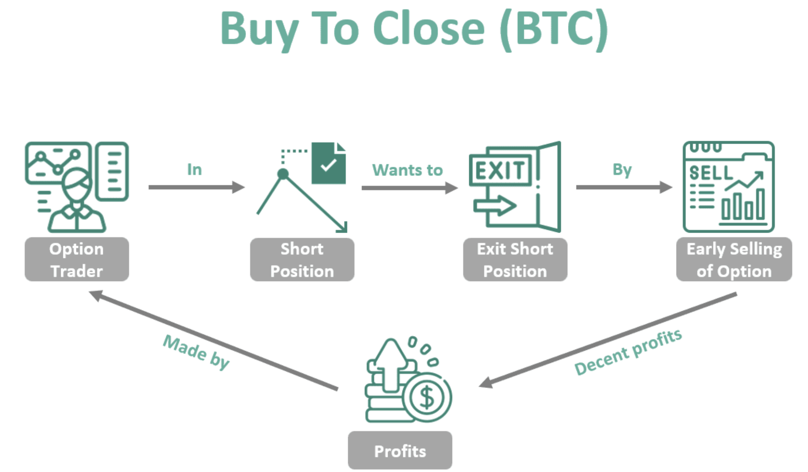

Options trading is a significant component of modern financial markets, offering investors the flexibility to hedge risk, speculate on price movements, and leverage positions with limited capital. Options are financial derivatives that derive their value from an underlying asset, typically stocks. They provide traders with the right, but not the obligation, to buy (call options) or sell (put options) the underlying asset at a predetermined price within a specified time frame. This characteristic allows options to be versatile tools for various trading strategies, including income generation, risk management, and portfolio diversification.

A key concept in options trading is the 'Buy to Close' order, which is crucial for managing open short option positions. When a trader sells an option to open the position, buying to close is necessary to exit that position. This action effectively retires the obligation associated with the initial sale and is often used to lock in profits or limit potential losses on short options.



Algorithmic trading, an innovation in financial markets, employs computer algorithms to automate trading strategies. Algorithms can process market data at high speed and execute orders efficiently, which is particularly advantageous in the complex and fast-paced environment of options trading. By incorporating algorithmic trading, traders can systematically implement strategies, reduce human error, and take advantage of fleeting market opportunities.

This article aims to explore how the 'Buy to Close' order fits within algorithmic trading strategies. Understanding this integration is essential for both novice and experienced traders seeking to optimize their trading tactics. As markets evolve, the synergy between options trading and algorithmic methods continues to enhance the potential for strategic financial gains. By examining the role of 'Buy to Close' in algorithmic frameworks, traders can better navigate the complexities of modern financial markets and improve their strategic decision-making processes.

## Table of Contents

## Understanding Options Trading

Options trading is a crucial component of financial markets, offering investors and traders a way to hedge risk, speculate on market movements, and enhance portfolio returns. At its core, options trading involves contracts that give the buyer the right, but not the obligation, to buy or sell an underlying asset at a predetermined price before a specified expiration date.

**Types of Stock Options: Calls and Puts**

There are two primary types of stock options: calls and puts. A call option grants the holder the right to purchase the underlying asset, such as stocks, at a specific price (known as the strike price) before the option's expiration. Conversely, a put option gives the holder the right to sell the underlying asset at the strike price within the same timeframe.

For example, owning a call option with a strike price of $50 means the holder can buy the stock at $50, regardless of its current market price. Similarly, a put option allows the holder to sell the stock at the predetermined strike price.

**Mechanics of Options Trading**

Options trading involves several key processes, including opening and closing positions. To open a position, traders either buy options (known as "long" positions) or write (sell) options (creating "short" positions). The complexity of options trading arises from the need to decide which option to opt for and the strategy to employ based on market predictions and personal investment goals.

Once a position is open, traders monitor market conditions to determine the optimal time for closing their position. This involves either buying or selling options—referred to as exercising the option or allowing it to expire worthless if it's not profitable to execute the trade.

**Role of Options in a Diversified Investment Portfolio**

Options can significantly augment a diversified investment portfolio by providing tools for hedging, speculation, and income generation. They allow investors to hedge against potential losses in other investments, speculate on stock price movements, and earn premium income through strategies like covered calls.

For instance, an investor who owns shares of a company might write a call option against the stock holdings—a strategy known as a covered call. This approach generates additional income from the premium if the option expires worthless, while also offering a cushion against potential downward price movements.

In summary, understanding the intricacies of options trading, such as the types of options available and the mechanics of trading, is essential for effectively incorporating these financial instruments into investment strategies. Options not only provide versatile opportunities for market engagement but also play a pivotal role in enhancing the risk-adjusted returns of a diversified portfolio.

## What is 'Buy to Close'?

The 'Buy to Close' order is a critical component of options trading, employed primarily to close or terminate an existing short option position. At its core, executing a 'Buy to Close' order involves purchasing an option that had previously been sold short, thereby closing out the position. This process is fundamental for traders seeking to realize profits or losses associated with the initial sale of options or to mitigate potential risks as contracts approach expiration.

Situations where 'Buy to Close' is typically used in trading include instances where a trader initially executes a 'Sell to Open' position. This action involves selling option contracts to initiate a position, with a 'Buy to Close' order later being used to [exit](/wiki/exit-strategy) the trade. For instance, if a trader believes an options premium will decrease, they might sell a call or put option and then later buy it back—once their market forecast materializes—to close the position at a lower price, thereby securing a profit.

The options market recognizes four primary order types: 'Buy to Open', 'Sell to Open', 'Buy to Close', and 'Sell to Close'. Each serves a distinct purpose:

- 'Buy to Open': Initiates a new long position by purchasing call or put options, signaling the start of a position.
- 'Sell to Open': Opens a new short position by selling options contracts, thus establishing a short exposure.
- 'Buy to Close': Closes an existing short position by purchasing the options initially sold, effectively closing the trade.
- 'Sell to Close': Terminates an existing long position by selling the options initially bought.

The strategic advantage of using 'Buy to Close' orders lies in their role in risk management and strategic positioning. Closing a short option through 'Buy to Close' allows traders to lock in profits or limit losses as market conditions evolve. By exiting the market when reaching predetermined profit targets or stop-loss levels, traders effectively manage their financial exposure.

Furthermore, 'Buy to Close' orders are instrumental in avoiding assignment risks associated with options contracts reaching expiration. When positions remain open, traders risk being assigned underlying assets or liabilities, which can lead to unfavorable financial obligations. Thus, judicious use of 'Buy to Close' orders contributes to an organized and disciplined approach to options trading.

In summary, 'Buy to Close' is a pivotal tool in the arsenal of options traders, enabling them to efficiently manage their positions, safeguard against risks, and capitalize on anticipated market movements. Whether aiming to crystallize gains or minimize losses, this order type plays an essential role in executing well-informed and timely trading decisions.

 to Algo Trading

Algorithmic trading, commonly known as algo trading, refers to the use of computer algorithms to automate trading decisions and execute orders in the financial markets. This method leverages mathematical models and complex formulas to make fast and efficient trading decisions, thereby minimizing human intervention. Historically, [algorithmic trading](/wiki/algorithmic-trading) gained traction in the late 20th century with the advent of advanced computing technologies and electronic trading platforms. Its development can be traced back to the 1970s when financial markets began adopting electronic systems to improve transaction efficiency.

At its core, algorithmic trading employs pre-defined instructions known as algorithms to determine parameters such as timing, price, and quantity of trading orders. These algorithms analyze a multitude of data, including historical price patterns, market conditions, and other quantitative metrics, to make informed decisions. A fundamental aspect of algo trading is its ability to process large volumes of data at high speeds, unattainable by human traders, thus transforming how trades are conducted.

One of the key advantages of algorithmic trading is its speed. Algorithms can execute complex calculations in milliseconds, allowing traders to capitalize on minute price differences across markets, commonly known as [arbitrage](/wiki/arbitrage). This speed not only increases trading volumes but also enhances market [liquidity](/wiki/liquidity-risk-premium). Moreover, algo trading offers improved efficiency by reducing or eliminating human errors associated with manual trading. The precision of algorithms ensures that trades are executed as planned, adhering strictly to the set strategies and objectives.

Risk management is another significant benefit provided by algorithmic trading. Algorithms can be programmed to include risk management protocols, such as stop-loss orders, which automatically sell a security if its price falls to a certain level. This feature mitigates potential losses by preventing trades that could be influenced by emotional decision-making. In addition, algos allow for [backtesting](/wiki/backtesting) of strategies on historical data to assess their viability and performance, further enhancing risk management capabilities.

Several platforms and tools are widely used for executing algorithmic trading strategies. Popular platforms include MetaTrader 4, [Interactive Brokers](/wiki/interactive-brokers-api), and TradeStation, which provide the necessary infrastructure for developing and deploying trading algorithms. These platforms often include powerful programming languages and libraries such as Python and R, which enable traders to create custom scripts and trading strategies. For instance, Python libraries like Pandas and NumPy can be used to handle and analyze data, while platforms such as QuantConnect and Quantopian offer researchers cloud-based environments to test and refine strategies.

In summary, algorithmic trading represents a significant advancement in trading technology, characterized by its automation, speed, efficiency, and robust risk management features. As computing power continues to evolve, and data analytics grow increasingly sophisticated, algo trading is poised to play an ever-expanding role in the global financial markets.

## Integrating 'Buy to Close' in Algorithmic Trading

Integrating 'Buy to Close' orders into algorithmic trading strategies involves both strategic planning and technical setup. These orders are used primarily to close short positions in options trading, and incorporating them effectively can optimize the management of options portfolios.

### Strategies for incorporating 'Buy to Close' into automated trading algorithms

An algorithmic trading strategy including 'Buy to Close' orders begins with identifying suitable scenarios for short position closure. A common strategy involves the use of market indicators to signal when a short option has reached optimal profitability or relative risk reduction, signaling that it's time to exit the position. Algorithms can be programmed to execute 'Buy to Close' orders when predefined criteria, such as price thresholds or time decay (Theta), are met.

For example:

```python
def should_buy_to_close(current_price, target_profit, initial_price):
    return (initial_price - current_price) >= target_profit

# Example usage - Initiate 'Buy to Close' if the target profit is achieved
initial_option_price = 5.00  # Original price when the option was sold
current_option_price = 1.50  # Current market price
target_profit = 3.00         # Desired profit target

if should_buy_to_close(current_option_price, target_profit, initial_option_price):
    print("Execute 'Buy to Close'")
```

With this script, 'Buy to Close' is executed automatically when the price of the short option allows the trader to achieve a set profit, thereby protecting gains and closing the trading cycle efficiently.

### Examples of algorithms that effectively execute 'Buy to Close' orders

One effective algorithm could be based on [volatility](/wiki/volatility-trading-strategies) trading strategies, where options positions are adjusted based on changes in implied volatility. 'Buy to Close' orders come into play by offsetting short options as the volatility environment changes, thus limiting potential losses during volatility spikes.

Another approach is the usage of [machine learning](/wiki/machine-learning) models that predict price movements or options Greeks (such as Delta, Gamma) to dynamically decide when to exit short positions systematically. These models can be trained using historical market data and continuously updated as new data becomes available. For instance, [reinforcement learning](/wiki/reinforcement-learning) can be applied to optimize the timing of 'Buy to Close' decisions in response to evolving market conditions.

### Technical setup required to integrate these strategies

Integrating 'Buy to Close' strategies into an automated trading system requires a robust technology infrastructure. Key components include:

1. **Data Feed Integration**: Access to real-time market data for price and volatility tracking is essential. This includes integration with an API provided by brokerage firms or market data providers.

2. **Algorithm Development Environment**: A programming environment such as Python or C++ to build, test, and deploy trading algorithms. Libraries like NumPy, pandas, and scikit-learn can be utilized for quantitative analysis.

3. **Order Management System (OMS)**: An OMS that supports direct market access (DMA) for executing 'Buy to Close' orders efficiently and automatically.

4. **Risk Management Tools**: Implementing stop-loss mechanisms and risk analytics tools to monitor and manage portfolio risk in real-time.

### Challenges and considerations in using 'Buy to Close' within algo portfolios

The integration of 'Buy to Close' orders into algorithmic trading portfolios presents challenges. Market volatility can introduce unpredictability, requiring algorithms to be adaptive and responsive to sudden changes.

Technical challenges include ensuring the latency of data feeds and order execution is minimized to prevent slippage. Furthermore, algorithms must be thoroughly backtested to validate their effectiveness and to understand their performance under various market conditions. Algorithms should also be regularly updated to adapt to new market behaviors and regulatory changes.

In conclusion, algorithmic strategies involving 'Buy to Close' orders offer a disciplined approach to managing options positions. By leveraging technology to automate these strategies, traders can enhance their efficiency and potentially improve their trading outcomes, although careful consideration must be given to the technical and market-related challenges that accompany this integration.

## Case Studies and Examples

In the exploration of real-world applications of "Buy to Close" orders within algorithmic trading, several case studies provide insightful examples. These studies illustrate how integrating "Buy to Close" orders into automated strategies can enhance trading efficiency and risk management while highlighting potential pitfalls and solutions for future implementations.

### Case Study 1: Leveraging Market Volatility

In a scenario where a trading firm implemented a volatility-based algorithm, "Buy to Close" orders were used primarily to manage risks associated with short call options. The firm’s strategy involved writing call options on high-volatility stocks and later buying them back using "Buy to Close" when market conditions shifted. By setting a threshold volatility level, the algorithm automatically executed these orders upon reaching or exceeding the set threshold, thereby reducing unwanted exposure.

**Outcome and Effectiveness:** This approach proved effective during market volatility peaks, such as quarterly earnings reports. The automated nature of the algorithm ensured prompt responses to market changes, leading to reduced losses during volatile swings.

**Lesson Learned:** The case study highlights the importance of developing algorithms that can adapt to market volatility. Incorporating mechanisms for dynamic threshold adjustments can further enhance the adaptability of algos using "Buy to Close" strategies.

### Case Study 2: Options Expiration Management

Another example involved an automated strategy focused on options nearing expiration. A trading desk employed "Buy to Close" orders to efficiently manage open positions as expiration dates approached. The algorithm was designed to monitor time decay (Theta) effects and automatically close positions close to expiration, avoiding unnecessary assignment risks.

**Outcome and Effectiveness:** Significant reduction in assignment losses was observed. The algorithm’s capability to monitor and react to time decay helped optimize the closure timing of positions, ensuring profitability and avoiding adverse outcomes.

**Lesson Learned:** This case study underscores the importance of incorporating time-decay elements into trading algorithms. A critical takeaway is the need for nuanced understanding and handling of greeks in options trading strategies.

### Case Study 3: Pair Trading in Index Options

In a complex [pair trading](/wiki/pair-trading) example, an investment firm executed a strategy involving index options. The strategy used historical price correlations between two major indices to identify trading opportunities. When divergences occurred, the algorithm deployed "Buy to Close" orders to unwind positions in the correlated index options once price convergence was detected.

**Outcome and Effectiveness:** The firm experienced improved risk-adjusted returns through this approach, as the use of "Buy to Close" helped minimize exposure once the trading signals indicated a profit target or correction.

**Lesson Learned:** Pair trading requires robust statistical models to assess correlations accurately. The success of this strategy with "Buy to Close" hinges on precise calibration of model parameters and continuous monitoring of the market conditions.

### Lessons for Future Implementations

These cases emphasize the necessity for robust algo frameworks capable of accommodating various market conditions. Key lessons include the development of dynamic trading thresholds, the critical integration of options greeks for strategic timing, and the requirement for statistical rigor in model construction. Future algorithmic strategies incorporating "Buy to Close" must prioritize adaptability and rigorous market analysis to optimize outcomes and mitigate risks effectively. 

Conclusively, the real-world application of "Buy to Close" within algorithmic frameworks showcases significant potential for optimizing options trading strategies, particularly in managing risk and enhancing return predictability.

## Risks and Limitations

Using 'Buy to Close' in options trading comes with certain risks and limitations that traders must navigate with care. A primary concern is the impact of market volatility. Options markets can be highly volatile, and swift price movements can affect 'Buy to Close' orders, leading to unexpected losses or reduced profits. During periods of high volatility, prices can gap, meaning the market price moves suddenly, making it challenging for algorithms to execute 'Buy to Close' orders at the intended price level.

Algorithmic strategies that incorporate 'Buy to Close' are particularly susceptible to these fluctuations. Algorithms are programmed to follow specific rules, which might not always adapt effectively to rapid market changes, potentially resulting in suboptimal order execution. This reliance on pre-set conditions necessitates a deep understanding of volatility measures, such as the implied volatility index (VIX), to adjust strategies proactively.

Another limitation of algorithmic systems is their intrinsic inflexibility and occasional lack of nuance. Algorithms process data and execute orders based on their coding without the ability to exercise judgment or adapt to unprecedented market conditions. Consequently, there is an inherent need for human oversight. Traders must regularly monitor algorithmic performance, making necessary adjustments to account for evolving market contexts. This oversight helps ensure that algorithms operate within acceptable parameters and adjust for any deviations from expected market behavior.

To mitigate these risks, traders employing 'Buy to Close' within algorithmic frameworks can adopt several strategies. Diversifying algorithmic strategies across different market conditions can reduce the impact of volatility on any single method. Additionally, implementing real-time monitoring systems that provide alerts on unusual market activity allows for timely human intervention. Algorithms can also be designed with dynamic thresholds that adjust based on recent volatility data, helping to optimize order execution during sudden market swings. Also, stress-testing algorithms under various simulated conditions before live deployment can identify potential vulnerabilities and prevent costly errors.

In summary, while 'Buy to Close' orders provide significant advantages in managing options positions, they require careful consideration when integrated into algorithmic trading strategies due to risks associated with market volatility and algorithmic limitations. Through vigilant oversight and strategic mitigation techniques, traders can better harness the power of algorithmic trading while managing these inherent challenges.

## Future Trends in Options Trading and Algo Integration

Emerging trends in options trading are increasingly influenced by advancements in algorithmic trading techniques. One significant trend is the growing sophistication of algorithms used to execute options trades, including complex strategies like 'Buy to Close'. As technology evolves, these algorithms are becoming more capable of handling intricate trading strategies with speed and precision.

Technological advancements are a key [factor](/wiki/factor-investing) driving these changes. High-frequency trading ([HFT](/wiki/high-frequency-trading-strategies)) technologies are continuing to evolve, providing traders with the ability to execute thousands of transactions in milliseconds. This speed is crucial in options markets, where prices can change rapidly. The use of smart order routing—which automatically routes orders to the most favorable market—is enhancing the efficiency and execution of 'Buy to Close' orders.

Artificial Intelligence (AI) and machine learning (ML) are playing significant roles in the evolution of options trading strategies. AI-powered algorithms can analyze vast amounts of market data to identify patterns and predict market movements with a high degree of accuracy. Machine learning techniques, such as neural networks and reinforcement learning, are used to optimize trading strategies in real-time, adapting to changing market conditions. For instance, a machine learning model can be programmed to optimize a 'Buy to Close' strategy by continuously analyzing price movements and volatility patterns:

```python
import numpy as np
from sklearn.ensemble import RandomForestClassifier

# Example data: features represent historical price and volatility data
X = np.array([[100, 1.2], [102, 1.3], [104, 1.5], [98, 1.4]])
y = np.array([1, 0, 1, 0])  # 1: execute 'Buy to Close', 0: hold

# Train a model
model = RandomForestClassifier()
model.fit(X, y)

# Predict action
new_data = np.array([[101, 1.35]])
action = model.predict(new_data)
```

Predictions for the future interaction between 'Buy to Close' orders and algo trading platforms suggest increased integration and automation. As algorithms become more adept at managing 'Buy to Close' transactions within dynamic markets, traders can expect improved execution times and reduced transaction costs. By leveraging AI and ML, these platforms can offer enhanced decision-making capabilities, further optimizing the conditions under which 'Buy to Close' orders are executed.

Looking ahead, the fusion of algorithmic trading with technologies like quantum computing and big data analytics is expected to revolutionize options trading further. Quantum computing, for example, has the potential to exponentially increase processing power, enabling algorithms to solve complex optimization problems and execute large-[volume](/wiki/volume-trading-strategy) trades almost instantaneously.

In conclusion, the landscape of options trading is set for continuous transformation, driven by technological innovations and the integration of sophisticated algorithms. As these advancements unfold, 'Buy to Close' orders, among other trading strategies, will benefit from higher efficacy and efficiency, reshaping trading tactics for both novice and experienced traders alike.

## Conclusion

The "Buy to Close" order holds a critical role in options trading, providing traders with a mechanism to exit a short option position by purchasing an equivalent option. This process not only finalizes the trader's obligation but also allows for profit realization or loss limitation based on market movements. The significance of "Buy to Close" thus lies in its ability to facilitate efficient position management and optimize portfolio strategies.

Integrating "Buy to Close" within algorithmic trading presents a blend of opportunities and challenges. Among its benefits is the automation of decision-making processes, allowing for rapid execution and increased precision in timing, which can be critical in volatile markets. Algorithmic approaches can handle vast datasets and identify ideal buy-to-close opportunities based on predefined criteria, reducing human error and emotional bias. However, the integration also faces challenges such as the need for complex technical setups and the potential for over-reliance on algorithms that may not fully adapt to unpredictable market conditions. Furthermore, implementing such strategies demands high-level coding skills and an in-depth understanding of market dynamics.

Looking forward, the potential of algorithmic trading to elevate options trading strategies is immense. As technology advances, the sophisticated analysis capabilities and execution speed afforded by algorithms can significantly enhance trading performance. Incorporating machine learning and [artificial intelligence](/wiki/ai-artificial-intelligence) can lead to the development of even more adaptive and predictive trading models. These advancements hold the promise not only of improved market entry and exit strategies but also of comprehensive risk management solutions.

Traders are encouraged to explore and innovate with "Buy to Close" strategies, maintaining an adaptable mindset. As the trading landscape evolves, incorporating diverse algorithmic techniques and being open to testing new models can provide a competitive edge. By effectively integrating "Buy to Close" orders into their automated trading systems, traders can enhance their ability to navigate the complexities of options trading dynamically.

## References & Further Reading

[1]: Bergstra, J., Bardenet, R., Bengio, Y., & Kégl, B. (2011). ["Algorithms for Hyper-Parameter Optimization."](https://papers.nips.cc/paper/4443-algorithms-for-hyper-parameter-optimization) Advances in Neural Information Processing Systems 24.

[2]: ["Advances in Financial Machine Learning"](https://www.amazon.com/Advances-Financial-Machine-Learning-Marcos/dp/1119482089) by Marcos Lopez de Prado

[3]: ["Evidence-Based Technical Analysis: Applying the Scientific Method and Statistical Inference to Trading Signals"](https://www.amazon.com/Evidence-Based-Technical-Analysis-Scientific-Statistical/dp/0470008741) by David Aronson

[4]: ["Machine Learning for Algorithmic Trading"](https://github.com/stefan-jansen/machine-learning-for-trading) by Stefan Jansen

[5]: ["Quantitative Trading: How to Build Your Own Algorithmic Trading Business"](https://books.google.com/books/about/Quantitative_Trading.html?id=j70yEAAAQBAJ) by Ernest P. Chan