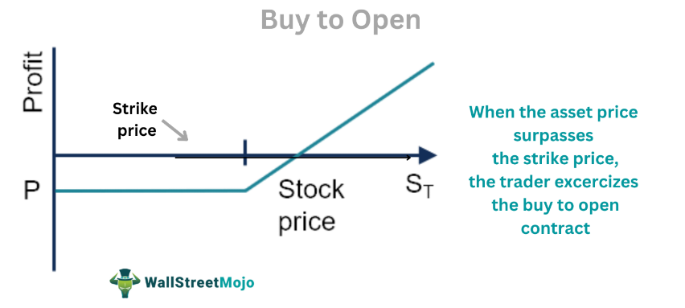

The stock market remains a pivotal arena for wealth generation and attaining financial security. Investors constantly seek strategies that optimize returns and minimize risks. Among an array of trading methodologies, 'buy to open' has stood out as a favorite for many, allowing traders to initiate a long position on a stock or option. This strategy aims to profit from an anticipated increase in the underlying asset's value.

The technological revolution has ushered in a new age of trading, prominently marked by the rise of algorithmic trading. By utilizing computer algorithms to execute trades, this approach capitalizes on speed and precision, surpassing the limitations of manual trading. Algorithmic trading has fundamentally changed the financial landscape, offering substantial benefits such as reduced transaction costs, enhanced liquidity, and minimized emotional biases.



This article explores the sophisticated nuances of the 'buy to open' strategy, addressing its core mechanics and timing. Furthermore, it elucidates how algorithmic trading strategies can significantly enhance trading efficiency. By leveraging data analytics and advanced models, traders can refine their approaches, optimizing performance and adapting to dynamic market environments.

Ultimately, readers will obtain a comprehensive understanding of how marrying traditional strategies like 'buy to open' with modern technological advancements, such as algorithmic trading, can redefine trading paradigms. The journey through this article promises a blend of timeless trading insights with cutting-edge technological applications, ensuring traders are well-equipped to navigate the evolving financial market landscape.

## Table of Contents

## Understanding 'Buy to Open' in Stock Trading

In stock market trading, 'buy to open' is a standard order type that investors use when they aim to establish a new long position in either a stock or an option contract. It is one of the basic mechanisms through which market participants enter the financial markets, enabling them to benefit from anticipated price increases in the selected securities. The central objective of a 'buy to open' order is to purchase shares or contracts with the expectation that the asset's value will rise, thus providing the opportunity for profit.

The process of 'buy to open' typically involves selecting a stock or option, deciding the number of units to buy, and executing the order through a brokerage platform. The price at which the order is placed can be determined by market conditions and the investor's strategy, with options to execute at current market prices or to specify a desired price point through limit orders. The timing of placing a 'buy to open' order is crucial and often hinges on thorough market analysis and strategic planning. Understanding market volatility and recognizing entry points require a solid grasp of market trends and potential catalysts that could influence price movements.

Case studies provide insight into the efficacy of the 'buy to open' strategy, especially in volatile scenarios. During periods of high market [volatility](/wiki/volatility-trading-strategies), seasoned traders have adeptly utilized 'buy to open' orders to capitalize on rapid price swings, transitioning in and out of positions to harness gains from short-term market movements. For instance, in times of earnings reports or economic announcements, quick 'buy to open' actions could lead to substantial returns if the analyst's predictions about market directions hold true.

There are common misconceptions about 'buy to open' orders that can mislead inexperienced investors. One misunderstanding is that all 'buy to open' orders guarantee profit, ignoring the inherent risks of market fluctuations. Another misconception is equating 'buy to open' with a guarantee of eventual sale; while purchasing opens a position, it necessitates a subsequent 'sell to close' action to realize gains or manage losses.

Investors can enhance their 'buy to open' strategies by analyzing historical data and employing technical indicators to forecast trends accurately. Tools such as moving averages, relative strength indices, and support/resistance levels can inform decisions on when to execute these orders. Additionally, aligning 'buy to open' decisions with broader economic indicators and news can provide a comprehensive strategy that balances potential rewards with the market's inherent risks. 

In conclusion, 'buy to open' is more than a transactional order; it is a strategic approach that enables investors to take advantage of market dynamics. By refining their understanding and application of this order type, traders can effectively navigate both stable and turbulent market environments.

 to Algorithmic Trading

Algorithmic trading refers to the use of computer algorithms to automate the process of buying and selling financial instruments in markets. It utilizes a set of pre-programmed instructions for trading, which take into account variables such as timing, price, and [volume](/wiki/volume-trading-strategy). These algorithms can execute trades at a speed and frequency that is impossible for a human trader, capitalizing on ephemeral market opportunities.

The evolution of [algorithmic trading](/wiki/algorithmic-trading) began in the 1970s with the introduction of electronic exchanges, which paved the way for more sophisticated trading strategies. By the early 2000s, technological advancements in computing power and data processing capabilities had significantly accelerated the adoption of algorithmic trading. Today, it is ubiquitous in global financial markets, employed extensively by institutional investors such as hedge funds, mutual funds, and pension funds, as well as growing in popularity among individual investors.

The appeal of algorithmic trading lies primarily in its efficiency and precision. Algorithms can analyze vast amounts of market data in milliseconds, executing trades based on real-time information. This reduces the latency associated with human decision-making and minimizes potential losses. Furthermore, algorithmic trading helps eliminate emotional interference from trading decisions. Human traders often fall prey to psychological biases such as fear and greed, which can adversely affect decision-making. By relying on data-driven algorithms, these biases are mitigated, leading to more consistent trading outcomes.

The benefits extend to enhanced [backtesting](/wiki/backtesting) capabilities. Traders can develop and refine strategies based on historical market data, ensuring their validity before deployment in actual market conditions. Additionally, algorithmic trading systems are adept at exploiting small price discrepancies across multiple markets, a strategy known as [arbitrage](/wiki/arbitrage), thus improving potential returns.

Key tools and technologies underlie the execution of algorithmic trading strategies. High-frequency trading ([HFT](/wiki/high-frequency-trading-strategies)) platforms, which emphasize low-latency execution, leverage co-location facilities that place trading servers close to exchange servers to minimize transmission delays. Machine learning algorithms are increasingly integrated to adapt strategies to evolving market conditions by recognizing patterns and anomalies within data streams. Furthermore, programming languages such as Python, C++, and Java are widely used to design and implement trading algorithms due to their versatility and robust libraries.

The infrastructure also encompasses advanced order placement technologies and risk management tools. Sophisticated real-time analytics systems are deployed to monitor market conditions and the performance of algorithms. The combination of algorithmic precision, high-speed execution, and advanced analytics equips traders with the tools necessary to navigate the complexities of modern financial markets effectively.

## Strategizing 'Buy to Open' with Algorithmic Trading

Integrating algorithmic trading systems can significantly optimize 'buy to open' strategies by enhancing precision, speed, and efficiency. These systems leverage mathematical models and algorithms to make informed trading decisions, executing orders at optimal times based on predefined criteria.

### Momentum-Based Models and Market-Making Algorithms

Momentum-based models capitalize on the continuation of existing market trends. These models identify securities exhibiting upward or downward [momentum](/wiki/momentum) and place 'buy to open' orders in anticipation of the trend persisting. The algorithm evaluates factors such as price velocity and trading volume to predict direction accurately. For instance, a simple momentum algorithm might examine moving averages:

```python
def calculate_momentum(prices, window=5):
    return prices[-1] - prices[-window]

prices = [102, 105, 107, 110, 112]
momentum = calculate_momentum(prices)
if momentum > 0:
    execute_buy_to_open_order()
```

Market-making algorithms, on the other hand, actively create [liquidity](/wiki/liquidity-risk-premium) by simultaneously placing buy and sell orders. These algorithms profit from the bid-ask spread and help ensure favorable prices for 'buy to open' strategies by stabilizing market volatility.

### Data Analytics and Backtesting

Data analytics plays a crucial role in developing robust 'buy to open' algorithms by enabling traders to interpret vast quantities of market data. Predictive analytics assesses potential future price movements, allowing algorithms to adjust strategies proactively. Backtesting, the process of evaluating an algorithm's effectiveness using historical data, is essential for validating strategies before their deployment in live markets. Traders analyze different scenarios to ensure high performance and risk management.

```python
import pandas as pd

def backtest_strategy(data, buy_threshold):
    results = []
    for price in data:
        if price > buy_threshold:
            results.append("Buy")
        else:
            results.append("Hold")
    return results

historical_data = pd.Series([100, 102, 104, 103, 105])
backtest_strategy(historical_data, buy_threshold=103)
```

### Risk Mitigation in Algorithmic 'Buy to Open' Trades

Mitigating risks associated with algorithmic 'buy to open' trades involves implementing stop-loss orders and diversification strategies. Algorithms can be programmed to trigger stop-loss actions automatically if a security's price falls below a specified level, thus minimizing potential losses. Furthermore, diversifying across different asset classes or sectors helps reduce exposure to market swings affecting a specific asset.

### Real-World Examples

Numerous real-world applications demonstrate the viability of algorithmic 'buy to open' methodologies. Hedge funds and investment banks commonly utilize these strategies; one instance involved a notable [hedge fund](/wiki/hedge-fund-trading-strategies) implementing momentum-based algorithms during a volatile market period, allowing it to outperform benchmarks significantly. Similarly, market-making algorithms are employed by firms like Virtu Financial to execute large volumes of trades efficiently while minimizing market impact through optimized 'buy to open' orders.

In conclusion, integrating algorithmic trading with 'buy to open' strategies offers traders the potential for increased accuracy and reduced emotional bias. By focusing on data-driven decision-making and rigorous testing, traders can devise strategies that stand resilient in the face of market uncertainties.

## Challenges and Considerations

Automating 'buy to open' strategies presents several challenges that traders must navigate effectively to reap the benefits of algorithmic trading. Understanding and addressing these challenges is crucial for both individual traders and institutional investors.

A significant initial challenge involves regulatory considerations and compliance issues. Algorithmic trading operates under the scrutiny of various financial regulatory bodies, which aim to ensure fair and transparent market practices. Regulatory frameworks, such as the Markets in Financial Instruments Directive II (MiFID II) in Europe and the Securities and Exchange Commission (SEC) guidelines in the United States, impose strict requirements on algorithmic trading systems. These include maintaining detailed records of algorithmic transactions, performance audits, and ensuring systems do not contribute to market abuse or instability. Traders must establish robust compliance protocols to align their algorithms with regulatory expectations, often requiring legal advice and regular audits by compliance professionals.

The ethical implications of algorithmic trading cannot be overlooked, particularly concerning the potential for market manipulation. High-frequency trading and other algorithmic strategies have been criticized for creating unfair advantages over traditional traders. Algorithms have the potential to execute large volumes of orders within milliseconds, possibly leading to activities like spoofing, where false orders are placed to manipulate the market's perception of demand and supply. To mitigate these risks, traders should incorporate ethical considerations into their strategy development, ensuring their algorithms do not engage in manipulative or unfair practices.

Continuous monitoring and adjustment of algorithms are essential due to the ever-evolving nature of financial markets. Market conditions can change rapidly, influenced by economic events, geopolitical developments, and technological advancements. An algorithm that performs well under certain conditions might fail dramatically in another. Implementing adaptive algorithms that can recalibrate themselves based on new data is critical. This adaptability can be achieved through [machine learning](/wiki/machine-learning) techniques that enable algorithms to evolve and optimize based on historical and real-time data analysis.

Technical and practical hurdles in automated trading include algorithm scalability, data integrity, and latency issues. Scalability ensures that trading systems can handle increasing amounts of data and transactions as markets grow. Data integrity is paramount, as algorithms depend on accurate and reliable data feeds to make decisions. Any discrepancies or inaccuracies in data input can lead to erroneous trades and financial losses. Addressing latency, the delay between order initiation and execution, is also crucial, especially in high-frequency trading. Traders need to employ technology with high processing speed, such as co-location services, where servers are placed close to exchange servers to reduce communication delays.

To overcome these challenges, traders should embrace iterative testing and simulation. Backtesting, using historical data to evaluate algorithm performance, helps identify potential pitfalls and optimize decision-making algorithms. Simultaneously, paper trading or demo accounts offer risk-free environments to test algorithm functionality before live deployment. Utilizing these tools minimizes risk and enhances confidence in deploying automated trading systems.

In conclusion, while the automation of 'buy to open' strategies presents a host of challenges, a well-structured approach incorporating regulatory compliance, ethical practices, continuous adjustment, and robust testing can position traders to harness the capabilities of algorithmic trading effectively.

## Conclusion

The "buy to open" strategy holds significant potential when enhanced through algorithmic trading, a combination that allows traders to capitalize on stock market opportunities with greater precision and speed. By leveraging algorithmic systems, traders can execute buy orders swiftly and efficiently, thus optimizing investment returns while minimizing human limitations and emotional biases. This technological edge is crucial in a market characterized by rapid fluctuations and high volatility.

For traders to fully utilize these advancements, it is essential to strike a balance between traditional methodologies and innovative technologies. While classic trading principles remain vital, integrating them with cutting-edge algorithmic strategies can provide a distinct competitive advantage. This synergy enables investors to navigate complex market dynamics more effectively and to devise strategies that are responsive to real-time data.

Continuous education and learning are paramount in the rapidly evolving landscape of stock market trading. As algorithmic trading tools and techniques advance, so too should the knowledge base of traders. Staying informed about market trends, technological developments, and regulatory changes is indispensable for both novice and seasoned investors who wish to refine their trading approaches and maintain relevance in the field.

Looking ahead, algorithmic trading is poised to play a transformative role in the execution of "buy to open" strategies. With advancements in machine learning, [artificial intelligence](/wiki/ai-artificial-intelligence), and data analytics, the potential to enhance decision-making processes is vast. These developments promise to revolutionize how traders interact with the market, providing more sophisticated tools to devise and implement strategies that are both efficient and adaptable.

Both new and experienced traders are encouraged to embrace innovation and adopt tools that amplify their market engagement. By doing so, they can hone their trading skills and potentially boost their financial outcomes. The future of "buy to open" strategies, fortified by algorithmic trading, points toward a more informed, analytical, and strategic approach to stock trading, offering exciting possibilities for those ready to evolve their trading practices.

## Additional Resources and Tools

To enhance your understanding of algorithmic trading and the intricacies of 'buy to open' strategies, consider exploring the following resources:

### Recommended Books and Courses

1. **Books**: 
   - *"Algorithmic Trading: Winning Strategies and Their Rationale"* by Ernie Chan offers a comprehensive foundation for traders looking to incorporate algorithms into their trading practices.
   - *"Building Winning Algorithmic Trading Systems: A Trader's Journey From Data Mining to Monte Carlo Simulation to Live Trading"* by Kevin J. Davey provides insights into creating sustainable trading systems.

2. **Courses**:
   - The course *"Algorithmic Trading and Finance Models with Python, R, and Stata Essential Training"* on platforms like Coursera or udemy offers practical insights into building trading models.
   - *QuantInsti's EPAT (Executive Programme in Algorithmic Trading)* is another reputable program tailored to aspiring quants.

### Trading Platforms and Software

For those specifically interested in executing 'buy to open' strategies with algorithmic precision, the following platforms and software are beneficial:

- **MetaTrader 5**: Popular for its diverse technical indicators and automated trading systems, MT5 supports algorithmic trading via Expert Advisors.
- **QuantConnect**: This platform enables users to develop and test algorithms using a wide variety of data sources, thanks to its integration with Python and C#.
- **Interactive Brokers**: Known for its robust API and extensive market access, it is ideal for traders seeking to implement complex algorithmic strategies.

### Online Communities and Forums

Engaging with communities can offer valuable insights and support:

- **Quantitative Finance Stack Exchange** is a vibrant forum where traders and developers discuss strategies, algorithms, and market trends.
- **r/algotrading** on Reddit presents a platform for both novice and experienced traders to share insights and resources.
- **Trade2Win** is an online trading community where discussions range from technical analysis to algorithmic trading.

### Starting with Demo Accounts

Before committing capital, utilize demo accounts to understand market behaviors and refine trading algorithms:

- Most platforms, including MetaTrader and Interactive Brokers, offer demo accounts replicating real market conditions.
- Utilize these resources to implement 'buy to open' strategies in simulated environments, ensuring the robustness of your algorithms.

### Latest Trends and Research

Stay informed with the latest trends and research in algorithmic trading:

- Research papers available on platforms like **ArXiv** and **SSRN** frequently publish cutting-edge studies on algorithmic trading techniques.
- **Kaggle** hosts competitions and datasets that can assist in developing and refining trading algorithms using real-world data scenarios.

By leveraging these resources and tools, traders can effectively enhance their understanding and efficiency in executing 'buy to open' strategies through algorithmic means. Continuous learning and adaptation remain key in this dynamic field.

## References & Further Reading

[1]: Chan, E. P. (2009). ["Quantitative Trading: How to Build Your Own Algorithmic Trading Business."](https://github.com/ftvision/quant_trading_echan_book) John Wiley & Sons.

[2]: Chan, E. P. (2013). ["Algorithmic Trading: Winning Strategies and Their Rationale."](https://github.com/ftvision/quant_trading_echan_book) John Wiley & Sons.

[3]: Davey, K. J. (2014). ["Building Winning Algorithmic Trading Systems: A Trader's Journey From Data Mining to Monte Carlo Simulation to Live Trading."](https://www.wiley.com/en-us/Building%20Winning%20Algorithmic%20Trading%20Systems:%20A%20Trader's%20Journey%20From%20Data%20Mining%20to%20Monte%20Carlo%20Simulation%20to%20Live%20Trading,%20%20%20Website-p-9781118778883) John Wiley & Sons.

[4]: Jansen, S. (2020). ["Machine Learning for Algorithmic Trading: Predictive Models to Extract Signals from Market and Alternative Data for Systematic Trading Strategies."](https://github.com/stefan-jansen/machine-learning-for-trading) Packt Publishing.

[5]: Lopez de Prado, M. (2018). ["Advances in Financial Machine Learning."](https://www.amazon.com/Advances-Financial-Machine-Learning-Marcos/dp/1119482089) John Wiley & Sons.