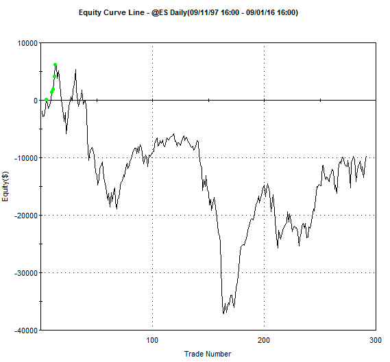

## Table of Contents

## What does 'Buy Weakness' mean in the context of investing?

'Buy Weakness' is a strategy in investing where you buy stocks or other assets when their prices go down. The idea is to buy these assets when they are 'weak' or cheaper, with the hope that their prices will go up later. This strategy is based on the belief that the market will eventually recognize the true value of the asset, and the price will recover.

This approach can be risky because it's hard to predict when the price will go back up. If you buy an asset when it's weak, it might keep getting weaker, and you could lose money. However, if you do it right and the price does recover, you could make a good profit. Many investors use this strategy because they believe in the long-term growth of the assets they are buying.

## Why might an investor choose to 'Buy Weakness'?

An investor might choose to 'Buy Weakness' because they believe the price of the asset will go up again in the future. When the price of a stock or another asset goes down, it can be a good chance to buy it for less money. If the investor thinks the asset is still good and will become more valuable later, buying it when it's weak can lead to big profits. This is like buying a favorite toy on sale, knowing that it will still be popular and worth more later.

However, this strategy can be risky. The price might keep going down after the investor buys it, and they could lose money. It's hard to know exactly when the price will start going up again. But some investors are okay with this risk because they believe in the long-term value of the asset. They might have done a lot of research and feel confident that the asset will recover and grow over time.

## What are the potential risks associated with buying weakness?

When you choose to 'Buy Weakness,' you are taking a risk that the price of the asset might keep going down. This means you could lose money if the price doesn't go back up. It's hard to know when the price will start to recover, and if you guess wrong, you might end up holding onto an asset that keeps losing value. This can be stressful and financially harmful if you're not prepared for it.

Another risk is that the reasons for the price drop might be more serious than you think. The company or asset might have big problems that won't go away soon. If the market doesn't believe in the company anymore, the price might not recover at all. This can lead to a permanent loss of your investment. It's important to do a lot of research and understand why the price dropped before deciding to buy.

Lastly, buying weakness can tie up your money for a long time. If you buy an asset hoping it will go up in value, you might have to wait a long time before you can sell it at a profit. During this time, you won't be able to use that money for other investments or needs. This can be a problem if you need the money sooner or if other investment opportunities come up that you can't take advantage of.

## How can one identify weakness in a stock or market?

To identify weakness in a stock or market, you can start by looking at the price. If the price of a stock is going down over time, that might mean it's getting weaker. You can also look at charts and graphs to see the trend. If the stock is making lower highs and lower lows, it's a sign of weakness. Another way to spot weakness is by watching the news and events that affect the company or the whole market. Bad news like a company losing money, a CEO leaving, or a big problem in the industry can make a stock weaker.

You can also use numbers to find weakness. Look at things like the company's earnings, how much money it's making, and its debts. If a company is not making as much money as before or if it's getting into more debt, these are signs of weakness. It's also helpful to compare the stock to others in the same industry. If other similar stocks are doing better, it might mean the one you're looking at is weak. Remember, it's important to look at many different things and not just one, to get a good idea of whether a stock or market is weak.

Lastly, paying attention to what other investors are doing can help. If a lot of people are selling a stock and not many are buying, this can push the price down and show weakness. You can see this in trading [volume](/wiki/volume-trading-strategy), which is how many shares are being bought and sold. High selling volume can be a sign that many people think the stock is weak. By combining all these different ways of looking at things, you can get a better picture of whether a stock or the whole market is weak and might be a good time to buy if you believe in its future.

## What are some common indicators used to determine when to buy weakness?

To figure out when to buy weakness, you can look at the stock's price. If the price keeps going down, it might be a good time to buy. You can use charts to see if the stock is making lower highs and lower lows. This shows the stock is getting weaker. Also, watching the news can help. If there's bad news about the company or the industry, like a company losing money or having big problems, it can make the stock weaker. This could be a chance to buy if you think the problems will get better.

You can also look at the company's numbers. If the company is making less money or getting into more debt, these are signs of weakness. Comparing the stock to others in the same industry can help too. If other similar stocks are doing better, it might mean the one you're looking at is weak. Another thing to watch is what other investors are doing. If a lot of people are selling the stock and not many are buying, it can push the price down. You can see this in the trading volume, which is how many shares are being bought and sold. High selling volume can be a sign that many people think the stock is weak. By looking at all these things together, you can decide if it's a good time to buy weakness.

## Can you explain the psychological aspects of buying weakness?

Buying weakness can be hard because it goes against what many people feel is safe. When a stock's price goes down, it can make people feel scared or worried. They might think the price will keep going down and they will lose money. This fear can make people want to sell their stocks instead of buying more. But some investors see this fear as a chance to buy. They think the stock is now cheaper than it should be and will go back up later. So, they need to be brave and not let their fear stop them from buying.

Another part of buying weakness is having hope and patience. When you buy a stock that's going down, you have to believe it will get better. This means you need to be patient and wait for the price to go back up. It can take a long time, and during this time, you might feel worried or unsure. But if you've done your homework and really believe in the stock, this hope can help you stick with your plan. It's all about staying calm and trusting that your research and understanding of the stock are right.

## How does the strategy of buying weakness differ across various asset classes?

The strategy of buying weakness can be different for different kinds of assets, like stocks, bonds, real estate, and commodities. For stocks, buying weakness means buying a company's shares when the price goes down. You might think the company is still good and will do better later. With bonds, buying weakness could mean buying bonds when their prices drop, often because people think the company or government that issued them might have trouble paying back the money. For real estate, buying weakness might mean buying a house or building when prices are low because of a bad market or other problems. You hope that the market will get better and the price will go up. Commodities, like gold or oil, might be bought when their prices fall because you think the price will go back up later.

Each asset class has its own risks and things to think about when buying weakness. Stocks can be risky because the company might keep doing badly, and the price might not go back up. Bonds can be safer, but if the issuer has big problems, you might lose money. Real estate can be good if you can hold onto it until the market gets better, but it can take a long time and you need a lot of money to start. Commodities can be hard to predict because their prices can change a lot because of things like weather or world events. So, when you're thinking about buying weakness, you need to understand the specific risks and chances for the kind of asset you're looking at.

## What historical examples illustrate successful buying of weakness?

One famous example of buying weakness is when Warren Buffett bought shares of American Express in 1964. At that time, American Express was in trouble because of a big scandal. The stock price dropped a lot, and many people were selling. But Buffett saw that the company was still strong and had a good future. He bought a lot of shares when they were cheap. Over time, American Express got better, and the stock price went way up. Buffett made a lot of money because he believed in the company and bought when others were scared.

Another example is when investors bought real estate during the 2008 financial crisis. When the housing market crashed, many people were scared and selling their homes for less money. But some investors saw this as a chance to buy houses at low prices. They believed that the market would get better in the future. Over time, the housing market did recover, and the prices went up. These investors made good profits because they bought weakness in real estate when others were too scared to buy.

## How do market cycles influence the effectiveness of buying weakness?

Market cycles play a big role in how well buying weakness works. A market cycle is like the ups and downs of the market over time. When the market is going down, or in a bear market, lots of stocks and other assets get cheaper. This can be a good time to buy weakness because you can buy things for less money. If you believe the market will go back up, or into a bull market, the prices of the assets you bought will go up too. You can make a good profit if you buy at the right time during a down cycle and hold on until things get better.

But, it's not always easy to know where you are in the market cycle. Sometimes, a market can keep going down for a long time, and if you buy weakness too early, you might lose money before things get better. It's important to look at other things too, like the economy, news, and how the company or asset is doing. If you understand the market cycle and can guess when it might turn around, buying weakness can be a smart move. But if you get it wrong, it can be risky.

## What are advanced techniques for timing the purchase during periods of weakness?

One advanced technique for timing the purchase during periods of weakness is using technical analysis. This means looking at charts and graphs to see patterns in how the stock's price is moving. You can use tools like moving averages, which smooth out the price over time, to find out if a stock is in a weak spot. If the price goes below the moving average, it might be a good time to buy because it shows the stock is getting weaker. Another tool is the Relative Strength Index (RSI), which tells you if a stock is overbought or oversold. If the RSI is low, it might mean the stock is weak and ready to go back up.

Another technique is using [fundamental analysis](/wiki/fundamental-analysis), which means looking at the company's financial health. You can check things like earnings, debts, and how much money the company is making. If a company's numbers are still good even though the stock price is going down, it might be a good time to buy. You can also look at the market as a whole and see if it's in a down cycle. If you think the market will go back up soon, buying during weakness can be a smart move. It's important to combine both technical and fundamental analysis to make the best decision on when to buy.

Lastly, some investors use sentiment analysis to time their purchases. This means looking at what other people are thinking and feeling about the stock or market. If a lot of people are scared and selling, it can push the price down. But if you think the fear is too much and the stock is still good, it might be a good time to buy. You can look at news, social media, and even surveys to see what the sentiment is. By understanding the mood of the market, you can find good times to buy weakness and make a profit later.

## How can quantitative analysis enhance the strategy of buying weakness?

Quantitative analysis can make buying weakness a better strategy by using numbers to find the right time to buy. It looks at things like how much a stock's price has changed, how much people are buying and selling, and other important numbers. By using math and special tools, you can see patterns that tell you when a stock is weak and might be a good time to buy. For example, if the numbers show that a stock's price has dropped a lot but the company is still doing well, it might be a good chance to buy. This can help you make smarter choices and not just guess when to buy.

Another way quantitative analysis helps is by taking away some of the feelings that can make investing hard. When you see a stock's price going down, it's easy to feel scared and not want to buy. But if you use numbers to guide you, you can stay calm and stick to your plan. You can set rules based on the numbers, like buying a stock when it reaches a certain price or when certain numbers show it's weak. This can make buying weakness less risky and more likely to work out well in the end.

## What are the long-term implications and considerations for a portfolio focused on buying weakness?

A portfolio that focuses on buying weakness can lead to big gains over the long term if the investor picks the right times to buy and holds onto the investments until they recover. When stocks or other assets go down in price, buying them can be a smart move if you believe they will go back up. Over many years, this strategy can help your portfolio grow because you are buying things at a lower price and selling them when they are worth more. However, it's important to do a lot of research and be patient. Not all stocks that go down will come back up, and some might take a long time to recover. So, you need to be ready to wait and have a good understanding of the companies or assets you are investing in.

On the other hand, focusing too much on buying weakness can make your portfolio riskier. If the market keeps going down or if the companies you invest in have big problems, you could lose a lot of money. It's also hard to know when the right time to buy is, and if you guess wrong, you might buy too early and see the price drop even more. To balance this, you might want to mix buying weakness with other investing strategies, like buying strong companies or spreading your money across different kinds of investments. This can help lower the risk and make your portfolio safer over the long term.

## References & Further Reading

[1]: Bergstra, J., Bardenet, R., Bengio, Y., & Kégl, B. (2011). ["Algorithms for Hyper-Parameter Optimization."](https://dl.acm.org/doi/10.5555/2986459.2986743) Advances in Neural Information Processing Systems 24.

[2]: ["Advances in Financial Machine Learning"](https://www.amazon.com/Advances-Financial-Machine-Learning-Marcos/dp/1119482089) by Marcos Lopez de Prado

[3]: ["Evidence-Based Technical Analysis: Applying the Scientific Method and Statistical Inference to Trading Signals"](https://www.amazon.com/Evidence-Based-Technical-Analysis-Scientific-Statistical/dp/0470008741) by David Aronson

[4]: ["Machine Learning for Algorithmic Trading"](https://github.com/stefan-jansen/machine-learning-for-trading) by Stefan Jansen

[5]: ["Quantitative Trading: How to Build Your Own Algorithmic Trading Business"](https://www.amazon.com/Quantitative-Trading-Build-Algorithmic-Business/dp/1119800064) by Ernest P. Chan