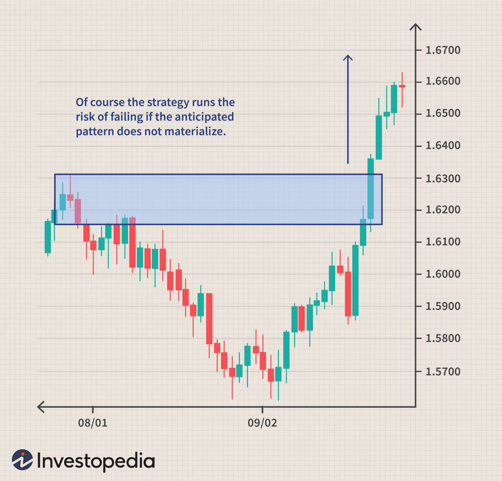

In today's dynamic financial landscape, understanding market trends is crucial for investors seeking to develop effective investment strategies. Navigating through the complexities of modern financial markets requires a keen awareness of how asset prices move and evolve over time. This awareness allows investors to anticipate potential market shifts and make informed decisions. Identifying emerging trends is the cornerstone of successful investing, as it enables market participants to capitalize on favorable conditions while avoiding potential downturns.

This article explores the importance of recognizing market trends and employs strategies like "buy weakness," which involves purchasing assets when they appear undervalued or during periods of market retracement. The buy weakness strategy is predicated on the fundamental investment principle of "buy low, sell high," aiming to take advantage of anticipated market reversals and subsequent price increases.



Furthermore, the role of algorithmic trading is highlighted in optimizing investment outcomes. Algorithmic trading, also known as algo trading, employs sophisticated computational algorithms to automate trading decisions with unparalleled speed and precision. By harnessing large datasets and pre-defined trading rules, algorithms can spot opportunities and execute trades at speeds unachievable by human traders.

The integration of these concepts—market trend analysis, buy weakness strategies, and algorithmic trading—provides investors with a comprehensive toolkit for maximizing returns. This article will discuss how these approaches function individually and how their combination can lead to enhanced investment efficiency and outcomes. Understanding these elements is essential for investors seeking not only to survive but thrive in the ever-evolving financial markets.

## Table of Contents

## Understanding Market Trends

Market trends signify the overarching direction in which a market or asset evolves over time, and their identification is crucial for investors aiming to make informed decisions. By discerning these patterns, investors can strategically position themselves to seize market opportunities, enhancing their portfolio's potential for growth.

Economic indicators are pivotal in recognizing market trends. These include metrics such as Gross Domestic Product (GDP) growth rates, unemployment rates, inflation figures, and interest rates. For example, a consistent increase in GDP over several quarters may indicate an expanding economy, likely influencing positive market trends. Conversely, rising unemployment or inflation can signal economic contraction, prompting investors to anticipate negative market movements.

Market sentiment is another vital component. It reflects the collective attitudes and emotional responses of investors towards market conditions, often serving as a self-fulfilling prophecy. Sentiment can be gauged through indicators like the Volatility Index (VIX), also known as the "fear index," which measures anticipated market [volatility](/wiki/volatility-trading-strategies). High VIX values typically suggest increased investor anxiety, potentially indicating a bearish trend, while low VIX values may point to complacency and a bullish outlook.

Geopolitical events are also influential, as they can cause sudden shifts in market trends. Events such as elections, international conflicts, and trade negotiations can create uncertainty or optimism, affecting both domestic and global markets. For instance, the resolution of a major trade dispute may lead to improved market confidence and result in upward trends.

Incorporating these indicators into an analytical framework allows investors to improve their trend recognition capabilities. For quantitative analysis, Python scripts utilizing libraries such as `pandas` and `numpy` can be employed to analyze historical data, identify patterns, and predict future market directions. A simple Python example to perform trend analysis might involve calculating a moving average to smooth out short-term fluctuations and highlight longer-term trends:

```python
import pandas as pd

# Sample data: 'price_data' is a DataFrame with 'Date' and 'Close' columns
price_data = pd.DataFrame({
    'Date': ['2023-01-01', '2023-01-02', '2023-01-03'],
    'Close': [100, 105, 102]
})
price_data['Date'] = pd.to_datetime(price_data['Date'])

# Calculate a 5-day moving average
price_data['5-Day MA'] = price_data['Close'].rolling(window=5).mean()

print(price_data)
```

Through such analytical techniques, investors can more accurately interpret market trends and align their investment strategies accordingly, ultimately fostering enhanced decision-making and capitalizing on emergent market opportunities.

## Investment Strategy: Buy Weakness

Buy weakness is an investment strategy that involves acquiring assets when their prices have retraced to specific support levels or appear undervalued in the broader market context. This strategy is rooted in the classic investment principle of "buy low, sell high," where investors aim to capitalize on anticipated market reversals and subsequent price increases.

Analogous to catching a market at its cyclical dips, the buy weakness approach seeks out moments when asset prices deviate temporarily from their longer-term upward trends. Investors who successfully identify these points can achieve gains as market conditions stabilize or rebound. Various technical analysis tools are utilized to enhance the execution of this strategy, notably trend channels and envelope channels.

Trend channels are graphical representations that trace the path of asset prices between parallel lines, signifying upward, downward, or sideways trends. When using trend channels, investors look for instances where asset prices touch the lower boundary, indicating potential buying opportunities within an upward trend. The assumption here is that prices are likely to rebound to either the channel's upper boundary or the midpoint, following the established trend direction.

Envelope channels, on the other hand, involve plotting two lines above and below a moving average, forming a channel that adapts to price volatility. When asset prices approach or cross the lower boundary of an envelope channel, it signifies an asset potentially trading below its intrinsic value, presenting a buy opportunity. Unlike fixed trend channels, envelope channels adjust dynamically, providing a more responsive detection of price weaknesses amidst fluctuating market conditions.

For quantitative validation of this strategy, mathematical models can be employed. Consider an algorithm that monitors price deviations from moving averages to signal potential buy points. In Python, a simplified approach could involve using the following code to identify buy signals based on historical price data:

```python
import pandas as pd

# Sample data: historical prices
data = {'Price': [100, 98, 97, 99, 96, 95, 97, 100, 102, 105]}
df = pd.DataFrame(data)

# Calculate moving average and envelope levels
df['MA'] = df['Price'].rolling(window=3).mean()
df['Lower_env'] = df['MA'] - df['MA'] * 0.02

# Identify buy signals
df['Buy_signal'] = df['Price'] < df['Lower_env']
print(df[['Price', 'Lower_env', 'Buy_signal']])
```

This code calculates a simple moving average and derives a lower envelope (2% below the moving average). Buy signals are generated when the asset's price falls beneath this calculated lower envelope.

The successful application of buy weakness strategies necessitates an in-depth understanding of market trends and careful evaluation of trading signals. This strategic foresight enables traders to anticipate market corrections and capitalize on potential price recoveries.

## Algorithmic Trading: An Advanced Approach

Algorithmic trading, often referred to as algo trading, represents a sophisticated approach to financial markets by utilizing computer algorithms to automate trade execution. These algorithms function on predefined instructions or rules which govern aspects like timing, price, and [volume](/wiki/volume-trading-strategy), thereby facilitating trades at speeds and frequencies beyond human capability.

Central to [algorithmic trading](/wiki/algorithmic-trading) is the ability of algorithms to process vast amounts of data to identify trading opportunities. This involves parsing through financial data, market news, and other indicators to optimize decision-making and enhance trading precision. The speed of modern computing allows for the real-time analysis of data, thus enabling algorithms to respond rapidly to market shifts.

There are several strategies within algorithmic trading, each designed to capitalize on different market behaviors and trends:

1. **Trend-Following Algorithms**: These algorithms are built to recognize and exploit patterns in market data. They systematically track the price movements and capitalize on upward or downward trends by buying or selling assets, respectively. Unlike human traders, trend-following algorithms can process multiple signals at once, react to market conditions in real-time, and adjust positions instantly. A simple example could be moving averages, where if the short-term average crosses above the long-term average, the algorithm generates a buy signal.

2. **Statistical Arbitrage**: This strategy involves taking advantage of price inefficiencies in the market. By employing mathematical models, statistical arbitrage seeks to identify and exploit price gaps between correlated securities. For instance, pairs trading is a common approach where two correlated stocks are simultaneously bought and sold to profit from divergences in their historical price relationships. For statistical arbitrage, these computations can involve mean reversion strategies that are statistically complex and involve rigorous backtesting.

```python
import numpy as np

# Example: Simple moving average crossover strategy
def moving_average(prices, window):
    return np.convolve(prices, np.ones(window), 'valid') / window

# Price data
prices = [101, 102, 103, 105, 108, 112, 115]

# Calculate 3-day and 5-day moving averages
ma_3_day = moving_average(prices, 3)
ma_5_day = moving_average(prices, 5)

print(f"3-Day Moving Average: {ma_3_day}")
print(f"5-Day Moving Average: {ma_5_day}")

# Generate signals: Signal = 1 (buy) if short-term MA > long-term MA, otherwise Signal = 0
signal = (ma_3_day[-len(ma_5_day):] > ma_5_day).astype(int)
print(f"Buy Signals: {signal}")
```

Algorithmic trading provides several benefits, including improved efficiency, reduced human error, and the ability to backtest trading strategies on historical data to validate their effectiveness. For instance, an algorithm can be programmed to test past market data to ensure that the strategy can yield profitable results before being applied to real markets. Moreover, by automating the decision-making process, algo trading reduces the emotional influences on trading, often leading to more consistent and disciplined trades.

The integration of powerful computing capabilities with financial strategies makes algorithmic trading an indispensable tool for modern traders. However, it requires diligent monitoring, continuous system updates, and comprehensive risk management to ensure success in fluctuating market environments.

## Integrating Buy Weakness and Algo Trading

Combining the 'buy weakness' strategy with algorithmic trading significantly improves the precision and efficiency of investment decisions. This integration leverages the strengths of both methodologies to automate and optimize trading activities. In essence, algo trading systems can be programmed to identify buy signals in markets experiencing temporary weakness. This automatic detection relies on predefined algorithms designed to recognize specific market patterns indicative of a buying opportunity, such as retracements or movements near established support levels.

The automated nature of algorithmic trading allows for rapid data processing, enabling the system to react to market changes with speeds unattainable by human traders. Algorithms can analyze variables such as price movements, volume changes, and historical data to ascertain the right moments for executing trades. For example, an algorithm might operate on the principle that when an asset’s price drops below its 50-day moving average but not beyond the 200-day moving average, a potential buy signal is generated due to the likelihood of price recovering.

This integration not only enhances execution timing but also provides consistency in strategy application. By deploying programs to handle trade executions, traders can minimize human error and emotional biases, which often distort trading decisions. Additionally, automated systems can conduct [backtesting](/wiki/backtesting) using historical data to optimize strategies against different market conditions, ensuring robustness and adaptability.

Consider the following simple Python code to illustrate a basic algorithm for buying weakness:

```python
import pandas as pd

def buy_weakness(data):
    data['50_MA'] = data['Close'].rolling(window=50).mean()
    data['200_MA'] = data['Close'].rolling(window=200).mean()
    buy_signals = []

    for i in range(len(data)):
        if data['Close'][i] < data['50_MA'][i] and data['Close'][i] > data['200_MA'][i]:
            buy_signals.append(data['Close'][i])
        else:
            buy_signals.append(None)
    return buy_signals

# Example usage with a DataFrame 'df' containing date-indexed closing prices
df['Buy_Signals'] = buy_weakness(df)
```

The integration of 'buy weakness' strategies with algorithmic trading thus offers a systematic approach to exploiting market inefficiencies. By automating the identification and execution of trades in weak markets, traders harness advanced computational power to mitigate risks associated with manual trading and to exploit transient market conditions effectively, ultimately seeking to maximize their returns.

## Risk Management and Considerations

Effective risk management is a cornerstone of any successful investment strategy, including those centered around the buy weakness approach and algorithmic trading. This crucial aspect ensures that potential losses are minimized while maximizing returns, thereby enhancing the overall sustainability of the investment portfolio.

One primary [factor](/wiki/factor-investing) to consider is market volatility. Volatile markets can present lucrative opportunities as well as substantial risks. To account for this, investors should develop strategies that dynamically adjust to market conditions. For instance, utilizing stop-loss orders can mitigate risks by automatically selling assets when they fall below a certain price level. This tactic helps prevent significant losses during sudden market downturns.

Another crucial element is algorithm reliability. When employing algorithmic trading, ensuring that the algorithms are robust, well-tested, and reliable is paramount. Faulty algorithms can execute trades based on erroneous signals, leading to financial losses. Regular audits of algorithmic performance and periodic updates are necessary to sustain reliability.

Transaction costs can significantly impact the profitability of frequent trading strategies, like those employed in algorithmic trading. High transaction costs can erode profits, particularly in high-frequency trading environments. Therefore, investors should seek trading platforms that offer competitive rates and consider these costs when calculating potential profits.

Backtesting and continuous monitoring play vital roles in validating investment strategies. Backtesting involves simulating the performance of a trading strategy using historical data. This process helps identify its potential strengths and weaknesses before applying it in real-time trading environments. A basic Python example of a backtesting framework might be:

```python
import pandas as pd

# Load historical data
data = pd.read_csv('historical_data.csv')

# Define a simple moving average strategy
data['SMA_50'] = data['close'].rolling(window=50).mean()
data['SMA_200'] = data['close'].rolling(window=200).mean()

# Generate buy/sell signals
data['Signal'] = 0
data.loc[data['SMA_50'] > data['SMA_200'], 'Signal'] = 1  # Buy
data.loc[data['SMA_50'] < data['SMA_200'], 'Signal'] = -1  # Sell

# Calculate strategy performance
data['Returns'] = data['close'].pct_change()
data['Strategy_Returns'] = data['Returns'] * data['Signal'].shift(1)

# Plot cumulative returns
(data['Strategy_Returns'] + 1).cumprod().plot(title='Strategy Performance')
```

Finally, continuous monitoring of trading strategies is essential to ensure they remain effective under evolving market conditions. Markets are dynamic, and what works in one environment may not in another. Therefore, investors should regularly review their strategies, incorporating real-time data and analytics to make informed adjustments.

In conclusion, meticulous risk management and consideration of key factors like market volatility, algorithm reliability, and transaction costs are vital for the successful implementation of buy weakness and algorithmic trading strategies. Through methods such as backtesting and continuous performance evaluation, investors can adapt their approaches, enhancing strategy robustness and investment outcomes.

## Conclusion

Understanding and leveraging market trends is key to successful investing in today's financial markets. Recognizing patterns and anticipating movements allow investors to act strategically, thereby optimizing returns. The integration of 'buy weakness' strategies and algorithmic trading provides investors with powerful tools to seize market opportunities with precision and agility. 

The 'buy weakness' strategy, centered on acquiring assets during price dips or support levels, aligns with the fundamental investment principle of 'buying low and selling high'. This approach benefits from identifying market reversals and capitalizing on subsequent upward [momentum](/wiki/momentum). Algorithmic trading enhances this strategy by automating the process, executing trades with speed and accuracy that surpass human capabilities. Algorithms designed to detect buying opportunities within these periods of weakness can effectively reduce latency in decision-making, thus improving the potential for positive outcomes.

Moreover, comprehensive strategies that combine traditional investment principles with advanced technology enable traders to maintain a competitive edge. The automated nature of algorithmic systems ensures that decisions are consistent and based on data-driven insights, reducing emotional biases that often hinder manual trading. By leveraging these systems, investors can balance risks associated with market volatility and optimize their investment approaches.

These refined strategies are not without challenges, as they demand continuous monitoring and adaptation to the ever-changing market conditions. Effective risk management techniques, such as backtesting and algorithm reliability assessments, are essential to validate and refine strategies over time.

In conclusion, a nuanced understanding of market trends, combined with the strategic deployment of 'buy weakness' and algorithmic trading, equips investors with the means to enhance returns and maintain a strategic advantage in the financial markets. By adopting these comprehensive approaches, investors can effectively navigate market fluctuations and capitalize on opportunities to achieve successful investment outcomes.

## References & Further Reading

[1]: Bergstra, J., Bardenet, R., Bengio, Y., & Kégl, B. (2011). ["Algorithms for Hyper-Parameter Optimization."](https://dl.acm.org/doi/10.5555/2986459.2986743) Advances in Neural Information Processing Systems 24.

[2]: ["Advances in Financial Machine Learning"](https://www.amazon.com/Advances-Financial-Machine-Learning-Marcos/dp/1119482089) by Marcos Lopez de Prado

[3]: ["Evidence-Based Technical Analysis: Applying the Scientific Method and Statistical Inference to Trading Signals"](https://www.amazon.com/Evidence-Based-Technical-Analysis-Scientific-Statistical/dp/0470008741) by David Aronson

[4]: ["Machine Learning for Algorithmic Trading"](https://github.com/stefan-jansen/machine-learning-for-trading) by Stefan Jansen

[5]: ["Quantitative Trading: How to Build Your Own Algorithmic Trading Business"](https://www.amazon.com/Quantitative-Trading-Build-Algorithmic-Business/dp/1119800064) by Ernest P. Chan