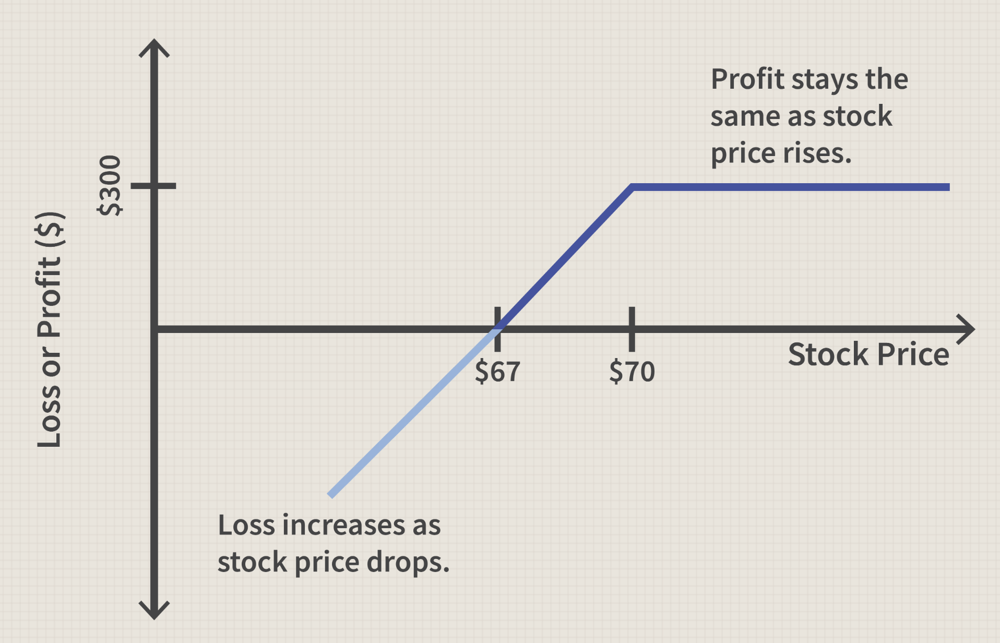

## Table of Contents

## What is the Buy-Write strategy?

The Buy-Write strategy, also known as a covered call, is an investment approach where an investor buys a stock and simultaneously sells a call option on that same stock. The main idea is to generate extra income from the option premiums while holding the stock. By selling the call option, the investor receives a payment upfront, which can help offset potential losses if the stock price goes down. However, this strategy also limits the potential profit if the stock price rises significantly, because the investor is obligated to sell the stock at the strike price of the call option if it is exercised.

This strategy is often used by investors who have a neutral to slightly bullish outlook on the stock. They are willing to sell their shares at a predetermined price in exchange for the premium income. The Buy-Write strategy can be a good way to generate additional income from a stock portfolio, but it does come with risks. If the stock price falls sharply, the premium income may not be enough to cover the losses. Additionally, if the stock price rises above the strike price of the call option, the investor misses out on any gains above that level. Therefore, it's important for investors to carefully consider their risk tolerance and market outlook before using this strategy.

## How does the Buy-Write strategy work?

The Buy-Write strategy is when you buy a stock and at the same time, sell a call option for that stock. When you sell the call option, you get money right away. This money is called the premium. You keep the premium no matter what happens to the stock price. The premium can help you if the stock price goes down because it gives you a little extra money to cover some of the loss.

However, there's a catch. If the stock price goes up a lot, you might miss out on some of the extra money you could have made. This is because when you sell the call option, you agree to sell your stock at a certain price, called the strike price, if someone decides to buy it from you. So, if the stock price goes above the strike price, you have to sell it at the lower strike price instead of the higher market price. This strategy is good if you think the stock will stay about the same or go up a little, but not too much.

## What are the benefits of using the Buy-Write strategy?

The Buy-Write strategy has a few main benefits. First, it can help you earn some extra money from your stock. When you sell the call option, you get paid right away. This money, called the premium, can help you if the stock price goes down because it gives you a bit of a cushion. It's like getting a little insurance on your stock. So, even if the stock doesn't do well, you still have the premium to make you feel better about it.

Second, the Buy-Write strategy can be good if you think the stock will stay about the same or go up just a little. You get to keep the premium no matter what happens, and if the stock does go up a bit but stays below the strike price, you can still sell it at that higher price. It's a way to make some money from your stock without having to sell it right away. This strategy can help you manage your investments better and maybe feel more secure about your stock choices.

## What are the risks associated with the Buy-Write strategy?

One big risk with the Buy-Write strategy is that you might miss out on big gains. If the stock price goes way up, you have to sell it at the strike price you agreed on when you sold the call option. So, you won't get to keep the extra money you could have made if you had just held onto the stock. This can be frustrating if the stock does really well, and you have to sell it for less than it's worth.

Another risk is that the premium you get from selling the call option might not be enough to cover your losses if the stock price drops a lot. The premium gives you a little cushion, but if the stock falls sharply, you could still lose money. It's important to think about how much risk you're okay with before you use this strategy. If you're not careful, you could end up losing more than you gain.

## Who should consider using the Buy-Write strategy?

The Buy-Write strategy is good for people who think their stock will stay about the same or go up a little bit. If you're okay with selling your stock at a certain price and you want to make some extra money from it, this strategy might work for you. It's like getting paid to wait and see what happens with your stock.

However, this strategy isn't for everyone. If you think your stock could go up a lot, you might not want to use the Buy-Write strategy because you could miss out on those big gains. Also, if you're worried about the stock price dropping a lot, you should think carefully because the extra money you get from selling the call option might not be enough to cover your losses. It's important to know how much risk you're comfortable with before you decide to use this strategy.

## How do you set up a Buy-Write position?

To set up a Buy-Write position, you first need to buy the stock you want to use for this strategy. Let's say you decide to buy 100 shares of a company. Once you have the stock, you then sell a call option on those same 100 shares. You choose a strike price and an expiration date for the call option. When you sell the call option, you get paid a premium right away. This premium is yours to keep no matter what happens to the stock price.

After setting up the Buy-Write position, you wait and see what happens with the stock. If the stock price stays below the strike price until the expiration date, the call option will expire worthless, and you keep both your stock and the premium. If the stock price goes above the strike price, the buyer of the call option might decide to exercise it, which means you have to sell your stock at the strike price. You still keep the premium, but you miss out on any gains above the strike price. This strategy can be a good way to earn extra income from your stock, but it's important to understand the risks involved.

## Can you provide a simple example of a Buy-Write strategy?

Let's say you buy 100 shares of a company called ABC for $50 each. That means you spend $5,000 on the stock. Now, you decide to use the Buy-Write strategy. You sell a call option for those 100 shares with a strike price of $55 and an expiration date one month away. Someone pays you $2 per share for the call option, so you get $200 right away. This $200 is the premium, and it's yours to keep no matter what happens to the stock price.

After a month, there are two possible outcomes. If the stock price of ABC stays below $55, the call option will expire worthless, and you keep both your 100 shares and the $200 premium. If the stock price goes above $55, the buyer of the call option might exercise it. You then have to sell your 100 shares at $55 each, which gives you $5,500. Even though you have to sell the stock, you still keep the $200 premium. So, in total, you made $700 from the stock ($500 from the stock price increase plus the $200 premium). But, if the stock price had gone above $55 and you hadn't sold the call option, you could have made more money by selling the stock at the higher market price.

## What are the key considerations when choosing stocks for a Buy-Write strategy?

When choosing stocks for a Buy-Write strategy, it's important to pick stocks that you think will stay about the same or go up a little bit. You don't want to choose stocks that you think will go up a lot because you might miss out on big gains if you have to sell them at the strike price. Also, make sure the stock is one you're okay with selling at the strike price you choose. If you really want to keep the stock for a long time, this strategy might not be right for you.

Another thing to think about is how much the stock moves around. Stocks that don't change price a lot are good for this strategy because they're less likely to go above the strike price. If the stock is very unpredictable, you might end up having to sell it at the strike price even if you didn't want to. Lastly, consider how much premium you can get for selling the call option. A higher premium can help cover some of the risk if the stock price goes down, but make sure the premium is worth the risk of missing out on potential gains.

## How does the Buy-Write strategy perform in different market conditions?

The Buy-Write strategy can do well in a market that's not going up or down a lot. If the stock price stays about the same or goes up just a little, you get to keep the premium you got from selling the call option. This extra money can help you if the stock price doesn't change much or goes down a bit. It's like getting paid to wait and see what happens with your stock. So, in a steady market, the Buy-Write strategy can be a good way to make some extra money from your stocks.

However, in a market that's going up a lot, the Buy-Write strategy might not be the best choice. If the stock price goes way above the strike price you set, you have to sell your stock at that lower price. This means you miss out on the extra money you could have made if you had just kept the stock. In a market that's going down a lot, the premium you got might not be enough to cover your losses. So, the Buy-Write strategy works best in a market that's not too wild, where the stock price stays pretty stable or goes up just a little.

## What are advanced techniques for optimizing a Buy-Write strategy?

One advanced technique for optimizing a Buy-Write strategy is to roll the call option. This means that if the stock price gets close to or goes above the strike price before the expiration date, you can buy back the call option you sold and sell a new one with a higher strike price or a later expiration date. This way, you can keep your stock longer and maybe get a bigger premium. Rolling the option can help you make more money if you think the stock will keep going up but not too fast.

Another technique is to use a dynamic strike price. Instead of [picking](/wiki/asset-class-picking) one strike price and sticking with it, you can change the strike price based on how the stock is doing. If the stock goes up a lot, you can sell a call option with a higher strike price to give the stock more room to grow. If the stock goes down, you can sell a call option with a lower strike price to get a bigger premium. This way, you can adjust your strategy to fit what's happening in the market and try to make the most money possible.

Lastly, you can use multiple expiration dates. Instead of selling just one call option with one expiration date, you can sell call options with different expiration dates. This is called a layered approach. By doing this, you can get premiums at different times and have more chances to make money. It also gives you more flexibility to adjust your strategy as the stock price changes. Using these advanced techniques can help you get the most out of your Buy-Write strategy, but they also make it more complicated, so make sure you understand them well before you try them.

## How does taxation affect the Buy-Write strategy?

When you use the Buy-Write strategy, taxes can change how much money you keep. If you sell a call option and it expires worthless, the premium you got is usually taxed as ordinary income. But if you have to sell your stock because someone exercises the call option, any profit you make from selling the stock is taxed as a capital gain. The tax rate for capital gains can be different depending on how long you held the stock. If you held it for more than a year, it's a long-term capital gain, which usually has a lower tax rate than short-term gains.

It's also important to know about the wash sale rule. If you sell a stock at a loss and then buy it back within 30 days, you can't use that loss to lower your taxes right away. This rule can affect your Buy-Write strategy if you're trying to use losses to offset gains. Always talk to a tax advisor to understand how the Buy-Write strategy will affect your taxes. They can help you plan better and make sure you're following all the tax rules.

## Can you discuss a case study where the Buy-Write strategy was effectively used?

In 2018, an investor named John decided to use the Buy-Write strategy on a stock he owned, XYZ Corporation. John bought 100 shares of XYZ at $40 each. He thought the stock would stay about the same or go up a little over the next month. So, he sold a call option with a strike price of $42 and an expiration date one month away. Someone paid John $1.50 per share for the call option, giving him a total premium of $150. This money was his to keep no matter what happened to the stock price.

Over the next month, the stock price of XYZ stayed below $42, and the call option expired worthless. John kept both his 100 shares of XYZ and the $150 premium. He was happy because he made extra money without having to sell his stock. If the stock price had gone above $42, John would have had to sell his shares at $42 each, but he still would have kept the $150 premium. This case shows how the Buy-Write strategy can work well when the stock price stays steady or goes up just a little.

John's successful use of the Buy-Write strategy helped him earn extra income from his stock. He was able to use the premium to cushion any small drops in the stock price. This strategy was a good fit for John because he had a neutral to slightly bullish outlook on XYZ Corporation. By using the Buy-Write strategy, John was able to manage his investments better and feel more secure about his stock choices.

## References & Further Reading

[1]: Whaley, R. E. (2002). ["Return and Risk of CBOE BuyWrite Monthly Index."](https://archive.org/download/wikipedia-scholarly-sources-corpus/10.3905.zip/10.3905%252Fjod.2002.319194.pdf) The Journal of Derivatives.

[2]: Hull, J. C. (2018). ["Options, Futures, and Other Derivatives"](https://www.semanticscholar.org/paper/Options%2C-Futures%2C-and-Other-Derivatives-Hull/89bdee500c8623864fc9eb7a471546aa713acc44) (9th Edition). Pearson.

[3]: Chincarini, L. B., & Kim, D. (2006). ["Quantitative Equity Portfolio Management: An Active Approach to Portfolio Construction and Management."](https://archive.org/details/quantitativeequi0000chin_c9d6) McGraw-Hill Education.

[4]: Fabozzi, F. J., Kolm, P. N., Pachamanova, D. A., & Focardi, S. M. (2007). ["Robust Portfolio Optimization and Management."](https://onlinelibrary.wiley.com/doi/book/10.1002/9781119202172) Wiley Finance.

[5]: Kissell, R. (2013). ["The Science of Algorithmic Trading and Portfolio Management."](https://www.sciencedirect.com/book/9780124016897/the-science-of-algorithmic-trading-and-portfolio-management) Academic Press.