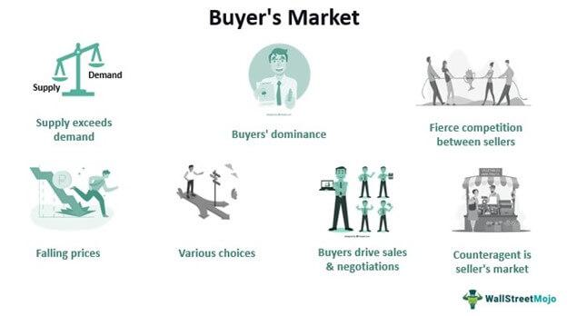

Understanding market dynamics is crucial for both investors and traders as it helps inform strategic decisions that can lead to profitability. Two prominent market environments are a buyer's market and a seller's market. A buyer's market occurs when the supply of goods exceeds demand, providing an advantage to buyers; conversely, a seller's market gives sellers an edge due to high demand and limited supply. Recognizing these market conditions helps participants make more informed decisions on when to buy or sell assets.

In today's financial markets, algorithmic trading plays a significant role in executing trades efficiently and effectively. Algorithmic trading, also known as algo trading, relies on software algorithms to carry out trades based on predefined criteria without human intervention. It minimizes the impact of human emotion and bias, allowing for more consistent and precise trading actions. By rapidly analyzing market data and executing orders, algorithmic trading can respond more swiftly to market changes than traditional trading methods.



This article will provide an examination of the characteristics of buyer's markets, using real-world examples to illustrate these concepts. Additionally, it will explore how algorithmic trading influences these market environments, particularly in terms of enhancing market efficiency and liquidity. Understanding both buyer's markets and the tools available to navigate them is essential for optimizing outcomes in ever-changing financial landscapes.

## Table of Contents

## Understanding a Buyer's Market

A buyer's market is characterized by an economic situation where the supply of goods or services surpasses the demand, thereby granting buyers a substantial advantage over sellers. This favorable condition for buyers is most prominently illustrated by lower prices and an increased inventory, as sellers are compelled to offer more attractive terms to secure sales.

Such markets can manifest across various sectors but are most prominently observed in real estate. In real estate, a buyer's market occurs when numerous properties are available, giving potential buyers the leverage to negotiate better deals. The abundance of options often results in properties spending more time on the market as sellers strive to entice the limited pool of interested buyers.

Several key factors contribute to the emergence of a buyer's market. One notable [factor](/wiki/factor-investing) is the influx of new sellers into the market, which typically increases the overall supply of goods or services. This can happen due to strategic market entries by companies or a demographic shift increasing property availability in real estate. Additionally, technological advancements in production methods can enhance efficiency, resulting in a greater supply of products without a corresponding rise in demand. For instance, automation in manufacturing can lead to increased production capacity, saturating the market and lowering prices.

Shifting consumer preferences also play a significant role in the development of a buyer's market. When consumers' tastes evolve or new trends emerge, demand for specific products or services may decline. This creates an oversupply of items that are no longer in high demand, prompting sellers to lower prices to encourage sales.

The dynamics of a buyer's market provide an interesting landscape for both sellers and buyers, with each group needing to adopt strategies to take advantage of or adapt to this economic setting. While buyers can enjoy the advantage of better terms and pricing, sellers must manage inventory effectively and employ strategies to stand out in a crowded market.

## Market Characteristics in a Buyer's Market

A buyer's market is characterized by conditions where supply exceeds demand, creating an advantageous environment for buyers. In such markets, prices are typically lower due to the surplus of available options. This abundance provides buyers with increased negotiating power, as sellers are often more willing to make concessions to attract potential buyers. Consequently, properties or products may remain on the market for extended periods as sellers compete for buyers' attention.

These market conditions frequently result from economic shifts that either increase the supply of goods or services or reduce consumer demand. Increased supply can be driven by new entrants in the market or advancements in technology that enhance production efficiency. For instance, in the real estate sector, a surge in construction can lead to an oversupply of housing, triggering a buyer's market.

On the demand side, factors such as changing consumer preferences, economic downturns, or technological obsolescence can diminish the desire for specific products or services, further contributing to a buyer's market. During such periods, buyers benefit from greater choice and potentially more favorable pricing, as sellers strive to stand out in a crowded marketplace.

## Examples of Buyer's Markets

A buyer's market is typified by conditions where supply surpasses demand, granting buyers a significant advantage. This scenario has been observed in various industries over time. A notable historical example is the real estate market during the mid to late 2000s, following the housing bubble burst. Leading up to the crisis, the market was characterized by rapidly escalating home prices, driven by speculative buying and easy access to credit. However, when the bubble burst, it resulted in a dramatic oversupply of housing units while demand dwindled. Consequently, home prices plummeted, and properties lingered on the market longer, providing potential buyers with diverse options and greater bargaining power. This marked shift transformed the real estate sector into a buyer's market, where buyers could negotiate better terms due to the abundance of available properties.

In contemporary times, technology markets frequently exhibit conditions conducive to a buyer's market, primarily due to rapid innovation and technological advancement. New models and revolutionary products emerge at a swift pace, saturating the market with options. This increases competition among manufacturers and sellers, often leading to reduced prices and improved features. For instance, consumer electronics such as smartphones, laptops, and other gadgets are subject to a quickly evolving landscape where frequent releases of new models render previous versions less desirable. Thus, sellers might offer discounts or bundle deals to clear inventories, benefiting the consumer. Such dynamics underscore how technological advancement can shift market power toward buyers, typifying a buyer's market in the tech industry.

## Algorithmic Trading: Definition and Role

Algorithmic trading employs computer programs to automatically execute trades in financial markets based on pre-established criteria. The primary aim is to reduce human intervention and emotion, thereby enabling more precise and rapid trading decisions. This mechanized approach is particularly beneficial in dynamic market conditions such as a buyer's market.

In a buyer's market, where supply outstrips demand, prices tend to be lower, and [algorithmic trading](/wiki/algorithmic-trading) can exploit these conditions effectively. Algorithms can detect small price fluctuations and inefficiencies more quickly than human traders, offering opportunities for profits by executing a large number of trades at high speed. By capitalizing on prevalent market conditions, algorithmic trading can optimize purchase decisions, particularly when inventory is high, and prices are competitive.

Several strategies are integral to algorithmic trading, each aligning with various market conditions:

1. **Trend-following**: This strategy is based on the premise that prices often exhibit trends, either upward or downward, over time. Algorithms employing trend-following strategies analyze historical price data to identify such trends and execute trades accordingly. For instance, if a security shows a consistent upward trend, the algorithm might initiate a buy order. Python libraries like `pandas` and `numpy` are frequently used for analyzing and identifying trends in historical price data.

   ```python
   import pandas as pd

   def simple_moving_average(prices, window):
       return prices.rolling(window=window).mean()
   ```

2. **Arbitrage**: Arbitrage exploits the price differences of the same asset across different markets. In a buyer's market, where competition among sellers can lead to price discrepancies, algorithms can quickly identify and act upon these arbitrage opportunities, buying low in one market and selling high in another.

   ```python
   def calculate_arbitrage_opportunity(price_market1, price_market2):
       return price_market1 - price_market2
   ```

3. **Market-making**: This strategy involves simultaneously providing buy and sell quotes for a given security, aiming to profit from the bid-ask spread. Algorithms can dynamically adjust pricing based on market conditions to maintain profitability. In markets with high inventory levels and low demand, market-making algorithms contribute to liquidity by facilitating more transactions.

Algorithmic trading's capacity to process vast amounts of data in real-time and execute trades based on complex strategies provides a significant advantage in buyer's markets. By minimizing emotional trading and maximizing data-driven decisions, algorithmic systems contribute to more efficient and effective market participation.

## Impact of Algorithmic Trading on Buyer's Markets

Algorithmic trading is a critical component in enhancing the efficiency and [liquidity](/wiki/liquidity-risk-premium) of buyer's markets, where supply often outstrips demand. In such market environments, buyers have the upper hand as there are more options available at potentially lower prices. Algorithmic trading systems, with their ability to execute trades based on pre-defined criteria, play a significant role in optimizing these advantages for buyers.

One of the primary benefits of algorithmic trading in a buyer's market is its capacity to enhance market efficiency. Efficient markets are characterized by the rapid incorporation of all available information into prices, which is facilitated by algorithmic systems that can process vast amounts of data in real-time. These systems are adept at identifying price discrepancies and opportunities quickly, allowing for prompt actions that can stabilize prices and reduce the spread between bid and ask prices. This increased efficiency ensures that buyers can operate in a market where prices more accurately reflect true values, reducing the risk of overpayment for assets.

Furthermore, algorithmic trading contributes to increased liquidity in buyer's markets. Liquidity refers to the ease with which assets can be bought or sold in the market without causing a significant price movement. High liquidity is advantageous for buyers because it ensures that they can acquire assets at stable prices and [exit](/wiki/exit-strategy) positions without substantial loss. Algorithms can execute large volumes of trades rapidly, continuously providing both buy and sell offers that facilitate the smooth operation of the market and empower buyers with greater negotiating power.

An example of algorithmic trading's impact can be illustrated through a simple Python script that identifies [arbitrage](/wiki/arbitrage) opportunities, one of the key strategies used by algorithms to promote market balance. The script could look something like this:

```python
# Sample Python code for detecting arbitrage opportunities
import numpy as np

# Simulated price data for an asset from two different exchanges
exchange_1_prices = np.array([100.5, 101.0, 101.5])
exchange_2_prices = np.array([100.0, 100.8, 101.2])

# Calculate the price differences
price_differences = exchange_1_prices - exchange_2_prices

# Identify arbitrage opportunities where the price difference exceeds a threshold
arbitrage_opportunities = np.where(price_differences > 0.5)[0]

print(f"Arbitrage opportunities found at indices: {arbitrage_opportunities}, exploiting price discrepancies.")
```

In fluctuating buyer's markets, such scripts allow algorithms to pinpoint pricing inefficiencies swiftly, enabling traders to capitalize on these opportunities. The result is a more balanced market where prices reflect genuine supply and demand dynamics, thereby benefiting buyers.

While the impact of algorithmic trading in buyer's markets is predominantly positive, it is essential to recognize the challenges it presents, such as the potential for increased [volatility](/wiki/volatility-trading-strategies). Nevertheless, when deployed judiciously, algorithmic trading offers substantial advantages to buyers by fostering a more efficient and liquid marketplace.

## Challenges and Considerations in Buyer's Markets with Algorithmic Trading

Algorithmic trading, while offering increased efficiency and the potential for profit, introduces unique challenges in a buyer's market. One primary concern is market volatility, exaggerated by the rapid execution of large volumes of trades. Algorithms executing trades in mere milliseconds can lead to increased price fluctuations. This high-frequency trading can destabilize the market, causing abrupt shifts in supply and demand dynamics.

The phenomenon of "flash crashes" exemplifies these challenges. Flash crashes are characterized by sudden, sharp declines in market prices, often driven by automated trading systems. These events highlight the potential risks in a heavily automated market environment. For instance, on May 6, 2010, the U.S. stock market experienced a dramatic flash crash where major indices plunged and then recovered in a matter of minutes. Investigations revealed that algorithmic trading played a critical role in this incident, amplifying price movements beyond what would occur with traditional human trading methods.

Regulatory bodies worldwide have recognized these risks, necessitating increased scrutiny over algorithmic trading practices. Regulations aim to ensure that these systems operate transparently and reliably, safeguarding market integrity. The introduction of circuit breakers, for instance, is a regulatory measure designed to halt trading temporarily in the event of severe price declines, allowing time for human intervention and assessment.

Moreover, algorithm transparency and reliability present technological challenges. Traders and developers must ensure that algorithms are thoroughly tested and robust against a range of market conditions. This includes implementing safeguards to prevent unintended market impacts, such as erroneous trades or the triggering of unintended cascading sell-offs.

In conclusion, while algorithmic trading can streamline operations in a buyer's market, it requires careful consideration of its challenges. Addressing market volatility, safeguarding against flash crashes, and ensuring compliance with regulatory standards are crucial for maintaining stability and trust in automated trading environments.

## Conclusion

Buyer's markets present unique opportunities and challenges for market participants. These environments, characterized by an excess supply over demand, allow buyers to negotiate better prices and terms. Such markets necessitate a strategic approach to maximize potential benefits while mitigating associated risks. Understanding the characteristics of buyer's markets, such as lower prices and increased inventory, is essential for informed decision-making.

Leveraging tools like algorithmic trading can significantly enhance the decision-making process for buyers. Algorithmic trading, by utilizing computer programs to execute trades based on predefined criteria, enables buyers to capitalize on price fluctuations swiftly and efficiently. These systems are adept at identifying market trends, arbitrage opportunities, and price discrepancies. For buyers, especially in low-demand environments, algorithmic trading provides a mechanism to enhance market efficiency and liquidity, ensuring that they transact at the most advantageous prices.

Navigating the balance between technology and traditional market knowledge is crucial for sustained success in buyer's markets. While algorithmic trading offers advanced capabilities to optimize trading strategies, understanding traditional market dynamics and human behavior remains equally important. This holistic approach, integrating both technological tools and conventional market analysis, is key to thriving in buyer's markets. Buyers who can adeptly combine these elements are better positioned to exploit opportunities, minimize risks, and achieve favorable outcomes.

## References & Further Reading

[1]: Bergstra, J., Bardenet, R., Bengio, Y., & Kégl, B. (2011). ["Algorithms for Hyper-Parameter Optimization."](https://dl.acm.org/doi/10.5555/2986459.2986743) Advances in Neural Information Processing Systems 24.

[2]: ["Advances in Financial Machine Learning"](https://www.amazon.com/Advances-Financial-Machine-Learning-Marcos/dp/1119482089) by Marcos Lopez de Prado

[3]: ["Evidence-Based Technical Analysis: Applying the Scientific Method and Statistical Inference to Trading Signals"](https://www.amazon.com/Evidence-Based-Technical-Analysis-Scientific-Statistical/dp/0470008741) by David Aronson

[4]: ["Machine Learning for Algorithmic Trading"](https://github.com/stefan-jansen/machine-learning-for-trading) by Stefan Jansen

[5]: ["Quantitative Trading: How to Build Your Own Algorithmic Trading Business"](https://www.amazon.com/Quantitative-Trading-Build-Algorithmic-Business/dp/1119800064) by Ernest P. Chan