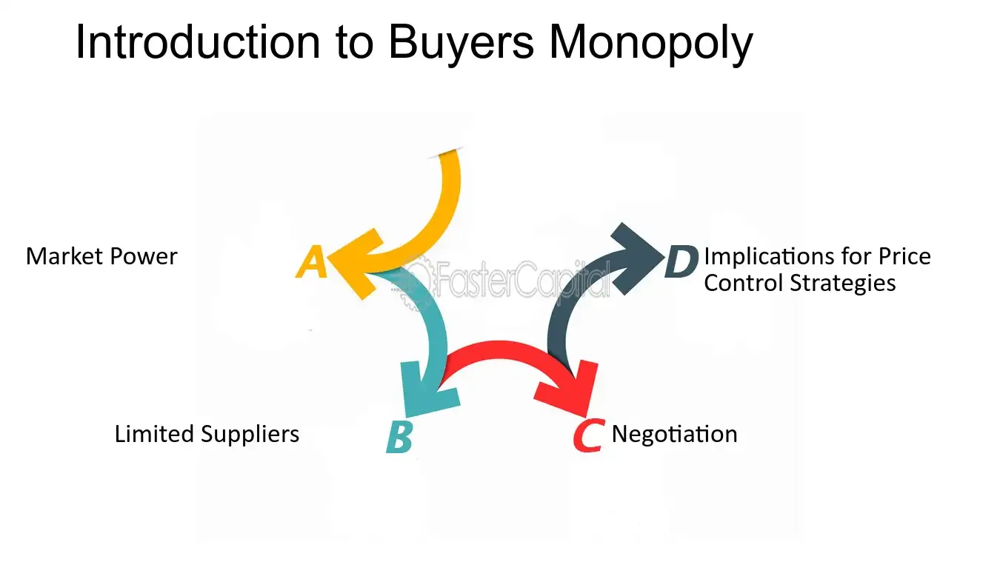

## Table of Contents

## What is a buyer's monopoly?

A buyer's monopoly, also known as a monopsony, is when there is only one buyer in a market. This is the opposite of a regular monopoly, where there is only one seller. In a buyer's monopoly, the single buyer has a lot of power over the sellers because they are the only one buying the product or service. This means the buyer can set the prices lower than in a normal market, where there are many buyers and sellers.

This situation can be tough for the sellers because they have no other place to sell their goods or services. They might have to accept lower prices or worse terms just to make a sale. For example, a small town with only one big employer can be seen as a buyer's monopoly. The employer is the only buyer of labor in the town, so they can pay workers less than they might earn in a place with more job options.

## How does a buyer's monopoly differ from a seller's monopoly?

A buyer's monopoly, or monopsony, is when there's only one buyer in a market. This gives the buyer a lot of power because sellers don't have anyone else to sell to. The buyer can set lower prices because the sellers need to sell to them. It's like if you were the only person buying apples in a town, you could tell the farmers you'll only pay a little for their apples, and they'd have to agree because you're their only option.

A seller's monopoly, or just monopoly, is the opposite. It's when there's only one seller in a market. This gives the seller a lot of power because buyers don't have anyone else to buy from. The seller can set higher prices because buyers need to buy from them. It's like if you were the only person selling apples in a town, you could charge a lot for them, and people would have to pay because you're their only option.

These two situations are different because they flip the power from one side to the other. In a buyer's monopoly, the buyer has all the power and can push prices down. In a seller's monopoly, the seller has all the power and can push prices up. Both can be hard on the side with less power, whether it's the sellers in a buyer's monopoly or the buyers in a seller's monopoly.

## What are some common examples of buyer's monopolies?

One common example of a buyer's monopoly is in a small town with only one big employer. In this situation, the employer is the only buyer of labor in the town. Workers don't have many other job options, so the employer can pay lower wages than they might in a bigger city with more employers. This gives the employer a lot of power over the workers, who have to accept the lower wages because they need the job.

Another example can be seen in some agricultural markets. For instance, if there's only one big company buying a certain type of crop from farmers in a region, that company can set the prices low. Farmers have to sell their crops to this company because there are no other buyers, so they have to accept whatever price the company offers, even if it's not enough to make a good profit. This shows how the buyer's monopoly can affect the sellers, in this case, the farmers.

## What are the key characteristics of a buyer's monopoly?

A buyer's monopoly, or monopsony, happens when there is only one buyer in a market. This gives the buyer a lot of power because sellers don't have anyone else to sell to. The buyer can set the prices lower than they would be in a normal market with many buyers and sellers. Sellers might have to accept these lower prices because they need to sell their goods or services to the only buyer available.

This situation can be tough for the sellers because they have no other options. They might have to agree to worse terms just to make a sale. For example, in a small town with only one big employer, the employer can pay workers less because there are no other jobs around. The workers have to accept the lower wages because they need the job. This shows how a buyer's monopoly can affect the sellers by giving the buyer a lot of control over the market.

## How does a buyer's monopoly affect market dynamics?

A buyer's monopoly changes how a market works by giving all the power to the one buyer. This means the buyer can set the prices lower than usual because sellers have nowhere else to go. They have to sell to this one buyer or not sell at all. This can make it hard for sellers because they might not make as much money as they would in a normal market with lots of buyers.

In a market with a buyer's monopoly, sellers might have to agree to worse terms just to make a sale. For example, if a town has only one big employer, that employer can pay workers less because there are no other jobs around. The workers have to accept the lower wages because they need the job. This shows how a buyer's monopoly can make the market less fair for sellers, who have to deal with the buyer's control over prices and terms.

## What are the potential benefits of a buyer's monopoly for the buyer?

In a buyer's monopoly, the buyer has a lot of power because they are the only one buying. This means they can set the prices lower than they would be in a normal market. When the buyer can pay less for things, it saves them money. For example, if a company is the only one buying a certain kind of apple, they can tell the farmers they will only pay a little for the apples. The farmers have to agree because they need to sell their apples to someone.

The buyer can also set the terms of the deal. They might ask for better quality or faster delivery, and the sellers have to agree because they don't have other buyers. This helps the buyer get what they want more easily. For example, a big employer in a small town can pay workers less and ask them to work longer hours because the workers don't have other job options. This gives the buyer more control over the market and helps them get better deals.

## What are the potential drawbacks of a buyer's monopoly for suppliers?

In a buyer's monopoly, suppliers face big problems because they only have one buyer to sell to. This means they can't go to other buyers if they don't like the price or the terms the one buyer offers. The buyer can set the prices very low because they know the suppliers have no other choice. This can make it hard for suppliers to make enough money to keep their business going. They might even have to sell their products at a loss just to stay in business.

Suppliers might also have to agree to other bad terms just to make a sale. For example, they might have to deliver their products faster or make them to a higher standard without getting paid more for it. This can be really tough on the suppliers because they have to do more work or spend more money to meet the buyer's demands, but they don't get anything extra in return. Over time, this can make it very hard for suppliers to stay in business because they are always under pressure from the one buyer.

## How can a buyer's monopoly be established?

A buyer's monopoly can be set up in a few ways. One way is when a company becomes the only one buying something in an area. For example, if a big company is the only one buying apples from farmers in a region, it can set the price low because the farmers have no one else to sell to. Another way is when a town has only one big employer. This employer is the only one hiring workers, so they can pay less because there are no other jobs around. This gives the employer a lot of power over the workers.

Sometimes, laws or rules can help create a buyer's monopoly. If the government makes it hard for new buyers to enter a market, the existing buyer can stay the only one. This can happen if there are a lot of rules to follow or if it costs a lot of money to start buying in that market. When there are no other buyers, the one buyer can control the prices and terms, making it hard for sellers or workers to get a fair deal.

## What legal and ethical considerations must be addressed in a buyer's monopoly?

In a buyer's monopoly, there are important legal and ethical issues to think about. Legally, laws against anti-competitive behavior might come into play. If a buyer is using their power to set very low prices or bad terms, it might be against the law. Governments often have rules to stop one buyer from taking too much control over a market. These rules try to make sure that sellers and workers are treated fairly and can make a living. If a buyer's monopoly breaks these rules, they could face fines or other punishments.

Ethically, a buyer's monopoly raises questions about fairness. When one buyer has all the power, it can hurt the sellers or workers who depend on them. It might not be right for a buyer to pay very low prices or demand too much from sellers just because they can. People might see this as taking advantage of others who don't have a choice. Companies in a buyer's monopoly should think about how their actions affect others and try to be fair, even if the law doesn't force them to. Treating others well can help build a better relationship and a more balanced market in the long run.

## How do government regulations impact buyer's monopolies?

Government regulations can have a big effect on buyer's monopolies. Laws against anti-competitive behavior are meant to stop one buyer from having too much power in a market. If a buyer is using their power to set very low prices or bad terms, they might be breaking the law. Governments can step in to make sure that sellers and workers are treated fairly and can make a living. This might mean fines or other punishments for the buyer if they don't follow the rules.

These rules help to balance the market and protect those who might be hurt by a buyer's monopoly. By making it easier for new buyers to enter the market, governments can break up a buyer's monopoly and give sellers more options. This can lead to fairer prices and better terms for everyone involved. Without these regulations, a buyer's monopoly could keep its power and continue to set low prices or bad terms, which would be hard on the sellers and workers who depend on them.

## What strategies can suppliers use to negotiate with a buyer's monopoly?

When suppliers are dealing with a buyer's monopoly, they can try to work together with other suppliers. If they join forces, they can have more power when they talk to the buyer. This way, they can ask for better prices or terms because they are not alone. It's like if all the apple farmers in a region decide to work together and say they won't sell their apples for less than a certain price. The buyer might have to agree because they need the apples.

Another thing suppliers can do is look for new buyers or markets. Even if it's hard, finding other places to sell their products can give them more choices. This can make the buyer's monopoly less powerful because the suppliers have other options. For example, if a company is the only one buying a certain type of apple, the farmers might try to sell their apples in another region or even another country. This can help them get better prices and terms from the original buyer because they are not stuck with just one option.

## How might technological advancements influence the power of a buyer's monopoly?

Technological advancements can change the power of a buyer's monopoly by giving suppliers new ways to reach buyers. For example, if farmers can use the internet to sell their apples directly to people far away, they don't have to depend on the one buyer in their area. This means they can get better prices because they have more options. Technology can also help suppliers work together more easily. They can use online tools to talk and plan how to ask for better prices or terms from the buyer's monopoly. This teamwork can make them stronger and help them negotiate better deals.

On the other hand, technology can also make a buyer's monopoly stronger. If the buyer uses new technology to control the market better, they can keep their power. For example, if a big employer uses software to keep track of workers and set their pay, they can make sure they are paying the lowest possible wages. Technology can also help the buyer find out more about what the suppliers need and use that information to set even lower prices. So, while technology can help suppliers in some ways, it can also make things harder for them if the buyer uses it to stay in control.

## How does it compare with Traditional Monopoly?

Monopsony, or buyer's monopoly, and traditional monopoly, or seller's monopoly, represent unique market structures where a single market participant holds significant market power. Despite both being considered price makers, they differ fundamentally in their domains. Monopolies dominate the sale of a product or service, whereas monopsonies have substantial control over the purchase of a [factor](/wiki/factor-investing) of production, such as labor.

In a traditional monopoly, the monopolist sets prices higher than in a competitive market, leading to reduced quantities sold and higher profit margins. The monopolist maximizes profit where marginal cost (MC) equals marginal revenue (MR), resulting in consumer surplus loss and creation of deadweight loss. The formula for a monopolist's profit maximization can be represented as:

$$
MR = MC
$$

Conversely, a monopsonist influences the market by determining the price it pays for goods or services. A monopsonist will purchase a quantity where marginal expenditure (ME) equals marginal value (MV), which is typically lower than that in competitive markets. The monopsonist thus forces down prices paid to suppliers, including labor, often leading to reduced supplier welfare and production.

Economic impacts on market efficiency and consumer welfare vary across these structures. Monopolies tend to reduce consumer choice and inflate prices, negatively affecting consumer welfare and creating inefficiencies. Monopsonies, on the other hand, may lead to underpayment for resources or labor, affecting income distribution and possibly causing a reduction in overall market supply.

Examining case studies further elucidates the nuances of these market structures. A prominent example of a traditional monopoly is a utility provider, such as a water company, which often experiences little to no competition and has the liberty to set prices to maximize profits. In contrast, monopsony is exemplified within labor markets, such as a major manufacturing plant in a small town being the predominant employer, thereby wielding significant influence over wage levels.

Both structures confirm the limitations of market efficiency inherent to non-competitive environments. Monopolies might restrict output and inflate prices, whereas monopsonies suppress input costs, potentially leading to an underutilization of resources. Therefore, market regulation can be crucial in mitigating the adverse effects associated with both monopolistic and monopsonistic behavior to ensure fair competition and protect market participants.

## What is the relationship between Algorithmic Trading and Market Structures?

Algorithmic trading, a method utilizing automated and pre-programmed trading instructions to execute trades based on variables like price, time, and [volume](/wiki/volume-trading-strategy), significantly alters market dynamics. In monopsonistic markets, where a single buyer has considerable market influence, [algorithmic trading](/wiki/algorithmic-trading) can both amplify and mitigate monopsony power.

Algorithms refine pricing strategies by analyzing vast datasets rapidly and identifying subtle patterns that human traders might overlook. In a monopsonistic context, this allows the buyer to optimize their purchasing strategy by anticipating market moves and adjusting their bids accordingly. For instance, an algorithm might analyze supply fluctuations and automatically adjust purchasing quantities to maintain favorable prices.

Consider the problem of determining the optimal price $P^*$ at which a monopsonist should purchase a given asset. One approach is to minimize the average cost, $AC$, across a set of potential prices $P$. The average cost can be defined as:

$$
AC(P) = \frac{\sum_{i=1}^{n} P_i \cdot Q_i}{\sum_{i=1}^{n} Q_i}
$$

where $P_i$ is the price at time $i$, $Q_i$ is the quantity purchased at time $i$, and $n$ is the total number of transactions considered. The optimal price $P^*$ minimizes this average cost.

```python
import numpy as np

def optimal_price(prices, quantities):
    total_cost = np.sum(prices * quantities)
    total_quantity = np.sum(quantities)
    average_cost = total_cost / total_quantity
    return average_cost

prices = np.array([100, 95, 105])
quantities = np.array([10, 15, 10])
optimal_price = optimal_price(prices, quantities)
print("Optimal Price: ", optimal_price)
```

Algorithmic trading can also democratize market intelligence, thus potentially reducing the monopsonist's power. Algorithms provide real-time insights that are accessible to multiple market participants, leading to more transparent pricing and reducing the buyer's ability to exert undue influence.

The intersection of monopsony and algorithmic trading presents both challenges and opportunities. On the one hand, it could exacerbate market inefficiencies if a dominant buyer leverages algorithms to manipulate prices subtly. On the other hand, the widespread use of sophisticated algorithms could encourage more competitive practices, increase [liquidity](/wiki/liquidity-risk-premium), and lead to efficient market-clearing prices.

However, challenges arise concerning data privacy, market manipulation risks, and the need for robust regulatory frameworks that adapt to the rapid evolution of technology. These considerations are crucial to ensure that the benefits of algorithmic trading are realized without exacerbating the inherent inequalities in monopsonistic structures. As technology continues to advance, ongoing assessment will be essential to balance market power and promote fair trading practices.

## References & Further Reading

[1]: Robinson, Joan, "The Economics of Imperfect Competition," Second Edition. Macmillan Education UK, 1969.

[2]: Blair, Roger D., and Harrison, Jeffrey L., "Monopsony in Law and Economics," Cambridge University Press, 2010.

[3]: Ashenfelter, Orley, and Krueger, Alan, "Theory and Evidence on Employer Collusion in the Franchise Sector," IZA Discussion Paper No. 11672, July 2018.

[4]: Bulow, Jeremy and Pfleiderer, Paul, "A Note on the Effect of Cost in Imperfect Competition," Journal of Political Economy, Vol. 91, No. 1, 1983, pp. 194–200.

[5]: Van Weele, Arjan, "Purchasing and Supply Chain Management," Cengage Learning EMEA, 2018.