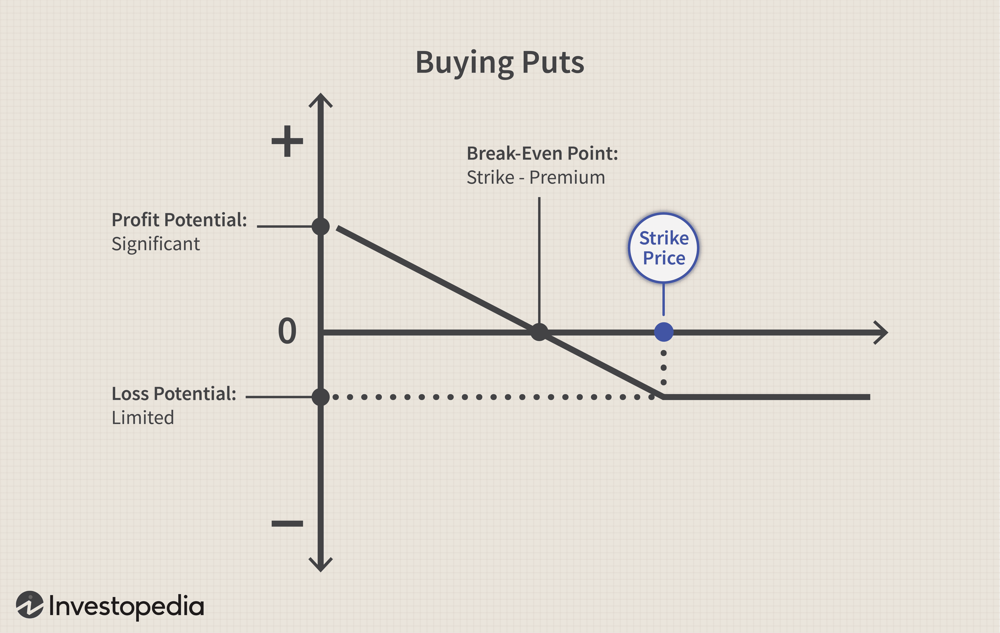

Understanding investment strategies in financial markets can be a challenging endeavor due to the dynamic and complex nature of global economies and trading systems. Among the myriad strategies available, buyer's options and algorithmic trading have emerged as significant components that modern investors and traders increasingly utilize.

A buyer's option is a type of financial contract that permits the holder flexibility in purchase decisions. Unlike traditional contracts that bind the buyer to a specific quantity, a buyer's option offers strategic advantages by allowing the buyer to decide on the amount to purchase at a future date, typically within a set timeframe. This flexibility can be particularly advantageous in fluctuating markets, where price volatility might impact purchasing decisions. Familiarizing oneself with these options is essential for today's investors, as they can be found in commercial contracts and auctions, potentially influencing various market sectors.



Algorithmic trading, on the other hand, represents the automation of trading strategy execution using sophisticated computer programs. By leveraging the speed and efficiency of computer processing, algorithmic trading can analyze massive sets of market data and execute trades swiftly, often capitalizing on market opportunities that may be missed by human traders. These algorithms might employ a variety of strategies, including trend-following, arbitrage, and statistical analysis. The incorporation of algorithms into trading not only enhances precision but also reduces the emotional biases traditionally involved in manual trading.

This article seeks to provide a comprehensive exploration of buyers' options and algorithmic trading, elucidating their roles, implications, and the way they are harnessed in modern investment strategies. By understanding the mechanisms and applications of these concepts, investors can better navigate the intricate landscape of today's financial markets, enhancing their capability to make informed and strategic investment decisions.

## Table of Contents

## Understanding Buyer's Options

A buyer's option is a distinctive financial contract that grants the purchaser the flexibility to decide on the quantity of an asset to buy without the obligation to commit to a predetermined volume. This flexibility presents a strategic advantage in various commercial contexts by allowing the buyer to adjust to market conditions and better manage financial exposures.

Unlike typical contracts which often enforce strict requirements about quantities and delivery schedules, buyer's options offer buyers an element of contingent decision-making. This can be particularly useful in industries where price [volatility](/wiki/volatility-trading-strategies) is high, as buyers can optimize the purchase [volume](/wiki/volume-trading-strategy) according to the market price at the time of execution.

In commercial contracts, buyer's options are often employed to manage inventory levels effectively or to hedge against price swings. For example, within the commodities market, businesses may use buyer’s options to secure favorable prices for raw materials while retaining the flexibility to adjust order sizes based on forecasted demand, protecting against either shortage or surplus. In auctions, these options can enable participants to bid on multiple lots without committing to purchasing all of them, allowing for strategic participation that aligns with budget constraints and competitive behavior.

The benefits of buyer's options to buyers include the flexibility to adapt purchase decisions based on market conditions, potential cost savings during times of price declines, and optimized resource allocation. Sellers, on the other hand, might benefit from securing a committed customer base and potentially premium option fees. However, the chief detriment to sellers is the risk of uncertain demand, as they must prepare to fulfill potential purchases while also facing the possibility that buyers may not exercise their options if market conditions are unfavorable.

Legal considerations governing buyer's options are significant, particularly in the context of the Uniform Commercial Code (UCC) in the United States, which standardizes transactions involving personal property. Under the UCC, buyer's options are evaluated in terms of their enforceability, with attention to the specifics of the contract language defining the option's scope, duration, and exercise conditions. Legal scrutiny ensures that the rights and obligations of both buyers and sellers are clearly articulated, mitigating disputes and fostering smoother commercial interactions.

In summary, buyer's options present a unique financial tool that provides flexibility and strategic advantage to purchasers while posing both opportunities and challenges for sellers. Understanding these dynamics, along with the legal framework governing them, is crucial for effectively leveraging buyer's options in modern commercial practices.

## Algorithmic Trading: An Overview

Algorithmic trading stands as a pivotal innovation in financial markets, characterized by the use of computer programs to execute trading strategies without the need for direct human intervention. These algorithms leverage the speed and computational power of modern computers to analyze vast amounts of market data, detecting patterns and executing trades in milliseconds. This process not only enhances trading precision but also significantly reduces the likelihood of emotion-driven decisions, which can often lead to suboptimal trading outcomes.

One primary strategy employed in [algorithmic trading](/wiki/algorithmic-trading) is trend-following, where the algorithm identifies and capitalizes on ongoing market trends to make profitable trades. This method assumes that markets exhibit identifiable patterns that can be quantitatively tracked over time. For example, a trend-following algorithm may utilize moving averages to spot upward or downward trends in stock prices and execute trades accordingly.

Arbitrage is another widely used strategy, where traders exploit price discrepancies of the same asset across different markets. This strategy relies heavily on the rapid execution capabilities of algorithmic systems. The time-sensitive nature of [arbitrage](/wiki/arbitrage) opportunities makes human execution impractical, while algorithms can efficiently identify and capitalize on these fleeting opportunities.

Statistical analysis is also a crucial component of algorithmic trading. Algorithms may use statistical models to forecast price movements based on historical data, identifying opportunities that may not be visible through standard technical analysis. Techniques such as linear regression, neural networks, or support vector machines are commonly employed to build predictive models that guide trading decisions.

The integration of options in algorithmic strategies allows for the execution of more complex trades. Options, which provide the right but not the obligation to buy or sell an asset at a predetermined price, offer algorithms additional flexibility. By incorporating options, algorithms can devise strategies that hedge against potential losses or leverage positions for amplified gains. The combination of options with algorithmic trading enhances risk management capabilities, as strategies can be designed to adjust dynamically to market conditions.

Key benefits of algorithmic trading include improved risk management through tighter control over trading parameters and increased precision in executing trades at optimal prices. Furthermore, the elimination of human bias and emotion enables a more systematic and consistent trading approach, often resulting in better overall performance. Importantly, algorithmic trading systems also enable continuous market monitoring, allowing for rapid response to changes and opportunities in the market environment.

## Integrating Buyer's Options in Algorithmic Trading

Integrating buyer's options into algorithmic trading strategies can provide significant flexibility and precision in executing trades. A buyer's option, by allowing the holder to determine whether or not to complete a purchase, offers strategic leeway which algorithmic trading systems can tactically exploit to maximize returns and minimize risks.

Leveraging buyer's options within algorithmic trading strategies introduces a dynamic dimension to automated systems. This integration can enhance the adaptability of trading strategies, particularly in volatile or rapidly changing market conditions. Algorithms can be programmed to evaluate market conditions continuously and execute trades based on pre-defined criteria, utilizing buyer's options to delay commitment until the most opportune moment. This capability can transform how firms approach cost management and hedge against potential losses.

For instance, consider an automated trading algorithm that uses buyer's options to engage in commodities trading. By incorporating a buyer's option into the algorithm, the trader can set criteria such as a favorable market price or increased demand before deciding to purchase. This results in a more flexible trading strategy that can readily adapt to economic forecasts and real-time market data.

To illustrate, let's consider Python code that automates this integration:

```python
import random

def evaluate_market_conditions():
    # Simulate a process to evaluate current market conditions
    return random.choice(['favorable', 'unfavorable'])

def execute_trade(conditions):
    if conditions == 'favorable':
        print("Executing trade based on buyer's option.")
    else:
        print("Waiting for better market conditions.")

# Simulating the use of buyer's options in an algorithmic strategy
def trading_algorithm():
    current_conditions = evaluate_market_conditions()
    execute_trade(current_conditions)

# Run the simulation
trading_algorithm()
```

The above code simulates the decision-making process where the trading algorithm evaluates current market conditions before executing a trade, leveraging the flexibility inherent in buyer's options.

Case studies provide concrete examples of integrating buyer's options and algorithmic trading. For instance, a financial institution might use this hybrid strategy in foreign exchange markets to capitalize on currency fluctuations. By setting algorithms to automatically execute trades when market conditions align with the parameters set forth in the buyer's option contracts, the institution can achieve optimal pricing and minimize risk exposure.

Successful integration yields several benefits, including increased precision in executing trades, the ability to react swiftly to market changes, and enhanced risk management. The combination of buyer's options and algorithmic trading can redefine operational efficiencies and strategic planning, positioning investors and financial institutions to better navigate the complexities of modern markets.

In conclusion, integrating buyer's options into algorithmic trading systems demonstrates a pragmatic approach to harnessing the strengths of both strategies. As technology continues to evolve, these combined strategies are likely to play a crucial role in shaping future investment landscapes.

## Risk Management and Optimization

Efficient risk management is a cornerstone of both buyer's options and algorithmic trading, particularly in volatile markets. Implementing robust risk management strategies can significantly mitigate exposure and safeguard investments. One primary approach is diversification, which involves spreading investments across various assets to reduce the impact of any single market movement. Additionally, employing stop-loss orders can help limit potential losses by automatically executing trades once an asset reaches a predetermined price level.

In algorithmic trading, optimization techniques are crucial for enhancing performance, especially when implementing complex strategies. By optimizing algorithms, traders can ensure that their strategies are executed with maximum efficiency. This often involves fine-tuning trading parameters and improving computational efficiency. For instance, using [machine learning](/wiki/machine-learning) models to predict asset price trends can provide a competitive edge. These models can analyze historical data and identify patterns, allowing algorithms to make informed trading decisions.

Backtesting plays a critical role in strategy refinement and risk adjustment, allowing traders to evaluate the performance of their algorithms using historical data. By simulating trades over past market scenarios, traders can assess the effectiveness of their strategies and make necessary adjustments. Code examples in Python, such as using libraries like `pandas` and `numpy`, can facilitate this process:

```python
import pandas as pd
import numpy as np

# Load historical data
data = pd.read_csv('historical_prices.csv')

# Calculate moving average
data['MA'] = data['Close'].rolling(window=20).mean()

# Example trading strategy
def trading_strategy(prices):
    signals = []
    for i in range(1, len(prices)):
        if prices['Close'][i] > prices['MA'][i] and prices['Close'][i-1] <= prices['MA'][i-1]:
            signals.append('buy')
        elif prices['Close'][i] < prices['MA'][i] and prices['Close'][i-1] >= prices['MA'][i-1]:
            signals.append('sell')
        else:
            signals.append('hold')
    return signals

data['Signal'] = trading_strategy(data)

# Backtesting to evaluate strategy
def backtest_strategy(data, initial_balance=1000):
    balance = initial_balance
    position = 0
    for i in range(len(data)):
        if data['Signal'][i] == 'buy' and balance >= data['Close'][i]:
            position = balance / data['Close'][i]
            balance = 0
        elif data['Signal'][i] == 'sell' and position > 0:
            balance = position * data['Close'][i]
            position = 0
    return balance

final_balance = backtest_strategy(data)
print(f"Final balance: ${final_balance}")
```

Continuous monitoring is another essential component of effective risk management, ensuring that algorithms adapt to changing market conditions. This involves tracking real-time market data and adjusting strategies when deviations from expected market behavior occur.

Anticipating unforeseen disruptions requires a proactive stance, often incorporating scenario analysis and stress testing. These practices simulate extreme market conditions to understand potential impacts on trading systems and identify ways to mitigate such risks.

In conclusion, a holistic approach to risk management and optimization is vital for navigating the complexities of buyer's options and algorithmic trading. By utilizing a combination of diversification, algorithm optimization, [backtesting](/wiki/backtesting), continuous monitoring, and scenario analysis, traders can enhance their strategies' resilience and ensure robust investment performance in dynamic market environments.

## Future Trends and Considerations

The future of financial markets is poised for significant transformation due to technological advancements. A key area of development is algorithmic trading, where increased computational power and [artificial intelligence](/wiki/ai-artificial-intelligence) are expected to drive more sophisticated trading strategies. Emerging trends suggest a growing reliance on machine learning techniques to predict market movements, enabling traders to develop adaptive algorithms that can respond to real-time data with minimal human intervention.

In terms of buyer's options, advancements are likely to focus on enhancing flexibility and reducing transaction costs. Digital platforms using blockchain technology may offer innovative ways to streamline these financial contracts, thus improving enforceability and transparency. These platforms could allow for more efficient pricing mechanisms in auctions and commercial contracts, thereby expanding the use of buyer's options in diverse financial settings.

Potential innovations in these domains include quantum computing applications that could revolutionize data processing speeds, further refining predictive models and optimization techniques in trading. Additionally, decentralized finance (DeFi) ecosystems might integrate algorithmic trading with buyer’s options, providing novel avenues for investment strategies and contract execution without traditional financial intermediaries.

Ethical considerations are paramount as algorithmic trading and buyer's options evolve. Algorithm biases, data privacy, and the societal implications of automated trading systems highlight the need for robust ethical frameworks. Concerns about market manipulation through high-frequency trading and the potential for systemic risks underline the necessity for comprehensive regulatory oversight.

Regulatory challenges will likely increase as these technologies evolve. Policymakers may need to adapt existing regulations or create new standards to address the complexities that arise from integrating advanced algorithms and digital platforms. Ensuring fair access to technology and avoiding monopolistic behaviors in the digital trading sphere are crucial components of this regulatory landscape.

To prepare for these developments, investors and stakeholders are encouraged to stay informed about technological trends and regulatory changes. Engaging in continuous education and adapting investment strategies to leverage technological advancements will be vital for maintaining competitiveness. As the financial markets continue to evolve, a proactive approach towards embracing innovation while adhering to ethical standards will be essential for sustainable growth and stability.

## Conclusion

This article provided an in-depth exploration of investment strategies involving financial contracts like buyer's options and algorithmic trading. Understanding these concepts and their applications is essential for effective investment decisions in today's markets. Buyer's options offer flexibility and strategic advantages, allowing buyers to choose the quantity of purchase without obligation, thus adapting to market conditions. Algorithmic trading complements this by harnessing computational speed and precision to execute trades efficiently. The artful integration of these strategies can significantly optimize trading performance and risk management.

We've covered practical integration methods, such as employing algorithmic systems to automate and optimize buyer's options execution. Risk management strategies and optimization techniques were also discussed, focusing on mitigating exposure in volatile markets and enhancing algorithmic trading performance. Future trends, such as technological advancements and regulatory considerations, are crucial for staying ahead in the rapidly evolving financial landscape.

Continuing to adapt and refine these strategies can enhance competitiveness in evolving markets, maintaining agility and efficiency in investment decisions. We encourage readers to leverage these insights to refine their own investment approaches, ensuring preparedness for future developments and opportunities in the financial sector. By embracing these sophisticated tools and strategies, investors can navigate complexities and capitalize on potential gains in the financial markets.

## References & Further Reading

[1]: Bergstra, J., Bardenet, R., Bengio, Y., & Kégl, B. (2011). ["Algorithms for Hyper-Parameter Optimization."](https://dl.acm.org/doi/10.5555/2986459.2986743) Advances in Neural Information Processing Systems 24.

[2]: ["Advances in Financial Machine Learning"](https://www.amazon.com/Advances-Financial-Machine-Learning-Marcos/dp/1119482089) by Marcos Lopez de Prado

[3]: ["Evidence-Based Technical Analysis: Applying the Scientific Method and Statistical Inference to Trading Signals"](https://www.amazon.com/Evidence-Based-Technical-Analysis-Scientific-Statistical/dp/0470008741) by David Aronson

[4]: ["Machine Learning for Algorithmic Trading"](https://github.com/stefan-jansen/machine-learning-for-trading) by Stefan Jansen

[5]: ["Quantitative Trading: How to Build Your Own Algorithmic Trading Business"](https://www.amazon.com/Quantitative-Trading-Build-Algorithmic-Business/dp/1119800064) by Ernest P. Chan