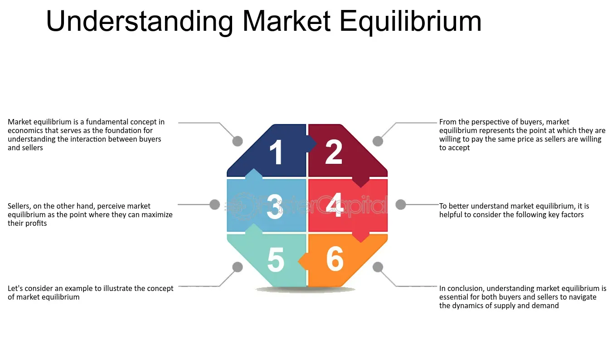

## Table of Contents

## What is the concept of Buyers-Sellers Balance?

The concept of Buyers-Sellers Balance refers to the equilibrium between the number of buyers and sellers in a market. This balance is important because it affects the prices and availability of goods and services. When there are more buyers than sellers, it's called a seller's market. In a seller's market, sellers have more power because many people want to buy what they are selling. This can lead to higher prices and fewer choices for buyers. On the other hand, when there are more sellers than buyers, it's called a buyer's market. In a buyer's market, buyers have more power because they have many options to choose from, which can lead to lower prices and more choices.

Achieving a Buyers-Sellers Balance is crucial for a healthy market. It helps to ensure that prices remain fair and that goods and services are accessible to those who need them. If the balance tips too far in one direction, it can cause problems. For example, if there are too many sellers and not enough buyers, some sellers might go out of business because they can't sell their products. If there are too many buyers and not enough sellers, people might struggle to find what they need at a reasonable price. Therefore, understanding and maintaining this balance is key to a stable and efficient market.

## How does the mechanism of Buyers-Sellers Balance work in a market?

The Buyers-Sellers Balance in a market works like a seesaw. When the number of buyers and sellers is about the same, the market is balanced. This balance helps keep prices fair and makes sure that goods and services are available for people who want them. If there are more buyers than sellers, it's like the buyers' side of the seesaw goes down. Sellers can then charge more because lots of people want to buy from them. This is called a seller's market. On the other hand, if there are more sellers than buyers, the sellers' side goes down. Buyers can then find better deals because they have many choices. This is called a buyer's market.

The balance can change over time because of different things happening in the market. For example, if a new product becomes really popular, more people might want to buy it, which can tip the balance toward a seller's market. Or, if a lot of new businesses start selling the same thing, it might tip the balance toward a buyer's market. Keeping the market balanced is important because it helps everyone. Sellers need enough buyers to stay in business, and buyers need enough sellers to find what they need at a good price. When the market is balanced, it works smoothly and everyone can benefit.

## What are the key factors that influence Buyers-Sellers Balance?

The Buyers-Sellers Balance is influenced by many things. One big thing is how much people want to buy something. If lots of people want to buy a new phone, for example, it can make more buyers than sellers. This can make the market tip towards a seller's market. Another thing is how many people are selling something. If lots of new stores open up selling the same thing, there might be more sellers than buyers, which can tip the market towards a buyer's market.

Economic conditions also play a big role. When the economy is doing well, people have more money to spend, which can increase the number of buyers. But if the economy is not doing well, people might not buy as much, which can decrease the number of buyers. Also, changes in technology or new laws can affect the balance. For example, if a new law makes it easier for people to start a business, more people might start selling, which can change the balance.

Overall, the Buyers-Sellers Balance is always changing because of many different factors. It's important for everyone to pay attention to these factors because they can affect how easy it is to buy or sell things in the market. Keeping an eye on these things helps people make better choices about buying and selling.

## How can imbalances in Buyers-Sellers Balance be identified?

You can tell if there's an imbalance in the Buyers-Sellers Balance by looking at a few things. One way is to check the prices of things. If prices are going up a lot, it might mean there are more buyers than sellers. This is called a seller's market. If prices are going down, it might mean there are more sellers than buyers, which is a buyer's market. Another way is to see how long it takes to sell something. If things are selling really fast, there might be more buyers than sellers. If things are taking a long time to sell, there might be more sellers than buyers.

Another way to spot an imbalance is by looking at how many choices people have. If there are lots of different sellers to choose from, it's probably a buyer's market. If there aren't many sellers and people have to wait to buy things, it's probably a seller's market. Also, you can listen to what people are saying. If lots of people are complaining about high prices or not being able to find what they want, there might be more buyers than sellers. If sellers are complaining about not making enough sales, there might be more sellers than buyers. Keeping an eye on these signs can help you figure out if the market is balanced or not.

## What are the common causes of imbalances in Buyers-Sellers Balance?

Imbalances in the Buyers-Sellers Balance can happen for many reasons. One big reason is changes in how much people want to buy something. If a new product comes out and everyone wants it, like a new smartphone, there can be more buyers than sellers. This makes it a seller's market because sellers can charge more. Another reason is how many people are selling something. If a lot of new stores open up selling the same thing, there might be more sellers than buyers. This makes it a buyer's market because buyers can find better deals.

Economic conditions also affect the balance. When the economy is good, people have more money to spend, which can lead to more buyers. But if the economy is bad, people might not buy as much, which can lead to fewer buyers. Changes in technology or new laws can also cause imbalances. For example, if a new law makes it easier for people to start a business, more people might start selling, which can change the balance. All these things can make the market tip one way or the other, leading to imbalances in the Buyers-Sellers Balance.

## What are the short-term effects of Buyers-Sellers Balance imbalances on the market?

When there are more buyers than sellers, it can cause prices to go up quickly. This is because sellers know a lot of people want to buy what they have, so they can charge more. It can also make it hard for people to find what they want because there isn't enough to go around. This can make people frustrated and they might have to wait or pay more to get what they need.

On the other hand, if there are more sellers than buyers, prices can go down. Sellers might have to lower their prices to try and sell their things because there are not enough people buying. This can be good for buyers because they can find better deals and have more choices. But it can be hard for sellers because they might not make as much money and some might even have to close their businesses if they can't sell enough.

## How do long-term imbalances in Buyers-Sellers Balance affect economic stability?

Long-term imbalances in Buyers-Sellers Balance can hurt the economy. If there are always more buyers than sellers, prices can keep going up. This makes it hard for people to afford things they need. Businesses might start making less of what people want because it's too hard to keep up with demand. This can slow down the economy because people aren't buying as much and businesses aren't making as much money. It can also make people feel unhappy and stressed because they can't get what they need easily.

On the other hand, if there are always more sellers than buyers, prices can keep going down. This might sound good for buyers at first, but it can cause problems too. Sellers might not make enough money to stay in business, and some might have to close down. This can lead to fewer jobs and less money being spent in the economy. Over time, this can make the economy weaker because there are fewer businesses and people have less money to spend. Both types of long-term imbalances can make the economy less stable and harder for everyone.

## What strategies can be used to correct Buyers-Sellers Balance imbalances?

To fix imbalances in the Buyers-Sellers Balance, one strategy is to increase the number of sellers if there are too many buyers. This can be done by making it easier for new businesses to start up. Governments can offer loans or grants to help new sellers get going. They can also make rules simpler so it's not too hard to start a business. Another way is to encourage more competition. If more people are selling the same thing, it can help bring prices down and give buyers more choices.

If there are too many sellers and not enough buyers, one way to fix this is by boosting how much people want to buy. This can be done through advertising or by making the economy stronger so people have more money to spend. Governments can also help by giving people more money to spend, like tax breaks or direct payments. Another strategy is to help sellers find new markets. For example, if sellers can sell their products in other countries, it can help them reach more buyers and balance out the market. By using these strategies, the market can become more balanced and work better for everyone.

## How do government policies impact Buyers-Sellers Balance?

Government policies can really change the Buyers-Sellers Balance. If the government makes it easier for new businesses to start, like by giving loans or making rules simpler, more people might start selling things. This can help if there are too many buyers and not enough sellers. It can make prices go down and give buyers more choices. But, if the government puts in rules that make it hard to start a business, it might keep the number of sellers low, which can make prices go up because there are not enough sellers to meet the demand.

On the other hand, if the government wants to help when there are too many sellers and not enough buyers, they can do things to make people want to buy more. They might give people more money to spend, like tax breaks or direct payments. This can help sellers sell more of their things. The government can also help sellers find new places to sell, like in other countries, which can help balance out the market. By using these policies, the government can help make the market work better for everyone.

## Can predictive models be used to anticipate Buyers-Sellers Balance imbalances?

Yes, predictive models can be used to guess when there might be too many buyers or sellers in a market. These models look at a lot of information, like how much people are buying and selling right now, how prices are changing, and what's happening in the economy. By studying this information, the models can find patterns and make guesses about what might happen next. For example, if a model sees that a new product is becoming really popular and prices are going up fast, it might predict that there will soon be more buyers than sellers.

Using these models can help people get ready for changes in the market. If a model predicts there will be more buyers than sellers, businesses might decide to make more of their product or raise their prices. If it predicts there will be more sellers than buyers, businesses might lower their prices or try to find new places to sell their things. By using predictive models, people can make better choices and help keep the market balanced.

## What role does technology play in managing Buyers-Sellers Balance?

Technology helps a lot in keeping the Buyers-Sellers Balance right. It does this by making it easier for people to buy and sell things. Websites and apps let sellers reach more buyers, no matter where they are. This can help if there are too many sellers and not enough buyers. Technology also makes it easier to find out what people want to buy. By looking at data, sellers can see what's popular and make more of it. This can help if there are too many buyers and not enough sellers.

Another way technology helps is by using smart tools like predictive models. These tools look at a lot of information to guess what might happen in the market. If they see that prices are going up fast, they might predict there will be more buyers than sellers soon. This can help businesses get ready by making more of their product or changing their prices. Technology makes it easier for everyone to know what's happening in the market and make good choices to keep things balanced.

## How do global economic factors influence Buyers-Sellers Balance in local markets?

Global economic factors can really change the Buyers-Sellers Balance in local markets. For example, if the world economy is doing well, people in other countries might want to buy more things from a local market. This can make more buyers than sellers in that market, which can make prices go up. On the other hand, if the world economy is not doing well, people might not buy as much from the local market. This can make more sellers than buyers, which can make prices go down. Big events like a global health crisis or changes in trade rules can also affect how many buyers and sellers there are in a local market.

Technology and global trade also play a big role. If a local seller can use the internet to sell things to people all over the world, it can help balance out the market. More buyers from different countries can help if there are too many sellers in the local market. But if other countries start making the same things as the local market and selling them cheaper, it can make more sellers than buyers in the local market. This can make it hard for local sellers to stay in business. So, what happens in the world economy can really affect how balanced the Buyers-Sellers Balance is in a local market.

## What is Buyer-Seller Balance?

Buyer-seller balance is a fundamental concept in financial markets, signifying a state where the quantity of buyers equals that of sellers. This equilibrium ensures price stability, as the forces of supply and demand are in harmony. In a balanced market, prices reflect the true value of assets, as neither buyers nor sellers exert undue influence on price direction. Such stability allows for efficient pricing mechanisms, beneficial for traders and investors seeking to make informed decisions based on intrinsic values.

Mathematically, the balance can be represented as:

$$
\text{Number of Buyers} = \text{Number of Sellers}
$$

When this equation holds, the market equilibrium results in stable pricing, minimizing [volatility](/wiki/volatility-trading-strategies). However, markets rarely maintain this perfect balance for extended periods, and fluctuations between buyer and seller activities are common.

Imbalances arise when there is a disparity between the number of buy and sell orders. For instance, if the number of buy orders significantly exceeds that of sell orders, demand outstrips supply, pushing prices upward. Conversely, if sell orders predominate, supply surpasses demand, causing prices to fall. These price movements are foundational to trading strategies and are pivotal in creating opportunities for profit, as they hint at potential market direction shifts.

Understanding buyer-seller balance is crucial for market participants as it directly impacts price discovery and market dynamics. Traders often monitor these imbalances, as they can signal potential changes in market sentiment or upcoming volatility. Recognizing when an market is transitioning from balance to imbalance aids in making well-timed trading decisions, thus capitalizing on the ensuing price movements.

## References & Further Reading

[1]: Bergstra, J., Bardenet, R., Bengio, Y., & Kégl, B. (2011). ["Algorithms for Hyper-Parameter Optimization."](https://dl.acm.org/doi/10.5555/2986459.2986743) Advances in Neural Information Processing Systems 24.

[2]: ["Advances in Financial Machine Learning"](https://www.amazon.com/Advances-Financial-Machine-Learning-Marcos/dp/1119482089) by Marcos Lopez de Prado

[3]: ["Evidence-Based Technical Analysis: Applying the Scientific Method and Statistical Inference to Trading Signals"](https://www.amazon.com/Evidence-Based-Technical-Analysis-Scientific-Statistical/dp/0470008741) by David Aronson

[4]: ["Machine Learning for Algorithmic Trading"](https://github.com/stefan-jansen/machine-learning-for-trading) by Stefan Jansen

[5]: ["Quantitative Trading: How to Build Your Own Algorithmic Trading Business"](https://www.amazon.com/Quantitative-Trading-Build-Algorithmic-Business/dp/1119800064) by Ernest P. Chan