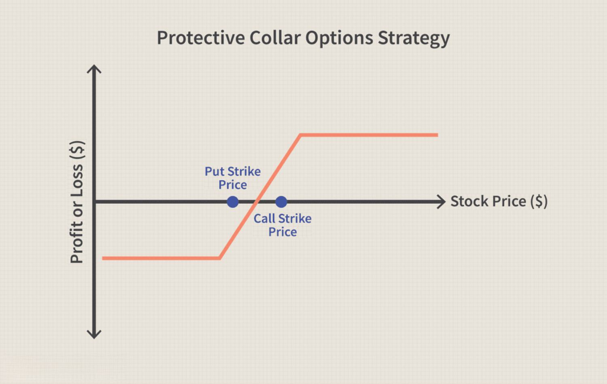

Understanding the balance between buyers and sellers in a market is crucial for traders and investors. This balance is fundamental to the efficient functioning of financial markets, where the price of an asset is determined by the forces of supply and demand. A state of equilibrium is achieved when the quantity of a commodity that buyers wish to purchase matches the quantity that sellers wish to sell at a given price level. The interaction between buyers and sellers contributes to the determination of market prices and ensures the allocation of resources.

However, imbalances in this equilibrium present unique challenges and opportunities. When buyer demand exceeds the supply offered by sellers, prices tend to increase, which can result in overvaluations and potential market bubbles. Conversely, when supply outstrips demand, prices may decline, potentially leading to undervaluations and market crashes. These imbalances can generate market inefficiencies that present opportunities for traders and investors to profit.



Algorithmic trading has become a significant component of modern financial markets. It often seeks to capitalize on these imbalances by using pre-programmed strategies that can execute trades at high speed and volume. These algorithms are designed to identify discrepancies between supply and demand almost instantaneously, thus allowing for rapid adjustment of positions to exploit fleeting opportunities.

This article explores how the trading mechanism functions in relation to the balance between buyers and sellers, particularly in the context of algorithmic trading. By examining the definitions and implications of market balance, as well as the strategies employed to navigate imbalanced conditions, we aim to offer insights into how traders can better understand and optimize their interactions with the market. Furthermore, the discussion will shed light on how algorithmic approaches can enhance market efficiency, albeit with potential risks of exacerbating volatility due to their speed and sophistication.

## Table of Contents

## What is Buyer-Seller Balance?

Buyer-seller balance is a fundamental concept in financial markets, signifying a state where the quantity of buyers equals that of sellers. This equilibrium ensures price stability, as the forces of supply and demand are in harmony. In a balanced market, prices reflect the true value of assets, as neither buyers nor sellers exert undue influence on price direction. Such stability allows for efficient pricing mechanisms, beneficial for traders and investors seeking to make informed decisions based on intrinsic values.

Mathematically, the balance can be represented as:

$$
\text{Number of Buyers} = \text{Number of Sellers}
$$

When this equation holds, the market equilibrium results in stable pricing, minimizing [volatility](/wiki/volatility-trading-strategies). However, markets rarely maintain this perfect balance for extended periods, and fluctuations between buyer and seller activities are common.

Imbalances arise when there is a disparity between the number of buy and sell orders. For instance, if the number of buy orders significantly exceeds that of sell orders, demand outstrips supply, pushing prices upward. Conversely, if sell orders predominate, supply surpasses demand, causing prices to fall. These price movements are foundational to trading strategies and are pivotal in creating opportunities for profit, as they hint at potential market direction shifts.

Understanding buyer-seller balance is crucial for market participants as it directly impacts price discovery and market dynamics. Traders often monitor these imbalances, as they can signal potential changes in market sentiment or upcoming volatility. Recognizing when an market is transitioning from balance to imbalance aids in making well-timed trading decisions, thus capitalizing on the ensuing price movements.

## Causes of Market Imbalances

Market imbalances arise due to a variety of factors that disrupt the equilibrium between buyers and sellers. One primary cause of these imbalances is news events that can change investor perceptions rapidly. For instance, the release of an unexpected quarterly earnings report or changes in government policy can alter market expectations and lead to sudden shifts in demand or supply for particular stocks or assets. These events can trigger a chain reaction where the number of buy or sell orders significantly exceeds the other, leading to fluctuations in market prices.

Economic indicators, such as GDP growth rates, unemployment figures, or changes in interest rates, also play a significant role in causing market imbalances. When economic data is released, it can affirm or contradict investors’ expectations, influencing their trading behavior. For example, a higher-than-expected unemployment rate might signal economic slowdown, prompting investors to sell equities in anticipation of reduced corporate earnings, thereby creating an imbalance skewed towards selling.

Sudden shifts in investor sentiment can further amplify these imbalances. Investor sentiment is often driven by psychological factors and herd behavior. Fear and greed can lead to overreactions, with investors moving in or out of positions en masse, causing temporary but significant market imbalances. Such shifts are typically reactive rather than anticipatory, meaning they often exacerbate the underlying cause rather than reflect rational reassessment of market conditions.

Large institutional trades are another important [factor](/wiki/factor-investing) contributing to market imbalances. Institutions such as mutual funds, hedge funds, or pension funds handle large volumes of assets. When these entities decide to enter or [exit](/wiki/exit-strategy) large positions, their substantial trade sizes can overwhelm current market [liquidity](/wiki/liquidity-risk-premium) and temporarily push prices away from their equilibrium levels. For example, if an institutional investor decides to liquidate a significant portion of its holdings in a single stock, it can create a sudden excess of sell orders, leading to rapid price declines until the market can absorb the [volume](/wiki/volume-trading-strategy).

Additionally, [algorithmic trading](/wiki/algorithmic-trading) amplifies these imbalances due to the speed and volume at which these programs can execute trades. Algorithmic trading systems are designed to capitalize on small price discrepancies by executing high-frequency trades that can contribute to increased volatility. When many algorithms simultaneously react to the same market signals, it can lead to cascading effects where price movements are exaggerated due to rapid fire buying and selling. This phenomenon can sometimes result in flash crashes—a scenario where asset prices plunge and recover quickly, underscoring the influence of algorithmic trading in creating short-term imbalances.

Understanding the causes of market imbalances is crucial for developing strategies to anticipate and manage these disruptions. Each factor, whether it be originating from macroeconomic announcements, shifts in sentiment, large institutional trades, or algorithmic activity, contributes uniquely to the overall dynamics of market equilibrium.

## Impacts of Market Imbalances

Market imbalances significantly influence financial markets, with price volatility being one of the most direct outcomes. When there is a disparity between buyers and sellers, it leads to fluctuations in asset prices, presenting both risks and opportunities for traders.

Price volatility manifests when buy and sell pressures are uneven. For instance, when buy orders substantially outnumber sell orders, prices tend to rise as demand outstrips supply. Conversely, when sell orders predominate, prices generally fall. This dynamic interplay contributes to the ongoing volatility observed in markets, making trading both a potential avenue for profit and a source of risk. Traders must navigate these fluctuations, often relying on sophisticated strategies to capture profits while managing potential losses.

Sustained market imbalances can lead to more severe economic consequences, such as asset bubbles or market crashes. Bubbles occur when asset prices exceed their intrinsic value over an extended period, often driven by speculative trading. When the market eventually corrects itself, such bubbles can burst, leading to rapid declines in asset prices. A historic example is the dot-com bubble of the late 1990s, where excessive speculation in internet-related companies led to a sharp increase in valuations, followed by a significant market correction in the early 2000s.

Conversely, market crashes may occur when a quick and massive shift in sentiment or economic indicators causes a dramatic sell-off, as observed during the 2008 financial crisis. These crash scenarios highlight the inherent risks of imbalanced markets, where corrections can be swift and severe.

Despite these risks, markets generally have self-correcting mechanisms. New market participants are often attracted by deviations in price, entering the market in response to perceived opportunities. This influx of new traders tends to restore balance, as increased trading activity helps stabilize prices. For example, when prices drop significantly due to an imbalance, value-oriented buyers might enter the market, creating upward pressure on prices and facilitating a return to equilibrium.

In conclusion, understanding the impacts of market imbalances is crucial for traders who must evaluate both the risks and opportunities presented by price volatility. While markets have a natural tendency to self-correct, the interim period can represent a volatile and challenging environment for market participants. Strategies to navigate these imbalances are vital for enhancing trading outcomes.

## Trading Mechanisms and Imbalances

Trading mechanisms are crucial in determining how market imbalances emerge and are rectified. Two primary types of orders define these mechanisms: market orders and limit orders. Understanding how these orders function provides insight into market dynamics and aids traders in predicting and managing imbalances.

A market order is an instruction to buy or sell a security immediately at the best available current price. It ensures execution but not the price. This immediacy can sometimes exacerbate imbalances when large market orders are executed, pushing prices upward or downward rapidly, particularly in less liquid markets or during high volatility periods. Market participants preferring speed over price certainty typically favor this order type.

Limit orders, on the other hand, specify the maximum price a buyer is willing to pay or the minimum price a seller is willing to accept. These orders provide price certainty but not execution certainty. Limit orders contribute to market imbalances by creating a backlog of unfilled orders when prices do not reach the specified limits. This backlog can impact price stability by serving as a reservoir of pending transactions that, when triggered, can lead to sudden shifts in market prices.

Market makers play an essential role during periods of imbalance. Their function is to provide liquidity by standing ready to buy and sell securities at quoted bid and ask prices. By doing so, market makers can help stabilize prices when disparities arise between buyers and sellers. They profit from the bid-ask spread—the difference between purchasing and selling prices—which compensates for the risk of holding potentially volatile securities.

From a trader's perspective, understanding trading mechanisms equips them to predict and react to imbalances more effectively. For instance, during a sell-off, anticipating that market makers might step in to purchase undervalued assets can provide a strategic advantage. Similarly, being aware of the accumulation of limit orders above a certain price can signal potential resistance levels, aiding in decision-making regarding entry and exit points.

In summary, market and limit orders significantly influence how imbalances are formed and resolved. Market makers enhance liquidity, aiding in the stabilization of prices. A deep comprehension of these trading mechanisms allows traders to better navigate and anticipate market dynamics, improving their ability to capitalize on potential opportunities that imbalances present.

## Algorithmic Trading and Balance

Algorithmic trading, often referred to as algo trading, involves the use of computer programs to execute trades at speeds and frequencies that are impossible for a human trader to match. Algorithms are capable of analyzing large volumes of market data in real-time, identifying patterns, and executing trades based on pre-defined criteria. This ability enables them to exploit market imbalances, which arise when there is a lack of equilibrium between buyers and sellers.

One of the advantages of algorithmic trading is its capability to detect market imbalances more rapidly than human traders. Algorithms can continuously monitor market conditions and apply statistical and mathematical models to identify opportunities. For instance, they can use data analysis techniques such as mean reversion or [momentum](/wiki/momentum) strategies to predict price movements and execute trades in milliseconds. This rapid detection and reaction to shifts in supply and demand dynamics lead to more efficient price discovery processes.

While algorithms contribute significantly to market liquidity and operational efficiency, they also have the potential to cause rapid price movements. When multiple algorithms respond to a market signal simultaneously, their collective trading actions can lead to cascading effects, resulting in increased volatility. This phenomenon is sometimes referred to as the 'flash crash' effect, where market prices can drastically shift within a very short time frame due to algorithmic trading activities.

For example, consider the following Python snippet that represents a simple high-frequency trading algorithm designed to capitalize on market imbalances:

```python
import time
import random

def moving_average(prices, window_size):
    if len(prices) < window_size:
        return sum(prices) / len(prices)
    return sum(prices[-window_size:]) / window_size

def trading_strategy(prices, window_size):
    avg_price = moving_average(prices, window_size)
    current_price = prices[-1]
    if current_price < avg_price:
        return "Buy"
    elif current_price > avg_price:
        return "Sell"
    return "Hold"

prices = []

# Simulate receiving new price data every second
for _ in range(100):
    new_price = random.uniform(50, 150)  # Simulating price data input
    prices.append(new_price)
    decision = trading_strategy(prices, window_size=5)  # Using a window size of 5
    print(f"Price: {new_price:.2f}, Decision: {decision}")
    time.sleep(1)
```

This basic piece of code demonstrates how an algorithm might decide whether to buy, sell, or hold a stock based on a five-period moving average strategy, simulating responses to minor imbalances it perceives in the price data.

Overall, algorithmic trading plays a vital role in capital markets by contributing to price stabilization and efficiency. However, its inherent capacity to cause sudden and significant price movements underscores the need for appropriate risk management frameworks and regulatory oversight to mitigate potential negative effects on market stability.

## Strategies for Navigating Imbalanced Markets

Traders navigating imbalanced markets can employ several strategies to effectively manage and capitalize on potential opportunities. One primary approach involves the application of technical analysis. This methodology uses historical price data and chart patterns to forecast future market movements. By analyzing indicators such as moving averages, relative strength index (RSI), and Bollinger Bands, traders can identify trends and potential reversal points. For instance, a moving average crossover might suggest a potential entry or exit point, informing traders about potential imbalances in buy and sell orders. 

Diversification is another critical strategy to manage risks associated with market imbalances. This involves spreading investments across various asset classes, sectors, or geographical regions to minimize the impact of any single market anomaly. Diversification can be mathematically understood through the principle of portfolio variance, where the overall risk of the portfolio is decreased by blending assets with non-correlated returns. 

Moreover, risk management is essential for traders in imbalanced markets. Techniques such as setting stop-loss orders help in limiting potential losses when the market moves unfavorably. Additionally, position sizing, a strategy where the size of a trading position is determined based on the level of risk, is instrumental in maintaining control over the trading portfolio. These strategies ensure that traders remain solvent and withstand volatility.

Staying informed about market news and trends is equally crucial for anticipating shifts in buyer-seller dynamics. Financial news, economic indicators, and geopolitical events can all influence market sentiment and create potential imbalances. Traders utilizing news alerts and economic calendars can better anticipate these shifts and adjust their strategies accordingly.

By combining technical analysis, diversification, risk management, and staying informed, traders can navigate the complexities of imbalanced markets effectively. These strategies not only mitigate risks but also allow traders to capitalize on potential market inefficiencies.

## Conclusion

Balancing the forces of buyers and sellers in financial markets is a continuous and dynamic process shaped by various factors including economic indicators, news events, and technological advancements. A key aspect of navigating this balance is understanding how these variables can affect market imbalances, potentially leading to rapid price shifts and volatility.

The mechanics of market imbalances necessitate a deep comprehension of trading strategies capable of maximizing success. Prudent execution involves leveraging both [fundamental analysis](/wiki/fundamental-analysis) of market conditions and technical analysis of price patterns. The ability to foresee potential imbalances allows traders to adjust their positions accordingly, minimizing risk and optimizing returns.

The increasing prevalence of algorithmic trading has intensified the speed and complexity with which markets operate. Algorithms, capable of processing vast amounts of data and executing trades at high velocity, can both exploit and exacerbate market imbalances. Traders who utilize algorithmic strategies must therefore prioritize robust risk management protocols to safeguard against the pitfalls of high-frequency fluctuations.

Key strategies for enhancing trading success include diversification, which mitigates exposure to specific assets and spreads risk more evenly across a portfolio, and maintaining an updated understanding of market trends and developments. Real-time analytics and data-driven decision-making tools are indispensable in today's fast-paced trading environment.

As algorithmic trading continues to evolve, the necessity for maintaining a balanced market becomes even more critical. Traders who can adeptly navigate the shifting dynamics of buyer-seller interactions, while employing adaptive strategies, are better positioned to thrive in this complex landscape. The synergy of technological innovation and strategic insight plays a pivotal role in sustaining market stability amid ever-evolving challenges.

## References & Further Reading

[1]: Bergstra, J., Bardenet, R., Bengio, Y., & Kégl, B. (2011). ["Algorithms for Hyper-Parameter Optimization."](https://dl.acm.org/doi/10.5555/2986459.2986743) Advances in Neural Information Processing Systems 24.

[2]: ["Advances in Financial Machine Learning"](https://www.amazon.com/Advances-Financial-Machine-Learning-Marcos/dp/1119482089) by Marcos Lopez de Prado

[3]: ["Evidence-Based Technical Analysis: Applying the Scientific Method and Statistical Inference to Trading Signals"](https://www.amazon.com/Evidence-Based-Technical-Analysis-Scientific-Statistical/dp/0470008741) by David Aronson

[4]: ["Machine Learning for Algorithmic Trading"](https://github.com/stefan-jansen/machine-learning-for-trading) by Stefan Jansen

[5]: ["Quantitative Trading: How to Build Your Own Algorithmic Trading Business"](https://www.amazon.com/Quantitative-Trading-Build-Algorithmic-Business/dp/1119800064) by Ernest P. Chan