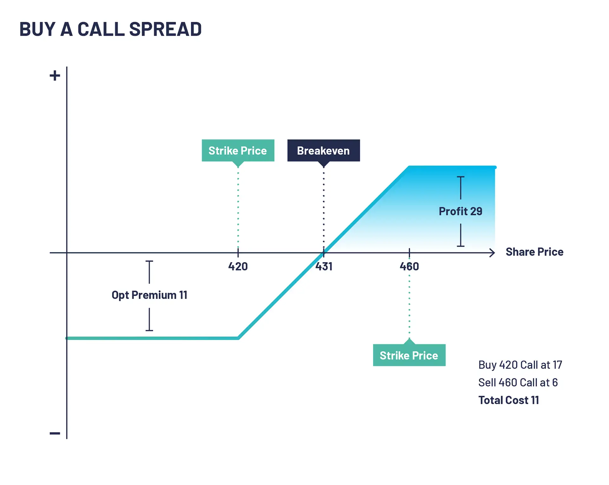

## Table of Contents

## What is a spread in financial trading?

In financial trading, a spread refers to the difference between the buying price (also known as the bid price) and the selling price (also known as the ask price) of a security, currency, or other financial instrument. This difference is important because it represents the cost that traders and investors pay to enter or exit a trade. For example, if the bid price for a stock is $10 and the ask price is $10.05, the spread is $0.05.

The spread is influenced by various factors, including the liquidity of the market, the volatility of the asset, and the competition among market makers. In highly liquid markets, where there are many buyers and sellers, the spread tends to be smaller because there is more competition to buy and sell the asset. Conversely, in less liquid markets, the spread can be wider, reflecting the higher cost and risk of trading in those conditions. Understanding the spread is crucial for traders as it directly impacts the profitability of their trades.

## What are the different types of spreads?

There are mainly two types of spreads in financial trading: the bid-ask spread and the yield spread. The bid-ask spread is the difference between the highest price a buyer is willing to pay for an asset (the bid) and the lowest price a seller is willing to accept (the ask). This spread is important because it shows how much it costs to buy or sell a financial instrument right away. In markets where lots of people are buying and selling, the bid-ask spread is usually small. But in markets where fewer people are trading, the spread can be bigger.

The yield spread, on the other hand, is the difference in yield between two different investments, like bonds. It shows how much more return one investment gives compared to another. For example, the yield spread between a government bond and a corporate bond can tell you about the risk difference between them. A bigger yield spread might mean the corporate bond is riskier, so investors want a higher return for taking that risk. Both types of spreads help traders and investors understand market conditions and make better decisions.

## How does buying a spread work?

Buying a spread in trading means you're doing two trades at the same time. You're buying one thing and selling another. This is often done with options or futures. For example, if you think the price of something will go up a little bit, you might buy a spread by buying a call option with a lower price and selling a call option with a higher price. The goal is to make money from the difference in how much the prices of these two options change.

When you buy a spread, you're trying to limit how much you could lose. If the price doesn't move the way you thought, your loss is smaller because you've sold one option to help pay for the one you bought. It's like betting on a small change in price, not a big one. This can be a safer way to trade because it helps control risk, but it also means your potential profit is smaller compared to just buying one option.

## What is the purpose of buying a spread?

Buying a spread is a way to trade with less risk. When you buy a spread, you're doing two trades at once: buying one option and selling another. This helps you limit how much money you could lose. If the price doesn't go the way you thought, your loss won't be as big because the option you sold can help cover some of the cost of the option you bought. It's like a safety net that makes trading a bit safer.

The main goal of buying a spread is to make money from small changes in price. Instead of betting on a big move, you're betting on a smaller one. This means your possible profit is less than if you just bought one option, but it's also a safer way to trade. Buying a spread can be a good choice if you want to try to make some money without risking too much.

## What are the benefits of buying a spread for a beginner?

Buying a spread can be a good choice for a beginner because it helps to lower the risk. When you buy a spread, you are doing two trades at the same time: buying one option and selling another. This means if the price doesn't go the way you thought, you won't lose as much money. The option you sell helps to pay for the option you buy, so it's like having a safety net. This can make trading feel less scary for someone who is just starting out.

Another benefit is that buying a spread can help beginners learn about trading without risking too much money. Since you're betting on small changes in price, you don't need the price to move a lot to make some money. This can be easier to understand and manage for someone new to trading. Plus, it teaches you about how options work and how to use them together, which is a good skill to have as you get more experience.

## How can spreads be used to manage risk?

Spreads can help manage risk by allowing traders to do two trades at the same time. When you buy a spread, you buy one option and sell another. This means if the price doesn't go the way you expected, the option you sold can help cover some of the cost of the option you bought. It's like having a safety net that limits how much money you could lose. This makes trading less risky, which is good for people who want to be careful with their money.

Using spreads also helps traders focus on smaller price changes instead of big ones. Instead of betting on a huge move in price, you're betting on a smaller one. This can make trading easier to manage because you don't need the price to move a lot to make some money. By using spreads, traders can control their risk better and feel more confident in their trading decisions.

## What are the key factors to consider before buying a spread?

Before buying a spread, it's important to think about what you expect the price to do. Are you hoping for a small move up or down? Knowing this helps you pick the right options for your spread. You also need to look at how much time is left until the options expire. If you think the price will move soon, you might want options that expire sooner. If you think it will take longer, then options with more time might be better.

Another thing to consider is how much money you're willing to risk. Buying a spread can help limit your losses, but you still need to decide how much you're okay with losing. It's also a good idea to check how much the spread will cost you. The price of the spread depends on the difference between the options you're buying and selling, so make sure it fits your budget. By thinking about these things, you can make a smarter choice about buying a spread.

## How do spreads affect the cost of trading?

Spreads can make trading more expensive. When you buy something, you pay the ask price, which is a bit higher than the bid price, or what someone is willing to pay for it. The difference between these two prices is the spread, and it's like a fee you pay just for making a trade. In markets where lots of people are buying and selling, the spread is usually small, so it doesn't cost you much extra. But in markets where fewer people are trading, the spread can be bigger, making your trades more expensive.

Using spreads in trading, like buying a spread with options, can also affect your costs. When you buy a spread, you're doing two trades at the same time: buying one option and selling another. The cost of the spread is the difference between what you pay for the option you buy and what you get for the option you sell. This can help you save money because the option you sell can help pay for the one you buy. But you still need to think about how much the whole spread will cost and if it fits your budget.

## What are some common strategies involving spreads?

One common strategy involving spreads is the bull call spread. This is used when you think the price of something will go up a little bit. You buy a call option with a lower price and sell a call option with a higher price. The goal is to make money from the difference in how much these two options change in value. It's a good way to bet on a small price increase without risking too much money.

Another popular strategy is the bear put spread, which you use when you think the price will go down a bit. Here, you buy a put option with a higher price and sell a put option with a lower price. The idea is to profit from the difference in how these two options change as the price goes down. Both the bull call spread and bear put spread help limit your risk because you're doing two trades at the same time, which can make trading feel safer.

A third strategy is the butterfly spread, which is used when you think the price will stay about the same. You buy one call option with a low price, sell two call options with a middle price, and buy another call option with a high price. This creates a range where you can make money if the price doesn't move much. Butterfly spreads can be a bit more complex, but they're a good way to bet on the price staying steady without risking a lot.

## How do market conditions influence the effectiveness of spread strategies?

Market conditions can really change how well spread strategies work. When the market is calm and prices don't move a lot, strategies like the butterfly spread can be very effective. This is because butterfly spreads are designed to make money when the price stays about the same. But if the market is really moving around a lot, a butterfly spread might not be the best choice because the price could go outside the range you're betting on.

On the other hand, if the market is trending up or down, strategies like the bull call spread or bear put spread can work better. A bull call spread is good when you think the price will go up a little bit, and a bear put spread is good when you think it will go down a bit. These strategies help you make money from small price moves, but they also limit your risk. So, knowing what the market is doing can help you pick the right spread strategy to use.

## What are the advanced techniques for optimizing spread trades?

One advanced technique for optimizing spread trades is to use delta hedging. Delta is a number that shows how much an option's price will change when the price of the thing it's based on changes. By adjusting the number of options you buy and sell, you can make your spread trade more balanced. This means if the price moves against you, the loss on one option can be made up for by a gain on the other. It's like fine-tuning your trade to make it less risky and more likely to make money no matter which way the price goes.

Another technique is to use [volatility](/wiki/volatility-trading-strategies) analysis. Volatility is how much the price of something moves up and down. By studying how volatile the market is, you can choose the right time to set up your spread trade. If you think the market will be more volatile, you might want to use a strategy that can take advantage of big price moves. On the other hand, if you think the market will be calm, you can set up a spread that makes money when the price doesn't change much. By understanding and using volatility to your advantage, you can make your spread trades more effective.

## How can one evaluate the performance of spread trading over time?

To evaluate the performance of spread trading over time, you need to keep track of how much money you make or lose on each trade. Look at the total profit or loss from all your spread trades over a certain period, like a month or a year. Also, think about how much risk you took with each trade. Did you make more money than you lost, and was the risk worth it? By comparing your results over time, you can see if your spread trading strategy is working well or if you need to change something.

Another way to evaluate your spread trading performance is to look at how often you made money compared to how often you lost money. This is called your win rate. If you win more often than you lose, that's a good sign. But also think about how big your wins and losses are. Sometimes, a few big wins can make up for a lot of small losses. By looking at both your win rate and the size of your wins and losses, you can get a better idea of how well your spread trading is doing over time.

## References & Further Reading

[1]: Bergstra, J., Bardenet, R., Bengio, Y., & Kégl, B. (2011). ["Algorithms for Hyper-Parameter Optimization."](https://dl.acm.org/doi/10.5555/2986459.2986743) Advances in Neural Information Processing Systems 24.

[2]: ["Advances in Financial Machine Learning"](https://www.amazon.com/Advances-Financial-Machine-Learning-Marcos/dp/1119482089) by Marcos Lopez de Prado

[3]: ["Evidence-Based Technical Analysis: Applying the Scientific Method and Statistical Inference to Trading Signals"](https://www.amazon.com/Evidence-Based-Technical-Analysis-Scientific-Statistical/dp/0470008741) by David Aronson

[4]: ["Machine Learning for Algorithmic Trading"](https://github.com/stefan-jansen/machine-learning-for-trading) by Stefan Jansen

[5]: ["Quantitative Trading: How to Build Your Own Algorithmic Trading Business"](https://www.amazon.com/Quantitative-Trading-Build-Algorithmic-Business/dp/1119800064) by Ernest P. Chan