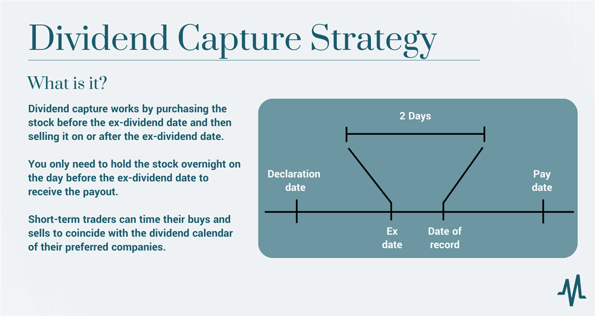

## Table of Contents

## What are dividends and why do companies pay them?

Dividends are payments that companies make to their shareholders, usually from their profits. When a company earns money, it can choose to give some of that money back to the people who own its stocks. This payment is called a dividend. Dividends are often paid out regularly, like every three months or once a year, and they can be a way for investors to earn money without selling their stocks.

Companies pay dividends for a few reasons. One reason is to share their success with their shareholders. When a company does well and makes a lot of profit, it might want to reward the people who invested in it. Another reason is to attract more investors. If a company pays regular dividends, more people might want to buy its stock because they know they will get some money back regularly. This can help the company grow by getting more investment.

## How can I find out when a stock pays its dividend?

To find out when a stock pays its dividend, you can check the company's investor relations website. Most companies have a section where they list important dates like when they pay dividends. This section might be called "Investor Calendar" or "Dividend Information." You can also look at the company's past dividend payments to guess when the next one might be, since many companies pay dividends at the same time each year.

Another way to find dividend dates is by using financial websites and apps. Websites like Yahoo Finance, Morningstar, or the stock exchange's own website often have detailed information about a company's dividend history and upcoming dividend dates. These sites can be very helpful because they gather all the information in one place, making it easier for you to find what you need without going to different company websites.

If you own the stock through a brokerage account, you can also check there. Most brokerage platforms have a section where they show upcoming dividend dates for the stocks you own. This can be a quick and easy way to keep track of when you will get your next dividend payment.

## What is the ex-dividend date and why is it important for stock trading?

The ex-dividend date is the first day a stock trades without its upcoming dividend. If you buy the stock on or after this date, you won't get the next dividend payment. The ex-dividend date is important because it helps traders decide when to buy or sell a stock to get the dividend.

Knowing the ex-dividend date can affect your trading strategy. If you want to receive the dividend, you need to buy the stock before the ex-dividend date. If you don't care about the dividend, you might wait until after the ex-dividend date to buy the stock, which could be cheaper because it no longer includes the dividend. This date helps traders plan their moves around dividend payments.

## Can you explain the difference between the record date and the payment date?

The record date is the day when the company looks at its list of shareholders to see who gets the dividend. If you own the stock on the record date, you will get the dividend. The record date is important because it decides who is on the list to receive the money. 

The payment date is when the company actually sends out the dividend money to the shareholders. This is the day you get the money in your account if you were on the list on the record date. The payment date comes after the record date and the ex-dividend date.

## What are the risks of buying stocks just before the ex-dividend date?

Buying stocks just before the ex-dividend date can be risky. One risk is that the stock price might drop by about the amount of the dividend right after the ex-dividend date. This happens because the stock is now trading without the dividend, so its value goes down. If you buy the stock just to get the dividend, you might end up losing money if the stock price drops more than the dividend amount.

Another risk is that the market might not react as expected. Sometimes, the stock price might not drop as much as the dividend amount, or it might even go up. This can happen if there is good news about the company or if more people want to buy the stock. But if the stock price drops a lot, you could lose money even after getting the dividend. So, it's important to think about these risks before deciding to buy a stock just before the ex-dividend date.

## How does buying stocks before the ex-dividend date affect my tax situation?

When you buy stocks before the ex-dividend date, you get the dividend, but you also have to pay taxes on it. Dividends are considered income, so you need to report them on your tax return. The tax you pay on dividends depends on your income and the type of dividend. There are two types of dividends: qualified and non-qualified. Qualified dividends are taxed at a lower rate, like long-term capital gains, while non-qualified dividends are taxed at your regular income tax rate.

If you buy a stock right before the ex-dividend date and then sell it soon after, you might also have to pay capital gains tax. If you sell the stock for more than you paid for it, you have a capital gain, and if you sell it for less, you have a capital loss. Capital gains tax rates are usually lower than income tax rates, but they still add to your tax bill. So, buying stocks just to get the dividend can make your tax situation more complicated because you have to think about both the dividend tax and any capital gains or losses from selling the stock.

## What strategies can I use to profit from buying and selling around dividend dates?

One strategy to profit from buying and selling around dividend dates is called dividend capture. This means you buy a stock just before the ex-dividend date to get the dividend, and then you sell it soon after. The goal is to keep the dividend money and hopefully not lose too much on the stock price. But this can be risky because the stock price often drops by the amount of the dividend after the ex-dividend date. If the price drops more than the dividend, you could lose money.

Another strategy is to focus on companies that have a history of increasing their dividends. If you buy stocks from these companies before the ex-dividend date and hold them for a while, you can get the dividend and also benefit from the stock price going up over time. This can be less risky than trying to quickly buy and sell around dividend dates, but it means you need to wait longer to see your profits. Both strategies require you to think about the risks and how they might affect your taxes.

## How do dividend capture strategies work and what are their potential pitfalls?

Dividend capture strategies involve buying a stock just before its ex-dividend date to receive the dividend and then selling it soon after. The idea is to keep the dividend payment while hoping the stock price doesn't drop too much. For example, if a stock pays a $1 dividend, you might buy it a few days before the ex-dividend date, get the dividend, and then sell it. If the stock price only drops by $1 after the ex-dividend date, you break even on the stock but keep the dividend.

However, there are potential pitfalls to this strategy. One big risk is that the stock price might drop by more than the dividend amount after the ex-dividend date. If you bought the stock at $50 and it drops to $48 after the dividend, you lose $2 on the stock even though you got a $1 dividend. Another pitfall is transaction costs. Every time you buy and sell a stock, you might have to pay fees, which can eat into your profits. Plus, you have to think about taxes. Dividends are taxable income, and if you sell the stock soon after buying it, you might also have to pay capital gains tax. All these factors can make dividend capture less profitable than it seems.

## What impact do dividend announcements have on stock prices?

When a company announces a dividend, it can affect the stock price in different ways. If the dividend is higher than what people expected, the stock price might go up. This is because investors see the higher dividend as a sign that the company is doing well and making more money. They might want to buy the stock to get the bigger dividend, which can push the price up.

On the other hand, if the dividend is lower than expected or if the company cuts the dividend, the stock price might go down. Investors might think the company is not doing as well as before and might sell their stocks, which can make the price drop. Also, right after the ex-dividend date, the stock price usually goes down by about the amount of the dividend because the stock is now trading without the dividend.

## How can I use options trading in conjunction with dividend dates to maximize returns?

You can use options trading around dividend dates to try to make more money. One way is to buy call options on a stock before its ex-dividend date. If you think the stock price will go up because of a good dividend announcement, buying a call option can let you make money from that increase without spending as much money as you would if you bought the stock itself. Another way is to sell put options before the ex-dividend date. If you think the stock price won't drop too much after the ex-dividend date, you can keep the money people pay you for the put option.

But using options with dividend dates can be risky. If the stock price doesn't go up after a dividend announcement, your call options might lose value. And if the stock price drops more than you expected after the ex-dividend date, the person who bought your put option might want to sell you the stock at a higher price than it's worth now. Plus, options trading can be complicated and you need to understand how it works to use it well. Always think about the risks and maybe talk to a financial advisor before trying this strategy.

## What are the long-term effects of consistently trading around dividend dates on portfolio performance?

Trading around dividend dates a lot can have big effects on your portfolio over time. If you keep buying stocks just before the ex-dividend date and selling them soon after, you might make some money from the dividends. But you also have to think about the risks. The stock price often drops after the ex-dividend date, and if it drops more than the dividend amount, you could lose money. Plus, you'll have to pay taxes on the dividends and any profits from selling the stocks, which can eat into your returns. Over time, the costs of buying and selling stocks, like fees and taxes, can add up and make it harder to make a profit.

Another thing to think about is how trading around dividend dates fits into your overall investment plan. If you're always buying and selling stocks, you might miss out on other chances to make money. Stocks that pay good dividends often grow over time, and if you hold onto them, you could make more money from the stock price going up than from just the dividends. Also, focusing too much on dividend dates might make you miss out on other good investments that don't pay dividends but could still help your portfolio grow. So, while trading around dividend dates can be a way to make some money, it's important to look at the bigger picture and think about how it affects your long-term investment goals.

## How do market conditions and sector performance influence the effectiveness of dividend date trading strategies?

Market conditions and how well a sector is doing can really change how well trading around dividend dates works. If the market is going up and people feel good about buying stocks, a company's stock might not drop as much after the ex-dividend date. This can make it easier to make money from dividend capture because the stock price stays strong. Also, if a whole sector is doing well, like tech or energy, the stocks in that sector might go up even after paying a dividend. This means you could make money from both the dividend and the stock price going up.

On the other hand, if the market is going down or people are worried about the economy, trading around dividend dates can be riskier. In a bad market, a stock's price might drop more than the dividend amount after the ex-dividend date, which means you could lose money. If a sector is not doing well, the stocks in that sector might go down even if they pay a dividend. So, it's important to look at what's happening in the market and how the sector is doing before you decide to trade around dividend dates. This can help you figure out if it's a good time to try to make money this way or if you should wait for better conditions.

## What are the key aspects of understanding dividend strategies?

Dividends represent a portion of a company's earnings that is distributed to shareholders, typically on a quarterly basis. This distribution is a signal of a company's profitability and its ability to share profits with its investors. Within dividend strategies, several key concepts are crucial for understanding a company's financial health: dividend yield, payout ratio, and dividend growth.

**Dividend Yield** is a financial ratio that shows how much a company pays out in dividends each year relative to its stock price. It is calculated as:

$$
\text{Dividend Yield} = \left( \frac{\text{Annual Dividends per Share}}{\text{Price per Share}} \right) \times 100
$$

This metric allows investors to gauge the return on investment in terms of dividends received for every dollar spent on a share. A higher dividend yield may indicate a good investment opportunity, but it is essential to consider other financial metrics and company specifics.

**Payout Ratio** represents the percentage of earnings paid to shareholders in dividends and is calculated as:

$$
\text{Payout Ratio} = \left( \frac{\text{Dividends per Share}}{\text{Earnings per Share}} \right) \times 100
$$

This ratio informs investors about the sustainability of a company's dividend payments. A high payout ratio might suggest that a company is distributing most of its earnings as dividends, which could be concerning if the company is not retaining enough earnings for growth or unforeseen downturns.

**Dividend Growth** refers to the annualized percentage rate of growth of a company’s dividends over time. Companies that consistently increase dividends could indicate a sound business with ongoing income potential. Historical growth rates can be a predictor of future company performance.

The **dividend capture strategy** involves the timing of stock purchases and sales around dividend dates to benefit from dividend earnings without holding the stock long-term. This approach capitalizes on the ex-dividend date—a critical date when a stock's price is adjusted to reflect the dividend payment. The strategy is to purchase the stock just before the ex-dividend date and sell it shortly after, collecting the dividend payout in the process. 

While this strategy might seem straightforward, it requires precise timing and awareness of market conditions. Successful implementation involves understanding the market movements around ex-dividend dates and forecasting potential price adjustments resulting from the dividend payouts.

## References & Further Reading

[1]: Bodie, Z., Kane, A., & Marcus, A. J. (2014). ["Investments"](https://www.mheducation.com/highered/product/Investments-Bodie.html). McGraw-Hill Education.

[2]: Fabozzi, F. J., & Peterson, P. P. (2003). ["Financial Management and Analysis Workbook: Step-by-Step Exercises and Tests to Help You Master Financial Management and Analysis"](https://www.amazon.com/Financial-Management-Analysis-Frank-Fabozzi/dp/0471234842). Wiley.

[3]: Graham, B., & Dodd, D. L. (2009). ["Security Analysis"](https://drive.google.com/file/d/0B8yPeYHl2ueSTEpmOGZVXzVFZ00/view?usp=sharing). McGraw-Hill Education.

[4]: Vanderbei, R. J. (2014). ["Linear Programming: Foundations and Extensions"](https://link.springer.com/book/10.1007/978-3-030-39415-8). Springer.

[5]: Lopez de Prado, M. (2018). ["Advances in Financial Machine Learning"](https://www.amazon.com/Advances-Financial-Machine-Learning-Marcos/dp/1119482089). Wiley.

[6]: Jansen, S. (2020). ["Machine Learning for Algorithmic Trading: Predictive models to extract signals from market and alternative data for systematic trading strategies with Python"](https://github.com/stefan-jansen/machine-learning-for-trading). Packt Publishing.

[7]: Chan, E. P. (2008). ["Quantitative Trading: How to Build Your Own Algorithmic Trading Business"](https://github.com/ftvision/quant_trading_echan_book). Wiley.

[8]: Sharpe, W. F. (1994). ["The Sharpe Ratio"](https://web.stanford.edu/~wfsharpe/art/sr/SR.htm). The Journal of Portfolio Management.

[9]: Aronson, D. R. (2007). ["Evidence-Based Technical Analysis: Applying the Scientific Method and Statistical Inference to Trading Signals"](https://onlinelibrary.wiley.com/doi/book/10.1002/9781118268315). Wiley.