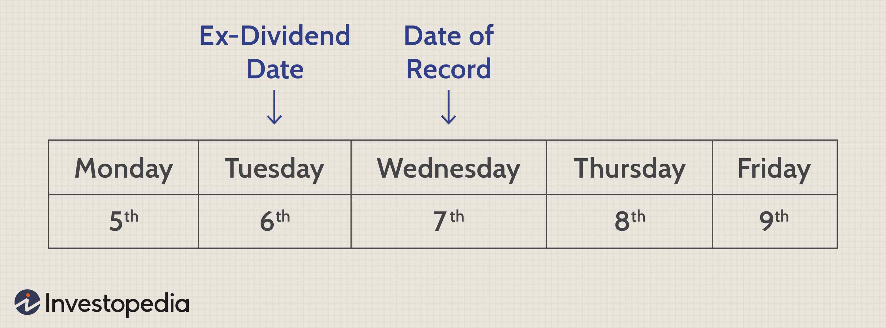

In the world of investing, stock trading and dividend strategies have gained prominence as methodologies to maximize returns on investment. A principal strategy within this domain is the dividend capture strategy, which targets potential quick gains through a calculated approach to dividend collection. This strategy, while enticing, presents its own set of intricacies and risks that require careful navigation. The essence of this strategy lies in timing the purchase and sale of dividend-paying stocks to capture the dividend payout.

Algorithmic trading, or algo trading, has significantly transformed the execution of stock and dividend strategies. By providing unmatched precision and efficiency, algorithmic trading systems enable investors to time their trades with unprecedented accuracy. This technology leverages sophisticated algorithms and vast data analysis to enhance the execution of strategies such as dividend capture, thus potentially increasing profitability while minimizing human error.



Understanding the fundamental aspects of dividend investing, including key dates, dividend yields, and payout ratios, is crucial for optimizing returns. Moreover, grasping the importance of timing and the advantages offered by algorithmic trading can substantially improve an investor's approach to dividend strategies, allowing for more informed and strategic decision-making in stock trading endeavors.

## Table of Contents

## Understanding Dividend Strategies

Dividends represent a portion of a company's earnings that is distributed to shareholders, typically on a quarterly basis. This distribution is a signal of a company's profitability and its ability to share profits with its investors. Within dividend strategies, several key concepts are crucial for understanding a company's financial health: dividend yield, payout ratio, and dividend growth.

**Dividend Yield** is a financial ratio that shows how much a company pays out in dividends each year relative to its stock price. It is calculated as:

$$
\text{Dividend Yield} = \left( \frac{\text{Annual Dividends per Share}}{\text{Price per Share}} \right) \times 100
$$

This metric allows investors to gauge the return on investment in terms of dividends received for every dollar spent on a share. A higher dividend yield may indicate a good investment opportunity, but it is essential to consider other financial metrics and company specifics.

**Payout Ratio** represents the percentage of earnings paid to shareholders in dividends and is calculated as:

$$
\text{Payout Ratio} = \left( \frac{\text{Dividends per Share}}{\text{Earnings per Share}} \right) \times 100
$$

This ratio informs investors about the sustainability of a company's dividend payments. A high payout ratio might suggest that a company is distributing most of its earnings as dividends, which could be concerning if the company is not retaining enough earnings for growth or unforeseen downturns.

**Dividend Growth** refers to the annualized percentage rate of growth of a company’s dividends over time. Companies that consistently increase dividends could indicate a sound business with ongoing income potential. Historical growth rates can be a predictor of future company performance.

The **dividend capture strategy** involves the timing of stock purchases and sales around dividend dates to benefit from dividend earnings without holding the stock long-term. This approach capitalizes on the ex-dividend date—a critical date when a stock's price is adjusted to reflect the dividend payment. The strategy is to purchase the stock just before the ex-dividend date and sell it shortly after, collecting the dividend payout in the process. 

While this strategy might seem straightforward, it requires precise timing and awareness of market conditions. Successful implementation involves understanding the market movements around ex-dividend dates and forecasting potential price adjustments resulting from the dividend payouts.

## The Role of Investment Timing

Investment timing plays a pivotal role in the successful execution of dividend capture strategies, primarily focusing on the precise entry and [exit](/wiki/exit-strategy) of trades around critical dividend dates. The ex-dividend date is of utmost importance, as it determines the eligibility for receiving dividends and often leads to adjustments in stock prices. On this date, the stock typically begins trading without the value of its next dividend payment, resulting in a likely drop in its price by roughly the dividend amount.

For investors employing a dividend capture strategy, accurately timing the purchase and sale of stocks around the ex-dividend date is essential. This strategic timing allows investors to qualify for dividends while minimizing capital loss due to the expected price decline. However, the precision required in this approach is challenged by the inherent market [volatility](/wiki/volatility-trading-strategies) and sudden price movements, which can disrupt anticipated gains.

Market conditions can influence the timing efforts significantly, with volatile markets amplifying the difficulty of capturing dividends effectively. In unpredictable markets, the expected stock price reduction on the ex-dividend date might exceed the dividend value, causing net losses rather than profits.

For a practical approach, investors can utilize algorithmic models to predict and act upon such dates efficiently. A simple Python snippet to monitor and calculate potential movements around ex-dividend dates might involve fetching financial data and employing statistical models to gauge volatility. Here is an example pseudocode:

```python
import numpy as np
import pandas as pd

# Hypothetical function to fetch stock prices around ex-dividend dates
def fetch_stock_data(stock_symbol, start_date, end_date):
    # Placeholder for fetching data, e.g., using an API
    pass

# Example calculation for expected price drop
def calculate_expected_drop(dividend, volatility, stock_price):
    expected_drop = dividend - (volatility * stock_price)
    return expected_drop

# Fetching data
stock_data = fetch_stock_data('EXAMPLE', '2023-10-01', '2023-11-01')

# Calculating expected stock price drop
expected_drop = calculate_expected_drop(dividend=1.5, volatility=0.02, stock_price=100)

print(f"Expected price drop on ex-dividend date: {expected_drop}")
```

Such models can help simulate different scenarios, providing insights into the likely outcomes of a dividend capture strategy under various market conditions. The complexity of precise timing in dividend capture underlines its risky nature, necessitating robust strategies and possible algorithmic interventions for optimal execution.

## Benefits and Risks of Dividend Capture

The dividend capture strategy offers an enticing opportunity for investors seeking quick returns by capitalizing on dividend-paying stocks. This method focuses on acquiring shares just before the ex-dividend date to receive dividends and selling them shortly after. Despite its potential benefits, the strategy has inherent risks and challenges that warrant thorough understanding and strategic planning.

One of the main advantages of dividend capture is the potential to achieve rapid financial gains. By timing the purchase and sale of stocks around their ex-dividend dates, investors can accumulate dividends in a relatively short period. However, this strategy is not without risks. A significant concern is the typical price drop that occurs on the ex-dividend date. When a stock goes ex-dividend, its price often decreases by the amount of the dividend, a phenomenon driven by market forces adjusting for the outbound cash payment. This price decline can negate the dividend received if the investor’s timing is off or if market conditions are unfavorable.

Furthermore, transaction costs, including brokerage fees, can erode the overall profitability of this strategy. Frequent buying and selling to capture dividends can significantly increase these costs, especially if the trades are executed several times within a short period. Additionally, the rapid turnover associated with dividend capture can lead to tax inefficiencies. Short-term capital gains, realized from these quick trades, are typically taxed at a higher rate than long-term capital gains, which can diminish net returns.

Investors must also consider broader market conditions that could impact the expected gains. Market volatility and unexpected economic events can influence stock prices unpredictably, posing further challenges to the precise timing required for successful dividend capture. The strategy demands acute awareness of market trends and the ability to respond to changes swiftly.

Due diligence and an understanding of individual stock behavior around dividend events are critical for mitigating these risks. Utilizing tools such as [algorithmic trading](/wiki/algorithmic-trading) can also support investors by optimizing trade timings to enhance potential gains while managing associated risks.

## Leveraging Algo Trading for Dividend Strategies

Algorithmic trading has significantly transformed the landscape of dividend strategies by infusing precision and efficiency into the trade execution process. Through the use of sophisticated algorithms, traders can process and analyze enormous datasets, identify relevant patterns, and make informed forecasts regarding dividend distributions. This capability is crucial for timing trades around key dividend dates, such as the ex-dividend date, optimizing the strategy to maximize potential returns. 

One of the primary advantages of algorithmic trading is its ability to execute trades with speed and accuracy that surpass human capability. Algos can quickly react to real-time market changes, ensuring transactions are executed at the optimal moment to capture dividends while minimizing risk. For instance, algorithms can be programmed to monitor not only the dividend announcements but also the broader market conditions, adjusting the trading strategy dynamically. 

Furthermore, algorithms can help in forecasting dividends by applying complex mathematical models to historical dividend data, company earnings announcements, and market conditions. They can be designed to use [machine learning](/wiki/machine-learning) techniques for pattern recognition, continuously improving their predictive accuracy regarding dividend yields and growth. Here is a simple Python example using a hypothetical library that could be employed:

```python
import numpy as np
from some_ml_library import PredictiveModel

# Hypothetical data of historical dividends
historical_data = np.array([1.2, 1.5, 1.6, 1.8, 2.0])

# Initialize and train a predictive model
model = PredictiveModel()
model.train(historical_data)

# Forecast future dividends
predicted_dividends = model.predict()

print("Forecasted Dividends: ", predicted_dividends)
```

In addition to predictive capabilities, algorithmic strategies are invaluable for their risk management properties. By incorporating real-time data analysis, algorithms can help investors mitigate risks, such as market volatility and sudden price fluctuations common around dividend dates. They can be programmed to set stop-loss orders to limit potential losses and adapt to real-time [liquidity](/wiki/liquidity-risk-premium) conditions, ensuring the strategy remains profitable.

In summary, the integration of algorithmic trading into dividend strategies offers a robust framework for enhancing profitability. By leveraging the ability to process large volumes of data, predict market movements, and adapt to changing conditions instantaneously, algos provide a competitive edge in the execution of dividend strategies. Investors employing algorithmic trading can benefit from a meticulously timed approach, tailored by precise data-driven insights.

## Tax Implications and Additional Costs

Dividends are a significant aspect of investing and can be subject to various tax implications, depending on their classification. Qualified dividends generally enjoy the benefit of lower tax rates akin to long-term capital gains, which range from 0% to 20% depending on the investor's income level. In contrast, non-qualified dividends are taxed at ordinary income tax rates, which can be significantly higher.

When engaging in dividend capture strategies—where stocks are bought just before and sold after the ex-dividend date—tax considerations become crucial. These short-term trades often lead to capital gains being classified as short-term, thus incurring higher ordinary income tax rates. Additionally, such frequent trading can also result in substantial brokerage fees, which may erode the potential gains from the dividend.

To mitigate tax liabilities, investors may consider leveraging tax-advantaged accounts, such as Individual Retirement Accounts (IRAs). Here, contributions are often tax-deductible, and investments grow tax-deferred until withdrawal (in the case of traditional IRAs), or withdrawals are tax-free (in the case of Roth IRAs, assuming qualifying conditions are met). Utilizing these accounts when implementing dividend strategies can significantly reduce the overall tax burden and improve net returns.

Investors engaging in dividend investing should also be mindful of additional costs associated with their strategies. Transaction costs, such as brokerage fees, can accumulate quickly in active trading strategies like dividend capture. These costs can often be calculated with simple Python scripts to evaluate whether the expected returns outweigh the transaction expenses and tax liabilities. Below is a basic Python script example to calculate the net profit after taxes and fees for a hypothetical dividend trade:

```python
def calculate_net_profit(dividend, stock_price, shares, brokerage_fee, tax_rate):
    # Gross dividend received
    gross_dividend = dividend * shares

    # Expected stock price drop (approximation)
    expected_price_drop = stock_price - dividend

    # Capital gain or loss
    capital_gain_loss = (expected_price_drop - stock_price) * shares

    # Brokerage fees (assumed to be the same for buy and sell)
    total_fees = brokerage_fee * 2

    # Tax on dividend and capital gain/loss
    tax_on_dividend = gross_dividend * tax_rate
    tax_on_gain_loss = capital_gain_loss * tax_rate

    # Net profit calculation
    net_profit = gross_dividend - tax_on_dividend + capital_gain_loss - tax_on_gain_loss - total_fees

    return net_profit

# Example usage
dividend_yield = 2.00
stock_price = 50.00
shares = 100
brokerage_fee = 10.00
tax_rate = 0.25  # 25% tax rate for non-qualified dividends and short-term gains

net_profit = calculate_net_profit(dividend_yield, stock_price, shares, brokerage_fee, tax_rate)
print(f"Net Profit: ${net_profit:.2f}")
```

This script takes into account the dividend received, the anticipated stock price movement, brokerage fees, and applicable taxes, providing a comprehensive view of the potential net gains or losses from a dividend capture strategy.

## Conclusion

The dividend capture strategy, while appealing for its potential quick gains, requires a meticulous approach due to its inherent complexities. Investors must carefully consider the timing of stock purchases and sales around key dividend dates, as well as the associated transaction costs and tax implications. Algorithmic trading can significantly enhance the execution of such strategies by providing precision and speed. Algorithms have the ability to process vast sets of market data in real-time, allowing traders to identify optimal entry and exit points with greater accuracy and efficiency than manual trading methods.

However, successful dividend investing often extends beyond short-term strategies like dividend capture. Long-term success typically involves selecting well-analyzed stocks from companies with proven records of consistent dividend growth. These companies often display robust financial health and have the capacity to sustain and increase dividend payouts over time, thereby contributing to capital appreciation and a stable income stream for investors.

In conclusion, while dividend capture strategies can offer opportunities for rapid returns, they demand a strategic and informed approach to mitigate the accompanying risks. Embracing algorithmic trading can enhance these strategies, but the true potential for sustained dividend returns lies in long-term investment in fundamentally strong and growth-oriented stocks.

## References & Further Reading

[1]: Bodie, Z., Kane, A., & Marcus, A. J. (2014). ["Investments"](https://www.mheducation.com/highered/product/Investments-Bodie.html). McGraw-Hill Education.

[2]: Fabozzi, F. J., & Peterson, P. P. (2003). ["Financial Management and Analysis Workbook: Step-by-Step Exercises and Tests to Help You Master Financial Management and Analysis"](https://www.amazon.com/Financial-Management-Analysis-Frank-Fabozzi/dp/0471234842). Wiley.

[3]: Graham, B., & Dodd, D. L. (2009). ["Security Analysis"](https://drive.google.com/file/d/0B8yPeYHl2ueSTEpmOGZVXzVFZ00/view?usp=sharing). McGraw-Hill Education.

[4]: Vanderbei, R. J. (2014). ["Linear Programming: Foundations and Extensions"](https://link.springer.com/book/10.1007/978-3-030-39415-8). Springer.

[5]: Lopez de Prado, M. (2018). ["Advances in Financial Machine Learning"](https://www.amazon.com/Advances-Financial-Machine-Learning-Marcos/dp/1119482089). Wiley.

[6]: Jansen, S. (2020). ["Machine Learning for Algorithmic Trading: Predictive models to extract signals from market and alternative data for systematic trading strategies with Python"](https://github.com/stefan-jansen/machine-learning-for-trading). Packt Publishing.

[7]: Chan, E. P. (2008). ["Quantitative Trading: How to Build Your Own Algorithmic Trading Business"](https://github.com/ftvision/quant_trading_echan_book). Wiley.

[8]: Sharpe, W. F. (1994). ["The Sharpe Ratio"](https://web.stanford.edu/~wfsharpe/art/sr/SR.htm). The Journal of Portfolio Management.

[9]: Aronson, D. R. (2007). ["Evidence-Based Technical Analysis: Applying the Scientific Method and Statistical Inference to Trading Signals"](https://onlinelibrary.wiley.com/doi/book/10.1002/9781118268315). Wiley.