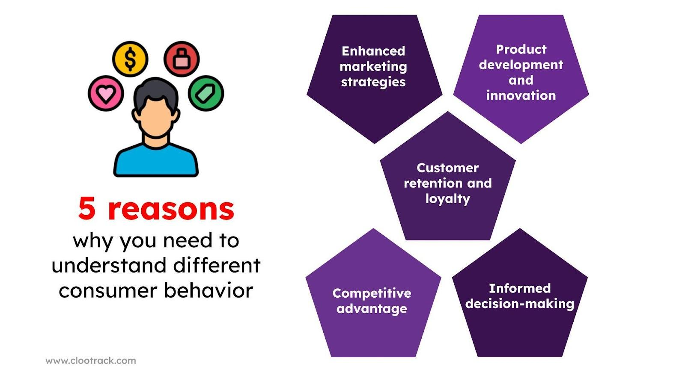

## Table of Contents

## What is the difference between consumer buying and business buying?

Consumer buying is when regular people buy things for their own use. They might buy food, clothes, or a new phone. People usually think about the price, how good the product is, and if they like it. They might also be influenced by ads or what their friends say. Consumer buying can be quick, like buying a snack, or it can take longer, like choosing a new car.

Business buying is different because companies buy things they need to run their business. They might buy office supplies, machines, or services. Businesses care a lot about the price, but they also think about how the product will help their business grow or save money. The buying process can be more complicated because it often involves many people in the company making decisions together. They might also need to follow strict rules or have long-term contracts with suppliers.

## What are the main factors that influence consumer buying decisions?

Several things can affect what people decide to buy. One big factor is price. People usually want to get the best value for their money, so they compare prices and look for deals. Another factor is the quality of the product. If something is well-made and lasts a long time, people are more likely to buy it. Brand reputation also matters a lot. People trust brands they know and like, so they might choose a product just because it's from a company they recognize.

Another important influence is personal needs and wants. For example, if someone is hungry, they'll buy food. If they need a new pair of shoes, they'll look for shoes that fit their style and budget. Social influences can also play a big role. People often listen to what their friends, family, or even celebrities say about products. If someone they trust recommends something, they might be more likely to buy it. Ads and marketing can also sway people's decisions by making products look appealing or by offering special promotions.

Lastly, psychological factors can impact buying decisions. People might buy things to feel good or to fit in with a certain group. Emotions like happiness, fear, or even boredom can lead to buying things. For instance, someone might buy a treat to cheer themselves up. The way a store is set up or how easy it is to buy something online can also influence choices. If shopping is easy and enjoyable, people are more likely to buy more.

## How do businesses typically approach the buying process?

When businesses need to buy things, they usually have a more detailed process than regular people. They start by figuring out exactly what they need. This might mean talking to different people in the company to understand what will help the business the most. Once they know what they need, they look for suppliers who can provide it. They might ask for quotes from different suppliers to compare prices and quality. Businesses often have to follow certain rules or policies when buying things, so they make sure everything is done correctly.

After finding the right supplier, businesses might negotiate to get the best deal. They think about not just the price, but also things like how quickly they can get the product, how reliable the supplier is, and if the product will help them save money or make more money in the long run. Sometimes, businesses sign long-term contracts with suppliers to make sure they always have what they need. The whole process can take a while because it involves a lot of people and steps, but it helps businesses make smart choices that are good for their company.

## What are the different types of consumer buying behavior?

There are four main types of consumer buying behavior. The first type is called "complex buying behavior." This happens when people buy expensive or important things, like a car or a house. They spend a lot of time researching and thinking about their choice because it's a big decision. The second type is "dissonance-reducing buying behavior." This is when people buy something that's pretty important but they're not sure which brand is the best. They might feel worried after buying it and wonder if they made the right choice.

The third type is "habitual buying behavior." This is when people buy things they use every day, like toothpaste or bread. They don't think much about it and usually buy the same brand without much thought. The last type is "variety-seeking buying behavior." This happens when people like to try different brands just for fun, like trying different kinds of snacks or drinks. They might switch brands a lot because they enjoy the variety. Each type of behavior shows how people make buying decisions based on what they're buying and how they feel about it.

## Can you explain the concept of B2B buying and its importance?

B2B buying, which stands for "business-to-business" buying, is when one company buys things from another company. These things can be products, like computers or raw materials, or services, like cleaning or consulting. B2B buying is different from when regular people buy things because it's usually more complicated and involves more people. Companies need to make sure they're getting the best deal and that what they're buying will help their business run better or make more money. They might spend a lot of time looking at different options, talking to suppliers, and figuring out the best way to buy what they need.

B2B buying is really important for the economy because it helps businesses work together and grow. When companies buy things from other companies, it keeps the supply chain moving and helps create jobs. For example, a car company might buy tires from a tire company, which helps both companies make money and keeps people working. B2B buying also helps businesses stay competitive. By finding the best suppliers and the best deals, companies can save money and offer better products or services to their customers. This makes the whole economy stronger and more efficient.

## What are some common strategies used in consumer marketing to influence buying?

One common strategy in consumer marketing is using ads to make products look really good. Companies show their products in ads on TV, online, and in magazines. They use bright colors, happy people, and catchy music to make people want to buy what they're selling. They also offer deals like discounts or buy-one-get-one-free to make people feel like they're getting a good deal. Another strategy is using social media to get people talking about their products. Companies pay influencers or celebrities to talk about their products, hoping that their followers will want to buy them too.

Another strategy is understanding what people need and want. Companies do a lot of research to find out what people are looking for. They make products that fit those needs and wants, and then they tell people about it through ads and marketing. They also make sure their products are easy to find in stores or online, and they might even put them in places where people will see them a lot, like at the checkout counter. By making products that people want and making it easy for them to buy, companies can influence more people to make a purchase.

## How does the buying process differ for small businesses compared to large corporations?

Small businesses often have a simpler buying process compared to large corporations. In a small business, the owner or a few key people might make most of the buying decisions. They usually don't need to follow as many rules or go through as many steps to buy what they need. For example, if a small bakery needs more flour, the owner might just call a supplier and order it. This quick and simple process helps small businesses stay flexible and respond to their needs fast.

On the other hand, large corporations have a more complex buying process. They often have many people involved in making decisions, and they need to follow strict rules and policies. For instance, if a big car company needs new tires, they might have a whole team researching different suppliers, comparing prices and quality, and negotiating contracts. This takes more time and effort, but it helps large corporations make sure they're getting the best deals and the best products for their business. The detailed process also helps them manage risks and keep their operations running smoothly.

## What role does market research play in understanding buying behavior?

Market research helps businesses understand how people buy things. By studying what people like, what they need, and how they make choices, companies can see patterns in buying behavior. They might find out that people want cheaper prices, better quality, or more choices. This information helps businesses make products that people will want to buy. They can also use it to make better ads and find the best places to sell their products.

Market research also helps businesses see how different groups of people buy things. For example, young people might buy more online, while older people might prefer to shop in stores. By knowing these differences, businesses can target their marketing to the right people. They can also change their products or how they sell them to fit what different groups want. This makes their business more successful and helps them grow.

## How can businesses optimize their buying processes to increase efficiency?

Businesses can make their buying processes better by using technology. They can use special computer programs to keep track of what they need to buy and when they need it. This helps them avoid running out of things they need. They can also use the internet to find and talk to different suppliers quickly. By using technology, businesses can save time and make sure they always have what they need without spending too much money.

Another way to make buying more efficient is by making the rules and steps simpler. Big companies often have a lot of rules that can make buying slow. By making these rules easier and faster, businesses can buy things quicker. They can also train their workers to know these rules well so they can make smart choices fast. This helps businesses save time and money, and it makes their whole operation run smoother.

## What are the psychological theories behind consumer buying behavior?

One important psychological theory behind consumer buying behavior is Maslow's Hierarchy of Needs. This theory says that people have different levels of needs, starting with basic things like food and safety, and going up to more complex needs like feeling good about themselves and reaching their full potential. When people buy things, they often do it to meet these needs. For example, someone might buy food to meet their basic need for nourishment, or they might buy a nice outfit to feel more confident and meet their need for self-esteem. Understanding these needs helps businesses know what to sell and how to market their products.

Another theory is the Theory of Planned Behavior. This theory says that people's buying decisions are influenced by what they think, what they want, and what they believe other people think they should do. If someone believes that buying a certain product will make them happier or healthier, they're more likely to buy it. If they think their friends will approve of the purchase, that can also influence their decision. Businesses use this theory to create ads and marketing campaigns that make people feel good about buying their products and show how others will approve of their choices.

## How do global economic factors affect both consumer and business buying?

Global economic factors can change how people and businesses buy things. When the economy is doing well, people might feel more confident and spend more money on things they want, not just what they need. They might buy a new TV or go on a vacation. Businesses might also buy more things to grow and make more money. But if the economy is not doing well, like during a recession, people might be worried about money. They might only buy what they really need, like food and basic clothes. Businesses might cut back on buying things too, and focus on saving money instead of growing.

Global economic factors can also affect prices and what's available to buy. If the value of money changes between countries, it can make things from other countries more or less expensive. For example, if the dollar gets stronger, things from other countries might be cheaper for people in the U.S. to buy. But if the dollar gets weaker, those same things might cost more. This can change what people and businesses decide to buy. Also, if there are problems like trade wars or supply chain issues, it can be harder to get certain products. This can make businesses and people change their buying plans and look for different options.

## What advanced technologies are being used to enhance buying decision processes in businesses?

One advanced technology that helps businesses with buying decisions is artificial intelligence (AI). AI can look at a lot of data really fast and find patterns that people might miss. For example, AI can predict when a business will need to buy more supplies by looking at past buying patterns and current needs. This helps businesses order things at the right time and avoid running out of what they need. AI can also help businesses find the best suppliers by comparing prices, quality, and how fast they can deliver. This makes the whole buying process faster and smarter.

Another technology that's changing how businesses buy things is blockchain. Blockchain is like a digital record book that everyone can see but no one can change. It helps businesses keep track of their buying and selling in a safe and clear way. For example, if a business buys something from another country, blockchain can show exactly where the product came from and how it moved along the way. This makes it easier for businesses to trust their suppliers and make sure they're getting what they paid for. Using blockchain can also cut down on paperwork and make buying things quicker and less confusing.

## What is the impact of algorithmic trading on buying behavior?

Algorithmic trading employs complex algorithms to automate the execution of trades, defined by specific criteria. This technological advancement is significant in transforming the financial buying process, primarily by introducing greater speed and efficiency. Automated systems are capable of processing vast amounts of data in real-time, enabling swift decision-making that outpaces human capabilities.

A key advantage of [algorithmic trading](/wiki/algorithmic-trading) is its ability to minimize human error and mitigate the influence of emotional decision-making. Traditional trading often suffers from biases introduced through human judgment, such as overconfidence or panic selling. Algorithms, however, operate based on pre-programmed instructions and are devoid of emotions, consistently executing trades according to calculated strategies. This leads to more objective and disciplined trading practices.

With the integration of [artificial intelligence](/wiki/ai-artificial-intelligence) (AI) and [machine learning](/wiki/machine-learning), the predictive power of algorithms has been further enhanced. These technologies allow algorithms to learn from historical data and identify patterns, improving the accuracy of predicting market trends. Machine learning algorithms can analyze diverse data sources, from financial indicators to news articles, and adjust trading strategies dynamically based on evolving market conditions. 

One common approach in algorithmic trading is the application of statistical models to predict price movements. For example, a linear regression model might be used to forecast the future price of a security based on its past performance:

$$
P_t = \beta_0 + \beta_1 X_{1t} + \beta_2 X_{2t} + \ldots + \beta_n X_{nt} + \epsilon_t
$$

In this equation, $P_t$ represents the predicted price at time $t$, $X_{nt}$ are the independent variables or factors affecting the price, $\beta_n$ are the coefficients, and $\epsilon_t$ is the error term. Such models allow for real-time analysis and adaptation, crucial for high-frequency trading environments where decisions must be made in milliseconds.

Python, as a preferred programming language in the trading industry, offers libraries such as numpy, pandas, and scikit-learn to implement these algorithms effectively. An example of setting up a simple algorithmic model could start with data preparation using pandas and predictive modeling using scikit-learn:

```python
import pandas as pd
from sklearn.linear_model import LinearRegression

# Load your data into a pandas DataFrame
data = pd.read_csv('market_data.csv')

# Define your features X and target y
X = data[['factor1', 'factor2', 'factor3']]
y = data['price']

# Create and train a linear regression model
model = LinearRegression()
model.fit(X, y)

# Predict future prices
predicted_prices = model.predict(X)
```

The use of machine learning techniques in algorithmic trading is not limited to simple linear models; more sophisticated models like neural networks and [reinforcement learning](/wiki/reinforcement-learning) are increasingly adopted to handle complex and non-linear relationships found in financial data. These advances underscore the potential of algorithmic trading to transform the buying behavior in finance, making it more efficient, systematic, and predictive.

## References & Further Reading

[1]: Bergstra, J., Bardenet, R., Bengio, Y., & Kégl, B. (2011). ["Algorithms for Hyper-Parameter Optimization."](https://dl.acm.org/doi/10.5555/2986459.2986743) Advances in Neural Information Processing Systems 24.

[2]: ["Advances in Financial Machine Learning"](https://www.amazon.com/Advances-Financial-Machine-Learning-Marcos/dp/1119482089) by Marcos Lopez de Prado

[3]: Aronson, D. (2006). ["Evidence-Based Technical Analysis: Applying the Scientific Method and Statistical Inference to Trading Signals."](https://www.amazon.com/Evidence-Based-Technical-Analysis-Scientific-Statistical/dp/0470008741) John Wiley & Sons.

[4]: Jansen, S. (2020). ["Machine Learning for Algorithmic Trading."](https://github.com/stefan-jansen/machine-learning-for-trading) Packt Publishing.

[5]: Chan, E. P. (2008). ["Quantitative Trading: How to Build Your Own Algorithmic Trading Business."](https://github.com/ftvision/quant_trading_echan_book) John Wiley & Sons.