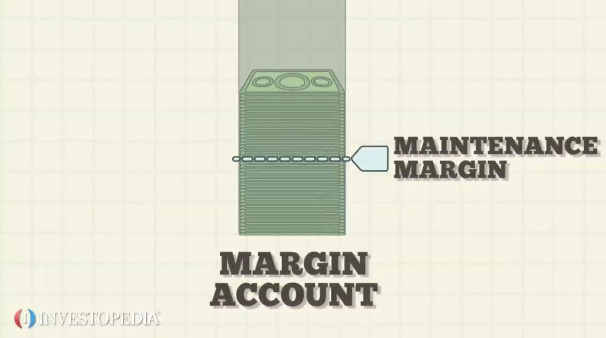

In the dynamic world of investing, staying ahead of the curve is crucial for achieving financial success. The ever-evolving landscape of financial markets demands that investors be well-versed in various strategies designed to optimize portfolios and maximize returns. This guide focuses on three essential investment strategies: Exchange-Traded Funds (ETFs), margin trading, and algorithmic trading (algo trading). Each of these strategies offers unique advantages and potential risks, making it vital for investors to understand their practical applications.

ETFs represent a diverse range of investment opportunities, providing access to different asset classes and sectors. They are known for their liquidity, cost-effectiveness, and the ability to diversify portfolios, making them a popular choice for investors seeking a balanced approach. However, knowing which ETF aligns with specific investment goals requires careful consideration of market conditions and portfolio objectives.

Margin trading, on the other hand, introduces the aspect of leverage, enabling investors to amplify potential gains by borrowing funds from brokers. While this offers the opportunity for higher returns, it also increases the risk, as losses can be magnified. Understanding the nuances of margin accounts and risk management is critical for anyone looking to engage in this form of trading.

Algorithmic trading leverages advanced computer algorithms to execute trades at high speeds. This strategy minimizes human emotion and bias, enhances accuracy, and capitalizes on market efficiencies. Yet, it demands significant technological investment and a robust understanding of regulatory and ethical considerations.

For both novice and experienced investors, this guide aims to broaden investment knowledge and enhance financial strategy planning. By exploring the benefits and drawbacks of ETFs, margin trading, and algo trading, readers can develop a comprehensive approach to investing that adapts to their risk tolerance and objectives. Continuous learning and strategic evaluation are essential as financial markets evolve, emphasizing the need for informed decision-making in pursuit of financial growth.

## Table of Contents

## Understanding ETFs

Exchange-Traded Funds (ETFs) are a type of investment fund that are traded on stock exchanges, much like individual stocks. An ETF holds assets such as stocks, commodities, or bonds and generally operates with an [arbitrage](/wiki/arbitrage) mechanism designed to keep trading close to its net asset value, although deviations can occasionally occur.

### Types of ETFs

ETFs can be categorized into several types based on the underlying assets they track:

1. **Equity ETFs**: These are the most common type of ETFs and are designed to track stock indices like the S&P 500 or the NASDAQ-100. They offer exposure to an array of stocks and enable investors to buy a diverse selection of shares in one transaction.

2. **Bond ETFs**: These focus on investments in fixed-income securities like government bonds, corporate bonds, and municipal bonds. Bond ETFs provide investors with a steady income stream, often with lower volatility compared to equity ETFs.

3. **Commodity ETFs**: These invest in physical commodities such as gold, oil, or agricultural products. Commodity ETFs are a way for investors to gain exposure to commodity movements without directly purchasing physical goods.

4. **Sector-specific ETFs**: These ETFs target specific sectors of the economy, such as technology, healthcare, or energy. They allow investors to focus on sectors they believe will outperform or to balance their existing portfolios.

### Advantages of ETFs

ETFs offer several advantages that make them attractive to a broad range of investors:

- **Diversification**: ETFs allow investors to own a broad array of investments in a single purchase, thus spreading risk. For example, purchasing an equity ETF can provide exposure to hundreds or even thousands of companies in various industries.

- **Liquidity**: ETFs are traded on major exchanges and can be bought or sold throughout the trading day at market prices, providing investors with high liquidity relative to some mutual funds.

- **Cost-effectiveness**: ETFs typically have lower expense ratios compared to traditional mutual funds because most are passively managed and track a specific index, eliminating the need for a team of active managers.

### Selecting ETFs for Investment Goals

When choosing ETFs, investors should consider several factors to ensure they align with their investment goals:

- **Underlying Index**: Understanding the index an ETF tracks is crucial for assessing its fit in a portfolio. This involves examining the components of the index and their weightings.

- **Expense Ratio**: A lower expense ratio is generally preferable, as it indicates a smaller portion of returns will be eaten away by fees.

- **Tracking Error**: This measures how closely the ETF mirrors the performance of its benchmark. Lower tracking errors are desirable as they suggest the ETF more accurately follows its intended index.

- **Liquidity**: Ensuring the ETF has sufficient trading volume is important to minimize issues with buying and selling. More liquid ETFs are typically easier to trade with lower spreads.

### Role of ETFs in a Balanced Portfolio

ETFs play a significant role in constructing a well-balanced investment portfolio. By providing instant diversification, they can help reduce unsystematic risk, which is the risk inherent to a particular stock or sector. Incorporating a mix of equity, bond, and commodity ETFs allows investors to create a portfolio that reflects their risk tolerance and financial goals. Moreover, sector-specific ETFs can be used to capitalize on anticipated growth in particular sectors, further fine-tuning portfolio exposure.

By understanding and strategically utilizing ETFs, investors can enhance their portfolio's potential returns while managing risk effectively. The continued evolution of ETFs provides investors with more precise tools to implement their investment strategies efficiently.

## The Basics of Margin Trading

Margin trading is a financial strategy where investors borrow funds from a broker to purchase additional financial assets, thereby potentially increasing their investment returns. This process requires a margin account, which involves depositing a certain amount of capital as collateral. The collateral acts as a security for the borrowed funds, and the purchasing power of an investor can be significantly enhanced through leverage. 

In margin trading, gains and losses are both amplified because the investor is trading with borrowed money. This can be exemplified by a simple calculation. If an investor uses $10,000 of their own funds and borrows another $10,000 from a broker, they are effectively controlling $20,000 of assets. If the asset's value increases by 10%, the investor earns $2,000, representing a 20% profit on their initial $10,000 investment. Conversely, if the asset’s value decreases by 10%, the investor incurs a $2,000 loss, leading to a 20% loss on their initial investment.

The risks associated with margin trading are substantial. One primary risk is the margin call, which occurs when the equity in a margin account falls below the maintenance margin requirement. In this scenario, the investor must either deposit additional funds or sell off some assets to restore the minimum required equity. Failure to meet a margin call can result in the broker selling the investor's securities, potentially at a loss. Moreover, the potential for significant losses is exacerbated by market [volatility](/wiki/volatility-trading-strategies). An adverse market move can lead to rapid depletion of the investor's equity, resulting in losses exceeding the original investment.

Risk management is crucial in margin trading. Investors can employ several strategies to mitigate the risks involved, such as setting stop-loss orders to limit potential losses and regularly monitoring their margin levels to avoid margin calls. Diversifying their investment portfolio can also help spread risk across different assets, reducing the impact of negative performance from any single investment. Additionally, investors should thoroughly understand their own risk tolerance and assess whether margin trading aligns with their financial goals.

Market conditions play a vital role in determining the success of margin trading. During periods of market stability, the use of leverage can enhance returns. However, in volatile or declining markets, the risks increase substantially. As a result, an understanding of current market trends and future projections is essential for margin traders. The leverage ratio is another critical consideration; it indicates the proportion of borrowed funds to an investor's equity. Higher leverage ratios can lead to greater returns, but also introduce heightened risk. Therefore, prudent investors often opt for moderate leverage ratios to balance potential gains against the possibility of significant losses.

In conclusion, while margin trading offers the potential for enhanced returns through leverage, it also introduces considerable risks. Effective risk management strategies, a keen awareness of market conditions, and judicious use of leverage ratios are essential components of a successful margin trading approach.

## Algo Trading: A Modern Investment Strategy

Algorithmic trading, often abbreviated as algo trading, employs computer programs to execute trades at high speed and [volume](/wiki/volume-trading-strategy). Its innovative approach hinges on pre-programmed instructions that analyze market data and make trading decisions. Algorithmic trading has gained prominence due to its ability to process vast data sets swiftly and execute trades much faster than human traders.

### Types of Algorithms Used in Trading

Algorithmic strategies can be broadly classified into several types, each serving a specific purpose in the trading ecosystem:

1. **Trend-Following Algorithms**: These algorithms capitalize on the momentum of price movements by adhering to the principle of buying high and selling higher. They are predicated on technical indicators such as moving averages. The simplicity and effectiveness of this strategy make it a popular choice, especially for long-term traders.

2. **Arbitrage Algorithms**: Designed to exploit price differentials across different markets or securities, arbitrage algorithms seek to profit from temporary discrepancies. For example, if a stock is priced lower on one exchange than another, an arbitrage algorithm would buy the stock at the lower price and sell it at the higher price, pocketing the difference.

3. **Market-Making Algorithms**: These algorithms provide liquidity to markets through continuous bid and ask prices. Market makers earn from the bid-ask spread, often using sophisticated algorithms to manage inventory risk and adjust to market movements.

### Advantages of Algo Trading

Algo trading offers significant advantages that have contributed to its integration into mainstream finance:

- **Accuracy and Speed**: Algorithms can analyze and react to market conditions far quicker than humans, leading to precision in trade execution.
- **Removal of Emotional Bias**: By automating decision-making processes, algo trading eliminates the emotional biases that can adversely affect human traders.
- **Scalability**: Algorithms can manage large portfolios simultaneously, optimizing for thousands of trades with precision and efficiency.

### Technological Requirements and Costs

The technical infrastructure for algo trading comprises several components:

- **Software and Hardware**: Developing a robust trading system requires sophisticated software capable of handling data-intensive operations. High-performance computing hardware is necessary to minimize latency, especially in high-frequency trading.
- **Data Feeds**: Real-time market data feeds are crucial for algorithmic trading systems to function effectively. This includes historical data for back-testing and live data for real-time decision-making.
- **Costs**: Implementing an algorithmic trading system can be costly, covering software development, hardware acquisition, data subscriptions, and potential regulatory compliance expenses.

### Regulatory Landscape and Ethical Considerations

The rapid growth of algo trading has prompted increased scrutiny by regulatory bodies globally.

- **Regulations**: Entities such as the Securities and Exchange Commission (SEC) in the United States have implemented measures to address risks, including market manipulation and systemic risk associated with high-frequency trading. Regulatory frameworks are evolving to ensure fair and transparent markets.
- **Ethical Considerations**: The ethical implications of algo trading center around issues such as market fairness and the potential for exacerbating volatility. Ensuring algorithms are designed to comply with ethical standards and do not manipulate market conditions is essential.

Algorithmic trading represents a transformative approach in modern finance, offering substantial benefits while posing unique challenges. Its integration into trading strategies necessitates a careful balance of technology, regulatory compliance, and ethical considerations to ensure sustainable and responsible market participation.

## Comparing Investment Strategies

Exchange-Traded Funds (ETFs), margin trading, and algorithmic (algo) trading represent diverse investment strategies, each with unique attributes catering to different investor profiles. By comparing these strategies, investors can better understand their suitability based on risk tolerance, investment goals, and market conditions.

ETFs offer a straightforward investment avenue primarily for those seeking diversification and long-term growth with moderate risk exposure. As a means to invest in a variety of asset classes like equities, bonds, or commodities, ETFs allow investors to spread risk across a broad spectrum of securities. This approach is particularly effective for risk-averse investors aiming to achieve steady returns without actively managing their portfolios. ETFs are also cost-effective and provide [liquidity](/wiki/liquidity-risk-premium), making them an appealing choice for both novice and experienced investors.

On the other hand, margin trading is suitable for investors with a higher risk tolerance who seek leverage to amplify potential returns. By borrowing funds from a broker, investors can increase their buying power, potentially leading to significant gains. However, the risks are substantial; losses can be magnified, and investors may face margin calls if the value of their investments declines. Effective risk management, such as setting stop-loss orders and closely monitoring market conditions, is crucial for those engaging in margin trading. This strategy demands a robust understanding of market dynamics and is typically more suitable for seasoned investors with a high-risk appetite and short-term investment objectives.

Algorithmic trading introduces a technological dimension to investing, harnessing the power of computer programs to execute trades at high speed and volume. This strategy is ideal for investors comfortable with technology and seeking precision and efficiency in their trading activities. Algo trading eliminates emotional bias, allowing for systematic decisions based on predefined criteria. However, it requires significant technological infrastructure and expertise, making it more appropriate for institutional investors or individuals with substantial resources and technical knowledge.

Integrating ETFs, margin trading, and algo trading into a comprehensive investment plan can provide a balanced mix of risk and reward. For example, investors might allocate a portion of their portfolios to ETFs for stability and growth, while using margin trading in favorable market conditions to enhance short-term returns. Meanwhile, algorithmic strategies can be employed to capture market inefficiencies, particularly in high-frequency or volatile environments.

Potential synergies exist when these strategies are combined thoughtfully. For instance, algo trading can optimize both [ETF](/wiki/etf-trading-strategies) and margin-based strategies by automating trade execution and timing, enhancing the overall effectiveness of a diversified portfolio. However, conflicts may arise due to differing risk profiles and capital requirements, necessitating careful planning to align these strategies with overall investment goals.

As market conditions evolve, investors must adapt their strategies accordingly. ETFs may require rebalancing to maintain desired asset allocations, while margin levels should be adjusted based on interest rates and market volatility. Algo trading systems might need updates to reflect new market patterns or regulations.

In summary, the adaptability and integration potential of ETFs, margin trading, and algo trading can cater to a broad spectrum of investor needs. By understanding the specific advantages and limitations of each strategy, investors can craft a dynamic and responsive investment plan that navigates the complexities of financial markets effectively.

## Conclusion

In this guide, we explored the investment strategies of ETFs, margin trading, and [algorithmic trading](/wiki/algorithmic-trading), each offering its unique advantages and considerations. Exchange-Traded Funds (ETFs) present a versatile investment option, providing diversification, liquidity, and cost-effectiveness, making them suitable for both novice and seasoned investors. Margin trading, with its potential for amplified gains, also poses significant risks, requiring a thorough understanding and careful management of leverage and market conditions. Algorithmic trading, meanwhile, leverages technology to enhance trading efficiency and precision, though it demands substantial technological investment and awareness of regulatory implications.

Continued education and strategy evaluation remain vital components of a successful investment journey. Financial markets are inherently unpredictable, and strategies that worked in the past may not yield the same results in the future. Therefore, staying informed and adaptive to changes in market dynamics and technological advancements is crucial. Investors should conduct comprehensive due diligence, carefully considering their financial situation, risk tolerance, and investment objectives before adopting any strategy.

For readers eager to deepen their understanding, various resources can provide further insights into these strategies. Online courses, webinars, financial news outlets, and investment forums offer valuable information for investors aiming to broaden their knowledge. Consulting with financial advisors can also provide personalized guidance aligned with one's financial goals.

As financial markets continue to evolve, maintaining an informed perspective is essential. The diversity and complexity of investment strategies demand a proactive approach, ensuring that investors remain equipped to navigate the challenges and opportunities that arise in the ever-shifting financial landscape.

## References & Further Reading

[1]: Petajisto, A. (2013). ["Active Share and Mutual Fund Performance."](http://www.petajisto.net/papers/petajisto%202013%20faj%20-%20active%20share.pdf) Financial Analysts Journal.

[2]: Ferri, R. A. (2009). ["The ETF Book: All You Need to Know About Exchange-Traded Funds"](https://www.amazon.com/ETF-Book-About-Exchange-Traded-Funds/dp/0470537469) by Richard A. Ferri

[3]: Duke, J., Questier, K., & Brunnabend, M. (2016). ["The Role of Algorithms and Financial Markets."](https://www.guilford.com/books/Literacy-Research-Methodologies/Mallette-Duke/9781462544318) International Monetary Fund Working Paper.

[4]: Pring, M. J. (2014). ["Technical Analysis Explained, Fifth Edition: The Successful Investor's Guide to Spotting Investment Trends and Turning Points"](https://www.amazon.com/Technical-Analysis-Explained-Fifth-Successful/dp/0071825177) by Martin J. Pring

[5]: Hull, J. C. (2018). ["Options, Futures, and Other Derivatives"](https://www.semanticscholar.org/paper/Options%2C-Futures%2C-and-Other-Derivatives-Hull/89bdee500c8623864fc9eb7a471546aa713acc44) by John C. Hull