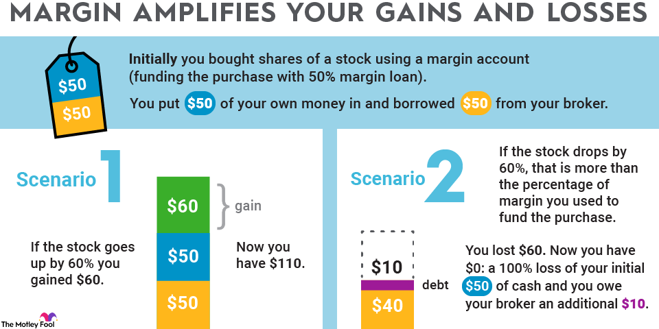

## Table of Contents

## What is an ETF and how does it work?

An ETF, or Exchange-Traded Fund, is a type of investment that works a lot like a mutual fund but trades on a stock exchange like a stock. It's a collection of different assets, such as stocks, bonds, or commodities, bundled together into a single fund. When you buy shares of an ETF, you're essentially buying a small piece of all the assets inside it. This makes it easy to diversify your investments without having to buy each asset separately.

ETFs are popular because they offer flexibility and can be bought and sold throughout the trading day at market prices. This is different from mutual funds, which are only priced at the end of the trading day. ETFs also tend to have lower fees than many mutual funds, making them a cost-effective way to invest. They can track a wide range of indexes, sectors, or commodities, allowing investors to target specific areas of the market or to build a broad, diversified portfolio.

## What does it mean to buy on margin?

Buying on margin means borrowing money from your broker to buy stocks or other investments. You use the money in your brokerage account as collateral for the loan. This allows you to buy more stocks than you could with just the cash you have, but it also increases your risk because you have to pay back the loan with interest.

If the value of your investments goes up, you can make more money than if you had only used your own cash. But if the value goes down, you could lose more money than you started with. You might get a margin call, which means you need to add more money to your account or sell some of your investments to cover the loan. It's a way to potentially increase your gains, but it also increases your risk.

## What are the risks associated with buying ETFs on margin?

Buying ETFs on margin can be risky because you're borrowing money to invest. If the value of the ETFs goes down, you might lose more money than you put in. This is because you still have to pay back the loan you took to buy the ETFs, plus interest. If the ETFs don't perform well, you could end up owing more money than the ETFs are worth.

Another risk is getting a margin call. This happens if the value of your ETFs drops a lot. Your broker might ask you to add more money to your account or sell some of your ETFs to cover the loan. If you can't do this, your broker might sell your ETFs without asking you, and you could end up with less money than you started with. So, buying ETFs on margin can make your gains bigger, but it can also make your losses bigger if things don't go well.

## How can I start buying ETFs on margin?

To start buying ETFs on margin, you first need to open a margin account with a brokerage firm. This is different from a regular brokerage account because it lets you borrow money to buy investments. You'll need to fill out an application and meet the firm's requirements, like having enough money in your account. Once your margin account is set up, you can start using the borrowed money to buy ETFs.

When you buy ETFs on margin, remember that you're borrowing money, so you'll have to pay interest on the loan. You'll need to keep an eye on your account because if the value of your ETFs goes down a lot, you might get a margin call. This means you'll have to add more money to your account or sell some of your ETFs to cover the loan. It's a way to possibly make more money, but it also means more risk.

## What are the margin requirements for ETFs?

Margin requirements for ETFs are set by your brokerage firm and the Financial Industry Regulatory Authority (FINRA). Usually, you need to have at least 50% of the total cost of the ETFs in your account to buy them on margin. This is called the initial margin requirement. For example, if you want to buy $10,000 worth of ETFs, you need to have at least $5,000 in your account, and the rest can be borrowed from your broker.

After you buy the ETFs, you need to keep a certain amount of money in your account, which is called the maintenance margin. This is usually about 25% of the total value of the ETFs you own. If the value of your ETFs goes down and the money in your account falls below this maintenance margin, you might get a margin call. This means you'll need to add more money to your account or sell some of your ETFs to bring your account back up to the required level.

## How does interest on margin loans work?

When you buy ETFs on margin, you're borrowing money from your broker. This loan comes with interest, which you have to pay. The [interest rate](/wiki/interest-rate-trading-strategies) can be different depending on your broker and the amount of money you borrow. It's usually shown as an annual percentage rate (APR), but you'll pay it every day or every month, depending on your broker's rules.

The interest adds up over time, so the longer you keep the loan, the more you'll have to pay. It's important to think about this cost when you're deciding to buy on margin. If the ETFs you buy don't go up in value enough to cover the interest, you could lose money. Always check the interest rate and make sure you understand how much it will cost you before you start buying on margin.

## What are the potential benefits of using margin to buy ETFs?

Using margin to buy ETFs can help you make more money if the ETFs go up in value. When you borrow money to buy more ETFs than you could with just your own cash, you can make bigger gains if the ETFs do well. This means you have the chance to grow your investments faster than if you were only using your own money.

But remember, using margin also comes with risks. If the ETFs don't go up in value or even go down, you could lose more money than you started with because you still have to pay back the loan plus interest. So, while margin can help you make more money, it's important to be careful and understand the risks involved.

## How do market conditions affect buying ETFs on margin?

Market conditions can really change how well buying ETFs on margin works out for you. When the market is going up, and the ETFs you bought are doing well, using margin can help you make more money. Since you borrowed money to buy more ETFs, your gains can be bigger than if you had only used your own cash. It's like having a chance to grow your investments faster.

But if the market goes down, buying ETFs on margin can be risky. If the ETFs you bought lose value, you might end up losing more money than you started with. That's because you still have to pay back the loan you took to buy the ETFs, plus the interest on that loan. If the market drops a lot, you could get a margin call, where you need to add more money to your account or sell some of your ETFs to cover the loan. So, market conditions can make buying ETFs on margin either a good choice or a risky one.

## What are some strategies for managing a margin account with ETFs?

Managing a margin account with ETFs means you need to keep an eye on the market and your investments. One good strategy is to set clear goals for your investments and decide how much risk you're okay with. Since buying on margin can make your losses bigger if the market goes down, it's smart to only use margin for ETFs that you think have a good chance of going up in value. Also, try to keep some extra cash in your account. This can help you avoid margin calls if the ETFs lose value.

Another strategy is to keep checking your account and the value of your ETFs. If the market starts to go down, you might want to sell some of your ETFs before you get a margin call. It's also a good idea to know how much interest you're paying on the money you borrowed. If the interest is too high, it might eat into your profits, so make sure the ETFs you're buying can make enough money to cover the interest. By being careful and keeping an eye on things, you can use margin to help grow your investments without taking too much risk.

## How does leverage impact the returns and losses when buying ETFs on margin?

When you buy ETFs on margin, you're using leverage, which means you're borrowing money to buy more ETFs than you could with just your own cash. This can make your returns bigger if the ETFs go up in value. For example, if you use margin to buy twice as many ETFs and they go up by 10%, you could make twice as much money as if you had only used your own money. It's like having a chance to grow your investments faster.

But leverage can also make your losses bigger if the ETFs go down in value. If you borrowed money to buy more ETFs and they drop by 10%, you'll lose twice as much money as if you had only used your own cash. Plus, you still have to pay back the loan and the interest on it, which can make your losses even worse. So, while leverage can help you make more money, it also means you need to be careful because the risks are higher.

## What are the tax implications of buying ETFs on margin?

When you buy ETFs on margin, the tax rules can get a bit tricky. If you sell your ETFs for more money than you paid for them, you'll have to pay capital gains tax on the profit. This is true whether you bought the ETFs with your own money or with borrowed money. The tax rate depends on how long you held the ETFs before selling them. If you held them for less than a year, it's a short-term capital gain, and you'll pay your regular income tax rate on it. If you held them for more than a year, it's a long-term capital gain, and the tax rate is usually lower.

Another thing to think about is the interest you pay on the money you borrowed to buy the ETFs on margin. You can't usually deduct this interest from your taxes unless you're using the ETFs to make money, like if you're a day trader. If you can deduct the interest, it might help lower your taxable income. But if you can't, the interest you pay is just another cost of buying on margin. So, always check with a tax professional to make sure you understand how buying ETFs on margin will affect your taxes.

## How can advanced traders use margin to optimize their ETF investment strategies?

Advanced traders can use margin to optimize their [ETF](/wiki/etf-trading-strategies) investment strategies by taking advantage of leverage to increase their potential returns. By borrowing money to buy more ETFs, traders can amplify their gains if the ETFs go up in value. This can be particularly useful for traders who have a strong understanding of market trends and can predict which ETFs are likely to perform well. For example, if a trader believes a certain sector is about to grow, they can use margin to buy more ETFs in that sector, potentially [earning](/wiki/earning-announcement) more money than if they had only used their own cash.

However, advanced traders also need to manage the risks that come with using margin. They should keep a close eye on their investments and the overall market to avoid big losses. If the ETFs they bought on margin start to lose value, traders might get a margin call, which means they need to add more money to their account or sell some ETFs to cover the loan. To manage this, advanced traders might use stop-loss orders to automatically sell ETFs if they drop to a certain price, helping to limit their losses. By carefully balancing the potential for higher returns with the increased risk, advanced traders can use margin to fine-tune their ETF investment strategies.

## References & Further Reading

[1]: Petajisto, A. (2013). ["Active Share and Mutual Fund Performance."](http://www.petajisto.net/papers/petajisto%202013%20faj%20-%20active%20share.pdf) Financial Analysts Journal.

[2]: Ferri, R. A. (2009). ["The ETF Book: All You Need to Know About Exchange-Traded Funds"](https://www.amazon.com/ETF-Book-About-Exchange-Traded-Funds/dp/0470537469) by Richard A. Ferri

[3]: Duke, J., Questier, K., & Brunnabend, M. (2016). ["The Role of Algorithms and Financial Markets."](https://www.guilford.com/books/Literacy-Research-Methodologies/Mallette-Duke/9781462544318) International Monetary Fund Working Paper.

[4]: Pring, M. J. (2014). ["Technical Analysis Explained, Fifth Edition: The Successful Investor's Guide to Spotting Investment Trends and Turning Points"](https://www.amazon.com/Technical-Analysis-Explained-Fifth-Successful/dp/0071825177) by Martin J. Pring

[5]: Hull, J. C. (2018). ["Options, Futures, and Other Derivatives"](https://www.semanticscholar.org/paper/Options%2C-Futures%2C-and-Other-Derivatives-Hull/89bdee500c8623864fc9eb7a471546aa713acc44) by John C. Hull