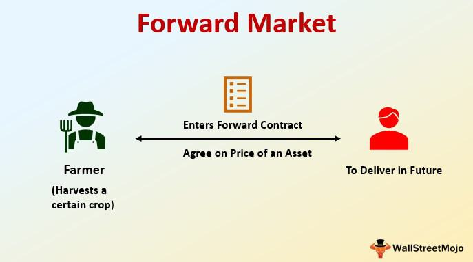

Forward contracts are a foundational component of financial strategy, allowing parties to lock in prices for the future purchase or sale of assets. These customizable agreements are particularly valuable in uncertain markets where price volatility can lead to unexpected financial outcomes. By predetermining the cost of an asset, forward contracts help businesses and investors mitigate risks associated with price fluctuations, ensuring stability in their financial planning and operations.

The significance of buying forward in financial markets cannot be overstated. In sectors such as commodities, currencies, and interest rates, the ability to secure a price in advance can protect against adverse market movements. For example, an airline might use a forward contract to purchase fuel at a fixed price, thus shielding itself from potential price increases. This strategic foresight allows participants to budget effectively and can lead to increased profitability by avoiding unfavorable terms or rates due to market unpredictability.



Algorithmic trading, which utilizes computer algorithms to execute trades at optimal speeds and prices, has increasingly gained relevance in the context of forward contracts. Algorithms can process vast amounts of data rapidly and execute trades based on predefined criteria, enhancing the efficiency and accuracy of trading strategies. In the case of forward contracts, algorithmic trading can optimize the timing and pricing of contracts, making them more advantageous for traders.

The purpose of this article is to explore the intricacies of buying forward as a component of algorithmic trading strategies. By examining the mechanisms and benefits of forward contracts, as well as their integration into algorithmic systems, this article aims to provide a comprehensive understanding of how forward buying can be leveraged effectively in today's technologically-driven trading environments.

## Table of Contents

## Understanding Forward Contracts

Forward contracts are customized financial agreements between two parties to buy or sell an asset at a predetermined price on a specified future date. Unlike standardized futures contracts which are traded on exchanges, forward contracts are typically traded over-the-counter (OTC), meaning they can be tailored to the specific needs of the parties involved.

The key distinction between forward and futures contracts lies in their customization and trading environments. Futures contracts are standardized agreements traded on exchanges with predefined terms regarding delivery dates, contract sizes, and compliance with exchange regulations. This standardization enhances liquidity but limits flexibility. In contrast, forward contracts offer bespoke terms that cater to the specific needs of the contracting parties, thus providing greater flexibility but also introducing more significant counterparty risk due to the lack of a centralized clearinghouse.

One advantage of using forward contracts in financial strategy is their ability to hedge against price [volatility](/wiki/volatility-trading-strategies). By locking in prices for underlying assets, such as currencies, commodities, or financial instruments, parties can mitigate the risks associated with price fluctuations. This quality is particularly valuable for businesses seeking to stabilize cash flows and budgeting by predetermining costs or revenues.

In high-demand scenarios, forward contracts exert significant influence on markets. For instance, in agricultural markets, producers may use forward contracts to secure prices for crops prior to harvest, reducing the uncertainty of income due to variations in market prices at delivery time. This strategy assures farmers a stable income and helps purchasers lock in a consistent supply of commodities at predictable prices.

Similarly, forward contracts can play a crucial role in currency markets where businesses aim to hedge against unfavorable exchange rate movements. By setting an exchange rate through a forward agreement, companies can diminish the risk of currency devaluation that could impact international transactions.

In summary, forward contracts serve as vital instruments for managing financial risks and ensuring price certainty in volatile markets. Their ability to offer bespoke terms that cater to specific strategic needs makes them indispensable in scenarios where standardized agreements may fall short.

## The Role of Buying Forward in Financial Strategy

Forward contracts play a crucial role in financial strategies by allowing parties to lock in prices for future transactions, thereby mitigating the financial risk associated with price volatility. By agreeing on a set price for an asset to be delivered at a future date, these contracts offer certainty and predictability, essential for effective financial planning and management.

**Strategic Benefits of Buying Forward in Anticipation of Price Hikes**

The foremost advantage of buying forward contracts is the ability to anticipate and hedge against price hikes. In economic sectors with high volatility, such as commodities or foreign exchange, these contracts allow buyers and sellers to insulate themselves from unpredictable market movements. Buyers can secure an asset at a predetermined price, even if the market rate escalates in the interim. By doing so, they protect themselves against inflationary pressures and price surges, which can significantly affect profitability and financial outcomes.

**Buying Forward in Currencies: An Effective Hedging Strategy**

In the currency markets, forward contracts serve as a potent hedging mechanism against exchange rate fluctuations. Corporations engaged in international trade often use these contracts to stabilize costs and revenues linked to foreign currencies. By entering a forward contract, a company can secure the current exchange rate for future transactions, thereby eliminating the risk of unfavorable currency movements that could erode profit margins. This strategy is especially critical in regions where currencies can be volatile due to economic or political instability.

**Impact on Commodity Markets: Securing Lower Prices in Advance**

In the commodities sector, forward contracts afford buyers the opportunity to secure lower prices for raw materials and other inputs, which can constitute a significant portion of production costs. For instance, an airline may enter a forward contract to purchase fuel at a fixed price, shielding itself from expected rises in oil prices. This can lead to more predictable budgeting and pricing strategies, allowing firms to maintain competitive pricing without sacrificing margins.

**Case Studies of Successful Forward Buying Strategies**

Several case studies illustrate the effective use of forward buying strategies. A notable example is that of Southwest Airlines, which successfully used fuel hedging through forward contracts for years, allowing the company to maintain stable operating costs despite volatile oil prices. This strategic foresight gave Southwest a competitive edge, enabling it to offer lower fares compared to its competitors who were more exposed to fuel cost fluctuations.

Another example is Procter & Gamble, which utilizes currency forward contracts to manage its international financial exposure effectively. By locking in exchange rates, P&G stabilizes its cost structure, ensuring that currency instability does not adversely impact its operations and financial performance.

In summary, forward contracts are indispensable tools in financial strategy, enabling market participants to anticipate and mitigate risks associated with price fluctuations. Through strategic implementation in currency and commodity markets, organizations can achieve greater financial stability and competitive advantage.

## Algorithmic Trading: An Overview

Algorithmic trading, commonly referred to as algo trading, is the use of computer algorithms to automate trading strategies and execute orders at high speed and frequency. This approach leverages mathematical models and complex algorithms to make decisions about the timing, price, and quantity of trades, often resulting in increased efficiency and profitability compared to traditional manual trading methods.

The evolution of [algorithmic trading](/wiki/algorithmic-trading) can be traced back to the 1970s with the introduction of electronic exchanges. The development of sophisticated computer systems and advancements in data analytics further propelled the growth of algo trading in the late 20th century. Today, it accounts for a significant portion of trading activity in financial markets worldwide, with a variety of strategies that cater to different market conditions and trader objectives.

Popular strategies used in algorithmic trading include:

1. **Arbitrage**: This strategy exploits price discrepancies between different markets or instruments. Algorithms can quickly identify and profit from these inefficiencies by simultaneously buying low in one market and selling high in another.

2. **Trend Following**: Algorithms are programmed to identify market trends and generate buy or sell signals based on such patterns. Moving averages, momentum indicators, and breakouts are common techniques in this strategy.

3. **Mean Reversion**: This strategy capitalizes on the assumption that asset prices will revert to their historical mean over time. Algorithms detect overbought or oversold conditions to initiate trades that anticipate a price correction.

4. **Market Making**: Algorithms act as liquidity providers by continuously quoting buy and sell prices for a financial instrument and profiting from the bid-ask spread.

The primary advantages of automation in trading decisions include speed and accuracy. Algorithms can process vast amounts of data in milliseconds, making it possible to execute trades at an optimal price and thus capture fleeting market opportunities. Moreover, automation minimizes human error and allows for the disciplined execution of trading strategies without the influence of emotions such as fear or greed.

Integrating algo trading with forward contracts offers enhanced strategy opportunities for traders. Forward contracts, private agreements between two parties to buy or sell an asset at a specified price on a future date, can be systematically executed through algorithms. This integration allows traders to manage risks more effectively by locking in prices automatically based on predefined criteria. For instance, an algorithm could be designed to activate forward contracts when market indicators predict unfavorable price movements, thereby securing favorable terms for the trader.

In summary, algorithmic trading represents a significant advancement in financial strategies, offering precise and efficient trading execution. By incorporating forward contracts into their algorithmic frameworks, traders can further refine their risk management practices and optimize their market engagements.

## Implementing Forward Contracts in Algo Trading

Forward contracts play a significant role in algorithmic trading, providing a tool for traders to hedge, speculate, or otherwise manage their financial exposures more precisely. Utilizing forward contracts within algorithmic trading involves a sophisticated approach to customizing contracts to align with specific trading strategies, managing associated risks, and employing algorithms that can effectively leverage these contracts.

**Utilization in Algorithmic Trading:**
Forward contracts are incorporated into algorithmic trading systems to allow precision in speculative or hedging strategies. These contracts are agreements to buy or sell an asset at a predetermined future date for a price agreed upon today. They are characterized by their customization abilities, free from the constraints of standardized contracts like futures. This customizable nature is attractive for algorithmic strategies requiring tailored financial instruments to match specific trading models, such as those based on quantitative finance theories or statistical [arbitrage](/wiki/arbitrage). 

**Customizing Forward Contracts:**
Customizing forward contracts involves adjusting the terms to cater to a specific strategy's needs, which may involve selecting suitable expiration dates, underlying asset quantities, and specified contract terms. For algorithmic traders, this personalization ensures that contracts align with the risk profiles and objectives dictated by the trading algorithms. For example, a trader adopting a [statistical arbitrage](/wiki/statistical-arbitrage) algorithm might design forward contracts to hedge against specific risks identified by their predictive models.

Consider the Python snippet below, which demonstrates a simple strategy to customize a forward contract:

```python
class ForwardContract:
    def __init__(self, asset, delivery_date, forward_price):
        self.asset = asset
        self.delivery_date = delivery_date
        self.forward_price = forward_price

    def customize(self, new_price=None, new_date=None):
        if new_price:
            self.forward_price = new_price
        if new_date:
            self.delivery_date = new_date

# Create a forward contract
forward = ForwardContract('EUR/USD', '2023-12-31', 1.20)
# Customize the contract
forward.customize(new_price=1.18)
```

**Risk Management:**
The combination of algo trading with forward contracts introduces several risks, such as market, [liquidity](/wiki/liquidity-risk-premium), and counterparty risks. Algorithms must be equipped with robust risk management frameworks to mitigate potential downsides. This involves implementing stop-loss mechanisms, setting predefined risk thresholds, and ensuring diversification across multiple market conditions. Proper [backtesting](/wiki/backtesting) under varying scenarios is crucial to ensure that trading algorithms can respond effectively in actual market situations.

**Examples of Effective Algorithms:**
Certain algorithms excel in leveraging forward contracts effectively by capitalizing on price movements anticipated through predictive analytics. For instance, trend-following algorithms might use forward contracts to lock in prices ahead of expected upward trends in asset prices. Another example is the use of mean reversion strategies, where forward contracts are employed to predict and capitalize on assets returning to their historical prices, securing contracts that benefit from this reversion.

In summary, the implementation of forward contracts in algorithmic trading offers precision, customization, and risk management benefits, allowing traders to craft sophisticated strategies that align with market predictions and risk tolerance profiles. By leveraging predictive analytics, solid risk mitigation strategies, and the inherent flexibility of forward contracts, algorithmic traders can enhance their market positions to achieve strategic financial goals.

## Benefits and Risks of Buying Forward in Algo Trading

Buying forward in algorithmic trading offers several compelling benefits that attract traders seeking to optimize their financial strategies. This method allows traders to lock in prices for assets or commodities at a future date, thus providing predictability in cash flows and protection against adverse price movements. The primary benefits of buying forward in algorithmic trading include price certainty, hedging against market volatility, and potential cost savings. By securing a price today for delivery in the future, traders can protect themselves against price surges, thereby stabilizing future costs and aiding more accurate financial planning.

However, trading through forward contracts in the context of algorithmic strategies also introduces several risks. One significant risk is market risk, which arises from the potential loss due to unfavorable movements in the price of the underlying asset. As forward contracts are typically customized to the buyer and seller's specifications, they are not traded on an exchange and thus, lack the inherent liquidity, increasing the difficulty of exiting or offsetting positions. To mitigate these risks, traders often employ various strategies, such as setting stop-loss orders and using predictive algorithms to anticipate price movements more accurately.

Another major risk in forward contracts, particularly in the over-the-counter (OTC) market, is counterparty risk. This risk refers to the possibility that the other party involved in the forward contract may default on their obligation. Since OTC transactions do not usually involve a clearinghouse, as futures contracts do, the burden of ensuring the creditworthiness of the counterparty lies solely with the trader. Employing thorough due diligence and possibly engaging third-party services for credit risk assessment are key strategies in mitigating counterparty risk.

Historical case studies illustrate the practical dynamics of buying forward in algorithmic trading. Successful scenarios often involve a combination of market insight and robust algorithmic models that account for various market conditions and adjust trading strategies accordingly. For example, during periods of anticipated commodity shortages, forward buying facilitated considerable cost saving for algorithmic traders who had correctly predicted supply constraints. Conversely, unsuccessful cases have frequently resulted from over-reliance on algorithmic predictions without adequate risk management, leading to significant financial losses when market conditions deviated from predicted models.

In conclusion, while buying forward in algorithmic trading offers strategic advantages such as price security and the potential for cost minimization, it requires astute management of intrinsic risks, including market and counterparty risks. By implementing comprehensive risk mitigation strategies, traders can effectively harness the benefits of forward contracts within their algorithmic trading frameworks.

## Technological and Regulatory Considerations

Technological infrastructure plays a crucial role in the successful implementation of algorithmic trading strategies involving forward contracts. A robust technology framework is required to handle the rapid execution of trades, manage large datasets, and ensure seamless integration with various financial systems. Key components include high-frequency trading systems, low-latency networks, and advanced data processing capabilities. The implementation often involves scalable cloud computing resources that can process transactions in real-time and handle complex algorithms required to execute forward contracts.

Algorithmic trading systems typically operate on high-performance computing environments that utilize multi-threading and parallel processing to optimize trade execution speeds. These systems are supported by financial data feeds, which provide real-time market information crucial for making informed trading decisions. Robust cybersecurity measures are also essential to protect sensitive trading data and maintain the integrity of the trading system.

Regulatory frameworks governing forward contracts vary significantly across jurisdictions. These contracts are primarily classified under over-the-counter (OTC) derivatives, which are subject to distinct regulatory oversight compared to exchange-traded derivatives like futures. In the United States, the Commodity Futures Trading Commission (CFTC) regulates forward contracts alongside the Securities and Exchange Commission (SEC), focusing on ensuring market transparency and mitigating systemic risk. The European Union implemented the European Market Infrastructure Regulation (EMIR), which mandates reporting and increases transparency of OTC derivatives, including forward contracts.

Compliance requirements in forward and algorithmic trading necessitate adherence to both technological and regulatory standards. Best practices include establishing transparent reporting procedures, ensuring data accuracy, and maintaining comprehensive audit trails of all trading activities. The development of compliance programs aligned with international standards is crucial for managing counterparty risks and adhering to anti-money laundering (AML) regulations.

Regulatory bodies worldwide play a pivotal role in facilitating secure and efficient markets by enforcing standards and practices that promote financial stability. These organizations are tasked with monitoring financial markets to prevent abusive practices, reduce systemic risk, and protect investors. Notable regulatory bodies include the Securities and Exchange Commission (SEC) in the United States, the Financial Conduct Authority (FCA) in the United Kingdom, and the International Organization of Securities Commissions (IOSCO), which coordinates international regulatory standards across jurisdictions.

In conclusion, technological and regulatory considerations are integral to the effective implementation of forward contracts in algorithmic trading. Financial institutions must invest in advanced technological systems to support trading activities while ensuring compliance with diverse regulatory standards to manage risks and maintain market integrity.

## Conclusion

Buying forward contracts as a strategy in algorithmic trading represents a fusion of traditional and modern trading methodologies. By incorporating forward contracts into algorithmic trading systems, traders can secure prices for assets they anticipate will rise in value, effectively hedging against price volatility. This approach offers the dual advantage of leveraging the predictive capabilities of algorithms while capitalizing on the strategic foresight provided by forward contracts.

Managing risks associated with forward contracts within algorithmic trading necessitates the development of robust strategies. This involves understanding the specific market dynamics, incorporating advanced risk management techniques, and ensuring that algorithms are designed to respond swiftly to market changes. Effective risk management can be achieved through diversification, implementing stop-loss mechanisms, and continuously optimizing algorithm parameters based on evolving market data.

Looking to the future, forward contracts are likely to become increasingly integral to algorithmic trading as technology evolves and markets become more interconnected. The expansion of global markets, coupled with the growing sophistication of trading algorithms, suggests that forward contracts will play a crucial role in facilitating cross-border transactions and managing associated risks.

For traders, exploring the integration of buying forward into their algorithmic strategies could provide a significant edge. As they navigate complex market conditions, the ability to lock in future prices can offer a competitive advantage, enabling traders to capitalize on favorable market trends and shield against unforeseen price fluctuations. Embracing forward contracts within algorithmic trading frameworks promises to enhance strategic flexibility and drive more informed decision-making in an ever-changing financial landscape.

## References & Further Reading

[1]: Hull, J. C. (2017). ["Options, Futures, and Other Derivatives."](https://www.semanticscholar.org/paper/Options%2C-Futures%2C-and-Other-Derivatives-Hull/89bdee500c8623864fc9eb7a471546aa713acc44) Pearson.

[2]: Black, F., & Scholes, M. (1973). ["The Pricing of Options and Corporate Liabilities."](https://www.cs.princeton.edu/courses/archive/fall09/cos323/papers/black_scholes73.pdf) The Journal of Political Economy, 81(3), 637-654.

[3]: Lopez de Prado, M. (2018). ["Advances in Financial Machine Learning."](https://www.amazon.com/Advances-Financial-Machine-Learning-Marcos/dp/1119482089) Wiley.

[4]: Chan, E. P. (2013). ["Algorithmic Trading: Winning Strategies and Their Rationale."](https://github.com/ftvision/quant_trading_echan_book) Wiley.

[5]: Jansen, S. (2020). ["Machine Learning for Algorithmic Trading: Predictive Models to Extract Signals from Market and Alternative Data."](https://www.amazon.com/Machine-Learning-Algorithmic-Trading-alternative/dp/1839217715) Packt Publishing.

[6]: Fabozzi, F. J., & Mann, S. V. (Eds.). (2012). ["Handbook of Fixed-Income Securities."](https://www.mhebooklibrary.com/doi/book/10.1036/9781260473902) McGraw-Hill Education.

[7]: Aronson, D. R. (2007). ["Evidence-Based Technical Analysis: Applying the Scientific Method and Statistical Inference to Trading Signals."](https://onlinelibrary.wiley.com/doi/book/10.1002/9781118268315) Wiley.