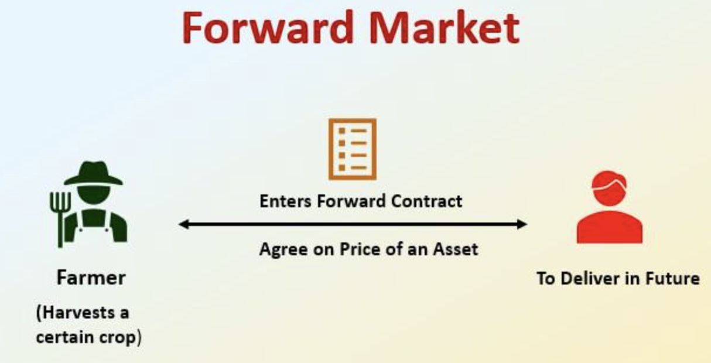

## Table of Contents

## What is buying forward?

Buying forward is when someone agrees to buy something now but will get it later. This is common in business, especially with things like crops or oil. For example, a company might buy forward wheat that will be harvested in six months. This helps the company know they will have the wheat they need, and it helps the farmer know they have a buyer for their wheat.

This kind of deal can be good because it makes things more predictable. The buyer knows they will get what they need, and the seller knows they will sell their product. But there are risks too. If the price of wheat goes down before the harvest, the buyer might end up paying more than they need to. If the price goes up, the seller might feel they sold too cheaply. So, buying forward is about balancing the need for predictability with the risk of price changes.

## How does buying forward differ from traditional purchasing?

Buying forward is different from traditional purchasing because it involves agreeing to buy something now but receiving it later. In traditional purchasing, you usually pay for and get the product right away. For example, when you go to a store and buy a shirt, you take it home with you that day. With buying forward, you might agree to buy wheat in January but not get it until the harvest in July.

This difference can be important for planning. Buying forward helps businesses know they will have what they need in the future, which can be useful for things like managing inventory or planning production. Traditional purchasing doesn't give you that future guarantee, which can make planning harder. But buying forward also comes with risks, like if the price of what you're buying changes before you actually get it. Traditional purchasing avoids this risk because you're paying the current price and getting the product immediately.

## What are the main benefits of buying forward for individuals?

Buying forward can help individuals plan better. For example, if you know you'll need heating oil in the winter, you can buy it forward in the summer. This means you won't have to worry about finding oil when it's cold outside. It also helps you know exactly how much you'll spend on oil, which can make budgeting easier.

Another benefit is that buying forward can sometimes save you money. If you think the price of something will go up, buying it forward lets you get it at today's lower price. For example, if you buy forward tickets for a concert that's happening next year, you might pay less than if you waited until just before the concert when ticket prices could be higher.

## What are the potential risks associated with buying forward?

Buying forward can be risky because prices might change after you make your deal. If you buy something forward and the price goes down before you get it, you might end up paying more than you needed to. For example, if you buy forward oil at $3 a gallon and the price drops to $2 a gallon by the time you get it, you've paid an extra dollar per gallon.

Another risk is that you might not need the thing you bought forward anymore. Life can change, and if you no longer need what you agreed to buy, you could be stuck with it. For instance, if you buy forward tickets to a concert but then can't go, you might not be able to get your money back.

Also, there's a chance that the seller might not be able to deliver what you bought. If the seller runs into problems, like a farmer having a bad harvest, you might not get what you paid for. This can leave you in a tough spot, especially if you were counting on that item.

## Can you explain the basic mechanisms of a forward contract?

A forward contract is an agreement between two people where one agrees to buy something from the other at a set price, but they will actually get it later. For example, a farmer and a bakery might make a forward contract for wheat. The farmer agrees to sell wheat to the bakery at a price they agree on today, but the bakery won't get the wheat until the harvest time.

The basic idea behind a forward contract is to help both the buyer and the seller plan better. The buyer knows they will get what they need in the future, and the seller knows they have a buyer for their product. But there are risks. If the price of wheat goes down before the harvest, the bakery might end up paying more than they need to. If the price goes up, the farmer might feel they sold too cheaply. So, a forward contract is about balancing the need for predictability with the risk of price changes.

## How are prices determined in forward buying agreements?

In forward buying agreements, prices are determined by what the buyer and seller agree on at the time they make the deal. They look at the current market price for the thing they are buying, like wheat or oil. They also think about what they think the price might be when the buyer actually gets the product. Sometimes, they use their own guesses, and sometimes they look at what experts are saying about future prices.

Both the buyer and the seller want to make a deal that feels fair. The buyer wants to make sure they don't pay too much if the price goes down later. The seller wants to make sure they don't sell too cheaply if the price goes up. So, they negotiate and try to find a price that works for both of them. This can be tricky because no one knows for sure what will happen to prices in the future.

## What types of assets or commodities are commonly involved in forward buying?

Forward buying is often used for things that people need but can't get right away, like crops and oil. Farmers use forward contracts to sell their crops, like wheat or corn, before they are even harvested. This helps them know they will have a buyer when the crops are ready. Companies that need these crops, like bakeries or food producers, use forward buying to make sure they have the ingredients they need in the future.

Another common use of forward buying is for energy, like oil and natural gas. Companies that use a lot of energy, like airlines or power plants, buy forward to lock in prices. This helps them plan their budgets and know how much they will spend on fuel or energy. Even though the price of oil can change a lot, forward buying gives them some control over their costs.

Forward buying can also be used for other things, like metals and currencies. Companies that need metals, like copper or steel, for manufacturing might buy forward to make sure they have what they need. And businesses that do a lot of international trade might use forward contracts for currencies to protect against changes in exchange rates. This helps them know how much they will spend or earn in different countries.

## How can businesses use forward buying to manage risk?

Businesses use forward buying to manage risk by making sure they have what they need in the future. For example, a bakery might use a forward contract to buy wheat at today's price, even though they won't get it until the harvest. This helps them avoid the risk of wheat prices going up before they can buy it. By knowing they will have wheat at a set price, the bakery can plan better and not worry about sudden price changes.

Another way forward buying helps manage risk is by giving businesses a steady income or supply. For instance, a farmer can use a forward contract to sell their crops before they are even planted. This means the farmer knows they will have a buyer and can plan their finances better. Even if the market price for crops goes down, the farmer is protected because they already have a deal at a good price. This helps both the buyer and the seller feel more secure about the future.

## What are the legal and regulatory considerations for forward buying?

When businesses do forward buying, they need to follow certain laws and rules. These laws make sure that both the buyer and the seller are treated fairly. For example, in many places, there are rules about how forward contracts should be written so everyone understands the deal. There are also rules about what happens if one side can't keep their promise. These rules help make sure that if something goes wrong, there is a way to fix it without too much trouble.

Another important thing to think about is the rules set by groups like the Commodity Futures Trading Commission (CFTC) in the United States. These groups watch over forward contracts to make sure they are not used to trick people or to do things that are not allowed. They also make sure that the people who make these deals are honest and follow the rules. If a business does not follow these rules, they could get into big trouble, like having to pay fines or even going to court. So, it's very important for businesses to know and follow these laws and rules when they do forward buying.

## How does forward buying impact market liquidity?

Forward buying can change how easy it is to buy and sell things in the market. When businesses make forward contracts, they agree to buy or sell something in the future. This can make the market less liquid right now because those businesses might not be buying or selling as much today. They are waiting for the future, when they will get or give the thing they agreed on. So, fewer people are trading right now, which can make it harder for others to find someone to buy from or sell to.

But forward buying can also help the market in the long run. By making deals for the future, businesses can plan better and feel more sure about what will happen. This can make them more willing to trade later on, which can make the market more liquid in the future. So, while forward buying might make the market less liquid today, it can help make it more liquid tomorrow by giving businesses more confidence and helping them plan better.

## What advanced strategies can be employed to optimize forward buying?

Businesses can use a few smart tricks to make forward buying work better for them. One way is to spread out their forward contracts. Instead of buying everything they need at once, they can make smaller deals at different times. This helps them get a better average price and not be stuck with one big deal that might go wrong. Another trick is to keep an eye on the market and be ready to change their plans. If they see prices changing a lot, they might decide to buy a little more or a little less forward, depending on what they think will happen.

Another smart strategy is to use options along with forward contracts. Options give businesses the right to buy or sell something at a set price, but they don't have to if they don't want to. This can help them protect themselves from big price changes. For example, if they have a forward contract to buy wheat but the price goes down, they can use an option to buy at the lower price instead. This way, they can still get the wheat they need but at a better price. By using these strategies, businesses can make forward buying safer and more helpful for planning their future needs.

## How do global economic factors influence the effectiveness of buying forward?

Global economic factors can make buying forward work better or worse. For example, if the world economy is doing well, people might expect prices to go up. This can make forward buying a good idea because you can lock in a lower price now. But if there's a big economic problem, like a recession, prices might go down. If you bought forward before the problem, you could end up paying more than you need to. So, it's important to think about what might happen in the world economy before making a forward buying deal.

Another way global economic factors can affect forward buying is through things like exchange rates and trade policies. If the value of one country's money changes a lot compared to another's, it can change the price of things you buy forward. For example, if you buy forward oil from another country and their money gets weaker, you might end up paying more than you planned. Also, if countries change their trade rules, it can make it harder or easier to buy things forward. Keeping an eye on these global factors can help businesses make smarter forward buying deals.

## References & Further Reading

[1]: Hull, J. C. (2017). ["Options, Futures, and Other Derivatives."](https://www.semanticscholar.org/paper/Options%2C-Futures%2C-and-Other-Derivatives-Hull/89bdee500c8623864fc9eb7a471546aa713acc44) Pearson.

[2]: Black, F., & Scholes, M. (1973). ["The Pricing of Options and Corporate Liabilities."](https://www.cs.princeton.edu/courses/archive/fall09/cos323/papers/black_scholes73.pdf) The Journal of Political Economy, 81(3), 637-654.

[3]: Lopez de Prado, M. (2018). ["Advances in Financial Machine Learning."](https://www.amazon.com/Advances-Financial-Machine-Learning-Marcos/dp/1119482089) Wiley.

[4]: Chan, E. P. (2013). ["Algorithmic Trading: Winning Strategies and Their Rationale."](https://github.com/ftvision/quant_trading_echan_book) Wiley.

[5]: Jansen, S. (2020). ["Machine Learning for Algorithmic Trading: Predictive Models to Extract Signals from Market and Alternative Data."](https://www.amazon.com/Machine-Learning-Algorithmic-Trading-alternative/dp/1839217715) Packt Publishing.

[6]: Fabozzi, F. J., & Mann, S. V. (Eds.). (2012). ["Handbook of Fixed-Income Securities."](https://www.mhebooklibrary.com/doi/book/10.1036/9781260473902) McGraw-Hill Education.

[7]: Aronson, D. R. (2007). ["Evidence-Based Technical Analysis: Applying the Scientific Method and Statistical Inference to Trading Signals."](https://onlinelibrary.wiley.com/doi/book/10.1002/9781118268315) Wiley.