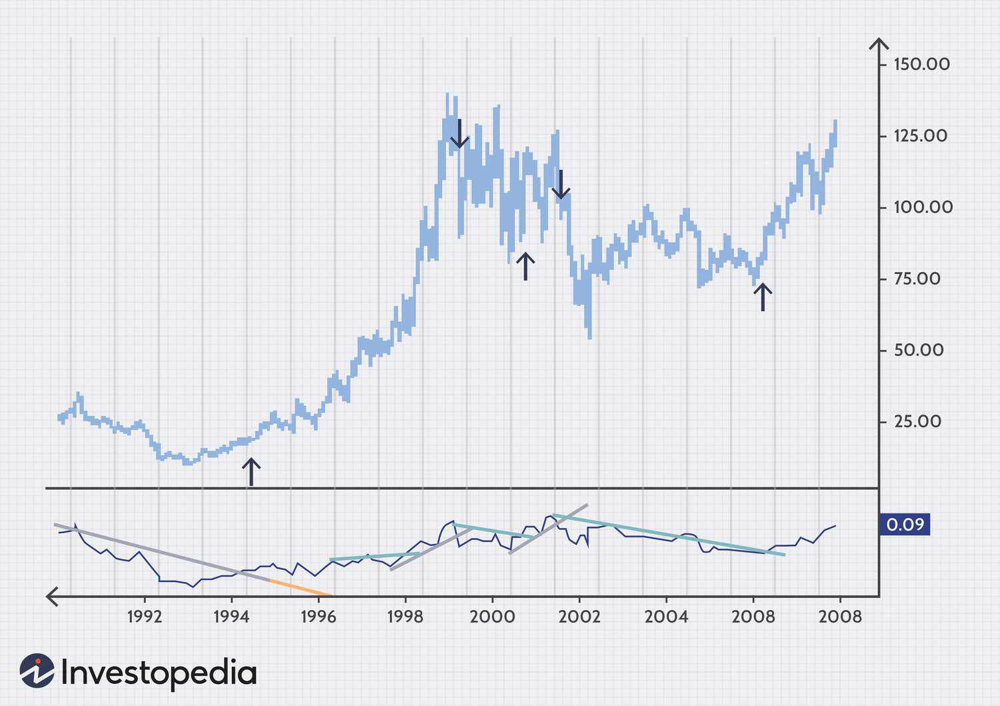

## Table of Contents

## What is relative strength in the context of investing?

Relative strength in investing is a way to compare how well an investment is doing compared to others. It's like a race where you see which runner is ahead of the others. Investors use relative strength to pick investments that are doing better than average. They look at the price changes of different stocks or other investments over time and see which ones are going up faster than others.

This method helps investors find strong performers in the market. For example, if you are looking at two stocks, and one stock's price is going up faster than the other, the first stock has more relative strength. Investors might choose to buy the stock with more relative strength because it seems to be doing better. This can help them make more money if the trend continues.

## How does the concept of buying high and selling low differ from traditional investment strategies?

The idea of buying high and selling low goes against what most people think about investing. Usually, people follow the traditional strategy of buying low and selling high. This means they try to buy something when its price is low and then sell it when the price goes up. The goal is to make money from the difference between the low buying price and the higher selling price. This traditional way makes sense because it feels like getting a good deal and then making a profit.

However, buying high and selling low can be part of a different strategy called momentum investing. Momentum investors look for things that are already going up in price and buy them, hoping they will keep going up. They might sell something if it starts to go down, even if it's still higher than when they bought it. This approach believes that trends in the market can continue for a while, so jumping on a rising trend can lead to profits. It's a different way of thinking, but it can work if you can spot and follow these trends correctly.

## What are the key indicators used to measure relative strength?

To measure relative strength, investors often use something called the Relative Strength Index (RSI). This is a number that shows how fast a stock's price is going up or down compared to other stocks. The RSI goes from 0 to 100. If the RSI is above 70, it might mean the stock is getting too expensive and could go down soon. If it's below 30, it might mean the stock is a good buy because it's getting cheaper.

Another way to measure relative strength is by comparing the price performance of one stock to a benchmark, like the S&P 500. This is called the Relative Strength Comparison. If a stock is doing better than the S&P 500, it has positive relative strength. If it's doing worse, it has negative relative strength. This helps investors see which stocks are leading the market and which ones are falling behind.

## How can an investor identify stocks with high relative strength?

To find stocks with high relative strength, an investor can start by looking at the Relative Strength Index (RSI). The RSI is a number that shows how quickly a stock's price is moving compared to other stocks. If the RSI is over 70, it means the stock is doing really well and might be getting too expensive. But if it's between 50 and 70, it could be a good sign that the stock is strong but not too pricey yet. Investors can use tools on financial websites or trading platforms to check the RSI of different stocks.

Another way to spot stocks with high relative strength is by comparing them to a big group of stocks, like the S&P 500. This is called the Relative Strength Comparison. If a stock is going up faster than the S&P 500, it has high relative strength. Investors can look at charts that show how a stock's price has changed over time compared to the S&P 500. If the stock's line is above the S&P 500's line, that's a good sign. By doing this, investors can find stocks that are leading the market and might keep doing well.

## What are the risks associated with a strategy of buying high and selling low?

Buying high and selling low can be risky because it goes against what most people think about investing. When you buy something at a high price, there's a chance it might not go up anymore. It could even start going down right after you buy it. This means you might lose money instead of making it. Also, selling low means you're selling something for less than you paid for it. This can lead to losses if the price keeps dropping after you sell.

Another risk is that trends in the market can change quickly. If you buy a stock because it's going up, but the trend suddenly changes, you could end up losing money. It's hard to know when a trend will stop or reverse. Plus, buying high and selling low can lead to emotional decisions. It's easy to get caught up in the excitement of a rising stock and buy it, but if it starts to fall, it can be hard to decide when to sell. This can make you hold onto a losing investment for too long, hoping it will go back up.

## Can you explain how to use relative strength index (RSI) in this strategy?

The Relative Strength Index (RSI) is a tool that helps investors see how strong a stock's price movement is. It's a number that goes from 0 to 100. If the RSI is over 70, it means the stock might be getting too expensive and could start going down soon. But if the RSI is between 50 and 70, it could be a good time to buy because the stock is doing well but not too pricey yet. Investors can use this information to decide when to buy a stock that's already going up, which is part of the buying high and selling low strategy.

When using the RSI for this strategy, investors look for stocks with an RSI above 50 but not too close to 70. They want to buy stocks that are strong but not overbought. If the RSI starts to go down and gets close to or below 70, it might be a good time to sell. This way, they can try to sell before the stock's price drops too much. Using the RSI helps investors time their buys and sells better, but it's still important to watch the market closely because things can change quickly.

## How does market timing play a role in buying high and selling low?

Market timing is really important when you're trying to buy high and sell low. It's all about figuring out the right moments to buy and sell stocks. When you're buying high, you want to jump in when a stock is going up and looks like it will keep going up. You use tools like the Relative Strength Index (RSI) to see if a stock is strong but not too expensive. If the RSI is between 50 and 70, it might be a good time to buy because the stock is doing well but not overbought yet.

Selling low in this strategy means selling before the stock's price drops too much. You need to watch the market closely and use the RSI again to help you decide when to sell. If the RSI starts to go down and gets close to or below 70, it might be a good time to sell. This way, you can try to sell before the stock's price falls a lot. Market timing is tricky because trends can change fast, but using tools like the RSI can help you make better decisions about when to buy and sell.

## What are some common mistakes investors make when applying this strategy?

One common mistake investors make when trying to buy high and sell low is buying too late. They see a stock going up and think it's a good time to buy, but they wait too long. By the time they buy, the stock might already be at its peak and ready to go down. This can lead to losses if the stock's price drops right after they buy it. It's important to use tools like the Relative Strength Index (RSI) to buy when the stock is strong but not too expensive.

Another mistake is holding onto a stock for too long. When the stock starts to go down, some investors hope it will go back up. They keep waiting, but the price keeps falling. This can make them lose more money than if they had sold earlier. It's better to sell when the RSI shows the stock might be getting too expensive or if it starts to go down. Emotional decisions can make this strategy hard, so it's important to stick to a plan and not let feelings get in the way.

## How can one backtest a strategy of buying high and selling low using relative strength?

To backtest a strategy of buying high and selling low using relative strength, you need to look at past data to see how well the strategy would have worked. First, you pick a time period to study, like the last five years. Then, you find stocks that had a high Relative Strength Index (RSI) during that time. You pretend to buy these stocks when their RSI was between 50 and 70, which means they were doing well but not too expensive. After buying, you watch the RSI and pretend to sell the stock when it starts to go down and gets close to or below 70. You keep track of how much money you would have made or lost by doing this over and over again with different stocks.

This kind of backtesting helps you see if buying high and selling low with relative strength could be a good way to invest. You can use computer programs or special software to make this easier. These tools let you put in your rules for buying and selling, and they do all the calculations for you. By looking at the results, you can see if the strategy made money more often than it lost money. This can help you decide if it's a strategy you want to try for real. Remember, just because it worked in the past doesn't mean it will work in the future, but backtesting gives you a good idea of what might happen.

## What advanced techniques can be used to refine the selection of stocks based on relative strength?

One advanced way to pick stocks based on relative strength is to use something called sector rotation. This means looking at different parts of the market, like technology or healthcare, and seeing which ones are doing better than others. You can use relative strength to find the strongest sectors and then pick the best stocks within those sectors. This can help you find stocks that are not just doing well on their own but are also part of a bigger trend. It's like [picking](/wiki/asset-class-picking) the best players on the winning team.

Another technique is to combine relative strength with other indicators, like moving averages or the MACD (Moving Average Convergence Divergence). Moving averages can help you see the general direction of a stock's price over time. If a stock's price is above its moving average and also has a high relative strength, it might be a good buy. The MACD can show you when a stock's momentum is changing, which can help you decide when to buy or sell. Using these tools together can give you a better picture of which stocks are likely to keep doing well.

## How do macroeconomic factors influence the effectiveness of this investment strategy?

Macroeconomic factors like interest rates, inflation, and economic growth can really change how well a strategy of buying high and selling low works. When the economy is growing fast, stocks usually go up in price. This can make it easier to find stocks that are doing well and buy them when they're going up. But if interest rates go up, it can make borrowing money more expensive, which might slow down the economy and make stock prices go down. So, it's important to keep an eye on these big economic changes because they can affect which stocks are strong and when to buy or sell them.

Also, inflation can make things tricky. If prices are going up a lot, it might make stocks seem like they're doing better than they really are. But if inflation gets too high, it can hurt the economy and make stock prices fall. So, understanding how these big economic things work together can help you pick the right times to use a buying high and selling low strategy. It's all about watching the big picture and adjusting your plan based on what's happening in the world around you.

## What are the psychological challenges investors face when implementing a buy high, sell low strategy?

One big challenge investors face when trying to buy high and sell low is dealing with fear and greed. When a stock is going up and you decide to buy it, it can feel scary because you're paying a lot for it. You might worry that the price will drop right after you buy. But if you see the price keep going up, it's easy to get greedy and want to hold onto the stock even longer, hoping for even bigger gains. This can make it hard to sell at the right time, especially if the stock starts to go down.

Another challenge is the fear of missing out (FOMO). When you see other people making money by buying stocks that are going up, you might feel like you need to jump in too. This can make you buy stocks at the wrong time, just because everyone else is doing it. It's tough to stick to a plan when you see others making quick profits. Plus, if you sell a stock and its price keeps going down after you sell, you might feel like you made a mistake. These feelings can make it hard to stick with a strategy of buying high and selling low, even when it's working.

## What is Relative Strength?

Relative strength is an investment strategy designed to evaluate a stock's performance relative to the broader market, facilitating informed decision-making by investors. The core idea of this strategy is straightforward: investors should focus on acquiring stocks that demonstrate stronger performance compared to the market average and divest from them as they begin to show signs of weakening. This approach allows investors to ride on the momentum of outperforming stocks, aiming for higher returns.

Historically, the concept of relative strength has been validated through its successful application since the early 20th century. Renowned investor Jesse Livermore, among others, emphasized the strategic significance of relative strength in crafting effective investment practices. Livermore's approach often involved analyzing price behaviors and capitalizing on stocks that displayed exceptional strength relative to the market, a method that contributed to his legendary status in investment circles.

In contemporary markets, the application of relative strength has evolved with technological advancements. Modern investors leverage sophisticated mathematical models to dynamically assess and compare stock performance. The use of advanced computations enables a more refined and real-time analysis of stock trends, thereby optimizing investment decisions. These models typically involve calculating the percentage change in a stock’s price relative to the market index over a specified period. The formula for relative strength can be expressed as:

$$

\text{RS} = \frac{\text{Change in Stock Price}}{\text{Change in Market Index (e.g., S&P 500)}} 
$$

By evaluating this ratio, investors can identify stocks that are outperforming or underperforming the market, providing a strategic edge in portfolio management. This dynamic assessment aids in maintaining a responsive investment strategy that can adapt to market changes and optimize returns based on current performance metrics.

## How does relative strength work?

Relative Strength (RS) operates by comparing a stock's price movement to a broader market index, such as the S&P 500, providing investors with insights into how a particular stock is performing relative to the market. This assessment begins with calculating the percentage change in the stock's price over a specified period and juxtaposing it with the percentage change in the index over the same period. The resulting relative performance metric highlights stocks that are outperforming or underperforming the market, allowing investors to pinpoint potential opportunities or risks.

To compute the RS value, the formula typically used is:

$$
\text{RS} = \frac{\text{Price of Stock at Current Period}}{\text{Price of Stock at Previous Period}} \div \frac{\text{Index Value at Current Period}}{\text{Index Value at Previous Period}}
$$

Where:
- Price of Stock at Current Period refers to the closing price of the stock at the end of the evaluation period.
- Price of Stock at Previous Period refers to the closing price of the stock at the beginning of the evaluation period.
- Index Value at Current Period and Index Value at Previous Period are similarly defined for the market index.

This relative measurement highlights stocks with upward [momentum](/wiki/momentum), as an RS greater than 1 indicates that the stock has outperformed the market during the specific timeframe. Conversely, an RS less than 1 signals underperformance.

To refine the RS calculation and account for additional market dynamics, investors may also consider metrics such as velocity ratings, which measure the speed of price movements, and beta coefficients, which assess a stock's [volatility](/wiki/volatility-trading-strategies) relative to the overall market. Beta is calculated using the covariance between the returns of the stock and the returns of the market, divided by the variance of the market returns:

$$
\beta = \frac{\text{Covariance}(\text{Stock Returns, Market Returns})}{\text{Variance}(\text{Market Returns})}
$$

A nuanced understanding of these variables allows investors to manage their investment selections strategically and optimize their portfolio performance by choosing stocks that not only outperform but also align with their risk tolerance and investment goals. By integrating such methodologies, investors can more effectively capitalize on market trends and ensure robust portfolio growth. Additionally, various software and algorithmic tools can automate these calculations, thereby enhancing efficiency and accuracy in identifying stock dynamics.

## How can RS Strategies be implemented?

To implement Relative Strength (RS) strategies effectively, it is essential to begin by calculating the RS of various stocks within your investment universe, using relevant market indices as benchmarks. The RS of a stock can be determined by comparing its price movement to a chosen market index, such as the S&P 500. The formula for calculating RS is typically expressed as:

$$

RS = \frac{\text{Stock Price Change}}{\text{Index Price Change}} 
$$

Consistent weekly ranking of stocks based on their RS values is crucial to identify top performers within a portfolio. By evaluating these rankings, investors can make timely adjustments to their portfolios, favoring stocks that demonstrate stronger upward trends relative to the market.

Backtesting plays a pivotal role in verifying the reliability and performance of RS strategies under varying market conditions. By assessing historical data, investors can evaluate the effectiveness of RS strategies and refine them to optimize future performance. Effective [backtesting](/wiki/backtesting) helps identify patterns and potential pitfalls, allowing investors to make data-driven decisions.

Enhancing RS strategies by combining them with other indicators, such as the Relative Strength Index (RSI), is beneficial for comprehensive investment analysis. While RS measures the strength of a stock's performance relative to the market, RSI provides insight into the stock's momentum and potential overbought or oversold conditions. Integrating these indicators can help investors devise robust strategies and mitigate risks associated with market fluctuations.

Staying abreast of market trends and continuously refining RS calculations are vital for maintaining a competitive edge in trading. Market dynamics are perpetually evolving, and investors must adapt their strategies to align with current market conditions. By systematically reviewing and adjusting RS calculations, investors can ensure their strategies remain relevant and effective.

Implementing RS strategies requires diligent monitoring and adaptation; however, when applied correctly, they can significantly enhance investment returns. By focusing on stocks with strong upward trends, supported by thorough backtesting and complementary indicators, investors can position themselves for success in dynamic market environments.

## References & Further Reading

[1]: Lebeau, C., & Lucas, D. (1992). ["Technical Traders Guide to Computer Analysis of the Futures Markets."](https://books.google.com/books/about/Technical_traders_guide_to_computer_anal.html?id=at0PAQAAMAAJ) McGraw Hill Professional.

[2]: Hayes, A. (2023). ["Relative Strength Index (RSI): What it is and How to Use it."](https://www.markets.com/education-centre/momentum-indicator-what-is-relative-strength-index-and-how-to-use-rsi/) Investopedia.

[3]: ["Advances in Financial Machine Learning"](https://www.amazon.com/Advances-Financial-Machine-Learning-Marcos/dp/1119482089) by Marcos Lopez de Prado

[4]: Kirkpatrick, C. D., & Dahlquist, J. R. (2010). ["Technical Analysis: The Complete Resource for Financial Market Technicians."](https://ptgmedia.pearsoncmg.com/images/9780134137049/samplepages/9780134137049.pdf) FT Press.

[5]: Appel, G., & Hitschler, F. (2008). ["Technical Analysis: Power Tools for Active Investors."](https://www.amazon.com/Technical-Analysis-Power-Active-Investors/dp/0132930048) FT Press.

[6]: Lo, A. W., & MacKinlay, A. C. (1999). ["A Non-Random Walk Down Wall Street."](https://www.amazon.com/Non-Random-Walk-Down-Wall-Street/dp/0691092567) Princeton University Press.