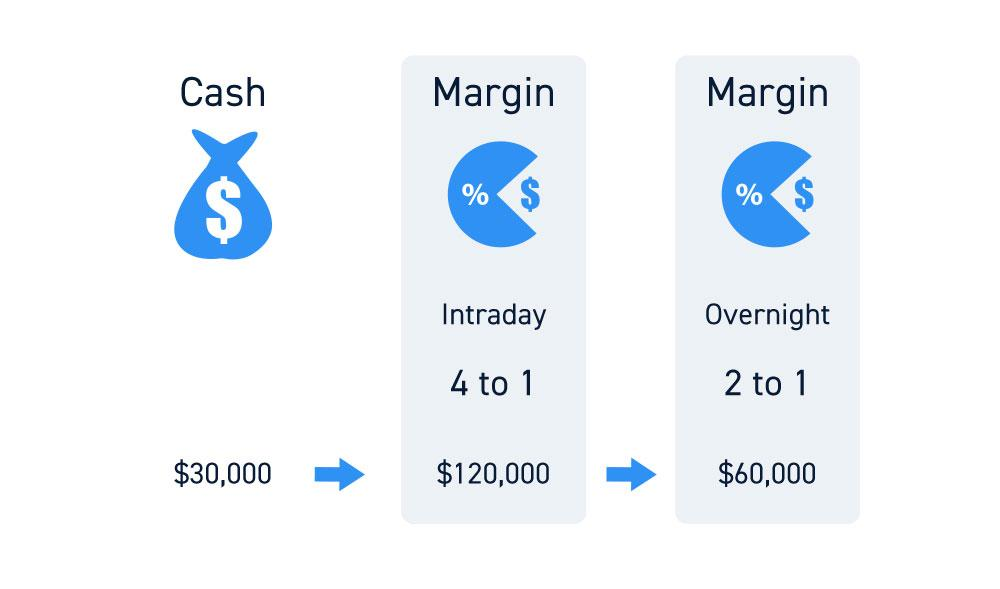

## Table of Contents

## What is buying power in trading?

Buying power in trading is the amount of money you have available to buy stocks, options, or other financial products. It's like having a certain amount of cash in your pocket that you can use to make purchases. If you have $1,000 in your trading account, your buying power is $1,000, meaning you can spend up to that amount on investments.

In some cases, buying power can be increased through margin trading, where a broker lends you money to buy more than you could with just your own funds. This can amplify your buying power, but it also comes with higher risks because you have to pay back the borrowed money, plus interest. Understanding your buying power is important because it helps you know how much you can invest without going over your budget.

## How is buying power calculated for a trading account?

Buying power for a trading account is calculated based on the money you have in your account. If you have $500 in your account, your buying power is $500. This means you can buy up to $500 worth of stocks or other investments. It's like having $500 in your wallet to spend at a store.

Sometimes, brokers let you borrow money to increase your buying power. This is called margin trading. If your broker gives you a 2:1 margin, and you have $500, your buying power becomes $1,000. You can buy more, but remember, you have to pay back the borrowed money plus interest. It's like a credit card; you can spend more than you have, but you need to pay it back later.

## What is the difference between buying power and account balance?

Buying power is the amount of money you can use to buy stocks or other investments in your trading account. It's like having money in your pocket that you can spend on things you want to buy. If you have $1,000 in your account, your buying power is $1,000, meaning you can buy up to that amount of investments.

Account balance, on the other hand, is the total amount of money in your trading account at any given time. This includes money you've deposited, any profits from your investments, and any money you've made from selling investments. Your account balance can be different from your buying power because your buying power might be increased if you're allowed to borrow money from your broker through margin trading.

## Can buying power be used for both stocks and options trading?

Yes, buying power can be used for both stocks and options trading. It's like having money in your pocket that you can use to buy things at a store. If you have $1,000 in your trading account, you can use that $1,000 to buy stocks or options, depending on what you want to invest in.

However, there are some differences to keep in mind. When trading options, the buying power needed can be different because options contracts have a specific cost and value. Also, if you're using margin to increase your buying power, the rules for stocks and options might be different. Always check with your broker to understand how your buying power works for both stocks and options.

## How does margin trading affect buying power?

Margin trading can increase your buying power by letting you borrow money from your broker. If you have $1,000 in your account and your broker gives you a 2:1 margin, your buying power becomes $2,000. This means you can buy more stocks or options than you could with just your own money. It's like having a credit card that lets you spend more than you have, but you need to pay it back later.

However, using margin to increase your buying power also comes with more risk. If the value of your investments goes down, you might have to pay back the borrowed money even if you lose money on your investments. This can lead to bigger losses than if you were just using your own money. It's important to understand these risks before deciding to use margin trading to boost your buying power.

## What are the risks associated with using full buying power?

Using your full buying power means you're spending all the money you have available in your trading account. This can be risky because if your investments go down in value, you might not have any money left to buy new investments or to wait for the market to recover. It's like using all your money to buy something and then not having any left for other important things you might need later.

If you're using margin to increase your buying power, the risks get even bigger. When you borrow money from your broker to buy more investments, you have to pay it back, plus interest. If your investments lose value, you might have to sell them at a loss to cover the borrowed money. This can lead to bigger losses than if you were just using your own money. It's like borrowing money to buy something and then having to pay it back even if the thing you bought loses value.

## How can traders increase their buying power?

Traders can increase their buying power by adding more money to their trading account. It's like putting more cash in your wallet so you can buy more things. If you have $1,000 and you add another $500, your buying power goes up to $1,500. You can do this by depositing more money from your bank account or by selling other investments and using the money to buy new ones.

Another way to increase buying power is through margin trading. This means borrowing money from your broker to buy more investments than you could with just your own money. If your broker gives you a 2:1 margin and you have $1,000, your buying power becomes $2,000. But remember, you have to pay back the borrowed money plus interest. It's like using a credit card to buy more than you can afford, but you need to pay it back later.

## What regulations govern buying power in different countries?

In the United States, buying power is regulated by the Financial Industry Regulatory Authority (FINRA) and the Securities and Exchange Commission (SEC). These organizations set rules on how much money you can borrow through margin trading. For example, they say you can borrow up to 50% of the price of stocks you want to buy. This means if you want to buy $1,000 worth of stocks, you can borrow up to $500 from your broker. They also have rules to make sure you can pay back the borrowed money, like having to keep a certain amount of money in your account.

In other countries, like the United Kingdom, buying power is regulated by the Financial Conduct Authority (FCA). They also have rules about margin trading and how much money you can borrow. For example, they might let you borrow up to 100% of the price of stocks, but they also have rules to protect investors. In places like Canada, the Investment Industry Regulatory Organization of Canada (IIROC) sets similar rules. Each country has its own rules to make sure trading is fair and safe for everyone.

## How does buying power change with different types of accounts (e.g., cash vs. margin accounts)?

Buying power in a cash account is straightforward. It's the amount of money you have in your account that you can use to buy stocks or other investments. If you have $1,000 in your cash account, your buying power is $1,000. You can only spend what you have, so if you want to buy more stocks, you need to add more money to your account. It's like having cash in your wallet; you can only spend what's there.

In a margin account, buying power can be higher because you can borrow money from your broker to buy more investments. If you have $1,000 and your broker gives you a 2:1 margin, your buying power becomes $2,000. This means you can buy more stocks or options than you could with just your own money. But remember, you have to pay back the borrowed money plus interest. It's like using a credit card; you can spend more than you have, but you need to pay it back later.

## What strategies can traders use to manage their buying power effectively?

Traders can manage their buying power effectively by setting clear investment goals and sticking to a budget. This means deciding how much money they want to spend on investments and not going over that amount. If they have $1,000 in their account, they should plan how to use that money wisely, maybe by spreading it out over different investments to lower the risk. It's like planning how to spend your money at a store so you don't run out too quickly.

Another strategy is to keep some money in reserve and not use all of their buying power at once. This way, if the market goes down, they still have money to buy more investments at lower prices. It's like saving some money in your wallet for emergencies. If traders are using a margin account, they should be careful not to borrow too much money. They need to make sure they can pay back the borrowed money plus interest, even if their investments lose value. This helps them avoid big losses and keep their buying power under control.

## How does buying power impact trading strategies and decision-making?

Buying power is like the money in your wallet that you can use to buy things in the stock market. It affects how you make decisions about what to buy and when. If you have a lot of buying power, you might feel more confident to buy more stocks or options. You might even be willing to take bigger risks because you have more money to play with. But if your buying power is low, you might need to be more careful and choose your investments more wisely, sticking to safer options or smaller amounts.

Understanding your buying power also helps you plan your trading strategy. If you know you can only spend a certain amount, you might decide to spread your money across different investments to lower your risk. This is like not putting all your eggs in one basket. On the other hand, if you're using margin to increase your buying power, you need to think about how much risk you're willing to take. Borrowing money can lead to bigger wins, but also bigger losses if things go wrong. So, knowing your buying power helps you make smarter choices about how to invest your money.

## What are advanced techniques for optimizing buying power in high-frequency trading?

In high-frequency trading, optimizing buying power means using your money as efficiently as possible to make quick trades. One way to do this is by using algorithms that can spot small changes in the market and act on them fast. These algorithms can help you buy and sell stocks or options very quickly, making the most out of your buying power. Another technique is to use leverage carefully. Leverage lets you borrow money to trade more than you could with just your own money, but it's risky. In high-frequency trading, you need to balance the amount of leverage you use to maximize your buying power without taking too much risk.

Another advanced technique is to use smart order routing systems. These systems can find the best places to buy or sell your investments, helping you get the best prices and save on costs. This can stretch your buying power further because you're not losing money on high fees or bad prices. Lastly, managing your cash flow well is crucial. In high-frequency trading, you need to make sure you have enough money in your account to cover your trades. By keeping a close eye on your cash flow and using tools to predict how much money you'll need, you can keep your buying power strong and ready for the next trade.

## What is Buying Power?

Buying power, often synonymous with excess equity, is a crucial concept in trading, representing the investor's capacity to purchase securities using their available account balance and any leverage provided by the brokerage. It is a determinant of the scale of an investor's potential trading activities, directly affecting their ability to engage in larger market positions.

In a standard margin account, buying power is typically calculated as twice the equity value. This means if an investor has $10,000 in their account, they could potentially purchase up to $20,000 worth of securities. This leverage capability enables investors to expand their trading strategies and pursue greater market opportunities. For pattern day traders—those who make four or more day trades within five business days—regulation allows up to four times the equity in buying power. Hence, an account with $10,000 in equity may leverage up to $40,000 for trading activities.

The formula to calculate buying power (BP) in a margin account is typically:

$$
BP = \text{Equity} \times \text{Leverage factor}
$$

Where:
- Equity is the cash or securities value in the account,
- Leverage factor is the multiplier applied by the brokerage, often set to two for standard accounts and can be up to four for pattern day trading accounts.

Example: If an investor has $12,000 in a margin account, the buying power would be calculated as follows for a standard account:

$$
BP = 12,000 \times 2 = 24,000
$$

For a pattern [day trading](/wiki/day-trading-spy) account, it would be:

$$
BP = 12,000 \times 4 = 48,000
$$

Understanding and effectively managing buying power allows investors to make informed decisions and optimize their financial resources. Overleveraging, however, can lead to substantial risks, such as margin calls, where the brokerage requires additional funds if the account equity falls below a certain level.

Strategically, investors can utilize buying power to diversify portfolios or capitalize on short-term market movements, balancing the potential for higher returns against the exposure to increased risk. By maximizing buying power, traders may exploit market inefficiencies while also adhering to risk management principles to ensure sustainable trading success.

## How can one combine buying power, excess equity, and algorithmic trading?

Combining buying power, excess equity, and algorithmic trading can create powerful synergies in the pursuit of superior financial outcomes. Traders who strategically integrate these elements can enhance their market engagement and manage risks effectively. Understanding each operational component in this process is crucial for crafting efficient trading strategies.

### Strategic Integration

To optimize the integration, traders should first comprehend the role of each component. Buying power, a function of the available margin and cash balances, determines the potential scale of investment transactions. Excess equity, the surplus equity beyond the minimum requirement in a margin account, amplifies buying power and allows traders to seize opportunities without acquiring additional funds. Algorithmic trading introduces automation into this equation, executing trades at speed and frequency that surpass human capabilities.

Incorporating these elements can be mathematically modeled to assess potential outcomes. For instance, consider a trader whose buying power ($BP$) is calculated as:

$$
BP = M \times (Cash + Equity)
$$

Where $M$ is the margin multiplier depending on the account type (e.g., 2 for standard margin accounts and 4 for pattern day trading accounts). Excess equity ($EE$) might be denoted as:

$$
EE = Equity - Required\_Margin
$$

Algorithmic trading then uses these financial metrics as inputs to execute pre-defined strategies, potentially programmed as follows in Python:

```python
def execute_trade(buying_power, excess_equity, strategy_params):
    if buying_power > strategy_params['min_capital'] and excess_equity > strategy_params['min_equity']:
        # Execute algorithm to buy securities
        return f"Trade executed with strategy {strategy_params['name']}"
    return "Insufficient resources to execute trade"

strategy_params = {'min_capital': 5000, 'min_equity': 1000, 'name': 'Mean Reversion Algorithm'}
execute_trade(20000, 5000, strategy_params)
```

### Best Practices and Case Studies

Successful traders often follow best practices when combining these tools:

1. **Risk Management**: Prioritize risk assessments to define clear thresholds for buying power and excess equity utilization that an algorithm should adhere to.

2. **Backtesting Strategies**: Before deploying algorithms, traders should rigorously backtest strategies with historical data to evaluate performance and refine parameters.

3. **Dynamic Adjustment**: Implement algorithms capable of real-time adjustments based on market conditions and individual trading account status.

For instance, a case study of a trading firm utilizing these elements showed enhanced returns by dynamically adjusting leverage based on real-time buying power analytics and algorithmic signals. The firm mitigated risks by setting tight stop losses and continuously monitoring market volatility.

### Avoiding Pitfalls

Traders should be cautious of several potential pitfalls:

- **Over-leverage**: Excessive use of buying power can magnify losses as well as gains. Appropriate leverage levels must be maintained.

- **Technical Failures**: Algorithms are prone to glitches. Regular audits and real-time performance tracking are essential to prevent unintended trades.

- **Regulatory Compliance**: Adhering to trading regulations, like maintaining necessary equity levels in margin accounts, is vital to avoid penalties.

To ensure sustainable trading success, traders should balance the strengths of buying power and algorithmic efficiency with prudent risk management practices, ensuring that their strategies adapt to an ever-evolving market environment.

## References & Further Reading

[1]: Bergstra, J., Bardenet, R., Bengio, Y., & Kégl, B. (2011). ["Algorithms for Hyper-Parameter Optimization."](https://dl.acm.org/doi/10.5555/2986459.2986743) Advances in Neural Information Processing Systems 24.

[2]: ["Advances in Financial Machine Learning"](https://www.amazon.com/Advances-Financial-Machine-Learning-Marcos/dp/1119482089) by Marcos Lopez de Prado

[3]: ["Evidence-Based Technical Analysis: Applying the Scientific Method and Statistical Inference to Trading Signals"](https://www.amazon.com/Evidence-Based-Technical-Analysis-Scientific-Statistical/dp/0470008741) by David Aronson

[4]: ["Machine Learning for Algorithmic Trading"](https://github.com/stefan-jansen/machine-learning-for-trading) by Stefan Jansen

[5]: ["Quantitative Trading: How to Build Your Own Algorithmic Trading Business"](https://www.amazon.com/Quantitative-Trading-Build-Algorithmic-Business/dp/1119800064) by Ernest P. Chan