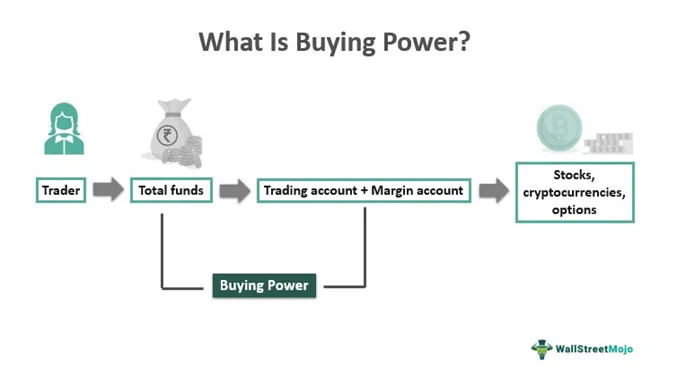

The complex world of trading offers a variety of strategies and tools to maximize financial growth. Among these, understanding terms like buying power, excess equity, and algorithmic trading is crucial for investors seeking to enhance their financial outcomes. Buying power refers to the money an investor has available to purchase securities. It plays a vital role in shaping an investor's trading strategies, as it determines the scope of transactions that can be undertaken without additional deposits.

Algorithmic trading, on the other hand, involves the use of automated scripts to execute trades quickly, based on pre-set variables and statistical analysis. This approach allows traders to handle large volumes of transactions with precision and speed that manual trading processes cannot achieve. By integrating algorithm-based systems, traders can capitalize on fleeting market opportunities, adjusting their strategies almost instantaneously in response to market signals.



This article will explore these concepts in detail, highlighting their practical applications and implications for traders. Understanding how these elements interact can reveal strategies that enhance trading results. Additionally, the discussion will cover the risks and opportunities inherent in these strategies, equipping you with the knowledge to navigate the trading landscape with confidence. As we dissect these concepts, it becomes clear that mastering them is essential for anyone aiming to achieve robust returns in the dynamic world of finance.

## Table of Contents

## What is Buying Power?

Buying power, often synonymous with excess equity, is a crucial concept in trading, representing the investor's capacity to purchase securities using their available account balance and any leverage provided by the brokerage. It is a determinant of the scale of an investor's potential trading activities, directly affecting their ability to engage in larger market positions.

In a standard margin account, buying power is typically calculated as twice the equity value. This means if an investor has $10,000 in their account, they could potentially purchase up to $20,000 worth of securities. This leverage capability enables investors to expand their trading strategies and pursue greater market opportunities. For pattern day traders—those who make four or more day trades within five business days—regulation allows up to four times the equity in buying power. Hence, an account with $10,000 in equity may leverage up to $40,000 for trading activities.

The formula to calculate buying power (BP) in a margin account is typically:

$$
BP = \text{Equity} \times \text{Leverage factor}
$$

Where:
- Equity is the cash or securities value in the account,
- Leverage factor is the multiplier applied by the brokerage, often set to two for standard accounts and can be up to four for pattern day trading accounts.

Example: If an investor has $12,000 in a margin account, the buying power would be calculated as follows for a standard account:

$$
BP = 12,000 \times 2 = 24,000
$$

For a pattern [day trading](/wiki/day-trading-spy) account, it would be:

$$
BP = 12,000 \times 4 = 48,000
$$

Understanding and effectively managing buying power allows investors to make informed decisions and optimize their financial resources. Overleveraging, however, can lead to substantial risks, such as margin calls, where the brokerage requires additional funds if the account equity falls below a certain level.

Strategically, investors can utilize buying power to diversify portfolios or capitalize on short-term market movements, balancing the potential for higher returns against the exposure to increased risk. By maximizing buying power, traders may exploit market inefficiencies while also adhering to risk management principles to ensure sustainable trading success.

## The Role of Excess Equity in Trading

Excess equity refers to the surplus equity in a margin account, which is above the mandatory margin requirement. This additional equity plays a crucial role in enhancing an investor's buying power, enabling them to seize new trading opportunities without the necessity of additional cash investments. For instance, in a margin account, the buying power is not merely limited to the cash balance but is amplified by any excess equity available.

This increased financial capacity allows traders to engage in larger or more numerous trades, potentially leading to amplified returns. However, this leverage also requires meticulous risk management. Excess equity is vital for assessing the risk levels in a trading account, as it indicates the cushion available before hitting a margin call. If the value of securities in a margin account falls, reducing the equity below the maintenance margin requirement, a margin call occurs. Thus, excess equity serves as a buffer against such situations.

For example, if an investor holds $50,000 in securities with a required margin of 25%, the necessity would be $12,500. If the account equity is $20,000, the excess equity becomes $7,500 ($20,000 - $12,500), boosting the investor's buying power and mitigating the risk of a margin call under market [volatility](/wiki/volatility-trading-strategies) conditions.

Excess equity's functionality varies across different types of accounts. In a standard margin account, excess equity directly corresponds to additional buying power. In contrast, a pattern day trading account further enhances this capability by providing up to four times the amount of excess equity for intraday trading, thereby significantly increasing potential leverage.

To illustrate the practical implications of excess equity, consider a scenario where an investor anticipates a market rally and utilizes excess equity to purchase additional shares. If the rally occurs, the investor maximizes returns without needing additional capital. However, if the anticipation is incorrect, the increased exposure could lead to greater losses. Therefore, understanding and managing excess equity is key to formulating effective trading strategies. Traders must continually monitor their account activities, align their strategies with their risk tolerance levels, and adjust positions accordingly to optimize outcomes while safeguarding against potential financial pitfalls.

## Understanding Algorithmic Trading

Algorithmic trading refers to the use of computer algorithms to automate the trading process by executing orders based on predetermined instructions. These instructions might include time, price, or quantity, aiming for speed and efficiency beyond the capacity of human traders. The significant advantage of [algorithmic trading](/wiki/algorithmic-trading) lies in its ability to process extensive data sets rapidly, thereby making swift decisions that align with complex trading strategies.

### How Algorithmic Trading Works

Algorithmic trading is driven by sophisticated algorithms that can analyze market conditions and execute trades at optimal times. These algorithms can be simple, using technical indicators such as moving averages, or complex, integrating various data inputs like historical price patterns and market conditions. Traders typically execute these algorithms on high-frequency trading platforms that provide access to up-to-the-millisecond market data. 

In algorithmic trading, execution speed is a critical [factor](/wiki/factor-investing). Automated trading systems can place orders in fractions of a second, a significant advantage in today's fast-paced markets. This capability not only reduces transaction costs but also minimizes the risk of significant price fluctuations between the time a trade decision is made and when the order is placed.

### Types of Algorithms Used

There are several types of algorithms commonly used in algorithmic trading:

1. **Trend-Following Algorithms**: These algorithms are designed to recognize and capitalize on upward or downward trends in the market prices. They often use indicators like moving averages and channel breakouts.

2. **Arbitrage Algorithms**: These algorithms exploit price differences of the same asset in different markets, executing trades to lock in risk-free profits. 

3. **Mean Reversion Algorithms**: Based on the assumption that prices will revert to their mean, these algorithms buy or sell when prices deviate significantly from historical averages.

4. **High-Frequency Trading (HFT) Algorithms**: These execute a large number of trades at extremely high speeds, often based on microsecond price fluctuations.

### Integration with Buying Power and Excess Equity

Algorithmic trading can be effectively integrated with concepts such as buying power and excess equity to enhance trading strategies. Buying power, which determines the amount of capital available to execute trades, can be optimized using algorithms that account for both the current market conditions and the availability of funds. By aligning trading strategies with real-time assessments of buying power, traders can maximize their market participation while minimizing risks related to over-leverage.

Moreover, algorithms can be programmed to adjust based on excess equity levels, ensuring that trading strategies align with an investor's risk tolerance and market exposure. This dynamic adjustment protects the trader from undertaking undue risk while taking advantage of new opportunities as they arise.

### Real-World Examples

Real-world applications of algorithmic trading highlight its effectiveness in maximizing returns and managing risks. For instance, quantitative hedge funds often use algorithmic strategies to exploit fleeting inefficiencies in the market. These strategies may involve complex statistical models that identify correlations between various market indicators, enabling traders to execute thousands of trades in multiple markets simultaneously.

A notable example includes the use of statistical [arbitrage](/wiki/arbitrage) in equities, where firms implement algorithms to identify anomalies in related instruments and capitalize on the short-lived mispricing. As market conditions change, these algorithms continually adapt, providing a significant competitive edge over traditional trading strategies.

Algorithmic trading presents powerful opportunities to enhance trading effectiveness, leveraging fast execution and data-driven insights. However, successful implementation requires careful strategy development and constant monitoring to adapt to the dynamic nature of financial markets.

## Combining Buying Power, Excess Equity, and Algorithmic Trading

Combining buying power, excess equity, and algorithmic trading can create powerful synergies in the pursuit of superior financial outcomes. Traders who strategically integrate these elements can enhance their market engagement and manage risks effectively. Understanding each operational component in this process is crucial for crafting efficient trading strategies.

### Strategic Integration

To optimize the integration, traders should first comprehend the role of each component. Buying power, a function of the available margin and cash balances, determines the potential scale of investment transactions. Excess equity, the surplus equity beyond the minimum requirement in a margin account, amplifies buying power and allows traders to seize opportunities without acquiring additional funds. Algorithmic trading introduces automation into this equation, executing trades at speed and frequency that surpass human capabilities.

Incorporating these elements can be mathematically modeled to assess potential outcomes. For instance, consider a trader whose buying power ($BP$) is calculated as:

$$
BP = M \times (Cash + Equity)
$$

Where $M$ is the margin multiplier depending on the account type (e.g., 2 for standard margin accounts and 4 for pattern day trading accounts). Excess equity ($EE$) might be denoted as:

$$
EE = Equity - Required\_Margin
$$

Algorithmic trading then uses these financial metrics as inputs to execute pre-defined strategies, potentially programmed as follows in Python:

```python
def execute_trade(buying_power, excess_equity, strategy_params):
    if buying_power > strategy_params['min_capital'] and excess_equity > strategy_params['min_equity']:
        # Execute algorithm to buy securities
        return f"Trade executed with strategy {strategy_params['name']}"
    return "Insufficient resources to execute trade"

strategy_params = {'min_capital': 5000, 'min_equity': 1000, 'name': 'Mean Reversion Algorithm'}
execute_trade(20000, 5000, strategy_params)
```

### Best Practices and Case Studies

Successful traders often follow best practices when combining these tools:

1. **Risk Management**: Prioritize risk assessments to define clear thresholds for buying power and excess equity utilization that an algorithm should adhere to.

2. **Backtesting Strategies**: Before deploying algorithms, traders should rigorously backtest strategies with historical data to evaluate performance and refine parameters.

3. **Dynamic Adjustment**: Implement algorithms capable of real-time adjustments based on market conditions and individual trading account status.

For instance, a case study of a trading firm utilizing these elements showed enhanced returns by dynamically adjusting leverage based on real-time buying power analytics and algorithmic signals. The firm mitigated risks by setting tight stop losses and continuously monitoring market volatility.

### Avoiding Pitfalls

Traders should be cautious of several potential pitfalls:

- **Over-leverage**: Excessive use of buying power can magnify losses as well as gains. Appropriate leverage levels must be maintained.

- **Technical Failures**: Algorithms are prone to glitches. Regular audits and real-time performance tracking are essential to prevent unintended trades.

- **Regulatory Compliance**: Adhering to trading regulations, like maintaining necessary equity levels in margin accounts, is vital to avoid penalties.

To ensure sustainable trading success, traders should balance the strengths of buying power and algorithmic efficiency with prudent risk management practices, ensuring that their strategies adapt to an ever-evolving market environment.

## Risks and Considerations

Increased buying power and automated strategies in trading present numerous opportunities for enhancing returns. However, they are also accompanied by inherent risks that need to be thoroughly understood and effectively managed. 

Market volatility is a primary concern. The rapid fluctuations in prices can lead to significant losses if not addressed properly. Automated systems can execute a vast number of trades in milliseconds based on pre-programmed criteria. While this speed can be advantageous, it can also exacerbate losses during volatile market conditions. Traders should implement risk management strategies such as stop-loss orders to limit potential losses and adjust their trading algorithms to incorporate volatility indices as a safeguard.

Algorithmic malfunctions pose another significant challenge. Technical glitches, such as coding errors or connectivity issues, can lead to unintended trades that might deviate from the trader's strategy. To mitigate such risks, rigorous [backtesting](/wiki/backtesting) of algorithms in simulated environments should be conducted before deployment in live markets. Regular audits and updates to the algorithms can also help ensure their stable performance. Employing a fail-safe mechanism within the algorithm can halt trading when irregular or excessive trades are detected.

The use of leverage, while increasing potential profits, also amplifies potential losses. Understanding the dynamics of leverage is essential to avoid margin calls, where the broker demands additional capital to maintain open positions. To manage leverage risk, traders should monitor their margin levels frequently and avoid utilizing maximum leverage. Calculating and maintaining a healthy margin is crucial. This can be expressed in a simple formula:
$$
\text{Maintenance Margin} = \frac{\text{Total Equity}}{\text{Total Market Value}}
$$
Keeping this value above a certain threshold can prevent forced sell-offs due to margin calls.

To navigate these risks effectively, ongoing monitoring of trading activities is essential. This involves setting up alerts for unusual trade executions, keeping abreast of market conditions, and ensuring compliance with regulatory requirements. Each trader should define their risk tolerance and adjust strategies accordingly. Risk management tools, such as value-at-risk (VaR) models, can offer insights into potential losses under various scenarios.

Furthermore, continuous learning and adaptation are key components of successful long-term trading practice. The financial markets are dynamic and constantly evolving. Traders should stay informed about the latest developments in financial regulations, market structures, and emerging technologies. Engaging in continuous education helps traders adapt their strategies and maintain competitiveness. Participating in forums, attending webinars, and subscribing to industry publications are effective ways to stay updated. 

By understanding and addressing these challenges, traders can formulate strategies that not only seize market opportunities but also effectively manage potential downsides, promoting sustainable growth in their trading endeavors.

## Conclusion

Navigating the trading world requires a solid understanding of leverage, buying power, and algorithmic trading. These concepts are foundational in crafting strategies that maximize growth while managing associated risks. By effectively combining these elements, traders can significantly enhance their market efficiency and profitability.

Leverage is an essential factor that allows traders to amplify their buying power, providing the capability to engage in larger trades than would be possible with just their account equity. However, leveraging also increases exposure to market fluctuations, making it imperative to maintain a balance between potential gains and the increased risk. It is crucial for traders to understand their risk tolerance and employ leverage judiciously.

Buying power, representing an investor's capacity to purchase securities, determines the scope of trading activities. An optimal use of buying power, augmented by margin accounts, facilitates substantial trading opportunities. It is vital for traders to monitor their buying power relative to market conditions, ensuring that they are neither overextending themselves nor missing potential gains.

Algorithmic trading introduces automation to this landscape, offering precision and speed that surpass manual trading efforts. Algorithms can continuously parse market data, execute trades at opportune moments, and manage complex portfolios with minimal human intervention. The integration of algorithmic trading with buying power allows traders to optimize their strategies, leveraging computational efficiency to execute high-[volume](/wiki/volume-trading-strategy) trades swiftly and accurately.

In this dynamic environment, it is essential for traders to remain vigilant to the constant evolution of markets. Balancing the potential for gains with an understanding of associated risks, including technology failures and market volatility, is crucial. Staying informed and agile enables traders to adapt to new trends and maintain competitive advantage.

With the insights and strategies outlined in this article, traders are better equipped to make informed decisions. Continued education and a deliberate strategic approach are the keys to fully harnessing the potential of buying power and algorithmic trading. By staying committed to learning and adapting, traders can effectively navigate the challenges and opportunities within the financial markets, fostering sustainable trading success.

## References & Further Reading

[1]: Bergstra, J., Bardenet, R., Bengio, Y., & Kégl, B. (2011). ["Algorithms for Hyper-Parameter Optimization."](https://dl.acm.org/doi/10.5555/2986459.2986743) Advances in Neural Information Processing Systems 24.

[2]: ["Advances in Financial Machine Learning"](https://www.amazon.com/Advances-Financial-Machine-Learning-Marcos/dp/1119482089) by Marcos Lopez de Prado

[3]: ["Evidence-Based Technical Analysis: Applying the Scientific Method and Statistical Inference to Trading Signals"](https://www.amazon.com/Evidence-Based-Technical-Analysis-Scientific-Statistical/dp/0470008741) by David Aronson

[4]: ["Machine Learning for Algorithmic Trading"](https://github.com/stefan-jansen/machine-learning-for-trading) by Stefan Jansen

[5]: ["Quantitative Trading: How to Build Your Own Algorithmic Trading Business"](https://www.amazon.com/Quantitative-Trading-Build-Algorithmic-Business/dp/1119800064) by Ernest P. Chan