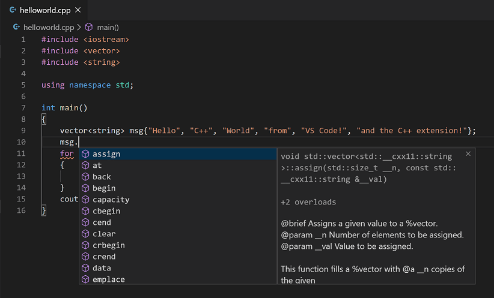

## Table of Contents

## What is C++ and why was it developed?

C++ is a programming language that was created to help people write computer programs. It was developed by Bjarne Stroustrup in the early 1980s. C++ is an extension of the C programming language, which means it includes all the features of C but adds more tools and capabilities. It's known for being powerful and flexible, which makes it popular for creating software, games, and other complex systems.

The reason C++ was developed was to address some limitations of the C language. Bjarne Stroustrup wanted a language that could handle bigger and more complex programs more easily. He added features like classes and objects, which are part of something called object-oriented programming. These additions make it easier to organize and reuse code, which is very helpful when working on large projects. This is why C++ became a favorite choice for many programmers and is still widely used today.

## How do you set up a C++ development environment?

To set up a C++ development environment, you first need to install a compiler. A compiler is a program that turns your C++ code into something the computer can understand. A popular choice is the GNU Compiler Collection (GCC), which you can download for free. If you're using Windows, you might want to install MinGW, which includes GCC. On macOS, you can use Xcode, which comes with a compiler. For Linux, GCC is often already installed, but you can update it if needed.

Next, you'll need an Integrated Development Environment (IDE) or a text editor. An IDE is like a special program that helps you write, run, and debug your code. Some popular IDEs for C++ are Visual Studio Code, CLion, and Code::Blocks. If you prefer a simpler text editor, options like Notepad++ or Sublime Text work well, but you'll need to run your code from the command line. Once you have your compiler and IDE or text editor set up, you can start writing and running C++ programs.

To make sure everything is working, create a simple "Hello, World!" program. Write the code in your IDE or text editor, save it with a .cpp extension, and then use your compiler to turn it into an executable file. Run the file to see if it prints "Hello, World!" on the screen. If it does, congratulations! Your C++ development environment is ready to go.

## What are the basic syntax rules in C++?

In C++, every program starts with a main function. This function is special because it's where your program begins running. You write the main function by typing `int main() { }`. Inside these curly braces, you put the code you want to run. C++ uses semicolons (;) at the end of each statement, kind of like periods in sentences. This tells the computer where one instruction ends and another begins. You also need to include libraries at the top of your program. For example, `#include <iostream>` lets you use input and output functions.

C++ is case-sensitive, so 'Hello' and 'hello' are different. When you want to use variables, you need to declare them first. For example, `int number = 5;` creates a variable called 'number' that holds the value 5. You can use different types like `int` for whole numbers, `float` for numbers with decimals, and `char` for single characters. To make your program do things, you use operators like `+`, `-`, `*`, and `/` for math, and `=` for assigning values. You can also use `if`, `else`, `for`, and `while` to control how your program runs.

Comments in C++ help explain your code. You can use `//` for a single-line comment or `/* */` for multi-line comments. Functions in C++ are reusable pieces of code. You define a function like `void sayHello() { cout << "Hello!" << endl; }` and call it in your main function with `sayHello();`. This makes your code easier to read and maintain. Learning these basic rules will help you start writing your own C++ programs.

## How do you manage memory in C++?

In C++, managing memory means keeping track of where your program stores information and making sure it uses that space correctly. When you create a variable, like `int number = 5;`, C++ automatically gives it a spot in memory. This is called automatic memory management. But sometimes, you need more control over memory. That's when you use something called dynamic memory allocation. You ask for memory using `new` and give it back using `delete`. For example, `int* ptr = new int;` asks for memory for an integer, and `delete ptr;` gives it back. It's important to give back memory you're not using anymore, or you might run out of space.

However, managing memory this way can be tricky. If you forget to use `delete`, you might have a memory leak, where memory is still taken but not used. This can slow down your program or even make it crash. To help avoid these problems, C++ has something called smart pointers. Smart pointers, like `unique_ptr` and `shared_ptr`, automatically manage memory for you. They know when to give memory back, so you don't have to remember. Using smart pointers can make your code safer and easier to manage.

## What are classes and objects in C++ and how are they used?

In C++, classes and objects are important tools that help organize code. A class is like a blueprint or a plan for creating objects. It defines what an object should look like by listing its properties (called data members) and what it can do (called member functions or methods). For example, if you're making a class for a car, you might include properties like color and speed, and methods like startEngine and stopEngine. You define a class using the `class` keyword, followed by the name of the class and a set of curly braces where you list the properties and methods.

An object is a specific instance of a class. If a class is a blueprint for a car, an object is an actual car made from that blueprint. When you create an object, you're using the class to make a real thing you can work with in your program. You create an object by declaring a variable of the class type, like `Car myCar;`. Once you have an object, you can use its properties and methods. For example, `myCar.startEngine();` would call the startEngine method on the myCar object. Using classes and objects helps keep your code neat and organized, making it easier to manage complex programs.

## Can you explain the concept of inheritance in C++?

Inheritance in C++ is like a way for classes to share features. Imagine you have a class called 'Animal' with properties like 'name' and methods like 'eat'. If you want to make a 'Dog' class, you don't have to start from scratch. You can make 'Dog' inherit from 'Animal', which means 'Dog' automatically gets all the properties and methods of 'Animal'. This saves time and helps keep your code organized. You can then add special things to 'Dog' that are just for dogs, like 'bark'.

Inheritance also helps with something called polymorphism, which means different classes can respond to the same method call in different ways. For example, if both 'Dog' and 'Cat' inherit from 'Animal', and 'Animal' has a method called 'sound', you can make 'Dog' use 'sound' to bark and 'Cat' use 'sound' to meow. This way, when you call 'sound' on an 'Animal' object, the right sound comes out depending on whether it's a dog or a cat. Using inheritance makes your code more flexible and easier to work with.

## What is polymorphism and how is it implemented in C++?

Polymorphism in C++ is a fancy word that means "many forms." It's a way for different objects to respond to the same command in different ways. Imagine you have a remote control that works with different devices like a TV and a fan. When you press the power button, the TV turns on and the fan starts spinning. That's like polymorphism. In C++, you can use it to make your code more flexible and easier to manage.

In C++, you implement polymorphism using something called virtual functions and inheritance. Let's say you have a base class called 'Animal' with a method called 'sound'. You can make 'sound' a virtual function, which means any class that inherits from 'Animal' can change how 'sound' works. For example, if you have classes 'Dog' and 'Cat' that inherit from 'Animal', you can make 'Dog' use 'sound' to bark and 'Cat' use 'sound' to meow. When you call 'sound' on an 'Animal' object, the right sound comes out depending on whether it's a dog or a cat. This makes your code more powerful and easier to use.

## How does exception handling work in C++?

Exception handling in C++ is like a safety net for your program. When something goes wrong, like trying to divide by zero or opening a file that doesn't exist, C++ can use exceptions to handle it. You use the `try` and `catch` keywords to do this. Inside a `try` block, you put the code that might cause a problem. If something bad happens, the program jumps to a `catch` block where you can deal with the problem. For example, if you're trying to read a file and it's not there, you can catch that error and tell the user to try again.

You can also throw your own exceptions using the `throw` keyword. This is helpful when you want to signal that something went wrong in your own code. For instance, if you're writing a function that needs a number to be positive, you can throw an exception if someone gives you a negative number. Other parts of your program can then catch this exception and decide what to do next. Using exceptions helps keep your code clean and makes it easier to handle errors without crashing your program.

## What are templates in C++ and how do they enhance code reusability?

Templates in C++ are like special tools that help you write code that can work with different types of data. Imagine you want to make a function that can add two numbers together. Normally, you'd have to write separate functions for adding integers, floating-point numbers, and other types. But with templates, you can write one function that works for all of them. You do this by using the `template` keyword and a placeholder like `typename T` or `class T`. This tells C++ to create a version of your function for each type you use it with. It's like having a magic box that can change its shape to fit whatever you put inside it.

Using templates makes your code more reusable because you don't have to write the same thing over and over for different types. This saves time and makes your code easier to manage. For example, if you write a template for a sorting function, you can use it to sort lists of numbers, names, or anything else without changing the function. This is really helpful when you're working on big projects where you need to use the same kind of operation on different kinds of data. Templates make your code more flexible and efficient, letting you focus on solving problems instead of repeating yourself.

## How do you use the Standard Template Library (STL) in C++?

The Standard Template Library (STL) in C++ is like a big toolbox full of useful things you can use in your programs. It has containers, which are like special boxes to store your data, algorithms, which are steps to do things with your data, and iterators, which help you move through your data. To use the STL, you need to include the right header files at the top of your program. For example, if you want to use a vector, which is like a list that can grow or shrink, you include `#include <vector>`. Then you can create a vector and use it to store and work with your data.

Using the STL makes your life easier because it does a lot of the hard work for you. For example, if you want to sort a list of numbers, you can use the `sort` function from the `<algorithm>` header. You don't have to write your own sorting code, which can be tricky and take a long time. The STL also makes your code more flexible because you can use the same tools with different types of data. This means you can write less code and still do more, which is great for making your programs faster and easier to maintain.

## What are the differences between C++11, C++14, and C++17 standards?

C++11, C++14, and C++17 are different versions of the C++ programming language. Each version added new features and improvements to make programming easier and more powerful. C++11 introduced many big changes, like auto variables that let you skip writing the type of a variable, lambda expressions that help you write small pieces of code, and smart pointers that manage memory for you. It also added new ways to work with threads, making it easier to write programs that can do multiple things at once. These changes made C++11 a big step forward in making C++ more modern and easier to use.

C++14 built on C++11 by adding smaller improvements and fixes. It made lambda expressions more flexible and added more ways to use auto, like in function return types. It also added some new features to make coding easier, like binary literals and digit separators. C++14 didn't change C++ as much as C++11 did, but it made the language smoother and more convenient to use. C++17 continued this trend by adding even more features. It introduced things like structured bindings, which let you unpack values from containers easily, and inline variables, which help with how code is organized. C++17 also improved how the language works with files and made some parts of the language faster and more efficient. Each version of C++ adds new tools and makes programming better, step by step.

## How can you optimize C++ code for performance?

To make your C++ code run faster, you can start by using the right data types. For example, if you're working with whole numbers, using `int` instead of `float` can be faster because it takes less space and is easier for the computer to handle. Another way is to avoid using too many function calls inside loops because each call takes time. Instead, try to do things outside the loop if you can. Also, using the Standard Template Library (STL) can help because it has been made to be fast and efficient. But be careful not to use parts of the STL that might be slow for your specific task.

Another important thing is to think about how you use memory. Try to keep things in the computer's fast memory, called the cache, by putting data that you use a lot close together. This can make your program run much faster. Also, be careful with dynamic memory allocation because it can slow things down. Using smart pointers can help manage memory better and make your code run smoother. Finally, always test your code to see where it's slow and fix those parts. Tools like profilers can show you which parts of your code take the most time, so you know where to focus your efforts.

## References & Further Reading

[1]: Markowitz, H. (1952). ["Portfolio Selection."](https://onlinelibrary.wiley.com/doi/abs/10.1111/j.1540-6261.1952.tb01525.x) The Journal of Finance, 7(1), 77-91.

[2]: Taleb, N. N. (2001). ["Fooled by Randomness: The Hidden Role of Chance in Life and in the Markets"](https://www.goodreads.com/book/show/38315.Fooled_by_Randomness). Random House.

[3]: ["C++ High Performance: Master the art of optimizing the functioning of your C++ code"](https://books.google.com/books/about/C++_High_Performance.html?id=tJIREAAAQBAJ) by Björn Andrist and Viktor Sehr

[4]: Joshi, M. S. (2008). ["Quantitative Finance: A Simulation-Based Introduction Using Excel"](https://books.google.com/books/about/Quantitative_Finance.html?id=xv3RBQAAQBAJ). Cambridge University Press.

[5]: Shelley, M. (2007). ["Introduction to C++ for Financial Engineers: An Object-Oriented Approach"](https://onlinelibrary.wiley.com/doi/book/10.1002/9781118673379) by Daniel J. Duffy

[6]: ["Inside the Black Box: The Simple Truth About Quantitative Trading"](https://www.amazon.com/Inside-Black-Box-Quantitative-Trading/dp/0470432063) by Rishi K. Narang

[7]: Hendershott, T., Jones, C. M., & Menkveld, A. J. (2011). ["Does Algorithmic Trading Improve Liquidity?"](https://onlinelibrary.wiley.com/doi/full/10.1111/j.1540-6261.2010.01624.x) The Journal of Finance, 66(1), 1-33.