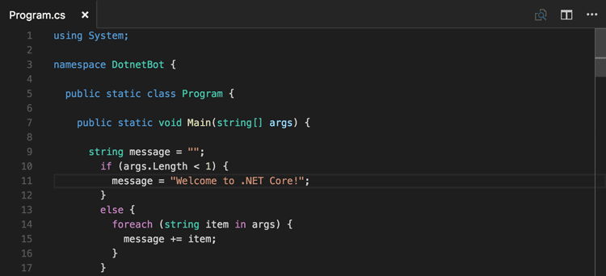

## Table of Contents

## What is C# and what is it used for?

C# is a programming language developed by Microsoft. It is used to create many types of software, like apps for Windows, games, and websites. C# is part of the .NET framework, which helps developers build and run programs easily.

People use C# because it is easy to learn and has many tools that make coding simpler. It's great for making desktop applications, mobile apps, and even games with Unity, a popular game engine. Many businesses and developers choose C# for its reliability and the strong support from Microsoft.

## How do you set up a C# development environment?

To set up a C# development environment, you first need to install the necessary software. Start by downloading and installing Visual Studio, which is a powerful tool made by Microsoft for writing and running C# code. You can get the free version called Visual Studio Community from their website. Once installed, open Visual Studio and you'll see options to create new projects. Choose a C# project to start coding.

After setting up Visual Studio, you need to make sure you have the .NET framework installed. This is important because C# programs run on the .NET framework. You can download it from the Microsoft website if it's not already on your computer. With Visual Studio and the .NET framework ready, you can start writing your C# code, building your projects, and running them to see how they work.

## What are the basic data types in C#?

In C#, there are several basic data types that you use to store different kinds of information. The most common ones are int, which is for whole numbers like 1, 2, or 3. There's also float and double for numbers with decimals, like 3.14 or 2.5. If you need to store just one character, you use char, which can hold things like 'a' or 'B'. For true or false values, you use bool, which can be either true or false.

Another important data type in C# is string, which is used for text. A string can hold words or sentences, like "hello" or "C# is fun". There's also the decimal type, which is good for money or other numbers where you need a lot of precision, like 123.45. Each of these data types has its own special uses, and knowing which one to use helps you write better C# programs.

## How do you create and use variables in C#?

To create a variable in C#, you first need to decide what type of data it will hold, like a number or text. Then, you write the type, followed by the name you want to give your variable, and end it with a semicolon. For example, if you want to store a whole number, you might write `int age;` to create a variable called `age` that holds an integer. If you want to store text, you could write `string name;` to create a variable called `name` that holds a string. After creating the variable, you can give it a value using the equals sign, like `age = 25;` or `name = "Alice";`.

Once you've created and assigned a value to your variable, you can use it in your program. For example, you might want to print the value of `age` to the screen using `Console.WriteLine(age);`, which would show `25` on the screen. You can also use variables in calculations or to make decisions in your code. If you need to change the value of a variable later, you can just assign it a new value, like `age = 30;`. This makes your programs flexible and able to work with different data as your program runs.

## What are control structures in C# and how do you use them?

Control structures in C# are special parts of the code that help you control how your program works. They let you make choices, repeat actions, and jump to different parts of your code. The main types of control structures are if statements, loops, and switch statements. If statements let you decide to do something only if a certain condition is true. Loops let you do the same thing over and over until a condition is met. Switch statements help you choose what to do based on different possible values of a variable.

To use an if statement, you write `if (condition) { code to run }`. For example, `if (age > 18) { Console.WriteLine("You are an adult."); }` will only print the message if the `age` variable is greater than 18. Loops, like a for loop, are used like this: `for (int i = 0; i < 5; i++) { Console.WriteLine(i); }`. This will print the numbers 0 to 4. A switch statement looks like this: `switch (day) { case "Monday": Console.WriteLine("Start of the week."); break; case "Friday": Console.WriteLine("End of the week."); break; default: Console.WriteLine("It's a regular day."); break; }`. This will print a message based on the value of `day`. Control structures make your programs smarter and more useful.

## How do you define and call methods in C#?

In C#, methods are blocks of code that do a specific job. To define a method, you start with the type of value it will return, like `int` for a number or `void` if it doesn't return anything. Then, you give it a name and put any information it needs in parentheses, called parameters. For example, `public int AddNumbers(int a, int b) { return a + b; }` defines a method named `AddNumbers` that takes two numbers and returns their sum. You can also add `static` before the return type if you want to call the method without creating an object.

To call a method, you use its name and give it the right information in the parentheses. If you defined `AddNumbers` like in the example, you could call it with `int result = AddNumbers(3, 4);`. This would run the `AddNumbers` method with 3 and 4 as the inputs, and store the result (which would be 7) in the `result` variable. If the method is `static`, you can call it using the class name, like `ClassName.AddNumbers(3, 4)`. Methods make your code easier to read and reuse, helping you build more complex programs.

## What is object-oriented programming in C# and how is it implemented?

Object-oriented programming (OOP) in C# is a way of organizing your code using objects and classes. Objects are like things in the real world, and classes are the blueprints for making those objects. In C#, you can create classes to represent anything you want, like a car or a person. Each class can have properties, which are like the characteristics of the object, and methods, which are the actions it can do. For example, a `Car` class might have a `color` property and a `Drive` method. This approach helps you write code that's easier to understand and reuse because you can think about your program in terms of real-world objects.

To implement OOP in C#, you start by defining a class using the `class` keyword. For instance, you could write `public class Car { public string color; public void Drive() { Console.WriteLine("The car is driving."); } }`. This creates a `Car` class with a `color` property and a `Drive` method. To use this class, you create an object from it, like `Car myCar = new Car(); myCar.color = "Red"; myCar.Drive();`. This code makes a new `Car` object, sets its color to red, and calls the `Drive` method. OOP also includes concepts like inheritance, where one class can inherit properties and methods from another, and encapsulation, which means keeping the internal details of a class hidden from the outside. These features make your programs more organized and easier to manage.

## How do you handle exceptions in C#?

In C#, exceptions are unexpected things that can happen while your program is running, like trying to divide by zero or reading a file that doesn't exist. To handle exceptions, you use a `try-catch` block. In the `try` part, you put the code that might cause an exception. If an exception happens, the program jumps to the `catch` part, where you can deal with the problem. For example, if you're trying to read a file, you might write `try { string content = File.ReadAllText("myfile.txt"); } catch (FileNotFoundException) { Console.WriteLine("The file was not found."); }`. This way, if the file doesn't exist, your program won't crash; it will just print a message.

You can also use `finally` blocks with `try-catch` to make sure some code always runs, no matter if an exception happens or not. This is useful for cleaning up resources, like closing a file. For instance, `try { string content = File.ReadAllText("myfile.txt"); } catch (FileNotFoundException) { Console.WriteLine("The file was not found."); } finally { Console.WriteLine("This will always run."); }`. Another way to handle exceptions is by throwing them yourself using the `throw` keyword. If something goes wrong in your method, you can use `throw new Exception("Something went wrong");` to let the caller know there was a problem. Handling exceptions helps make your program more reliable and user-friendly.

## What are delegates and events in C# and how are they used?

Delegates and events in C# are like special tools that help different parts of your program talk to each other. A delegate is like a pointer to a method. It lets you pass methods around like they're variables. For example, if you have a method that needs to do something special, you can use a delegate to tell it which special method to use. This is useful when you want to change what a method does without changing the method itself. You create a delegate by using the `delegate` keyword, like `public delegate void MyDelegate(int x);`. This means the delegate can point to any method that takes an `int` and doesn't return anything.

Events are like announcements that something interesting happened in your program. They use delegates to let other parts of the program know about these happenings. When you create an event, you're setting up a way for other parts of your code to listen for these announcements. For example, if you have a button in a program, you might want to know when it's clicked. You can create an event for this and have other parts of your code do something when the button is clicked. To set up an event, you use the `event` keyword with a delegate type, like `public event EventHandler ButtonClicked;`. Other parts of your code can then "subscribe" to this event and do something when it happens.

## How do you work with LINQ in C#?

LINQ, which stands for Language Integrated Query, is a way to easily work with data in C#. It lets you write simple and clear code to find, filter, and sort information from lists, databases, and more. You can use LINQ to do things like finding all the people in a list who are over 18 years old, or sorting a list of numbers from smallest to biggest. To use LINQ, you start by writing `using System.Linq;` at the top of your code file. Then, you can use LINQ methods like `Where`, `OrderBy`, and `Select` to work with your data.

For example, if you have a list of numbers and want to find all the even ones, you could write `var evenNumbers = numbers.Where(n => n % 2 == 0);`. This code uses the `Where` method to filter the list and keep only the numbers that are even. You can also combine LINQ methods to do more complex things, like `var sortedEvenNumbers = numbers.Where(n => n % 2 == 0).OrderBy(n => n);`, which finds the even numbers and then sorts them from smallest to largest. LINQ makes it easier to work with data because it lets you write code that's easier to read and understand.

## What are asynchronous programming techniques in C#?

Asynchronous programming in C# lets your program do more than one thing at the same time. This is helpful when you're waiting for something to finish, like getting information from the internet. Instead of just waiting and doing nothing, your program can keep working on other tasks. To use asynchronous programming, you use keywords like `async` and `await`. For example, if you're making a program that needs to download a file, you can use `async` and `await` to let the program do other things while it's waiting for the file to download.

You start by marking a method with the `async` keyword, like `public async Task DownloadFileAsync()`. Inside this method, you can use `await` with methods that take a long time, like `await DownloadFile()`. The `await` keyword tells the program to wait for the download to finish, but in the meantime, it can do other things. This makes your program feel faster and more responsive because it's not just sitting there waiting. Asynchronous programming is a powerful way to make your C# programs work better, especially when dealing with things that take time, like talking to a database or the internet.

## How do you optimize C# code for performance?

To make your C# code run faster, you can use a few simple tricks. One way is to use value types instead of reference types when you can. Value types like `int` and `struct` are stored directly in memory, which means your program can access them quickly. Another trick is to avoid creating new objects too often because it can slow down your program. Instead, try to reuse objects or use object pools. Also, using LINQ can make your code easier to read, but it might not be the fastest way to do things. If you need speed, you might want to use regular loops instead.

Another way to speed up your C# code is to use asynchronous programming. This lets your program do more than one thing at the same time, which can make it feel faster. For example, if your program needs to download something from the internet, it can do other tasks while waiting for the download to finish. You can also use profiling tools to find the slow parts of your code and fix them. These tools show you where your program is spending the most time, so you know what to work on. By using these tips, you can make your C# programs run smoother and faster.

## References & Further Reading

[1]: Jansen, S. (2020). ["Machine Learning for Algorithmic Trading: Predictive Models to Extract Signals from Market and Alternative Data for Systematic Trading Strategies with Python."](https://www.amazon.com/Machine-Learning-Algorithmic-Trading-alternative/dp/1839217715) Packt Publishing.

[2]: Chan, E. P. (2009). ["Quantitative Trading: How to Build Your Own Algorithmic Trading Business."](https://github.com/ftvision/quant_trading_echan_book) John Wiley & Sons.

[3]: Aronson, D. R. (2006). ["Evidence-Based Technical Analysis: Applying the Scientific Method and Statistical Inference to Trading Signals."](https://www.amazon.com/Evidence-Based-Technical-Analysis-Scientific-Statistical/dp/0470008741) John Wiley & Sons.

[4]: Lopez de Prado, M. (2018). ["Advances in Financial Machine Learning."](https://books.google.com/books/about/Advances_in_Financial_Machine_Learning.html?id=oU9KDwAAQBAJ) Wiley.

[5]: Bergstra, J., Bardenet, R., Bengio, Y., & Kégl, B. (2011). ["Algorithms for Hyper-Parameter Optimization."](https://proceedings.neurips.cc/paper/2011/file/86e8f7ab32cfd12577bc2619bc635690-Paper.pdf) Advances in Neural Information Processing Systems 24.