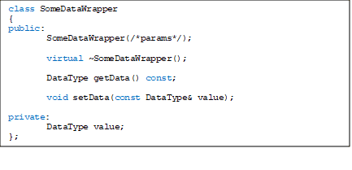

## Table of Contents

## What is a destructor in C++?

A destructor in C++ is a special member function that is called automatically when an object's lifetime ends. It's like a cleanup crew that comes in to tidy up after an object is done being used. The destructor's job is to free up any resources, like memory or file handles, that the object was using. In C++, a destructor is declared with a tilde (~) followed by the class name, and it doesn't take any parameters or return any value.

Think of a destructor as the opposite of a constructor. While a constructor sets up an object and gets it ready for use, a destructor tears it down and cleans up after it. This is important because if an object uses resources like memory, and those resources aren't properly released, it can lead to problems like memory leaks. By using a destructor, C++ programmers can make sure that objects clean up after themselves, keeping the program running smoothly and efficiently.

## Why do we need virtual destructors in C++?

We need virtual destructors in C++ because of something called polymorphism. Polymorphism lets us treat objects of different classes as if they were of the same class, as long as they share a common base class. When we delete an object through a pointer to its base class, C++ needs to know which destructor to call - the base class's or the derived class's. If the destructor in the base class is not virtual, C++ will only call the base class's destructor, which can lead to problems if the derived class has its own resources to clean up.

To avoid these problems, we make the base class's destructor virtual. This tells C++ to look at the actual type of the object being deleted, not just the type of the pointer being used. If the object is of a derived class, C++ will call the derived class's destructor first, which can then call the base class's destructor. This way, all resources get cleaned up properly, no matter how we delete the object. Using virtual destructors helps keep our programs safe and efficient, especially when working with inheritance and polymorphism.

## How do virtual destructors help prevent memory leaks?

Virtual destructors help prevent memory leaks by making sure that all parts of an object get cleaned up properly. When we use something called inheritance in C++, we can have a base class and a derived class. If we delete an object of the derived class using a pointer to the base class, C++ needs to know which destructor to call. If the base class's destructor is not virtual, C++ will only call the base class's destructor and ignore the derived class's destructor. This can leave behind resources that the derived class was using, causing a memory leak.

By making the base class's destructor virtual, we tell C++ to look at the actual type of the object being deleted, not just the type of the pointer. This means that if we delete an object of the derived class, C++ will first call the derived class's destructor. The derived class's destructor can then clean up any resources it was using, and then it will call the base class's destructor to clean up any resources the base class was using. This way, all resources get properly released, preventing memory leaks and keeping our programs running smoothly.

## What is a memory leak and how does it occur in C++?

A memory leak is when a program uses up memory but doesn't give it back when it's done. Imagine borrowing a toy from a friend and never returning it; that's kind of like a memory leak. In C++, memory leaks can happen if we use memory but forget to free it up when we're done. This can make our program use more and more memory over time, which can slow it down or even make it crash.

In C++, memory leaks often happen because we use something called dynamic memory allocation. This is when we ask the computer to give us a piece of memory to use, and it's our job to give it back when we're done. If we forget to return the memory, or if we lose track of where it is, that's a memory leak. Using tools like smart pointers and being careful with how we manage memory can help us avoid these leaks and keep our programs running well.

## Can you explain the difference between a virtual and non-virtual destructor?

A virtual destructor is like a special kind of cleanup tool in C++ that helps make sure everything gets cleaned up properly when we're done using an object. When we use something called inheritance, where one class builds on another, we might have a base class and a derived class. If we delete an object of the derived class using a pointer to the base class, a virtual destructor makes sure the right cleanup happens. It does this by looking at the actual type of the object, not just the type of the pointer. This means it will call the derived class's destructor first, which can clean up its own resources, and then it will call the base class's destructor. This way, all parts of the object get cleaned up properly, preventing any mess or memory leaks.

A non-virtual destructor, on the other hand, is simpler but can cause problems if not used carefully. When we delete an object through a pointer to its base class, a non-virtual destructor will only call the base class's destructor. It doesn't look at the actual type of the object, so it won't call the derived class's destructor. This can leave behind resources that the derived class was using, causing a memory leak. So, if we're using inheritance and deleting objects through base class pointers, we need to use virtual destructors to make sure everything gets cleaned up correctly.

## How do you declare a virtual destructor in C++?

To declare a virtual destructor in C++, you write the word `virtual` before the destructor's name in the class. The destructor's name is the same as the class name but with a tilde (~) in front of it. So, if your class is called ` MyClass`, you would write `virtual ~MyClass()`. This tells C++ that when you delete an object of this class or any class that inherits from it, it should make sure to call the right destructor.

Using a virtual destructor is important when you have a class that other classes can build on, which we call inheritance. If you delete an object of a class that builds on your base class using a pointer to the base class, C++ will look at the actual type of the object and call the right destructor. This helps make sure all parts of the object get cleaned up properly, preventing any memory leaks or other problems.

## What are the performance implications of using virtual destructors?

Using virtual destructors can make your program a bit slower and use a bit more memory. This is because when you use a virtual destructor, C++ has to keep track of which destructor to call for each object. It does this by adding something called a virtual table, or vtable, to each class that has a virtual function. This vtable takes up some extra memory, and looking up the right destructor in the vtable can take a tiny bit of extra time.

But for most programs, the difference won't be very noticeable. Virtual destructors are really important for making sure your program works correctly, especially when you're using inheritance and deleting objects through base class pointers. So, while they might make your program a tiny bit slower and use a bit more memory, the benefits of using them usually outweigh these small costs.

## In what scenarios should you use a virtual destructor?

You should use a virtual destructor when you have a base class and other classes that build on it, which we call inheritance. If you might delete an object of a class that builds on your base class using a pointer to the base class, you need a virtual destructor. This makes sure C++ calls the right destructor for the object, not just the base class's destructor. This is important because the class that builds on the base class might have its own things to clean up, and if you don't use a virtual destructor, those things won't get cleaned up properly.

For example, imagine you have a base class called `Animal` and a class that builds on it called `Dog`. If you delete a `Dog` object using a pointer to `Animal`, a virtual destructor will make sure the `Dog` destructor gets called first. This way, any special things the `Dog` class was using get cleaned up before the `Animal` destructor runs. So, if you're using inheritance and deleting objects through base class pointers, always use a virtual destructor to keep your program safe and working right.

## How does inheritance affect the use of virtual destructors?

Inheritance in C++ lets one class build on another, like how a dog is a type of animal. When we use inheritance, we might have a base class, like `Animal`, and a class that builds on it, like `Dog`. If we delete a `Dog` object using a pointer to the `Animal` class, we need to make sure the right cleanup happens. That's where virtual destructors come in. They make sure the `Dog` destructor gets called first, so any special things the `Dog` class was using get cleaned up properly before the `Animal` destructor runs.

If we don't use a virtual destructor in the base class, and we delete a `Dog` object using an `Animal` pointer, only the `Animal` destructor will be called. This can leave behind things the `Dog` class was using, causing a mess or a memory leak. So, when we use inheritance and might delete objects through base class pointers, we should always use a virtual destructor. It helps keep our program safe and working right by making sure all parts of the object get cleaned up properly.

## What are the best practices for managing memory with virtual destructors?

When you're using virtual destructors to manage memory, it's important to always use them in your base classes if you're using inheritance. This means if you have a class like `Animal` and another class like `Dog` that builds on `Animal`, you should make the `Animal` destructor virtual. This way, when you delete a `Dog` object using an `Animal` pointer, the `Dog` destructor will be called first, making sure everything the `Dog` class was using gets cleaned up properly before the `Animal` destructor runs. This helps prevent memory leaks and keeps your program working right.

Another good practice is to use smart pointers instead of regular pointers when you can. Smart pointers like `std::unique_ptr` and `std::shared_ptr` can automatically handle the memory cleanup for you, which means you don't have to worry as much about calling the right destructor. They work well with virtual destructors and can help make your program safer and easier to manage. By combining smart pointers with virtual destructors, you can make sure your program uses memory correctly and avoids common problems like memory leaks.

## Can you provide a code example demonstrating a memory leak due to a non-virtual destructor?

Let's look at a simple example to see how a memory leak can happen because of a non-virtual destructor. Imagine we have a base class called `Animal` and a class that builds on it called `Dog`. The `Dog` class has its own special thing, like a toy, that it needs to clean up. If we delete a `Dog` object using a pointer to the `Animal` class, and the `Animal` destructor is not virtual, only the `Animal` destructor will be called. This means the `Dog` destructor won't run, and the toy won't get cleaned up, causing a memory leak.

Here's some code to show this:

```cpp
#include <iostream>

class Animal {
public:
    Animal() { std::cout << "Animal constructor called\n"; }
    ~Animal() { std::cout << "Animal destructor called\n"; }
};

class Dog : public Animal {
public:
    Dog() { 
        std::cout << "Dog constructor called\n"; 
        toy = new char[100]; // Dog has a toy that needs to be cleaned up
    }
    ~Dog() { 
        std::cout << "Dog destructor called\n"; 
        delete[] toy; // This should clean up the toy
    }

private:
    char* toy;
};

int main() {
    Animal* myDog = new Dog();
    delete myDog; // This will only call the Animal destructor, causing a memory leak
    return 0;
}
```

In this example, when we run the program, you'll see that only the `Animal` destructor gets called. The `Dog` destructor, which is supposed to clean up the toy, never runs. This means the memory used for the toy is never given back, causing a memory leak. To fix this, we should make the `Animal` destructor virtual, like this: `virtual ~Animal() { std::cout << "Animal destructor called\n"; }`. This way, when we delete `myDog`, the `Dog` destructor will be called first, cleaning up the toy properly before the `Animal` destructor runs.

## How can you verify that a virtual destructor is working correctly in your code?

To check if a virtual destructor is working right, you can add some messages to your code that print out when different parts of it are running. For example, you could add a message in the base class's destructor and another in the derived class's destructor. When you run your program, if you see both messages when you delete an object of the derived class using a pointer to the base class, that means the virtual destructor is working correctly. The derived class's destructor should run first, followed by the base class's destructor, showing that all parts of the object are getting cleaned up properly.

Another way to make sure the virtual destructor is doing its job is to use tools that help you find memory leaks. Programs like Valgrind can watch your code as it runs and tell you if there are any memory leaks. If you see no memory leaks when you delete objects through base class pointers, it's a good sign that the virtual destructor is working as it should. By using these simple checks, you can feel confident that your virtual destructor is helping keep your program safe and efficient.

## References & Further Reading

[1]: Meyers, S. (2005). [Effective C++: 55 Specific Ways to Improve Your Programs and Designs](https://ptgmedia.pearsoncmg.com/images/9780321334879/samplepages/0321334876.pdf). Addison-Wesley Professional.

[2]: Sutter, H., & Alexandrescu, A. (2004). [C++ Coding Standards: 101 Rules, Guidelines, and Best Practices](https://books.google.com/books/about/C++_Coding_Standards.html?id=mmjVIC6WolgC). Addison-Wesley Professional.

[3]: Marquis, B. (2014). ["Avoiding Memory Leaks in C++: How Dynamic Memory Walking Can Help"](https://stackoverflow.com/questions/45627/how-do-you-detect-avoid-memory-leaks-in-your-unmanaged-code). ACM.

[4]: Yuhui, C., & Pande, R. (2005). ["Developing High-Frequency Trading Systems with C++"](https://ieeexplore.ieee.org/document/10163261). Journal of Financial Trading.

[5]: Alexandrescu, A. (2001). [Modern C++ Design: Generic Programming and Design Patterns Applied](https://www.oreilly.com/library/view/modern-c-design/0201704315/). Addison-Wesley Professional.