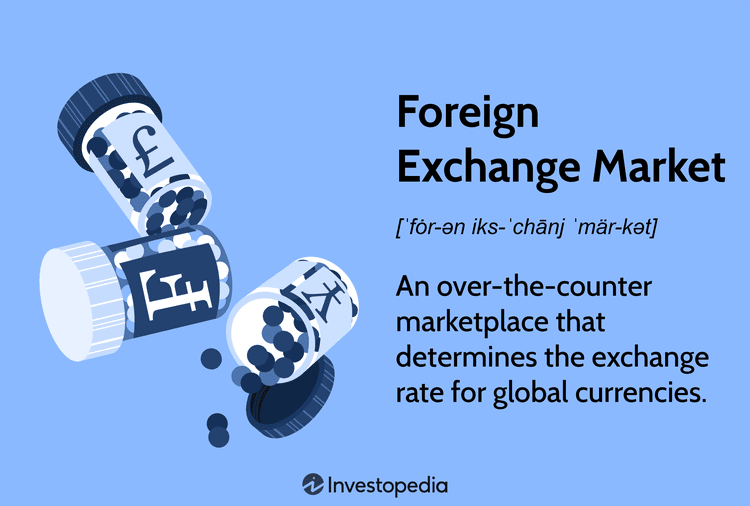

## Table of Contents

## What is a cable in the context of foreign exchange?

In the context of foreign exchange, a cable is a term used to refer to the exchange rate between the US dollar (USD) and the British pound (GBP). This term originated in the 19th century when transatlantic telegraph cables were used to transmit financial information, including exchange rates, between the United States and the United Kingdom.

Today, the term "cable" is still widely used in the forex market to describe the GBP/USD currency pair. Traders and financial analysts often monitor the cable closely because it is one of the most actively traded currency pairs in the world. The fluctuations in the cable rate can have significant impacts on international trade and investment between the two countries.

## How did the term 'cable' originate in forex trading?

The term 'cable' in forex trading started a long time ago, back in the 1800s. During that time, people used big underwater cables to send messages between the United States and the United Kingdom. These cables were used to share important financial news, like the exchange rates between the US dollar and the British pound. Because of this, people started calling the exchange rate between these two currencies 'the cable.'

Today, even though we don't use those old underwater cables anymore, the name 'cable' stuck around. In the world of [forex](/wiki/forex-system) trading, when someone talks about the cable, they are talking about the GBP/USD currency pair. It's a very important pair because a lot of money is traded between the US and the UK, so many people watch the cable closely to see how the exchange rate changes.

## What is the significance of the cable in international finance?

The cable, which is the exchange rate between the US dollar and the British pound, is very important in international finance. It is one of the most traded currency pairs in the world. This means that a lot of money is exchanged between the US and the UK every day. Because of this, changes in the cable can affect the economies of both countries. For example, if the pound gets stronger against the dollar, it can make things cheaper for Americans buying from the UK, but it can make things more expensive for British people buying from the US.

Watching the cable closely is important for businesses and investors. If a company in the US wants to buy things from the UK, they need to know how much their dollars will get them in pounds. Investors also look at the cable to decide where to put their money. If they think the pound will get stronger, they might buy more pounds. On the other hand, if they think the dollar will get stronger, they might sell their pounds. So, the cable helps people make decisions about trade and investment between these two big economies.

## How has the use of the cable evolved over time in forex markets?

In the old days, the term "cable" came from the big underwater cables that were used to send messages about money between the United States and the United Kingdom. Back then, people used these cables to share important news about how much a US dollar was worth compared to a British pound. This was really important because it helped people in both countries know how much money they would get when they traded with each other.

Today, we don't use those old cables anymore, but the name "cable" is still used in the forex market. Now, it means the exchange rate between the US dollar and the British pound, and it's one of the most important currency pairs that people trade. Because so much money moves between the US and the UK every day, the cable is watched very closely by traders and investors. They use it to make decisions about buying and selling money, and it can affect how much things cost when people in these countries trade with each other.

## What currencies are primarily involved in cable transactions?

The currencies primarily involved in cable transactions are the US dollar and the British pound. These two currencies make up the currency pair known as the cable, which is the exchange rate between the US dollar (USD) and the British pound (GBP).

In the world of forex trading, the cable is very important because it is one of the most traded currency pairs. This means that a lot of money is exchanged between the US and the UK every day. People who trade money, like traders and investors, watch the cable closely to see how the exchange rate changes and to make decisions about buying and selling these currencies.

## How does the cable rate affect global trade and economics?

The cable rate, which is the exchange rate between the US dollar and the British pound, has a big impact on global trade and economics. When the cable rate changes, it can make things cheaper or more expensive for people in the US and the UK who are trading with each other. For example, if the pound gets stronger against the dollar, things from the UK become more expensive for Americans to buy. On the other hand, if the dollar gets stronger, things from the US become more expensive for people in the UK. This can affect how much people buy and sell between these two countries, which is a big part of global trade.

Changes in the cable rate also affect the economies of both the US and the UK. If the pound gets weaker, it can make UK exports cheaper and more attractive to buyers around the world, which can help the UK economy grow. But it can also make things more expensive for people in the UK who want to buy things from other countries. On the other hand, if the dollar gets weaker, it can make US exports cheaper and help the US economy. But it can also make things more expensive for Americans buying from other countries. So, the cable rate is important for both trade and the overall health of these two big economies.

## What technological advancements have impacted the cable's role in forex?

Back in the old days, the cable got its name from big underwater cables that were used to send messages about money between the United States and the United Kingdom. These cables helped people know how much a US dollar was worth compared to a British pound. This was really important because it helped people in both countries know how much money they would get when they traded with each other. But now, we don't use those old cables anymore. Instead, we have new technology that makes it easier and faster to trade money.

Today, with computers and the internet, trading the cable is much faster and easier. People can see the exchange rate between the US dollar and the British pound change in real-time. This means they can make quick decisions about buying and selling money. Because of these new technologies, the cable has become even more important in the forex market. It's one of the most traded currency pairs in the world, and changes in the cable rate can have a big impact on global trade and the economies of the US and the UK.

## Can you explain the historical fluctuations of the cable rate?

The cable rate, which is the exchange rate between the US dollar and the British pound, has gone up and down a lot over the years. Back in the 19th century, when the term "cable" was first used, the pound was usually stronger than the dollar. This was because the British pound was the world's leading currency at that time. But things changed after World War II. The US dollar became more important in the world, and the cable rate started to change more often. In the 1970s, the world started using floating exchange rates, which means the value of currencies could change freely based on what people thought they were worth. This made the cable rate go up and down even more.

In more recent times, the cable rate has been affected by big events like the global financial crisis in 2008 and the UK's decision to leave the European Union, known as Brexit, in 2016. During the financial crisis, the cable rate dropped a lot because people were worried about the economy. After Brexit, the pound got weaker against the dollar because there was a lot of uncertainty about what would happen to the UK's economy. But the cable rate is always changing. It can go up when people think the UK's economy is doing well, and it can go down when there are problems. So, the cable rate has had a lot of ups and downs over the years, and it keeps changing because of what's happening in the world.

## What are some key historical events that influenced the cable rate?

Over the years, the cable rate, which is the exchange rate between the US dollar and the British pound, has been affected by many important events. One big event was World War II. After the war, the US dollar became more important around the world, and this changed how the cable rate worked. Before the war, the British pound was the leading currency, but after the war, the US dollar started to become more important. Then, in the 1970s, countries started using floating exchange rates, which means the value of money could change based on what people thought it was worth. This made the cable rate go up and down a lot more.

More recently, the global financial crisis in 2008 had a big impact on the cable rate. During the crisis, the cable rate dropped a lot because people were worried about the economy. Another big event was the UK's decision to leave the European Union, called Brexit, in 2016. After Brexit, the pound got weaker against the dollar because there was a lot of uncertainty about what would happen to the UK's economy. These events show how the cable rate can change because of big things happening in the world.

## How do traders use the cable rate in their strategies?

Traders use the cable rate, which is the exchange rate between the US dollar and the British pound, to make decisions about buying and selling money. They look at the cable rate to see if the pound is getting stronger or weaker against the dollar. If they think the pound will get stronger, they might buy pounds with their dollars, hoping to sell them later for more dollars. On the other hand, if they think the dollar will get stronger, they might sell their pounds to buy dollars, hoping to buy back pounds later for less.

To make these decisions, traders watch the news and events that could affect the economies of the US and the UK. They pay attention to things like interest rates, jobs reports, and big events like elections or changes in trade deals. By understanding how these events might change the cable rate, traders can try to predict whether the pound or the dollar will get stronger or weaker. This helps them decide when to buy or sell, trying to make a profit from the changes in the cable rate.

## What are the current trends and future predictions for the cable in forex markets?

Right now, the cable rate, which is the exchange rate between the US dollar and the British pound, is influenced by many things. One big thing is what's happening with the economy in the US and the UK. For example, if the US economy is doing well and the UK economy is not, the dollar might get stronger against the pound. Also, things like interest rates, jobs reports, and big events like elections can make the cable rate go up or down. Traders watch all these things closely to try to guess where the cable rate might go next.

Looking into the future, it's hard to say exactly what will happen with the cable rate. But some people think that if the US keeps doing well and the UK has problems, the dollar might stay strong against the pound. Other people think that if the UK can solve its problems, like figuring out trade deals after Brexit, the pound might get stronger. It's all about guessing what might happen next, and traders will keep watching the news and economic reports to try to make the best decisions about buying and selling the cable.

## How does the cable rate compare to other major forex pairs in terms of volatility and liquidity?

The cable rate, which is the exchange rate between the US dollar and the British pound, is known for being one of the most liquid currency pairs in the forex market. This means that a lot of money is traded between these two currencies every day, making it easier for traders to buy and sell them without big changes in the price. The cable is usually more liquid than other major forex pairs like the euro against the US dollar (EUR/USD) or the Japanese yen against the US dollar (USD/JPY), but it can still have times when it's not as easy to trade.

In terms of [volatility](/wiki/volatility-trading-strategies), the cable rate can be pretty up and down. It can change a lot from day to day or even hour to hour. This is because the economies of the US and the UK are big and important, and things like interest rates, jobs reports, and big events like elections can make the cable rate move a lot. Compared to other major pairs, the cable might be more volatile than the EUR/USD but less volatile than pairs like the Australian dollar against the US dollar (AUD/USD), which can have even bigger swings. So, the cable is very liquid and can be quite volatile, which makes it an important pair for traders to watch.

## References & Further Reading

[1]: ["The Foreign Exchange Market: Structure and Instruments"](https://getuplearn.com/blog/foreign-exchange-market/) by Thomas D. Simpson

[2]: Geva, A., & Kercheval, A.N. (2004). ["A Neural Network Approach to Predicting Currency Exchange Rates"](https://www.sciencedirect.com/science/article/pii/S0925231219310951). The Journal of Derivatives, 12(3).

[3]: ["Algorithmic and High-Frequency Trading"](https://www.amazon.com/Algorithmic-High-Frequency-Trading-Mathematics-Finance/dp/1107091144) by Álvaro Cartea, Sebastian Jaimungal, & José Penalva

[4]: Menkhoff, L., Sarno, L., Schmeling, M., & Schrimpf, A. (2012). ["Currency Momentum Strategies"](https://papers.ssrn.com/sol3/papers.cfm?abstract_id=1809776). The Review of Financial Studies, 25(3), 680-710.

[5]: ["Trading and Exchanges: Market Microstructure for Practitioners"](https://www.amazon.com/Trading-Exchanges-Market-Microstructure-Practitioners/dp/0195144708) by Larry Harris