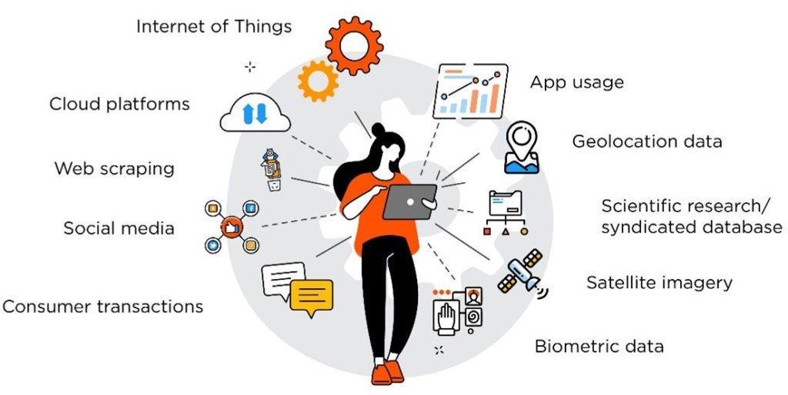

## Table of Contents

## What are cable, internet, and satellite alternative data?

Cable, internet, and satellite alternative data refers to information collected from sources other than traditional cable, internet, and satellite providers. This data can include things like social media posts, online reviews, and even satellite imagery. Companies use this alternative data to learn more about what people are watching, what they like, and how they use different services. It helps them make better decisions about what to offer and how to improve their services.

For example, a company might look at social media to see what TV shows people are talking about. This can help them understand which shows are popular and might be worth investing in. Another example is using online reviews to see what people think about different internet service providers. This can help other companies see where they can do better. By using this kind of data, companies can get a more complete picture of what their customers want and need.

## How can alternative data be used to improve cable, internet, and satellite services?

Alternative data can help cable, internet, and satellite companies learn more about what their customers want. For example, by looking at social media posts, companies can see which TV shows are popular and decide to offer more of those kinds of shows. They can also read online reviews to find out what people like or don't like about their services. This information helps them make changes that make their customers happier.

Another way [alternative data](/wiki/best-alternative-data) helps is by showing companies where they can improve their services. For example, if many people complain about slow internet speeds in certain areas, the company can focus on fixing those problems. They can also use data from satellite imagery to see where people live and work, and then make sure they offer good service in those places. By using this kind of data, companies can make their services better and keep their customers happy.

## What are the main sources of alternative data for these industries?

The main sources of alternative data for cable, internet, and satellite industries include social media platforms, online review sites, and satellite imagery. Social media platforms like Twitter and Instagram give companies a way to see what people are talking about. For example, they can see which TV shows are popular by looking at hashtags and mentions. Online review sites like Yelp and Google Reviews help companies understand what customers think about their services. If many people leave bad reviews about slow internet, the company knows they need to fix that problem.

Another important source of alternative data is satellite imagery. Companies can use this to see where people live and work, which helps them plan where to offer their services. For example, if a lot of people are moving to a new area, the company might decide to expand their service there. All these sources together give companies a good picture of what their customers want and need, helping them make better decisions about their services.

## How do companies collect and analyze alternative data?

Companies collect alternative data by using special computer programs that search the internet for information. They look at social media posts, online reviews, and even pictures taken from satellites. For example, a program might search for mentions of a TV show on Twitter to see how popular it is. Another program might read reviews on websites to find out what people think about different internet services. This helps companies gather a lot of information quickly and easily.

Once they have the data, companies use other computer programs to analyze it. These programs can sort through all the information to find patterns and trends. For example, they might see that a lot of people in one area are complaining about slow internet. This tells the company where they need to make improvements. By looking at the data carefully, companies can learn what their customers want and make better decisions about their services.

## What are the benefits of using alternative data in the cable, internet, and satellite sectors?

Using alternative data helps cable, internet, and satellite companies learn more about what their customers want. By looking at social media and online reviews, they can see which TV shows people like and what they think about their services. This helps them make better choices about what to offer. For example, if a lot of people are talking about a certain TV show on social media, the company might decide to buy more shows like that. This makes their customers happier because they get to watch what they enjoy.

Alternative data also helps companies find out where they need to improve. If many people are complaining about slow internet in a certain area, the company can focus on fixing that problem. They can also use satellite pictures to see where people are moving to and make sure they offer good service in those places. By using this kind of information, companies can make their services better and keep their customers satisfied.

## What challenges do companies face when integrating alternative data into their operations?

Companies face some challenges when they start using alternative data. One big challenge is figuring out how to collect all the data they need. There's a lot of information out there, and it can be hard to find the right stuff. They need special computer programs to search the internet and pull out the important information. Sometimes, these programs can make mistakes or miss things, which can lead to wrong decisions.

Another challenge is making sense of all the data. Once they have it, they need to sort through it and find patterns. This can be tricky because the data can be messy and hard to understand. Companies need to be careful not to jump to the wrong conclusions. They also have to make sure they're not breaking any rules about using people's information. All these challenges mean that using alternative data takes a lot of work, but it can help companies make their services better if they do it right.

## Can you provide examples of successful applications of alternative data in these industries?

One example of using alternative data successfully is when a cable company noticed a lot of people talking about a new TV show on social media. They saw that the show was very popular, so they decided to buy more shows like it. This made their customers happy because they got to watch more of what they liked. By using social media data, the cable company was able to offer better programs and keep their customers satisfied.

Another example is when an internet service provider used online reviews to find out what people thought about their service. They saw that many people in one area were complaining about slow internet speeds. The company focused on fixing the problem in that area, and their customers were happier as a result. By paying attention to online reviews, the internet service provider was able to improve their service and keep their customers.

A third example involves a satellite TV company using satellite imagery to see where people were moving to. They noticed a lot of new homes being built in a certain area, so they decided to expand their service there. This helped them reach new customers and grow their business. By using satellite data, the company was able to make smart decisions about where to offer their services.

## How does alternative data help in predicting market trends and consumer behavior?

Alternative data helps companies predict market trends and consumer behavior by giving them a lot of information about what people are doing and thinking. For example, by looking at social media posts, a company can see which TV shows people are talking about. If a lot of people are excited about a new show, the company might predict that more people will want to watch similar shows in the future. This helps them decide what to offer to keep their customers happy.

Another way alternative data helps is by showing companies what people like and don't like about their services. For example, if many people are leaving bad reviews about slow internet speeds, the company can predict that this is a big problem for their customers. By fixing this issue, they can keep their customers from switching to another service. By looking at all this data, companies can make better guesses about what will happen in the market and what their customers will want next.

## What are the ethical considerations and privacy concerns related to the use of alternative data?

Using alternative data can raise some ethical questions and privacy worries. Companies need to be careful about how they collect and use this information. They should make sure they're not breaking any rules or laws about using people's data. For example, they need to be sure they have permission to use the data they find on social media or online reviews. If they don't do this right, they could upset their customers and get in trouble.

Another big concern is keeping people's information private. When companies look at social media posts or online reviews, they're seeing personal information. They need to make sure they protect this information and don't share it with others without permission. If they don't, it could lead to people's private information being used in ways they didn't expect or want. So, companies need to think carefully about how they use alternative data and make sure they're doing it in a way that respects people's privacy and follows the rules.

## How can small businesses leverage alternative data to compete with larger companies in the cable, internet, and satellite markets?

Small businesses can use alternative data to learn more about what their customers want and need. By looking at social media and online reviews, they can see which TV shows people like and what they think about different services. This helps them offer better programs and fix any problems customers have. For example, if a lot of people are complaining about slow internet in a certain area, a small internet service provider can focus on making their service faster there. This way, they can make their customers happier and stand out from bigger companies.

Another way small businesses can use alternative data is by understanding where people are moving to and where they need better services. By looking at satellite pictures, they can see new neighborhoods being built and decide to offer their services there before bigger companies do. This helps them reach new customers and grow their business. By using this kind of information, small businesses can make smart choices and compete with larger companies in the cable, internet, and satellite markets.

## What advanced techniques and technologies are used for processing and deriving insights from alternative data?

Small businesses can use special computer programs to help them understand alternative data better. These programs can search through social media posts, online reviews, and even satellite pictures to find important information. For example, they can look at what people are saying about TV shows on Twitter or see if people are happy with their internet service from reviews on websites. These programs help small businesses see patterns and trends that they might miss if they looked at the data by themselves. This way, they can learn what their customers want and make better decisions.

Another advanced technique is using [machine learning](/wiki/machine-learning) to analyze the data. Machine learning is when computers learn from the data they see and get better at finding patterns over time. For example, a computer might start to understand that when people use certain words in their reviews, it means they're unhappy with the service. This helps small businesses know what to fix. By using these advanced technologies, small businesses can get a lot of useful information from alternative data, even if they don't have as many resources as bigger companies.

## What future trends can we expect in the use of alternative data for cable, internet, and satellite services?

In the future, we can expect that companies will use alternative data even more to learn about what people want to watch and what they think about their services. They will use new kinds of data, like pictures from drones or information from smart home devices. This will help them understand their customers better and offer them better TV shows and faster internet. Companies might also start using special computer programs that can learn from the data and make better guesses about what people will want next.

Another trend we might see is small businesses using alternative data more to compete with bigger companies. They will use easy-to-use tools that help them find important information without needing a lot of money or experts. This will let them offer better services in their areas and grow their business. As more and more people use social media and leave reviews online, there will be even more data for companies to use to make their services better.

## References & Further Reading

[1]: ["AlternativeData.org"](https://alternativedata.org/) - A comprehensive database connecting data providers with the financial industry.

[2]: Jansen, S. (2018). ["Machine Learning for Algorithmic Trading - Second Edition"](https://github.com/PacktPublishing/Machine-Learning-for-Algorithmic-Trading-Second-Edition) by Stefan Jansen.

[3]: Lopez de Prado, M. (2018). ["Advances in Financial Machine Learning"](https://books.google.com/books/about/Advances_in_Financial_Machine_Learning.html?id=oU9KDwAAQBAJ) by Marcos Lopez de Prado.

[4]: Chan, E. P. (2008). ["Quantitative Trading: How to Build Your Own Algorithmic Trading Business"](https://github.com/ftvision/quant_trading_echan_book) by Ernest P. Chan.

[5]: Aronson, D. (2006). ["Evidence-Based Technical Analysis: Applying the Scientific Method and Statistical Inference to Trading Signals"](https://www.wiley.com/en-us/Evidence+Based+Technical+Analysis%3A+Applying+the+Scientific+Method+and+Statistical+Inference+to+Trading+Signals-p-9780470008744) by David Aronson.

[6]: Narang, R. K. (2013). ["Inside the Black Box: A Simple Guide to Quantitative and High Frequency Trading"](https://onlinelibrary.wiley.com/doi/book/10.1002/9781118662717) by Rishi K. Narang.