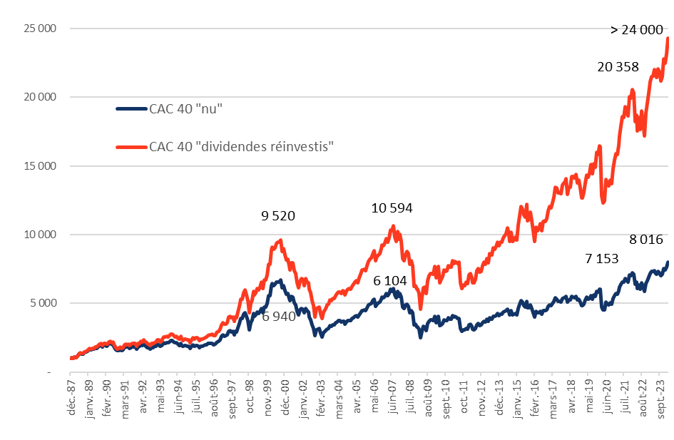

## Table of Contents

## What is the CAC 40 Index?

The CAC 40 Index is a stock market index that shows how well the top 40 companies listed on the Paris Stock Exchange are doing. It is a way to measure the performance of the French stock market. The companies in the CAC 40 are chosen because they are the biggest and most important in France. This index is updated every day to reflect changes in the stock prices of these companies.

People use the CAC 40 to understand the overall health of the French economy. If the index goes up, it usually means that the economy is doing well. If it goes down, it might mean that the economy is struggling. Investors and financial experts watch the CAC 40 closely to make decisions about buying and selling stocks. It is one of the most important stock market indexes in Europe.

## How is the CAC 40 Index calculated?

The CAC 40 Index is calculated using a method called "free-float market capitalization." This means it looks at the total value of the companies in the index, but only counts the shares that are available for the public to buy and sell. Each company's impact on the index depends on its size and how many of its shares are freely traded. If a company has a higher market value and more shares available, it will have a bigger effect on the index.

To find the index value, first, they add up the total value of all the free-float shares of the 40 companies. Then, they divide this total by a special number called the "divisor." The divisor is adjusted over time to make sure the index stays accurate even when companies are added or removed, or when there are stock splits or dividends. This way, the CAC 40 Index gives a clear picture of how the top French companies are doing in the stock market.

## Which companies are included in the CAC 40 Index?

The CAC 40 Index includes some of the biggest companies in France. Some of these companies are LVMH, which makes luxury goods like Louis Vuitton and Moët & Chandon. There's also TotalEnergies, which is a big energy company. BNP Paribas is a major bank, and L'Oréal makes beauty products. Other companies in the index are Airbus, which makes airplanes, and Sanofi, which makes medicines.

There are also companies like Schneider Electric, which makes electrical equipment, and Vinci, which builds roads and airports. Carrefour is a big supermarket chain, and Danone makes food and drinks. Other companies include Kering, which owns brands like Gucci, and EssilorLuxottica, which makes eyeglasses. These companies are chosen because they are important to the French economy and have a lot of shares that people can buy and sell.

## What is the significance of the CAC 40 Index for the French economy?

The CAC 40 Index is very important for the French economy because it shows how well the biggest and most important companies in France are doing. When the CAC 40 goes up, it usually means that these companies are making more money and that the economy is doing well. If the index goes down, it might mean that the economy is struggling. People who invest money, like investors and financial experts, watch the CAC 40 closely to decide whether to buy or sell stocks. This can affect how much money is coming into the French economy.

The index also helps people understand the overall health of the French economy. Since the CAC 40 includes companies from different industries like energy, luxury goods, and banking, it gives a broad picture of how these sectors are doing. This information is useful for the government and businesses to make plans and decisions. For example, if the CAC 40 is doing well, the government might feel more confident about spending money on new projects. If it's not doing well, they might need to find ways to help the economy grow.

## How does the CAC 40 Index influence global markets?

The CAC 40 Index can affect global markets because it shows how well big French companies are doing. These companies, like LVMH and TotalEnergies, do business all over the world. When the CAC 40 goes up, it might make investors feel good about the global economy. They might then buy more stocks in other countries, which can make stock markets in places like the United States or Germany go up too. On the other hand, if the CAC 40 goes down, it might make investors worried. They might sell stocks in other countries, which can make those markets go down.

The CAC 40 is also important because it is one of the main indexes in Europe. Europe is a big part of the world economy, so what happens in Europe can affect other places. For example, if the CAC 40 is doing well, it might make people think that the European economy is strong. This can lead to more trade and investment between Europe and other countries. But if the CAC 40 is not doing well, it might make people think that Europe's economy is weak, which can lead to less trade and investment. So, the CAC 40 can have a big impact on how the global economy works.

## What are the criteria for a company to be included in the CAC 40 Index?

To be included in the CAC 40 Index, a company needs to be one of the biggest in France. The main thing they look at is how much the company is worth on the stock market, which is called its market capitalization. They also check how many of the company's shares are available for people to buy and sell, which is called the free-float. If a company has a high market value and a lot of shares that people can trade, it has a better chance of being in the CAC 40.

The companies in the CAC 40 are chosen and reviewed every three months. The people who manage the index, called Euronext, look at the top 100 companies listed on the Paris Stock Exchange. They pick the 40 companies with the highest market value and free-float. Sometimes, they might also consider other things, like how important the company is to the French economy or how much it is traded. This way, the CAC 40 always shows a good picture of the biggest and most important companies in France.

## How often is the CAC 40 Index rebalanced and what is the process?

The CAC 40 Index is rebalanced every three months, which means it's checked and updated four times a year. This happens in March, June, September, and December. The people who manage the index, called Euronext, look at the top 100 companies listed on the Paris Stock Exchange. They choose the 40 companies with the highest market value and the most shares that people can buy and sell, which is called the free-float. This way, the index always shows the biggest and most important companies in France.

During the rebalancing process, Euronext looks at the market value and free-float of all the companies. If a company that's already in the index has a lower market value or free-float than some of the other top 100 companies, it might be taken out of the index. And if a new company has a higher market value and free-float, it might be added to the index. This keeps the CAC 40 accurate and up-to-date. Sometimes, they might also consider other things, like how important the company is to the French economy or how much its shares are traded.

## Can you explain the historical performance of the CAC 40 Index?

The CAC 40 Index started in 1987 and has been an important way to see how the French economy is doing ever since. Over the years, the index has gone through many ups and downs. For example, during the early 1990s, the index grew a lot because the economy was doing well. But then, in the late 1990s and early 2000s, it went down because of the dot-com bubble burst and other economic problems. The index hit its highest point ever in 2007, just before the big financial crisis started.

After the financial crisis in 2008, the CAC 40 dropped a lot, like many other stock markets around the world. It took several years for the index to start going up again. Since then, the CAC 40 has had good years and bad years, depending on what's happening in the economy. For example, it went down a lot in 2020 because of the COVID-19 pandemic, but then it started to recover as things got better. Overall, the CAC 40 shows how big events can affect the French economy and the companies in the index.

## How does the CAC 40 Index compare to other major stock indices like the DAX or S&P 500?

The CAC 40 Index is a big deal in France, just like the DAX is important in Germany and the S&P 500 is important in the United States. The CAC 40 shows how the top 40 French companies are doing, while the DAX looks at the 40 biggest German companies, and the S&P 500 tracks 500 large U.S. companies. These indexes are all used to see how well their countries' economies are doing, but they cover different numbers of companies and different countries.

Sometimes, the CAC 40, DAX, and S&P 500 move in similar ways because big events like the financial crisis in 2008 or the COVID-19 pandemic in 2020 affect the whole world. But they can also be different because each country's economy has its own problems and successes. For example, if something big happens in the U.S., it might affect the S&P 500 more than the CAC 40 or DAX. But if there's a problem in Europe, the CAC 40 and DAX might go down more than the S&P 500. So, while these indexes can give us a general idea of how the world economy is doing, they also show how each country's economy is unique.

## What are the investment vehicles available for investors interested in the CAC 40 Index?

Investors who want to put their money into the CAC 40 Index have a few different choices. One way is to buy shares in an Exchange Traded Fund ([ETF](/wiki/etf-trading-strategies)) that tracks the CAC 40. An ETF is like a basket of stocks that follows the performance of the index. This is an easy way to invest in the CAC 40 because you don't have to buy shares in all 40 companies yourself. Another option is to invest in mutual funds that focus on the CAC 40. These funds are managed by professionals who pick the stocks for you.

Another way to invest in the CAC 40 is by buying futures and options. Futures are agreements to buy or sell the index at a set price in the future, while options give you the right to buy or sell the index at a certain price. These are more complicated and risky, but they can be good for experienced investors who want to bet on how the index will do. No matter which way you choose, investing in the CAC 40 lets you put your money into some of the biggest and most important companies in France.

## How do geopolitical events affect the CAC 40 Index?

Geopolitical events can have a big impact on the CAC 40 Index. When there are big changes or problems in the world, like wars, trade disagreements, or political changes, they can make investors worried. If investors are scared, they might sell their stocks, which can make the CAC 40 go down. For example, if there's a war in a country that France does a lot of business with, it might hurt the companies in the CAC 40 and make the index drop.

On the other hand, good geopolitical news can make the CAC 40 go up. If countries agree to work together more or solve their problems, it can make investors feel better about the future. This might make them want to buy more stocks, which can push the CAC 40 higher. So, what happens in the world can really affect how the biggest French companies do, and that shows up in the CAC 40 Index.

## What are the future trends and predictions for the CAC 40 Index?

Looking ahead, the CAC 40 Index is expected to keep being influenced by big things happening in the world and in France. If the global economy does well, the CAC 40 might go up because the companies in the index do a lot of business all over the world. Also, if France's economy grows, that could help the CAC 40 too. But if there are problems, like new trade wars or political changes, the index might go down because investors might get scared and sell their stocks.

In the long run, many people think the CAC 40 will keep growing because of things like new technology and more people buying things. Companies in the index that focus on new ideas and green energy might do really well. But it's hard to say for sure because the future can be unpredictable. So, while the CAC 40 might have good years and bad years, it's likely to stay an important way to see how France's biggest companies are doing.

## References & Further Reading

- **Investopedia: 'Understanding Exchange-Traded Funds (ETFs)'**  
  This resource provides a comprehensive overview of Exchange-Traded Funds, offering insights into their mechanisms, advantages, and distinctions from mutual funds. It serves as a foundational source for understanding how ETFs can influence stock market indices like the CAC 40.

- **Investopedia: 'The CAC 40 Index: France’s Economic Indicator'**  
  An essential read for grasping the significance of the CAC 40 as a barometer for the French economy. This article covers the history, composition, and factors affecting the performance of this leading stock market index.

- **SpringerLink: 'Understanding Possibilities and Risks of Algorithmic Trading'**  
  This scholarly article examines the benefits and drawbacks of [algorithmic trading](/wiki/algorithmic-trading), providing a detailed analysis of how such trading strategies can impact market dynamics, including issues like [volatility](/wiki/volatility-trading-strategies) and [liquidity](/wiki/liquidity-risk-premium).

- **European Fund and Asset Management Association: 'Exchange-Traded Funds in Europe: Evolution and Regulation'**  
  This publication discusses the development and regulatory frameworks governing ETFs in Europe, offering insights into the evolving role of ETFs within the European financial markets and their intersection with indices such as the CAC 40.

- **European Securities and Markets Authority (ESMA): 'MiFID II - Directive on Markets in Financial Instruments'**  
  As a cornerstone regulatory piece, MiFID II outlines the rules governing trading practices within the EU, emphasizing transparency, investor protection, and market stability. This directive is crucial for understanding the regulatory environment in which algorithmic trading operates, particularly concerning the CAC 40 index within the French financial market.

