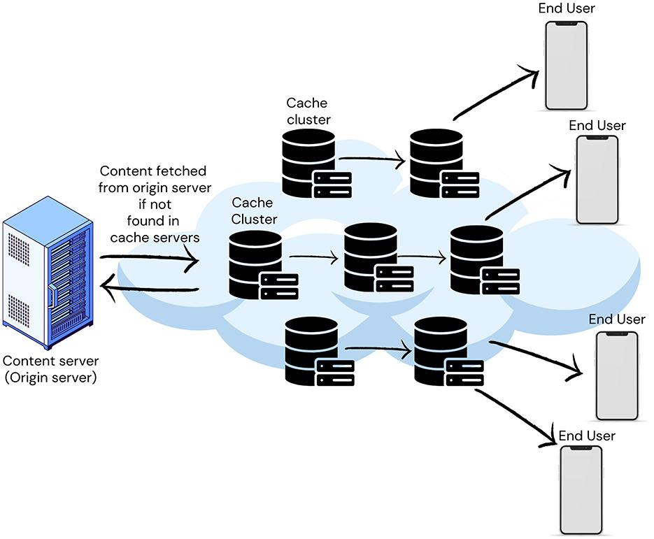

## Table of Contents

## What is a cache replacement model in the context of machine learning?

In machine learning, a cache replacement model is a strategy used to decide which items to keep or remove from a cache, which is a fast memory storage system. When the cache is full and new data needs to be stored, the model helps determine which existing data should be replaced to make room for the new data. This is important because it can greatly affect the performance and efficiency of a system, especially in applications where data access speed is critical.

A common example of a cache replacement model is the Least Recently Used (LRU) policy. In this model, when the cache is full, the item that was used least recently is removed to make space for the new item. This approach is based on the assumption that recently used items are more likely to be used again soon. Other models like Least Frequently Used (LFU) or First In First Out (FIFO) might be used depending on the specific needs of the system, each with its own method of deciding which data to keep or discard.

## Why are cache replacement models important for improving system performance?

Cache replacement models are important because they help make computers and systems work faster. When a system uses a cache, it keeps the most important or frequently used data close by, so it can be accessed quickly. If the cache gets full, the replacement model decides which old data to throw away to make room for new data. This decision can make a big difference in how fast the system runs. If the model keeps the right data in the cache, the system can find what it needs without slowing down.

For example, if you're using a web browser, a good cache replacement model can help load pages faster by keeping the parts of websites you visit often in the cache. If the model doesn't work well, it might throw away useful data and keep less useful data, making the browser slower. So, choosing the right cache replacement model helps keep the system running smoothly and quickly, which is important for any application where speed matters.

## What are the basic principles behind cache replacement algorithms?

Cache replacement algorithms work on the principle of deciding which data to keep in the cache and which to remove when the cache is full. The main goal is to keep the most useful data in the cache so that the system can work faster. Different algorithms use different methods to decide what's useful. Some look at how recently the data was used, thinking that recently used data might be needed again soon. Others might look at how often the data is used, believing that frequently used data is more important.

For example, the Least Recently Used (LRU) algorithm removes the item that was used the least recently when the cache is full. This is based on the idea that if something hasn't been used in a while, it's less likely to be needed soon. On the other hand, the Least Frequently Used (LFU) algorithm removes the item that has been used the least number of times. This method assumes that data used more often is more important to keep in the cache. Both methods aim to keep the cache filled with data that will speed up the system's performance.

## Can you explain the difference between traditional and machine learning-based cache replacement models?

Traditional cache replacement models use simple rules to decide which data to keep or remove from the cache. For example, the Least Recently Used (LRU) model removes the item that hasn't been used in the longest time. Another model, Least Frequently Used (LFU), removes the item that has been used the least number of times. These models are straightforward and easy to implement, but they don't take into account more complex patterns in how data is used. They work well for many situations, but they can be too simple for some applications where data access patterns are more complex.

Machine learning-based cache replacement models use data and algorithms to make smarter decisions about what to keep in the cache. They can learn from past data access patterns to predict what data will likely be needed soon. This means they can adapt to changing patterns and potentially perform better than traditional models in situations where data usage is unpredictable or complex. For example, a machine learning model might use historical data to predict that certain data will be needed more often at specific times of the day, and adjust the cache accordingly. This approach can lead to better performance, but it's also more complex to implement and may require more computational resources.

## What is the Parrot cache replacement model and how does it work?

The Parrot cache replacement model is a machine learning-based approach that tries to predict which data will be needed soon. It uses past data access patterns to make these predictions. The model learns from how data was used before and tries to guess what will happen next. This makes it different from simple models like LRU or LFU, which just look at how recently or how often data was used. Parrot is designed to be smarter and adapt to changing patterns in data usage.

Parrot works by keeping a history of which data was accessed and when. It then uses this history to train a machine learning algorithm. The algorithm looks for patterns in the data access and uses those patterns to decide which data to keep in the cache. For example, if the model sees that certain data is used more often at specific times, it will try to keep that data in the cache during those times. This way, Parrot can make better use of the cache and help the system run faster by keeping the most useful data close at hand.

## How does the Parrot model use machine learning to predict cache behavior?

The Parrot model uses machine learning to predict which data will be needed soon by looking at past data access patterns. It keeps track of when and how often data was used before. Then, it uses this information to train a machine learning algorithm. This algorithm learns to find patterns in the data usage, like if certain data is used more often at specific times or if there are other regular patterns. Once the algorithm understands these patterns, it can predict what data will likely be needed next and decides to keep that data in the cache.

This approach helps the Parrot model make better decisions about what to keep in the cache compared to simpler models like LRU or LFU. For example, if the model sees that a user often checks certain data every morning, it will try to keep that data in the cache during that time. By doing this, the Parrot model can help the system run faster by making sure the most useful data is always ready to use. This is especially helpful in situations where data usage patterns are complex or change over time.

## What are the key performance metrics used to evaluate cache replacement models?

The main way to see how good a cache replacement model is, is by looking at the hit rate. The hit rate is the percentage of times the system finds the data it needs in the cache. A higher hit rate means the model is doing a good job at keeping useful data in the cache. Another important thing to look at is the miss rate, which is the opposite of the hit rate. It shows how often the system has to go to slower storage to get data. A lower miss rate is better because it means the system doesn't have to wait as long to get the data it needs.

Another key performance metric is the average access time, which is how long it takes on average to get data from the cache. If the model keeps the right data in the cache, the average access time will be shorter because the system can find what it needs quickly. Sometimes, people also look at the cache utilization, which is how full the cache is. A model that keeps the cache full with useful data is doing well, but if the cache is full with data that's not needed, it's not helping the system run faster.

## How can the effectiveness of a cache replacement model like Parrot be measured in real-world applications?

To measure how well a cache replacement model like Parrot works in real-world applications, you can look at the hit rate. The hit rate is the percentage of times the system finds the data it needs in the cache. A higher hit rate means Parrot is doing a good job at keeping useful data in the cache. You can also check the miss rate, which is how often the system has to go to slower storage to get data. A lower miss rate is better because it means the system doesn't have to wait as long to get the data it needs. These metrics can be tracked over time to see if Parrot is adapting well to changing data usage patterns.

Another way to measure Parrot's effectiveness is by looking at the average access time. This is how long it takes on average to get data from the cache. If Parrot keeps the right data in the cache, the average access time will be shorter because the system can find what it needs quickly. You can also consider cache utilization, which is how full the cache is. A model that keeps the cache full with useful data is doing well, but if the cache is full with data that's not needed, it's not helping the system run faster. By monitoring these metrics in real-world scenarios, you can see how well Parrot is performing and whether it's improving the system's speed and efficiency.

## What are some common challenges faced when implementing machine learning-based cache replacement models?

One of the main challenges in implementing machine learning-based cache replacement models like Parrot is the need for a lot of data and computing power. These models learn from past data access patterns to make predictions, so they need enough data to train on. If there isn't enough data, the model might not be able to learn well and make good predictions. Also, training and running these models can use a lot of computing resources, which can be expensive and slow down the system if it's not powerful enough.

Another challenge is that these models can be hard to understand and explain. Traditional models like LRU or LFU are simple and easy to understand because they follow clear rules. But machine learning models can be like black boxes, making it hard to know why they make certain decisions. This can make it difficult to trust the model and fix problems if something goes wrong. Also, these models need to keep learning and updating as data usage patterns change, which can be tricky to manage in a real-world system.

## How does the Parrot model compare to other machine learning-based cache replacement models in terms of performance?

The Parrot model is designed to predict which data will be needed soon by learning from past data access patterns. Compared to other machine learning-based cache replacement models, Parrot often performs well in environments where data usage patterns are complex and change over time. For example, if users tend to access certain data more frequently at specific times of the day, Parrot can adapt to these patterns better than simpler models like LRU or LFU. Its ability to learn and adjust makes it particularly effective in dynamic systems where traditional models might struggle.

However, the performance of Parrot can depend a lot on how much data it has to learn from and how powerful the system running it is. Other machine learning models might be better in some situations. For instance, models that use different algorithms or focus on different aspects of data usage might outperform Parrot if they are better suited to the specific patterns of the system they are used in. Also, the complexity of Parrot can sometimes make it harder to understand and manage compared to other models, which might be simpler but still effective in certain scenarios.

## What advanced techniques can be used to further optimize the Parrot model's performance?

To further optimize the Parrot model's performance, one advanced technique is to use more sophisticated machine learning algorithms. Instead of using simple prediction methods, Parrot could employ deep learning techniques like neural networks. These can better capture complex patterns in data usage, leading to more accurate predictions about which data will be needed soon. Another technique is to use ensemble methods, where multiple models work together to make better predictions. By combining different machine learning models, Parrot can take advantage of their strengths and reduce the risk of making bad predictions.

Another way to improve Parrot's performance is through better feature engineering. This means finding new ways to represent the data that Parrot learns from. For example, adding features that capture the time of day or the day of the week could help Parrot understand and predict data usage patterns more accurately. Additionally, using real-time data updates can help Parrot adapt quickly to changes in how data is used. By constantly updating its training data, Parrot can stay relevant and effective even as the system's usage patterns evolve.

## What future developments can we expect in the field of machine learning-based cache replacement models?

In the future, we can expect machine learning-based cache replacement models to become even smarter and more adaptable. As technology improves, these models will be able to learn from more data and use more advanced algorithms to make better predictions about which data to keep in the cache. This could mean using deep learning techniques, like neural networks, to understand complex patterns in how data is used. Also, models might start using real-time data to quickly adjust to changes in usage patterns, making them even more effective at keeping the most useful data ready to use.

Another development we might see is the use of ensemble methods, where different machine learning models work together to make better decisions about cache replacement. By combining the strengths of multiple models, these systems could become more reliable and accurate. Additionally, as computing power continues to grow, these advanced models will be easier to implement and run, even on systems that are not very powerful. This means that machine learning-based cache replacement models like Parrot will become more common and help make many different types of systems run faster and more efficiently.